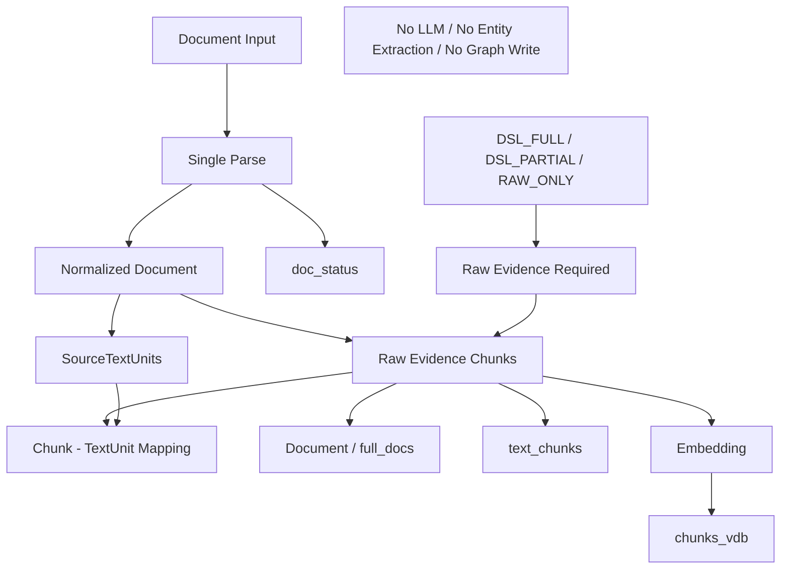

# Block 24B-1：统一原文证据链与单次解析对齐

你现在继续在本地 LightRAG 代码仓中工作。

本轮任务：Block 24B-1，Unified Raw Evidence Chain & Single-Parse Alignment。

## 前置状态

1. Block 24A-0 / 24A-0.1 已通过：
   - 已查清 `/documents/upload` 原生调用链；
   - 已查清 DSL 独立 ingestion 调用链；
   - 当前正式上传未接入 DSL；
   - 当前不存在统一 auto router。

2. Block 24A-1 已通过：
   - 真实 Embedding 可用；
   - 真实 LLM 可用；
   - 原生 raw ingestion 最小 smoke 通过；
   - DSL custom_kg 最小 smoke 通过；
   - query smoke 通过；
   - 隔离 workspace 和 cleanup 通过。

3. Block 24B-0 已通过：
   - 已实现统一入库协议；
   - 已实现 DSL Applicability Inspector；
   - 已实现 PLAN_ONLY / SHADOW_ONLY 路由；
   - 已能输出 DSL_FULL / DSL_PARTIAL / RAW_ONLY / PARSE_FAILED；
   - 当前仍未接入正式上传；
   - 当前仍未执行自动写入路由。

4. TO-BE 原则：
   - 原文证据链对所有可解析文档始终执行；
   - DSL 是产品设计知识的受控语义编译路径；
   - RAW_ONLY 至少保留 Text-only 检索；
   - DSL 成功和失败都不能影响原文证据可查询；
   - 同一文档只解析一次；
   - DSL Context 不得污染原文向量；
   - 本轮只完成原文证据链，不执行语义图分支。

---

## 一、本轮目标

构建统一原文证据链：

```text
Document Input
    ↓
Single Parse
    ↓
Normalized Document
    ├─ Raw Evidence Chunks
    ├─ SourceTextUnits
    └─ Chunk ↔ TextUnit Mapping
    ↓
Document / KV Storage
    ├─ full_docs 或当前等价文档存储
    ├─ text_chunks
    └─ doc_status
    ↓
Embedding
    ↓
chunks_vdb
```

无论路由结果是：

- DSL_FULL
- DSL_PARTIAL
- RAW_ONLY

都必须执行同一条原文证据链。

PARSE_FAILED：

- 不写 text_chunks；
- 不写 chunks_vdb；
- 记录失败状态和错误原因。

本轮要证明：

1. 同一份文档只解析一次；
2. 原文 Chunk 和 DSL SourceTextUnit 来自同一个规范化文本；
3. Chunk 与 SourceTextUnit 有稳定映射；
4. 原文正文写入文档/KV 存储；
5. 原文片段写入 text_chunks；
6. 原文片段向量写入 chunks_vdb；
7. 文档状态可记录；
8. 不调用 LLM；
9. 不调用 extract_entities；
10. 不写实体和关系图；
11. DSL Context 不进入 chunks_vdb 的向量正文；
12. 重复执行不会重复产生文档、Chunk 或向量；
13. 本轮仍不改变 `/documents/upload` 行为。

---

## 二、本轮严格边界

本轮允许：

- 构建统一解析结果；
- 构建 Raw Evidence Chunk；
- 构建 SourceTextUnit；
- 构建 Chunk ↔ SourceTextUnit 映射；
- 在隔离本地 workspace 中写入：
  - full_docs 或当前等价存储；
  - text_chunks；
  - chunks_vdb；
  - doc_status；
- 使用真实 Embedding 做一次显式 opt-in smoke；
- 使用本地 KV / Vector / DocStatus Storage；
- 生成报告和测试。

本轮禁止：

1. 不修改 `/documents/upload`。
2. 不连接 Live Shadow Hook。
3. 不改变正式上传行为。
4. 不调用真实 LLM。
5. 不调用 entity extraction LLM。
6. 不调用 extract_entities。
7. 不执行 Gleaning。
8. 不写实体节点。
9. 不写关系边。
10. 不写 entities_vdb。
11. 不写 relationships_vdb。
12. 不写 PFSS Graph。
13. 不写 Generic Graph。
14. 不连接 Neo4j。
15. 不连接生产 PostgreSQL、Milvus、Qdrant、Redis、MongoDB 或 OpenSearch。
16. 不使用正式 working_dir。
17. 不使用历史 test graph workspace。
18. 不修改 LightRAG Core/API。
19. 不实现 Block 24B-2。
20. 不实现生产 Sidecar 数据库。
21. 不使用真实公司设计文档。

本轮完成后必须仍然满足：

```text
LIVE_UPLOAD_BEHAVIOR_CHANGED = false
LIVE_UPLOAD_HOOK_CONNECTED = false
AUTO_WRITE_ROUTING_ENABLED = false
LLM_CALLS_EXECUTED = false
EXTRACT_ENTITIES_CALLED = false
GRAPH_WRITES_EXECUTED = false
ENTITY_VECTOR_WRITES_EXECUTED = false
RELATION_VECTOR_WRITES_EXECUTED = false
PRODUCTION_STORAGE_WRITES_EXECUTED = false
LIGHTRAG_CORE_MODIFIED = false
```

---

## 三、防止 Codex 原地打圈的执行纪律

必须严格遵守：

1. 只读取一次 Block 24B-0 报告：
   - `artifacts/block_24b0_shadow_router/shadow_router_report.json`
   - `artifacts/block_24b0_shadow_router/router_policy.json`
2. 不重新分析 `/documents/upload`。
3. 不重新盘点 24A 调用链。
4. 不重新运行真实 LLM smoke。
5. 不全仓反复 `rg` / `find`。
6. 每个待修改文件最多完整读取一次。
7. 后续只查看具体函数和具体行段。
8. 不安装新依赖。
9. 不修改 `uv.lock`、`pyproject.toml`、requirements。
10. 默认测试不得访问网络。
11. 真实 Embedding smoke 最多执行一次。
12. 同一个失败命令最多：
    - 首次执行一次；
    - 定向修复一次；
    - 重跑一次。
13. 同一个错误连续出现两次：
    - 写入 `unresolved_questions.md`；
    - 停止本轮。
14. 不为通过测试修改 LightRAG Core。
15. 不为通过测试绕过 storage schema。
16. 若当前 LightRAG 没有安全的 Text-only 写入接口：
    - 只允许在扩展层实现 Adapter；
    - 必须复用当前 Core 的实际 storage schema 和 ID 工具；
    - 不得凭空猜字段；
    - 无法安全实现时输出 `BLOCKED_BY_CORE_GAP` 并停止。
17. 完成准出项后立即停止，不开始 24B-2。

---

## 四、允许新增或修改的文件

建议新增：

- `lightrag_ext/us_dsl/unified_document_types.py`
- `lightrag_ext/us_dsl/unified_document_parser.py`
- `lightrag_ext/us_dsl/raw_evidence_chain.py`
- `lightrag_ext/us_dsl/raw_evidence_storage_adapter.py`
- `lightrag_ext/us_dsl/raw_evidence_mapping.py`
- `lightrag_ext/us_dsl/scripts/run_raw_evidence_chain_smoke.py`
- `lightrag_ext/us_dsl/tests/test_unified_document_parser.py`
- `lightrag_ext/us_dsl/tests/test_raw_evidence_mapping.py`
- `lightrag_ext/us_dsl/tests/test_raw_evidence_chain.py`
- `lightrag_ext/us_dsl/tests/test_raw_evidence_storage_adapter.py`

允许按需小改：

- `ingestion_router_types.py`
- `shadow_ingestion_router.py`
- `dsl_knowledge_ingestion_types.py`
- `dsl_knowledge_ingestion_readiness.py`
- SourceTextUnit 相关现有模块
- `kg_metadata_sidecar.py`

只允许增加纯函数、数据结构或 Adapter 接口。

禁止修改：

- `lightrag/lightrag.py`
- `lightrag/operate.py`
- `lightrag/prompt.py`
- `lightrag/api/*`
- `document_routes.py`
- Graph / Vector / KV / DocStatus Storage 实现
- `insert / ainsert`
- `ainsert_custom_kg`
- `extract_entities`
- `merge_nodes_and_edges`

---

## 五、统一文档数据模型

新增 `unified_document_types.py`。

### UnifiedDocumentEnvelope

字段：

- document_id
- document_version_id
- source_uri
- source_path
- file_name
- file_type
- module_code
- content_hash
- extracted_text
- normalized_text
- parser_name
- parser_version
- parse_started_at
- parse_finished_at
- metadata

要求：

1. document_id 表示逻辑文档身份；
2. document_version_id 表示当前内容版本；
3. 相同来源、相同内容重复执行：
   - document_id 稳定；
   - document_version_id 稳定；
4. 相同来源、内容变化：
   - document_id 稳定；
   - document_version_id 变化；
5. 不得把绝对本地临时路径直接作为唯一文档身份。

### RawEvidenceChunk

字段：

- chunk_id
- document_id
- document_version_id
- chunk_order
- content
- start_offset
- end_offset
- token_count
- content_hash
- source_span
- metadata

要求：

- content 必须是原始规范化文本片段；
- 不得包含 DSL_CONTEXT；
- 不得包含 Domain / Ontology Prompt；
- start_offset / end_offset 指向 normalized_text；
- chunk_id 必须确定性生成。

### SourceTextUnitRef

字段：

- text_unit_id
- document_id
- document_version_id
- source_us_id
- section_type
- content
- start_offset
- end_offset
- text_hash
- feature_key
- primary_domain
- related_domains
- metadata

优先复用当前已有 SourceTextUnit 数据结构。

不得为了本轮另造一套含义重复但 ID 不兼容的 SourceTextUnit。

### ChunkTextUnitLink

字段：

- link_id
- document_id
- document_version_id
- chunk_id
- text_unit_id
- overlap_start_offset
- overlap_end_offset
- overlap_char_count
- chunk_coverage_ratio
- text_unit_coverage_ratio
- link_type：
  - FULL
  - PARTIAL
  - CONTAINS
  - OVERLAPS
- evidence

### UnifiedParseResult

字段：

- document
- raw_chunks
- source_text_units
- chunk_text_unit_links
- parser_call_count
- normalized_text_hash
- raw_chunk_coverage
- text_unit_coverage
- orphan_chunk_count
- orphan_text_unit_count
- issues

---

## 六、单次解析要求

新增 `unified_document_parser.py`。

实现：

```python
build_unified_parse_result(
    *,
    source_path: str | None = None,
    content: str | None = None,
    document_metadata: dict | None = None,
    config: UnifiedParseConfig | None = None,
) -> UnifiedParseResult
```

流程：

1. 文件只读取一次；
2. Parser 只执行一次；
3. 生成 normalized_text；
4. 基于同一 normalized_text：
   - 生成 RawEvidenceChunk；
   - 生成 SourceTextUnit；
5. 生成 ChunkTextUnitLink；
6. 返回完整 UnifiedParseResult。

禁止：

```text
先原生 Parser 解析一遍
再 DSL Parser 重新读取并解析一遍
```

测试必须通过 spy / counter 验证：

```text
parser_call_count = 1
file_read_count = 1
```

### Raw Chunk 切分

优先复用当前实际 LightRAG Chunker 或通过 Adapter 调用。

不得重新发明一套与正式 LightRAG 完全不同的 Chunk 算法。

允许配置：

- token chunk；
- paragraph chunk；
- 当前正式配置中的实际 chunker。

必须记录：

```text
chunker_name
chunker_version/config
chunk_size
overlap
```

### SourceTextUnit 构造

复用现有：

```text
US边界
sectionType
字段表
规则段落
接口段落
报表段落
权限段落
迁移段落
```

SourceTextUnit 用于 DSL 编译和证据定位。

RawEvidenceChunk 用于文本向量召回。

二者不要求一一对应，但必须有稳定 overlap mapping。

---

## 七、Chunk 与 SourceTextUnit 映射要求

新增 `raw_evidence_mapping.py`。

实现：

```python
build_chunk_text_unit_links(
    raw_chunks: list[RawEvidenceChunk],
    source_text_units: list[SourceTextUnitRef],
) -> list[ChunkTextUnitLink]
```

映射基于：

```text
document_version_id
字符偏移区间
sourceSpan
textHash
```

不得仅基于字符串 contains 做映射。

准出要求：

```text
orphan_chunk_count = 0
orphan_text_unit_count = 0
mapping_link_count > 0
raw_chunk_coverage >= 0.99
text_unit_coverage >= 0.99
```

允许：

- 空白字符；
- 标题分隔；
- Chunk overlap；

导致极小非业务字符未覆盖。

若文档结构导致无法达到 0.99：

- 不得伪造；
- 输出实际覆盖率；
- 路由降级或标记 WARN；
- 默认 fixture 必须达到 1.0。

---

## 八、原文证据存储策略

新增 `raw_evidence_storage_adapter.py`。

必须先检测当前 LightRAG 是否存在可安全复用的 Text-only 写入方式。

策略优先级：

### Strategy A：现有 Public Text-only API

若当前 fork 已有：

```text
只写 full_docs / text_chunks / chunks_vdb / doc_status
且不调用 extract_entities
```

的公共接口，优先使用。

必须提供实际代码证据。

### Strategy B：Document Registry + chunks-only custom_kg

若没有 Public Text-only API，可在扩展层：

1. 使用当前真实 full_docs / doc_status schema 注册文档；
2. 使用：

```json
{
  "chunks": [...],
  "entities": [],
  "relationships": []
}
```

调用 `ainsert_custom_kg` 或当前等价安全接口写入 Chunk 和 Chunk Vector；

3. 必须验证：
   - extract_entities 未调用；
   - graph node / edge 数量不变；
   - entities_vdb / relationships_vdb 不写入；
   - full_docs / doc_status 由扩展层按实际 schema 正确维护。

使用该策略时必须输出：

```text
TEXT_INDEX_STRATEGY = DOCUMENT_REGISTRY_PLUS_CHUNKS_ONLY_CUSTOM_KG
```

### Strategy C：直接 Storage Adapter

仅当 A/B 都不可安全使用时，允许在扩展层通过当前 LightRAG storage abstraction：

```text
full_docs.upsert
text_chunks.upsert
chunks_vdb.upsert
doc_status.upsert
```

必须：

- 复用当前实际 ID、hash、token 和数据 schema；
- 不复制过期版本字段；
- 有专门兼容性测试；
- 不修改 storage implementation。

输出：

```text
TEXT_INDEX_STRATEGY = DIRECT_STORAGE_ADAPTER
```

### 安全停止

若无法确认任何策略安全：

```text
overall_status = BLOCKED_BY_CORE_GAP
```

停止，不得修改 Core 解决。

---

## 九、存储行为要求

实现：

```python
index_raw_evidence(
    *,
    rag,
    parse_result: UnifiedParseResult,
    route_decision: IngestionRouteDecision,
    config: RawEvidenceIndexConfig,
) -> RawEvidenceIndexResult
```

对于：

```text
DSL_FULL
DSL_PARTIAL
RAW_ONLY
```

均执行。

对于：

```text
PARSE_FAILED
```

只登记失败状态，不写 Chunk 和 Vector。

写入目标：

```text
Document / full_docs
text_chunks
chunks_vdb
doc_status
```

禁止写入：

```text
Graph nodes
Graph edges
entities_vdb
relationships_vdb
```

### 文档状态

按当前真实 DocStatus schema 适配。

至少表达：

```text
PENDING / PROCESSING
TEXT_INDEXED 或当前等价成功状态
FAILED
```

不得将本轮 Text-only 索引成功伪装成：

```text
完整图谱处理 PROCESSED
```

如原生 enum 不支持 TEXT_INDEXED：

- 在扩展 Sidecar 中记录 `raw_evidence_status=TEXT_INDEXED`；
- 原生 doc_status 使用兼容状态；
- 报告中明确说明。

### Idempotency

同一 document_version 重复执行两次：

```text
full_docs_count 不增加
text_chunks_count 不增加
chunks_vdb_count 不增加
chunk_id 不变化
mapping link 不变化
```

同一 document_id 新版本：

```text
document_version_id 变化
旧版本不被静默覆盖
当前只需隔离保存或标记 previous_version
```

完整版本生命周期在 24C 实现，本轮不得过度扩展。

---

## 十、原文与 DSL Context 必须隔离

本轮必须检查：

```text
RawEvidenceChunk.content
text_chunks.content
chunks_vdb embedding input
```

都不包含：

```text
DSL_CONTEXT
allowedEntityTypes
allowedRelationTypes
Ontology Prompt
Version Prompt
Domain Prompt
内部 review 状态模板
```

DSL Context 只能存在于：

```text
SourceTextUnit metadata
extraction_content
DSL compilation context
```

不得进入原文向量正文。

必须输出：

```text
dsl_context_contamination_count = 0
```

---

## 十一、与 Shadow Router 的接口

本轮接受 Block 24B-0 的：

```text
IngestionRouteDecision
```

但只读取：

```text
recommended_future_route
raw_text_required
document_profile
trace_id
document_id
```

所有可解析路由必须满足：

```text
raw_text_required = true
```

若 Router 错误返回：

```text
DSL_FULL 且 raw_text_required=false
```

本轮必须拒绝执行并报告 Router Contract Violation。

不得执行：

```text
dsl_write_planned
generic_graph_write_planned
```

本轮只处理 raw evidence。

---

## 十二、输出数据结构

新增：

### RawEvidenceIndexConfig

- enabled
- execution_mode：
  - PLAN_ONLY
  - ISOLATED_WRITE
- use_real_embedding
- local_storage_only
- cleanup_after_run
- artifact_root
- workspace
- namespace
- timeout_seconds
- enforce_single_parse
- enforce_no_llm
- enforce_no_graph_write

### RawEvidenceStorageSnapshot

- full_docs_count
- text_chunks_count
- chunks_vdb_count
- doc_status_count
- graph_node_count
- graph_edge_count
- entities_vdb_count
- relationships_vdb_count

### RawEvidenceIndexResult

- trace_id
- document_id
- document_version_id
- semantic_route
- text_index_strategy
- parser_call_count
- source_text_unit_count
- raw_chunk_count
- mapping_link_count
- raw_chunk_coverage
- text_unit_coverage
- orphan_chunk_count
- orphan_text_unit_count
- full_docs_written
- text_chunks_written
- chunk_vectors_written
- doc_status_written
- embedding_called
- embedding_vector_count
- embedding_dimension
- llm_called
- extract_entities_called
- graph_write_called
- entity_vector_write_called
- relation_vector_write_called
- dsl_context_contamination_count
- idempotency_key_count
- idempotency_passed
- storage_snapshot_before
- storage_snapshot_after
- status
- issues
- risks

### RawEvidenceChainReport

- input_document_count
- successful_document_count
- failed_document_count
- dsl_full_count
- dsl_partial_count
- raw_only_count
- parse_failed_count
- total_raw_chunks
- total_source_text_units
- total_mapping_links
- average_mapping_coverage
- idempotency_passed
- no_llm_passed
- no_graph_write_passed
- no_dsl_context_contamination_passed
- live_upload_behavior_changed
- live_upload_hook_connected
- production_storage_writes_executed
- core_modified_in_this_round
- results
- unresolved_questions
- recommended_next_block

---

## 十三、测试 Fixture

不得在通用逻辑中写死可接受银行或 LC。

至少构造以下合成 fixture。

### Fixture A：产品设计 Markdown

必须包含：

```text
US编号
业务目标
GWT
字段表
业务规则
接口或流程说明
```

路由可为 DSL_FULL。

验证：

```text
RawEvidenceChunk 和 SourceTextUnit 均生成
二者 mapping coverage = 1.0
原文向量写入
无 DSL Context 污染
无图写入
```

### Fixture B：部分可编译产品设计文档

包含：

```text
明确字段与部分规则
部分 Evidence 缺失
版本存在待确认
```

路由为 DSL_PARTIAL。

仍必须完整执行原文证据链。

### Fixture C：一般会议纪要

路由为 RAW_ONLY。

仍必须：

```text
full_docs
text_chunks
chunks_vdb
doc_status
```

可用。

不得因为 RAW_ONLY 就不建立文本索引。

### Fixture D：空文件或解析失败

路由为 PARSE_FAILED。

要求：

```text
doc status = FAILED
text_chunks = 0
chunks_vdb = 0
```

---

## 十四、测试要求

建议新增四个测试文件。

### test_unified_document_parser.py

至少覆盖：

1. `test_document_file_is_read_once`
2. `test_parser_is_called_once`
3. `test_raw_chunks_and_text_units_share_normalized_text`
4. `test_document_id_is_stable_for_same_source`
5. `test_document_version_id_changes_when_content_changes`
6. `test_chunk_ids_are_deterministic`
7. `test_raw_chunk_content_contains_no_dsl_context`
8. `test_source_text_units_reuse_existing_id_semantics`

### test_raw_evidence_mapping.py

9. `test_chunk_text_unit_mapping_uses_offsets`
10. `test_mapping_coverage_is_complete`
11. `test_no_orphan_chunks`
12. `test_no_orphan_text_units`
13. `test_mapping_is_deterministic`
14. `test_overlap_chunk_mapping_is_supported`

### test_raw_evidence_storage_adapter.py

15. `test_storage_strategy_is_selected_from_actual_capability`
16. `test_full_docs_are_written`
17. `test_text_chunks_are_written`
18. `test_chunk_vectors_are_written`
19. `test_doc_status_is_written`
20. `test_entities_vdb_is_not_written`
21. `test_relationships_vdb_is_not_written`
22. `test_graph_nodes_and_edges_are_not_written`
23. `test_extract_entities_is_not_called`
24. `test_llm_is_not_called`
25. `test_same_document_version_is_idempotent`
26. `test_parse_failed_writes_no_chunks_or_vectors`
27. `test_storage_schema_matches_current_lightrag_version`

### test_raw_evidence_chain.py

28. `test_dsl_full_always_runs_raw_evidence_chain`
29. `test_dsl_partial_always_runs_raw_evidence_chain`
30. `test_raw_only_runs_raw_evidence_chain`
31. `test_parse_failed_does_not_index_text`
32. `test_router_contract_requires_raw_text`
33. `test_dsl_context_contamination_count_is_zero`
34. `test_default_mode_does_not_use_network`
35. `test_real_embedding_requires_explicit_env_flag`
36. `test_real_embedding_smoke_uses_isolated_workspace`
37. `test_cleanup_removes_workspace`
38. `test_report_is_serializable`
39. `test_live_upload_behavior_is_unchanged`
40. `test_no_lightrag_core_modified`

所有默认测试：

```text
不访问网络
不调用真实 Embedding
不调用 LLM
不写生产存储
```

---

## 十五、运行与输出目录

输出目录：

```text
artifacts/block_24b1_raw_evidence_chain/
```

必须包含：

```text
raw_evidence_chain_report.json
raw_evidence_chain_report.md
parse_results.json
chunk_text_unit_mapping.json
storage_strategy_report.json
storage_snapshot.json
idempotency_report.json
architecture.mmd
safety_check.json
cleanup_report.json
command_log.txt
git_status_before.txt
git_status_after.txt
core_diff_check.txt
unresolved_questions.md
workspaces/
```

---

## 十六、默认测试命令

先记录：

```bash
mkdir -p artifacts/block_24b1_raw_evidence_chain

git status --short \
  > artifacts/block_24b1_raw_evidence_chain/git_status_before.txt
```

运行：

```bash
.venv/bin/python - <<'PY'
import subprocess
import sys

commands = [
    [
        ".venv/bin/python", "-m", "pytest",
        "lightrag_ext/us_dsl/tests/test_unified_document_parser.py",
        "-q",
    ],
    [
        ".venv/bin/python", "-m", "pytest",
        "lightrag_ext/us_dsl/tests/test_raw_evidence_mapping.py",
        "-q",
    ],
    [
        ".venv/bin/python", "-m", "pytest",
        "lightrag_ext/us_dsl/tests/test_raw_evidence_storage_adapter.py",
        "-q",
    ],
    [
        ".venv/bin/python", "-m", "pytest",
        "lightrag_ext/us_dsl/tests/test_raw_evidence_chain.py",
        "-q",
    ],
    [
        ".venv/bin/python", "-m", "compileall",
        "-q", "lightrag_ext",
    ],
    [
        ".venv/bin/python", "-m", "py_compile",
        "lightrag/prompt.py",
    ],
    [
        ".venv/bin/python", "-m", "ruff", "check",
        "lightrag_ext",
        "lightrag/prompt.py",
    ],
]

for command in commands:
    print("RUN:", " ".join(command), flush=True)

    try:
        result = subprocess.run(command, timeout=300)
    except subprocess.TimeoutExpired:
        print("TIMEOUT:", " ".join(command))
        sys.exit(124)

    if result.returncode != 0:
        sys.exit(result.returncode)
PY
```

---

## 十七、真实 Embedding 隔离 Smoke

真实 smoke 只有显式设置：

```text
LIGHTRAG_ENABLE_REAL_RAW_EVIDENCE_SMOKE=1
```

才允许运行。

命令：

```bash
LIGHTRAG_ENABLE_REAL_RAW_EVIDENCE_SMOKE=1 \
.venv/bin/python -m \
  lightrag_ext.us_dsl.scripts.run_raw_evidence_chain_smoke \
  --output-dir artifacts/block_24b1_raw_evidence_chain \
  --fixture-suite \
  --real-embedding \
  --cleanup
```

要求：

1. 使用 24A-1 已验证的真实 Embedding wrapper；
2. 不调用 LLM；
3. 不调用 extract_entities；
4. 使用本地隔离 KV / Vector / DocStatus；
5. GraphStorage 只允许读取空计数，不允许 upsert；
6. workspace 必须位于：
   ```text
   artifacts/block_24b1_raw_evidence_chain/workspaces/
   ```
7. Smoke 完成后 cleanup；
8. artifacts 报告保留。

真实 smoke 至少处理：

```text
1 份 DSL_FULL 合成文档
1 份 RAW_ONLY 合成文档
```

验证两类路由都完成原文证据索引。

---

## 十八、必须生成的架构图

`architecture.mmd`：



图中不得出现本轮已经写入语义图。

---

## 十九、安全检查

`safety_check.json` 必须包含：

```json
{
  "live_upload_behavior_changed": false,
  "live_upload_hook_connected": false,
  "auto_write_routing_enabled": false,
  "llm_calls_executed": false,
  "extract_entities_called": false,
  "graph_writes_executed": false,
  "entity_vector_writes_executed": false,
  "relation_vector_writes_executed": false,
  "production_storage_writes_executed": false,
  "lightrag_core_modified": false
}
```

Core 检查：

```bash
git diff --name-only -- \
  lightrag/lightrag.py \
  lightrag/operate.py \
  lightrag/prompt.py \
  lightrag/api \
  > artifacts/block_24b1_raw_evidence_chain/core_diff_check.txt
```

记录最终状态：

```bash
git status --short \
  > artifacts/block_24b1_raw_evidence_chain/git_status_after.txt
```

---

## 二十、准出标准

通过条件：

1. 统一文档 Envelope 已实现；
2. 文件只读取一次；
3. Parser 只调用一次；
4. RawEvidenceChunk 与 SourceTextUnit 共用 normalized_text；
5. Chunk ↔ TextUnit 映射可追溯；
6. mapping coverage >= 0.99；
7. orphan_chunk_count = 0；
8. orphan_text_unit_count = 0；
9. DSL_FULL 执行原文证据链；
10. DSL_PARTIAL 执行原文证据链；
11. RAW_ONLY 执行原文证据链；
12. PARSE_FAILED 不写 Chunk 和 Vector；
13. full_docs 或当前等价文档存储写入成功；
14. text_chunks 写入成功；
15. chunks_vdb 写入成功；
16. doc_status 写入成功；
17. 真实 Embedding 隔离 smoke 通过；
18. DSL Context 污染数量为 0；
19. extract_entities 未调用；
20. LLM 未调用；
21. 图节点和关系未写入；
22. entities_vdb / relationships_vdb 未写入；
23. 重复执行幂等；
24. workspace cleanup 通过；
25. 正式上传行为未改变；
26. 未连接 Live Hook；
27. 未写生产存储；
28. 未修改 LightRAG Core/API；
29. 测试和静态检查全部通过；
30. 报告完整落盘。

不通过条件：

1. 同一文档被解析两遍；
2. Raw Chunk 与 SourceTextUnit 来自不同文本版本；
3. DSL Context 被写入原文向量；
4. RAW_ONLY 没有文本索引；
5. DSL_FULL 跳过原文证据链；
6. 本轮调用 LLM 或 extract_entities；
7. 本轮写实体图或关系图；
8. entities_vdb / relationships_vdb 被写入；
9. 关系映射依赖字符串猜测而非 offset；
10. 重复执行产生重复 Chunk；
11. 修改正式上传入口；
12. 修改 LightRAG Core；
13. 使用旧 workspace；
14. 写入生产存储；
15. 测试失败；
16. 为解决接口缺口直接修改 Core。

---

## 二十一、完成后的终端输出

只输出：

```text
Block: 24B-1

Implementation:
- unified_document_envelope_implemented:
- single_parse_implemented:
- raw_evidence_chunks_implemented:
- source_text_units_reused:
- chunk_text_unit_mapping_implemented:
- text_index_strategy:

Parse:
- document_count:
- parser_call_count:
- file_read_count:
- raw_chunk_count:
- source_text_unit_count:
- mapping_link_count:
- raw_chunk_coverage:
- text_unit_coverage:
- orphan_chunk_count:
- orphan_text_unit_count:

Storage:
- full_docs_written:
- text_chunks_written:
- chunk_vectors_written:
- doc_status_written:
- graph_nodes_written:
- graph_edges_written:
- entities_vdb_written:
- relationships_vdb_written:

Quality:
- dsl_context_contamination_count:
- idempotency_passed:
- router_contract_passed:

Runtime:
- real_embedding_smoke_executed:
- real_embedding_smoke_passed:
- llm_calls_executed:
- extract_entities_called:

Safety:
- live_upload_behavior_changed:
- live_upload_hook_connected:
- auto_write_routing_enabled:
- production_storage_writes_executed:
- workspace_cleanup_passed:
- core_modified_in_this_round:

Tests:
- collected_count:
- passed_count:
- failed_count:
- compileall:
- py_compile:
- ruff:

Artifacts:
- artifacts/block_24b1_raw_evidence_chain

Recommended next block:
- Block 24B-2 only if all gates pass.
```

完成后停止。

---

## 二十二、特别提醒

本轮不是语义图谱入库轮。

本轮只解决一件事：

> 不论未来走 DSL 还是 RAW，所有文档都先形成同一套、只解析一次、可追溯且可向量召回的原文证据链。

下一步才是：

**Block 24B-2：语义分支接入与图谱隔离。**
