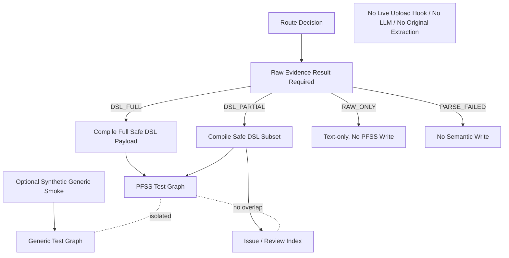

# Block 24B-2：语义分支接入与图谱隔离

你现在继续在本地 LightRAG 代码仓中工作。

本轮任务：**Block 24B-2，Semantic Branch Execution & Graph Isolation**。

---

## 一、前置状态

以下 Block 已通过：

1. **24A-0 / 24A-0.1**
   - 已查清 `/documents/upload` 原生链；
   - 已查清 DSL 独立 ingestion 链；
   - 当前正式上传未接入 DSL；
   - 当前不存在统一自动路由。

2. **24A-1**
   - 真实 Embedding、真实 LLM、原生 raw ingestion、DSL custom_kg 和 query smoke 均已通过；
   - 隔离 workspace、清理和安全边界已通过。

3. **24B-0**
   - 已实现统一入库协议和 Shadow Router；
   - 可输出 `DSL_FULL / DSL_PARTIAL / RAW_ONLY / PARSE_FAILED`；
   - 当前仍仅生成路由计划，不执行自动写入。

4. **24B-1**
   - 已实现统一原文证据链；
   - 同一文档单次解析；
   - `RawEvidenceChunk` 与 `SourceTextUnit` 共用规范化文本；
   - `Chunk ↔ SourceTextUnit` 映射可追溯；
   - `DSL_FULL / DSL_PARTIAL / RAW_ONLY` 均会写入原文证据链；
   - 原文链不调用 LLM、不调用 `extract_entities`、不写实体关系图；
   - DSL Context 未污染原文向量。

---

## 二、本轮目标

本轮开始真正执行**语义分支**，但仍然只在隔离测试环境中运行，不接正式上传入口。

目标流程：

```text
统一路由决定
    ↓
统一原文证据链（24B-1，已经完成）
    ↓
语义分支执行器
    ├─ DSL_FULL
    │    → DSL 全量安全对象
    │    → PFSS 产品功能图
    │
    ├─ DSL_PARTIAL
    │    → 安全对象进入 PFSS 图
    │    → 不安全对象进入 Issue / Review Index
    │
    ├─ RAW_ONLY
    │    → 默认仅保留 Text-only
    │    → 不写 PFSS 图
    │    → Generic Graph 默认关闭
    │
    └─ PARSE_FAILED
         → 不执行任何语义写入
```

本轮要证明：

1. `DSL_FULL` 能在原文证据链成功后写入 PFSS 图；
2. `DSL_PARTIAL` 只写安全子集，并保留完整问题清单；
3. `RAW_ONLY` 默认不写 PFSS 图；
4. `PARSE_FAILED` 不写任何图；
5. PFSS、Generic、Issue 三个逻辑空间严格隔离；
6. 同一语义对象不会因 raw 与 DSL 双路执行而在 PFSS 图中重复；
7. DSL 分支不调用原生 `extract_entities`；
8. DSL 分支不执行原生 Gleaning；
9. Generic Graph 若做隔离 smoke，只能使用预构造的合成 Generic KG，不得调用真实原生 LLM 抽取；
10. 本轮仍不修改 `/documents/upload`，不接 Live Hook。

---

## 三、必须坚持的目标架构

### 1. 原文证据链

所有可解析文档始终保留：

```text
full_docs / document registry
text_chunks
chunks_vdb
doc_status / raw evidence status
```

### 2. PFSS 产品功能图

仅保存经过 DSL 编译和 Policy Gate 的安全对象：

```text
FeatureCatalog
DomainObject
FieldSpec
RuleAtom
TaskRule
StateTransition
IntegrationEndpoint
ReportSpec
RolePermission
DataMigrationSpec
RuleVersion
CanonicalTerm
```

### 3. Generic Fallback Graph

只用于非产品设计知识的泛知识图；本轮默认关闭。

若执行 Generic Graph 隔离 smoke：

- 只能使用预构造的合成 `custom_kg`；
- 只验证 namespace / workspace 隔离；
- 不得调用原生 `ainsert(raw_text)`；
- 不得调用真实 LLM 实体关系抽取；
- 不得将 Generic 节点写入 PFSS 图。

### 4. Issue / Review Index

保存：

```text
VersionReviewRequired
VersionConflictWith
MissingEvidence
InvalidType
InvalidRelation
DanglingRelationship
TermAmbiguity
ReviewRequired
InfoOnly
```

Issue Index 不是正式业务事实图。

---

## 四、本轮严格边界

本轮允许：

- 读取 24B-0 路由结果；
- 读取 24B-1 统一解析和原文证据链结果；
- 执行 DSL 编译、版本补充和 Policy Gate；
- 构造 PFSS `custom_kg`；
- 在隔离本地 workspace 中调用 `ainsert_custom_kg`；
- 写入本地 PFSS Graph、entities_vdb、relationships_vdb；
- 使用真实 Embedding 做一次显式 opt-in smoke；
- 使用本地 Issue Index；
- 验证 Generic Graph namespace 隔离。

本轮禁止：

1. 不修改 `/documents/upload`；
2. 不连接 Live Shadow Hook；
3. 不启用正式 auto write router；
4. 不调用真实 LLM；
5. 不调用原生 `extract_entities`；
6. 不执行原生 Gleaning；
7. 不调用原生 `ainsert(raw_text)`；
8. 不写 production namespace；
9. 不连接 Neo4j；
10. 不连接生产 PostgreSQL、Milvus、Qdrant、Redis、MongoDB 或 OpenSearch；
11. 不使用历史 workspace；
12. 不修改 LightRAG Core/API；
13. 不实现 24C 文档生命周期数据库；
14. 不实现正式 Generic Graph 自动抽取；
15. 不将 Issue 对象作为正式业务关系写入 PFSS 图。

完成后必须满足：

```text
LIVE_UPLOAD_BEHAVIOR_CHANGED = false
LIVE_UPLOAD_HOOK_CONNECTED = false
AUTO_WRITE_ROUTING_ENABLED = false
REAL_LLM_CALLS_EXECUTED = false
ORIGINAL_EXTRACT_ENTITIES_CALLED = false
ORIGINAL_GLEANING_EXECUTED = false
PRODUCTION_STORAGE_WRITES_EXECUTED = false
NEO4J_CONNECTED = false
LIGHTRAG_CORE_MODIFIED = false
```

---

## 五、防止 Codex 原地打圈

必须严格遵守：

1. 只读取一次：
   - `artifacts/block_24b0_shadow_router/shadow_router_report.json`
   - `artifacts/block_24b1_raw_evidence_chain/raw_evidence_chain_report.json`
2. 不重新分析 `/documents/upload`；
3. 不重新盘点 24A 调用链；
4. 不重新运行 24A-1 LLM smoke；
5. 不全仓反复 `rg/find`；
6. 每个目标文件最多完整读取一次；
7. 不安装依赖；
8. 不修改 `uv.lock / pyproject.toml / requirements`；
9. 默认测试不访问网络；
10. 真实 Embedding smoke 最多执行一次；
11. capability probe 最多一次；
12. 同一失败命令只允许：
    - 首次执行；
    - 一次定向修复；
    - 重跑一次；
13. 第二次仍失败：
    - 写入 `unresolved_questions.md`；
    - 停止本轮；
14. 不得为了成功而修改 Core；
15. 不得提前进入 24C。

---

## 六、建议新增文件

建议新增：

```text
lightrag_ext/us_dsl/semantic_branch_types.py
lightrag_ext/us_dsl/graph_space_policy.py
lightrag_ext/us_dsl/pfss_graph_writer.py
lightrag_ext/us_dsl/generic_graph_writer.py
lightrag_ext/us_dsl/issue_index.py
lightrag_ext/us_dsl/semantic_branch_executor.py
lightrag_ext/us_dsl/scripts/run_semantic_branch_isolation_smoke.py

lightrag_ext/us_dsl/tests/test_graph_space_policy.py
lightrag_ext/us_dsl/tests/test_issue_index.py
lightrag_ext/us_dsl/tests/test_pfss_graph_writer.py
lightrag_ext/us_dsl/tests/test_semantic_branch_executor.py
lightrag_ext/us_dsl/tests/test_graph_isolation_smoke.py
```

允许按需小改：

```text
ingestion_router_types.py
shadow_ingestion_router.py
unified_document_types.py
raw_evidence_chain.py
dsl_knowledge_ingestion_policy.py
kg_payload_mapper.py
kg_metadata_sidecar.py
version_relation_builder.py
```

禁止修改：

```text
lightrag/lightrag.py
lightrag/operate.py
lightrag/prompt.py
lightrag/api/*
document_routes.py
insert / ainsert
ainsert_custom_kg
extract_entities
merge_nodes_and_edges
storage implementations
```

---

## 七、图空间协议

新增 `graph_space_policy.py`。

定义：

```text
GraphSpace:
- PFSS
- GENERIC
- ISSUE

GraphSpaceWriteMode:
- DISABLED
- ISOLATED_TEST_WRITE
- FUTURE_LIVE_WRITE
```

本轮只允许：

```text
DISABLED
ISOLATED_TEST_WRITE
```

### GraphSpaceDescriptor

字段：

```text
space
workspace
namespace
graph_storage_type
entity_vector_namespace
relationship_vector_namespace
shared_raw_evidence_reference
write_enabled
production_allowed
```

### 强制规则

#### PFSS

```text
workspace / namespace 必须包含 pfss_test 或 dsl_test
production_allowed = false
只接受 PolicyApprovedForTestGraph 对象
不接受 Generic Candidate
不接受 Issue 对象
```

#### GENERIC

```text
workspace / namespace 必须包含 generic_test
默认 write_enabled = false
不得与 PFSS workspace / namespace 相同
不得覆盖 PFSS 节点
```

#### ISSUE

```text
不得使用 PFSS graph namespace
本轮优先使用本地 JSON / SQLite-like adapter 或扩展层 KV
不得把 Issue 当正式关系图查询事实
```

若任意两个空间共享同一 graph namespace：

```text
FAIL_GRAPH_SPACE_COLLISION
```

---

## 八、语义分支数据结构

新增 `semantic_branch_types.py`。

### SemanticObjectDisposition

```text
APPROVED_PFSS
BLOCKED_ISSUE
INFO_ONLY
GENERIC_CANDIDATE
DROPPED_INVALID
```

### SemanticBranchExecutionConfig

字段：

```text
enabled
execution_mode
artifact_root
pfss_workspace
pfss_namespace
generic_workspace
generic_namespace
issue_index_path
use_real_embedding
allow_generic_graph
cleanup_after_run
timeout_seconds
enforce_raw_evidence_success
enforce_no_llm
enforce_no_original_extraction
enforce_graph_isolation
```

### SemanticBranchExecutionResult

字段：

```text
trace_id
document_id
document_version_id
semantic_route
raw_evidence_status
dsl_compile_executed
pfss_write_executed
generic_write_executed
issue_index_write_executed
safe_chunk_count
safe_entity_count
safe_relationship_count
blocked_object_count
issue_record_count
pfss_graph_node_count
pfss_graph_edge_count
generic_graph_node_count
generic_graph_edge_count
pfss_entity_vector_count
pfss_relationship_vector_count
duplicate_semantic_object_count
cross_space_collision_count
extract_entities_called
gleaning_executed
llm_called
embedding_called
status
issues
risks
```

### GraphIsolationSnapshot

字段：

```text
pfss_node_ids
pfss_edge_ids
generic_node_ids
generic_edge_ids
issue_object_ids
pfss_generic_node_overlap_count
pfss_generic_edge_overlap_count
pfss_issue_overlap_count
namespace_collision_count
```

---

## 九、PFSS 图写入前置条件

新增 `pfss_graph_writer.py`。

执行 PFSS 写入前必须验证：

```text
raw evidence chain success
route in {DSL_FULL, DSL_PARTIAL}
safe_entity_count + safe_relationship_count > 0
sidecar_alignment_passed = true
endpoint_closure_passed = true
forbidden_relation_count = 0
duplicate_id_count = 0
namespace_is_test = true
```

阻断对象不得进入 PFSS：

```text
ReviewRequired
InfoOnly
VersionReviewRequired
VersionConflictWith
MissingEvidence
InvalidType
InvalidRelation
ForbiddenRelation
DanglingRelationship
```

### DSL_FULL

写入：

```text
全部安全 Entity
全部安全 Relationship
安全 HasVersion
显式证据支持的 Supersedes
```

### DSL_PARTIAL

写入：

```text
安全 Entity
安全 Relationship
安全 HasVersion
```

同时：

```text
所有被阻断对象写入 Issue Index
```

---

## 十、避免重复原文 Chunk

24B-1 已写入原文证据 Chunk，本轮不得无条件重新写一份相同 Chunk。

必须先对当前 `ainsert_custom_kg` 能力做**一次** capability probe，判断以下策略。

### Strategy A：引用已有 Chunk

如果 `ainsert_custom_kg` 支持：

```text
entities / relationships 引用已存在 source_id
且 chunks 可为空
```

则使用：

```text
chunks = []
entities = [...]
relationships = [...]
```

记录：

```text
PFSS_SOURCE_REFERENCE_STRATEGY = EXISTING_CHUNK_REFERENCE
```

### Strategy B：幂等 Chunk 重用

如果必须附带 chunks：

- 使用 24B-1 的相同 `chunk_id / source_id / content`；
- 验证写入前后：
  ```text
  text_chunks_count 不增加
  chunks_vdb_count 不增加
  原文 Embedding 不重复调用
  ```
- 记录：
  ```text
  PFSS_SOURCE_REFERENCE_STRATEGY = IDEMPOTENT_CHUNK_REUSE
  ```

### Strategy C：独立证据引用

如果 PFSS 图可保存外部 `source_id`，但不能访问同一 chunk namespace：

- 不复制原文向量；
- Graph node/edge 的 `source_id` 只作为 Sidecar 外部引用；
- 记录：
  ```text
  PFSS_SOURCE_REFERENCE_STRATEGY = EXTERNAL_SIDECAR_REFERENCE
  ```

### 安全停止

若三种策略均不可证明安全：

```text
overall_status = BLOCKED_BY_CORE_GAP
```

不得修改 LightRAG Core 解决。

---

## 十一、Issue Index

新增 `issue_index.py`。

### IssueRecord

字段：

```text
issue_id
trace_id
document_id
document_version_id
semantic_object_id
object_kind
issue_type
severity
reason_code
source_us_id
text_unit_id
source_span
text_hash
evidence_text
domain_code
feature_key
version_group_key
review_required
created_at
```

### 必须支持的问题类型

```text
VERSION_REVIEW_REQUIRED
VERSION_CONFLICT
MISSING_EVIDENCE
INVALID_TYPE
INVALID_RELATION
DANGLING_RELATIONSHIP
TERM_AMBIGUITY
REVIEW_REQUIRED
INFO_ONLY
```

### 要求

1. 同一问题重复执行幂等；
2. Issue 记录可按：
   - document_id；
   - source_us_id；
   - semantic_object_id；
   - issue_type；
   查询；
3. Issue 不得进入 PFSS Graph；
4. Issue 不得被标记为 Confirmed；
5. Issue 内容必须可序列化；
6. 本轮使用本地隔离存储；
7. 生产持久化留到 24C。

---

## 十二、Generic Graph

本轮默认：

```text
allow_generic_graph = false
```

### RAW_ONLY 默认行为

```text
raw evidence chain = 已完成
pfss_write_executed = false
generic_write_executed = false
issue_index_write_executed = 可选，仅记录路由原因
```

### Generic Graph 隔离 smoke

只为验证隔离机制，可使用固定合成 `custom_kg`：

```json
{
  "chunks": [],
  "entities": [
    {
      "entity_name": "Synthetic Generic Topic",
      "entity_type": "GenericEntity",
      "description": "仅用于图空间隔离测试",
      "source_id": "GENERIC-SMOKE-001"
    }
  ],
  "relationships": []
}
```

要求：

```text
generic namespace != pfss namespace
PFSS graph node count 不变化
Generic node 不出现在 PFSS 图
不调用 LLM
不调用 extract_entities
```

不得将该 smoke 宣称为“原生 LightRAG fallback 已完成”。

必须明确：

```text
LIVE_GENERIC_FALLBACK_EXTRACTION_IMPLEMENTED = false
```

---

## 十三、语义分支执行器

新增 `semantic_branch_executor.py`。

实现：

```python
execute_semantic_branch(
    *,
    route_decision,
    unified_parse_result,
    raw_evidence_result,
    config,
) -> SemanticBranchExecutionResult
```

### 执行顺序

1. 验证 Route Decision；
2. 验证 Raw Evidence Chain；
3. 根据 route 分支；
4. 若 DSL：
   - 构造 DSL context；
   - 编译 DslKgPayload；
   - augment version relations；
   - 执行 policy；
   - 构造安全 PFSS payload；
   - 构造 Issue Records；
5. 校验 sidecar；
6. 校验 endpoint closure；
7. 校验 graph namespace；
8. 执行 PFSS isolated write；
9. 可选执行 Generic isolation smoke；
10. 生成 GraphIsolationSnapshot；
11. cleanup；
12. 输出报告。

### Route 行为

#### DSL_FULL

```text
pfss_write_executed = true
issue_index_write_executed = false 或仅记录非阻断 warning
generic_write_executed = false
```

#### DSL_PARTIAL

```text
pfss_write_executed = true
issue_index_write_executed = true
generic_write_executed = false
```

#### RAW_ONLY

```text
pfss_write_executed = false
generic_write_executed = false（默认）
```

#### PARSE_FAILED

```text
所有语义写入 false
```

---

## 十四、测试 Fixtures

通用逻辑不得写死 LC、FX 或其他业务模块。

至少构造：

### Fixture A：DSL_FULL

包含：

```text
明确 US
字段表
规则
Evidence
明确 Domain / Feature
合法 Entity / Relation
```

预期：

```text
PFSS 写入成功
Issue 为空或仅 warning
```

### Fixture B：DSL_PARTIAL

包含：

```text
安全字段和关系
一个 VersionReviewRequired
一个 MissingEvidence
```

预期：

```text
安全子集进入 PFSS
两个问题进入 Issue Index
不安全对象不入图
```

### Fixture C：RAW_ONLY

一般会议纪要。

预期：

```text
不写 PFSS
不写 Generic（默认）
```

### Fixture D：PARSE_FAILED

预期：

```text
不写任何语义空间
```

### Fixture E：Generic 隔离 smoke

预期：

```text
Generic 节点只出现在 generic namespace
PFSS 图无变化
```

---

## 十五、必须验证的质量指标

```text
pfss_generic_node_overlap_count = 0
pfss_generic_edge_overlap_count = 0
pfss_issue_overlap_count = 0
namespace_collision_count = 0
duplicate_semantic_object_count = 0
forbidden_relation_count = 0
dangling_relationship_count = 0
sidecar_alignment_passed = true
original_extract_entities_called = false
original_gleaning_executed = false
real_llm_called = false
```

### Source Reference

还必须输出：

```text
PFSS_SOURCE_REFERENCE_STRATEGY
raw_chunk_count_before
raw_chunk_count_after
raw_chunk_vector_count_before
raw_chunk_vector_count_after
duplicate_raw_chunk_count
```

若 PFSS 写入导致原文 Chunk 或向量重复：

```text
FAIL_RAW_EVIDENCE_DUPLICATION
```

---

## 十六、测试要求

至少覆盖：

### graph space policy

1. `test_pfss_namespace_must_be_test_only`
2. `test_generic_namespace_must_be_isolated`
3. `test_issue_space_is_not_pfss_graph`
4. `test_namespace_collision_is_blocked`

### issue index

5. `test_issue_records_are_idempotent`
6. `test_issue_records_keep_evidence`
7. `test_issue_records_are_not_confirmed`
8. `test_issue_index_is_queryable_by_document_and_type`

### PFSS writer

9. `test_dsl_full_writes_safe_pfss_objects`
10. `test_dsl_partial_writes_only_safe_subset`
11. `test_version_review_object_is_not_written_to_pfss`
12. `test_missing_evidence_object_is_not_written_to_pfss`
13. `test_invalid_type_is_not_written_to_pfss`
14. `test_forbidden_relation_is_not_written_to_pfss`
15. `test_endpoint_closure_is_required`
16. `test_sidecar_alignment_is_required`
17. `test_pfss_writer_does_not_call_extract_entities`
18. `test_pfss_writer_does_not_call_llm`
19. `test_pfss_writer_does_not_duplicate_raw_chunks`
20. `test_pfss_source_reference_strategy_is_reported`

### semantic branch executor

21. `test_dsl_full_executes_pfss_branch`
22. `test_dsl_partial_executes_pfss_and_issue_branches`
23. `test_raw_only_does_not_write_pfss`
24. `test_parse_failed_does_not_write_any_semantic_space`
25. `test_raw_evidence_success_is_required`
26. `test_generic_graph_is_disabled_by_default`
27. `test_generic_smoke_is_isolated_from_pfss`
28. `test_current_live_generic_fallback_is_reported_false`
29. `test_branch_execution_is_idempotent`
30. `test_graph_isolation_snapshot_has_zero_overlap`
31. `test_report_is_serializable`
32. `test_live_upload_behavior_is_unchanged`
33. `test_no_lightrag_core_modified`

### runtime guards

34. `test_real_embedding_requires_explicit_env_flag`
35. `test_default_tests_do_not_access_network`
36. `test_default_tests_do_not_write_remote_storage`
37. `test_workspace_is_inside_artifact_root`
38. `test_cleanup_removes_all_test_workspaces`

---

## 十七、输出目录

```text
artifacts/block_24b2_semantic_branch_isolation/
```

必须生成：

```text
semantic_branch_report.json
semantic_branch_report.md
graph_space_policy.json
route_execution_results.json
pfss_payload_summary.json
pfss_storage_snapshot.json
generic_storage_snapshot.json
issue_index.json
issue_summary.json
graph_isolation_snapshot.json
source_reference_strategy.json
idempotency_report.json
architecture.mmd
safety_check.json
cleanup_report.json
command_log.txt
git_status_before.txt
git_status_after.txt
core_diff_check.txt
unresolved_questions.md
workspaces/
```

---

## 十八、架构图

`architecture.mmd`：



---

## 十九、默认测试命令

```bash
mkdir -p artifacts/block_24b2_semantic_branch_isolation

git status --short \
  > artifacts/block_24b2_semantic_branch_isolation/git_status_before.txt
```

```bash
.venv/bin/python - <<'PY'
import subprocess
import sys

commands = [
    [".venv/bin/python", "-m", "pytest",
     "lightrag_ext/us_dsl/tests/test_graph_space_policy.py", "-q"],
    [".venv/bin/python", "-m", "pytest",
     "lightrag_ext/us_dsl/tests/test_issue_index.py", "-q"],
    [".venv/bin/python", "-m", "pytest",
     "lightrag_ext/us_dsl/tests/test_pfss_graph_writer.py", "-q"],
    [".venv/bin/python", "-m", "pytest",
     "lightrag_ext/us_dsl/tests/test_semantic_branch_executor.py", "-q"],
    [".venv/bin/python", "-m", "pytest",
     "lightrag_ext/us_dsl/tests/test_graph_isolation_smoke.py", "-q"],
    [".venv/bin/python", "-m", "compileall", "-q", "lightrag_ext"],
    [".venv/bin/python", "-m", "py_compile", "lightrag/prompt.py"],
    [".venv/bin/python", "-m", "ruff", "check",
     "lightrag_ext", "lightrag/prompt.py"],
]

for command in commands:
    print("RUN:", " ".join(command), flush=True)
    try:
        result = subprocess.run(command, timeout=300)
    except subprocess.TimeoutExpired:
        print("TIMEOUT:", " ".join(command))
        sys.exit(124)

    if result.returncode != 0:
        sys.exit(result.returncode)
PY
```

---

## 二十、隔离写入 Smoke

真实 Embedding 只在显式启用时执行：

```text
LIGHTRAG_ENABLE_REAL_SEMANTIC_BRANCH_SMOKE=1
```

命令：

```bash
LIGHTRAG_ENABLE_REAL_SEMANTIC_BRANCH_SMOKE=1 \
.venv/bin/python -m \
  lightrag_ext.us_dsl.scripts.run_semantic_branch_isolation_smoke \
  --output-dir artifacts/block_24b2_semantic_branch_isolation \
  --fixture-suite \
  --real-embedding \
  --generic-isolation-smoke \
  --cleanup
```

要求：

1. 处理 1 个 DSL_FULL fixture；
2. 处理 1 个 DSL_PARTIAL fixture；
3. 处理 1 个 RAW_ONLY fixture；
4. 可选执行合成 Generic Graph 隔离 smoke；
5. 不调用真实 LLM；
6. 不调用 `extract_entities`；
7. 使用全新本地 workspace；
8. 完成后 cleanup；
9. artifacts 保留。

---

## 二十一、安全检查

`safety_check.json` 必须包含：

```json
{
  "live_upload_behavior_changed": false,
  "live_upload_hook_connected": false,
  "auto_write_routing_enabled": false,
  "real_llm_calls_executed": false,
  "original_extract_entities_called": false,
  "original_gleaning_executed": false,
  "live_generic_fallback_extraction_implemented": false,
  "production_storage_writes_executed": false,
  "neo4j_connected": false,
  "lightrag_core_modified": false
}
```

Core 检查：

```bash
git diff --name-only -- \
  lightrag/lightrag.py \
  lightrag/operate.py \
  lightrag/prompt.py \
  lightrag/api \
  > artifacts/block_24b2_semantic_branch_isolation/core_diff_check.txt
```

最终状态：

```bash
git status --short \
  > artifacts/block_24b2_semantic_branch_isolation/git_status_after.txt
```

---

## 二十二、准出标准

通过条件：

1. PFSS / Generic / Issue 三空间协议实现；
2. PFSS 与 Generic namespace 严格隔离；
3. Issue 不进入 PFSS 图；
4. DSL_FULL 成功写 PFSS；
5. DSL_PARTIAL 只写安全子集；
6. DSL_PARTIAL 问题进入 Issue Index；
7. RAW_ONLY 默认不写 PFSS；
8. PARSE_FAILED 不写任何语义空间；
9. Generic Graph 默认关闭；
10. Generic 隔离 smoke 不污染 PFSS；
11. `extract_entities` 未调用；
12. 原生 Gleaning 未执行；
13. 真实 LLM 未调用；
14. 原文 Chunk 未重复写入；
15. 原文 Chunk Vector 未重复生成；
16. Source Reference Strategy 明确；
17. Sidecar 对齐通过；
18. Endpoint Closure 通过；
19. 无 Forbidden Relation；
20. 无跨空间节点或边重叠；
21. 幂等通过；
22. 隔离 workspace cleanup 通过；
23. 不写生产存储；
24. 不连接 Neo4j；
25. 不修改 LightRAG Core/API；
26. 测试和静态检查全部通过；
27. artifacts 完整。

不通过条件：

1. DSL 和原生结果写入同一 PFSS 图；
2. RAW_ONLY 写入 PFSS；
3. Issue 对象作为正式业务事实入图；
4. Generic 节点污染 PFSS；
5. PFSS 写入重新调用 `extract_entities`；
6. PFSS 写入执行 Gleaning；
7. 原文 Chunk 或向量重复；
8. 关系端点悬空；
9. Sidecar 不对齐；
10. 修改 `/documents/upload`；
11. 修改 LightRAG Core；
12. 调用真实 LLM；
13. 写生产存储；
14. cleanup 失败；
15. 为解决 Core 能力缺口而直接改 Core。

---

## 二十三、完成后终端输出

只输出：

```text
Block: 24B-2

Implementation:
- semantic_branch_executor_implemented:
- pfss_graph_writer_implemented:
- issue_index_implemented:
- graph_space_policy_implemented:
- generic_graph_enabled_by_default:
- live_generic_fallback_extraction_implemented:

Route execution:
- dsl_full_pfss_write:
- dsl_partial_pfss_write:
- dsl_partial_issue_write:
- raw_only_pfss_write:
- parse_failed_semantic_write:

Isolation:
- pfss_namespace:
- generic_namespace:
- namespace_collision_count:
- pfss_generic_node_overlap_count:
- pfss_generic_edge_overlap_count:
- pfss_issue_overlap_count:

Source reference:
- strategy:
- raw_chunk_count_before:
- raw_chunk_count_after:
- chunk_vector_count_before:
- chunk_vector_count_after:
- duplicate_raw_chunk_count:

Runtime:
- real_embedding_smoke_executed:
- real_embedding_smoke_passed:
- real_llm_calls_executed:
- original_extract_entities_called:
- original_gleaning_executed:

Safety:
- live_upload_behavior_changed:
- live_upload_hook_connected:
- auto_write_routing_enabled:
- production_storage_writes_executed:
- neo4j_connected:
- cleanup_passed:
- core_modified_in_this_round:

Tests:
- collected_count:
- passed_count:
- failed_count:
- compileall:
- py_compile:
- ruff:

Artifacts:
- artifacts/block_24b2_semantic_branch_isolation

Recommended next block:
- Block 24C-0 only if all gates pass.
```

完成后停止。

---

## 二十四、特别提醒

本轮不是正式上传接入轮。

本轮只解决：

> 路由已经决定后，DSL_FULL / DSL_PARTIAL / RAW_ONLY 如何在隔离测试环境中执行正确的语义分支，并保证 PFSS、Generic、Issue 三个空间互不污染。

下一步才是：

> **Block 24C-0：生产级 Sidecar 与文档注册表。**
