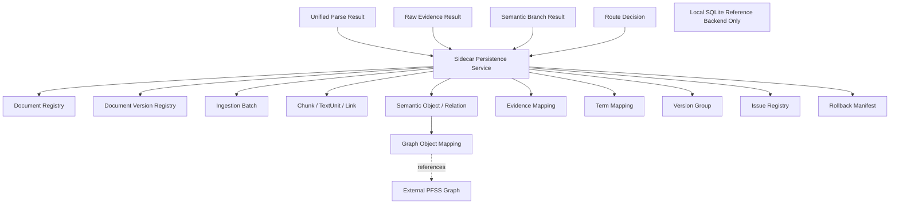

# Block 24C-0：文档注册表与持久化 Metadata Sidecar 基础

你现在继续在本地 LightRAG 代码仓中工作。

本轮任务：**Block 24C-0，Document Registry & Persistent Metadata Sidecar Foundation**。

本轮不是正式上传接入轮，也不是增量删除/重建轮。  
目标是在不修改 LightRAG Core 的前提下，为已经通过的原文证据链和 PFSS 语义分支建立一套**持久化、可事务、可查询、可审计的元数据平面**。

---

## 一、前置状态

以下 Block 已通过：

### 24A 系列

- 已查清 `/documents/upload` 原生调用链；
- 已查清 DSL 独立 ingestion 链；
- 当前正式上传仍未接入 DSL；
- 当前不存在 Live Auto Router；
- 真实 Embedding、真实 LLM、原生 raw ingestion、DSL custom_kg 和查询 smoke 已通过。

### 24B-0

- 已实现统一入库协议；
- 已实现 Shadow Router；
- 可判定：
  - `DSL_FULL`
  - `DSL_PARTIAL`
  - `RAW_ONLY`
  - `PARSE_FAILED`

### 24B-1

- 已实现统一文档 Envelope；
- 已实现单次解析；
- 已实现 RawEvidenceChunk 与 SourceTextUnit；
- 已实现 Chunk ↔ SourceTextUnit 映射；
- 原文证据链可写入文档/KV、text_chunks、chunks_vdb 和状态；
- 原文链不调用 LLM，不写语义图。

### 24B-2 / 24B-2.1

- 已实现 PFSS / Generic / Issue 三空间协议；
- `DSL_FULL` 可写 PFSS；
- `DSL_PARTIAL` 仅写安全子集并写 Issue Index；
- `RAW_ONLY` 默认不写 PFSS；
- PFSS、Generic、Issue 无空间污染；
- Sidecar 对齐、Endpoint Closure、Forbidden Relation、幂等、Issue 不入 PFSS 等准出项已通过；
- 当前 Sidecar 和 Issue 仍主要是扩展层内存/文件产物，尚未形成正式持久化注册表。

---

## 二、本轮要解决的问题

当前已有：

```text
LightRAG 文本/KV
LightRAG 向量索引
PFSS 测试图
扩展层 Sidecar
扩展层 Issue Index
```

但仍缺少一个统一的持久化元数据平面，用于回答：

```text
这份文件是什么？
当前是哪个文档版本？
本次入库属于哪个批次？
某个 Chunk 和 SourceTextUnit 如何对应？
某个图节点/边来自哪条 US、哪段证据？
这个对象属于哪个 Domain / Feature？
它处于什么版本状态？
哪些对象被阻断，为什么？
这次图写入可以如何回滚？
同一文档重复入库是否产生重复对象？
```

本轮必须实现：

```text
Document Registry
+ Document Version Registry
+ Ingestion Batch Registry
+ SourceTextUnit / Chunk Mapping
+ Semantic Object / Relation Registry
+ Graph Object Mapping
+ Evidence Mapping
+ Term Mapping
+ Version Group Registry
+ Issue Registry
+ Rollback Manifest
```

---

## 三、目标架构

```text
UnifiedParseResult
    ├─ UnifiedDocumentEnvelope
    ├─ RawEvidenceChunk
    ├─ SourceTextUnit
    └─ ChunkTextUnitLink
            │
            ▼
RawEvidenceIndexResult
            │
            ▼
SemanticBranchExecutionResult
    ├─ PFSS Objects
    ├─ PFSS Relations
    ├─ Graph Object IDs
    ├─ Sidecar Records
    └─ Issue Records
            │
            ▼
Persistent Sidecar Transaction
    ├─ Document Registry
    ├─ Version Registry
    ├─ Evidence Registry
    ├─ Semantic Registry
    ├─ Graph Mapping Registry
    ├─ Issue Registry
    └─ Rollback Manifest
```

LightRAG 存储继续负责：

```text
原文、文本片段、向量、图节点和图边
```

Persistent Sidecar 负责：

```text
身份、映射、证据、版本、审核、问题、批次和回滚治理
```

---

## 四、本轮严格边界

本轮允许：

- 新增 Sidecar Repository 抽象；
- 新增本地 SQLite 参考实现；
- 新增关系型 schema；
- 持久化 24B 输出的注册表和映射；
- 执行本地事务、回滚、幂等和查询测试；
- 生成 schema、报告和 artifacts；
- 读取此前 24B artifacts；
- 使用合成 fixture 完成 isolated persistence smoke。

本轮禁止：

1. 不修改 `/documents/upload`；
2. 不连接 Live Upload Hook；
3. 不启用正式 Auto Router；
4. 不调用真实 Embedding；
5. 不调用真实 LLM；
6. 不调用 `extract_entities`；
7. 不执行 Gleaning；
8. 不写 LightRAG 图、向量或 KV；
9. 不连接生产 PostgreSQL；
10. 不连接生产 Neo4j、Milvus、Qdrant、Redis、MongoDB 或 OpenSearch；
11. 不实现正式 PostgreSQL Adapter；
12. 不实现文档删除、图删除和向量删除；
13. 不实现完整增量更新；
14. 不修改 LightRAG Core/API；
15. 不修改 `.env`；
16. 不安装新依赖；
17. 不修改 `uv.lock / pyproject.toml / requirements`；
18. 不提前实现 Block 24C-1。

本轮完成后必须满足：

```text
LIVE_UPLOAD_BEHAVIOR_CHANGED = false
LIVE_UPLOAD_HOOK_CONNECTED = false
AUTO_WRITE_ROUTING_ENABLED = false
REAL_EMBEDDING_CALLS_EXECUTED = false
REAL_LLM_CALLS_EXECUTED = false
LIGHTRAG_STORAGE_WRITES_EXECUTED = false
PRODUCTION_DATABASE_CONNECTED = false
NEO4J_CONNECTED = false
LIGHTRAG_CORE_MODIFIED = false
```

---

## 五、防止 Codex 原地打圈

必须严格遵守：

1. 只读取一次：
   - `artifacts/block_24b1_raw_evidence_chain/raw_evidence_chain_report.json`
   - `artifacts/block_24b2_semantic_branch_isolation/semantic_branch_report.json`
   - `artifacts/block_24b2_semantic_branch_isolation/pfss_payload_summary.json`
   - `artifacts/block_24b2_semantic_branch_isolation/issue_index.json`
2. 不重新分析 `/documents/upload`；
3. 不重新运行 24A-1 真实模型 smoke；
4. 不重新执行 24B 图写入 smoke；
5. 不全仓反复 `rg/find`；
6. 每个目标文件最多完整读取一次；
7. 后续只查看具体函数和具体行段；
8. 仅使用 Python 标准库 `sqlite3`；
9. 不安装 ORM 或迁移框架；
10. 同一个测试命令只允许：
    - 首次执行；
    - 一次定向修复；
    - 重跑一次；
11. 第二次仍失败：
    - 写入 `unresolved_questions.md`；
    - 停止本轮；
12. 不为通过测试降低外键或唯一约束；
13. 不为方便而把 JSON 文件冒充“持久化关系型 Sidecar”；
14. 完成准出项后立即停止。

---

## 六、建议新增文件

建议新增：

```text
lightrag_ext/us_dsl/sidecar_registry_types.py
lightrag_ext/us_dsl/sidecar_repository.py
lightrag_ext/us_dsl/sqlite_sidecar_repository.py
lightrag_ext/us_dsl/sidecar_schema.py
lightrag_ext/us_dsl/sidecar_persistence_service.py
lightrag_ext/us_dsl/sidecar_readback_validator.py
lightrag_ext/us_dsl/scripts/run_persistent_sidecar_smoke.py

lightrag_ext/us_dsl/tests/test_sidecar_schema.py
lightrag_ext/us_dsl/tests/test_sqlite_sidecar_repository.py
lightrag_ext/us_dsl/tests/test_sidecar_persistence_service.py
lightrag_ext/us_dsl/tests/test_sidecar_readback_validator.py
lightrag_ext/us_dsl/tests/test_sidecar_transaction_guards.py
```

允许按需小改：

```text
unified_document_types.py
raw_evidence_mapping.py
semantic_branch_types.py
issue_index.py
kg_metadata_sidecar.py
version_relation_types.py
```

只能为复用稳定 ID、数据结构或序列化接口做小改。

禁止修改：

```text
lightrag/lightrag.py
lightrag/operate.py
lightrag/prompt.py
lightrag/api/*
document_routes.py
LightRAG storage implementations
insert / ainsert / ainsert_custom_kg
extract_entities
merge_nodes_and_edges
```

---

## 七、Repository 抽象

新增 `sidecar_repository.py`。

定义抽象协议：

```python
class SidecarRepository(Protocol):
    def initialize_schema(self) -> None: ...
    def begin_batch(self, batch: IngestionBatchRecord) -> None: ...
    def persist_bundle(self, bundle: SidecarPersistenceBundle) -> None: ...
    def complete_batch(self, batch_id: str, summary: dict) -> None: ...
    def fail_batch(self, batch_id: str, error: dict) -> None: ...
    def get_document(self, document_id: str): ...
    def get_document_version(self, document_version_id: str): ...
    def get_batch(self, batch_id: str): ...
    def list_source_text_units(self, document_version_id: str): ...
    def list_semantic_objects(self, document_version_id: str): ...
    def list_semantic_relations(self, document_version_id: str): ...
    def list_evidence_for_object(self, semantic_object_id: str): ...
    def list_issues(self, document_version_id: str): ...
    def get_rollback_manifest(self, batch_id: str): ...
    def validate_referential_integrity(self) -> dict: ...
```

要求：

- 上层业务不得依赖 SQLite 专有 SQL；
- Repository 接口未来可替换为 PostgreSQL；
- 本轮只实现 SQLite 参考后端；
- 不允许把数据库连接暴露给调用方。

---

## 八、SQLite 参考实现

新增 `sqlite_sidecar_repository.py`。

必须使用：

```text
sqlite3
foreign_keys = ON
WAL mode
busy_timeout
显式事务
参数化 SQL
```

数据库文件只能位于：

```text
artifacts/block_24c0_persistent_sidecar/workspaces/<run_id>/sidecar.db
```

禁止：

```text
写项目根目录数据库
写用户目录数据库
复用旧数据库
使用内存数据库作为唯一 smoke
```

单元测试可以使用 `:memory:`，但隔离 smoke 必须使用真实本地文件。

---

## 九、关系型 Schema

新增 `sidecar_schema.py` 并生成：

```text
artifacts/block_24c0_persistent_sidecar/sidecar_schema.sql
```

以下表为本轮必需。

### 1. documents

```text
document_id PK
source_uri_hash NOT NULL
source_type
module_code
logical_name
created_at
updated_at
```

约束：

```text
UNIQUE(source_uri_hash)
```

### 2. document_versions

```text
document_version_id PK
document_id FK -> documents
content_hash NOT NULL
parser_name
parser_version
normalized_text_hash
status
previous_version_id NULL FK -> document_versions
created_at
```

约束：

```text
UNIQUE(document_id, content_hash)
```

### 3. ingestion_batches

```text
batch_id PK
trace_id UNIQUE NOT NULL
requested_mode
semantic_route
status
policy_version
ontology_version
term_registry_version
pfss_namespace
started_at
completed_at
error_code
error_summary
```

状态至少支持：

```text
STARTED
COMPLETED
FAILED
```

### 4. batch_documents

```text
batch_id FK
document_version_id FK
PRIMARY KEY(batch_id, document_version_id)
```

### 5. raw_evidence_chunks

```text
chunk_id PK
document_version_id FK
chunk_order
start_offset
end_offset
token_count
content_hash
source_span_json
created_at
```

约束：

```text
UNIQUE(document_version_id, chunk_order)
UNIQUE(document_version_id, content_hash, start_offset, end_offset)
```

不要求将完整正文复制入 Sidecar。

### 6. source_text_units

```text
text_unit_id PK
document_version_id FK
source_us_id
section_type
start_offset
end_offset
text_hash
feature_key
primary_domain
related_domains_json
evidence_excerpt
created_at
```

### 7. chunk_text_unit_links

```text
link_id PK
document_version_id FK
chunk_id FK
text_unit_id FK
overlap_start_offset
overlap_end_offset
overlap_char_count
chunk_coverage_ratio
text_unit_coverage_ratio
link_type
```

约束：

```text
UNIQUE(chunk_id, text_unit_id, overlap_start_offset, overlap_end_offset)
```

### 8. semantic_objects

```text
semantic_object_id PK
document_version_id FK
object_type
canonical_name
domain_code
feature_key
knowledge_status
validation_status
review_decision
version_group_key
idempotency_key UNIQUE NOT NULL
created_at
updated_at
```

### 9. semantic_relations

```text
semantic_relation_id PK
document_version_id FK
src_semantic_object_id FK -> semantic_objects
relation_type
tgt_semantic_object_id FK -> semantic_objects
knowledge_status
validation_status
review_decision
idempotency_key UNIQUE NOT NULL
created_at
updated_at
```

### 10. graph_object_mappings

```text
mapping_id PK
batch_id FK
graph_space
graph_namespace
graph_object_kind
graph_object_id
semantic_object_id NULL FK
semantic_relation_id NULL FK
source_id
rollback_key
created_at
```

要求：

```text
semantic_object_id 与 semantic_relation_id 必须且只能有一个非空
UNIQUE(graph_space, graph_namespace, graph_object_kind, graph_object_id)
```

### 11. evidence_mappings

```text
evidence_mapping_id PK
semantic_object_id NULL FK
semantic_relation_id NULL FK
text_unit_id FK
source_span_json
text_hash
evidence_excerpt
evidence_role
created_at
```

要求：

```text
semantic_object_id 与 semantic_relation_id 必须且只能有一个非空
```

### 12. term_mappings

```text
term_mapping_id PK
original_term
canonical_term
language_code
domain_code
feature_key
object_type
confidence
mapping_status
mapping_source
created_at
```

`mapping_status`：

```text
CONFIRMED
CANDIDATE
REJECTED
```

### 13. version_groups

```text
version_group_key PK
module_code
domain_code
feature_key
object_type
object_key
rule_dimension
created_at
updated_at
```

### 14. version_members

```text
version_member_id PK
version_group_key FK
semantic_object_id FK
rule_version
version_status
latest_flag
valid_from
valid_to
supersedes_member_id NULL FK
created_at
```

### 15. ingestion_issues

```text
issue_id PK
batch_id FK
document_version_id FK
semantic_object_id NULL FK
semantic_relation_id NULL FK
text_unit_id NULL FK
issue_type
severity
reason_code
review_required
issue_status
evidence_excerpt
created_at
updated_at
```

`issue_status`：

```text
OPEN
RESOLVED
IGNORED
```

本轮不实现 Issue 审批工作流，只需持久化。

### 16. rollback_records

```text
rollback_record_id PK
batch_id FK
graph_space
graph_namespace
graph_object_kind
graph_object_id
rollback_key
planned_action
execution_status
created_at
```

本轮只生成 manifest：

```text
execution_status = NOT_EXECUTED
```

不得实际删除图对象。

---

## 十、稳定 ID 和唯一性原则

必须复用 24B 已验证的 ID，不重新发明不兼容 ID。

### Document ID

```text
逻辑文档身份稳定
```

### Document Version ID

```text
相同 document_id + 相同 content_hash → 稳定
内容变化 → 新 version ID
```

### Semantic Object ID

必须基于稳定语义键，优先：

```text
moduleCode
+ domainCode
+ featureKey
+ objectType
+ objectKey
```

### Semantic Relation ID

优先：

```text
src_semantic_object_id
+ relation_type
+ tgt_semantic_object_id
+ rule/evidence scope
```

### Issue ID

优先：

```text
document_version_id
+ semantic_object/relation_id
+ issue_type
+ reason_code
```

不得使用随机 UUID 作为唯一业务幂等依据。  
可使用 UUID 作为技术主键，但必须另有稳定唯一键。

---

## 十一、持久化 Bundle

新增 `sidecar_persistence_service.py`。

定义：

```python
persist_sidecar_bundle(
    *,
    repository,
    route_decision,
    unified_parse_result,
    raw_evidence_result,
    semantic_branch_result,
    config,
) -> SidecarPersistenceResult
```

### 执行顺序

1. 验证输入 trace_id、document_id、document_version_id 一致；
2. 创建 `ingestion_batches`，状态 `STARTED`；
3. 开启主事务；
4. Upsert document；
5. Upsert document version；
6. 关联 batch 与 document version；
7. 写 raw chunks；
8. 写 source text units；
9. 写 chunk-text-unit links；
10. 写 semantic objects；
11. 写 semantic relations；
12. 写 graph object mappings；
13. 写 evidence mappings；
14. 写 term mappings；
15. 写 version groups / members；
16. 写 issues；
17. 写 rollback manifest；
18. 执行 readback validation；
19. 更新 batch 为 `COMPLETED`；
20. 提交事务。

任一步失败：

1. 回滚主事务；
2. 使用独立小事务将 batch 标记为 `FAILED`；
3. 除 batch 失败记录外，不得留下部分业务行；
4. 输出失败原因；
5. 不允许继续下一文档。

---

## 十二、路由差异

### DSL_FULL

应持久化：

```text
Document / Version / Batch
Raw chunks / SourceTextUnits / Links
Approved semantic objects / relations
Graph mappings
Evidence
Term mappings
Version groups
非阻断 warning
Rollback manifest
```

### DSL_PARTIAL

除以上外，还必须持久化：

```text
Blocked Issue
Version Review
Missing Evidence
Invalid Type / Relation
```

### RAW_ONLY

应持久化：

```text
Document / Version / Batch
Raw chunks / SourceTextUnits / Links
Route reason
```

不得伪造 semantic objects / relations。

### PARSE_FAILED

应持久化：

```text
Document（如能生成身份）
Document Version（如能生成）
Failed Batch
Error code / summary
```

不得写 chunks、text units、semantic objects 或 graph mappings。

---

## 十三、读取与回查能力

新增 `sidecar_readback_validator.py`。

必须能回答：

### 1. 图对象追证据

输入：

```text
graph_space
graph_namespace
graph_object_kind
graph_object_id
```

返回：

```text
semantic object/relation
document
document version
sourceUsId
textUnitId
source span
text hash
evidence excerpt
version status
review decision
```

### 2. 文档追图对象

输入：

```text
document_version_id
```

返回：

```text
所有 semantic objects
所有 semantic relations
所有 graph object mappings
所有 issues
```

### 3. 版本组查询

输入：

```text
version_group_key
```

返回：

```text
members
current/historical/unknown
latest_flag
supersedes
issues
```

### 4. Batch 回滚清单

输入：

```text
batch_id
```

返回：

```text
graph namespace
graph object kind
graph object id
rollback key
planned action
```

---

## 十四、事务和幂等要求

### 同一批次重试

相同：

```text
trace_id
document_version_id
payload
```

不得重复增加：

```text
documents
document_versions
raw chunks
text units
semantic objects
semantic relations
evidence mappings
issues
rollback records
```

### 新 batch、相同文档版本

允许产生新 `ingestion_batch`，但业务对象不得重复。

### 故障注入

必须提供一次故障注入测试：

```text
在 semantic_relations 写入后抛出异常
```

验证：

```text
主事务全部回滚
batch 状态 FAILED
不存在孤立 semantic relation
不存在部分 graph mapping
不存在部分 evidence mapping
```

---

## 十五、安全与数据最小化

1. 不持久化 API Key、Token、Secret；
2. 不把 `.env` 内容写入 Sidecar；
3. `evidence_excerpt` 只保存必要片段；
4. 完整文档正文仍留文档/KV 存储；
5. Sidecar 不复制完整文档；
6. 所有 SQL 必须参数化；
7. SQLite path 必须位于 artifact workspace；
8. 不允许任意 SQL 字符串来自用户输入；
9. 报告中不得泄露敏感配置；
10. 不连接生产数据库。

---

## 十六、测试 Fixture

至少构造以下 fixture。

### Fixture A：DSL_FULL

```text
1 document
1 document version
2 raw chunks
3 SourceTextUnits
2 semantic objects
1 semantic relation
3 evidence mappings
1 version group
0 blocking issues
```

### Fixture B：DSL_PARTIAL

```text
安全 semantic objects / relation
1 VersionReviewRequired
1 MissingEvidence
对应 Issue Records
```

### Fixture C：RAW_ONLY

```text
Document / Version / Batch
Raw chunks / SourceTextUnits / Links
0 semantic objects
0 semantic relations
0 graph mappings
```

### Fixture D：PARSE_FAILED

```text
Failed batch
0 chunks
0 semantic objects
```

### Fixture E：故障注入

```text
semantic relation 后抛异常
验证原子回滚
```

---

## 十七、测试要求

至少覆盖：

### Schema

1. `test_schema_creates_all_required_tables`
2. `test_foreign_keys_are_enabled`
3. `test_unique_constraints_exist`
4. `test_graph_mapping_requires_exactly_one_semantic_target`
5. `test_evidence_mapping_requires_exactly_one_semantic_target`
6. `test_schema_sql_artifact_is_generated`

### Repository

7. `test_document_and_version_upsert_are_idempotent`
8. `test_batch_trace_id_is_unique`
9. `test_source_text_unit_references_document_version`
10. `test_relation_endpoints_require_existing_objects`
11. `test_graph_mapping_is_unique_per_namespace_object`
12. `test_issue_idempotency`
13. `test_rollback_manifest_is_queryable`
14. `test_parameterized_sql_is_used`

### Persistence Service

15. `test_dsl_full_bundle_persists_all_expected_records`
16. `test_dsl_partial_bundle_persists_safe_objects_and_issues`
17. `test_raw_only_persists_no_semantic_objects`
18. `test_parse_failed_persists_only_failure_registry`
19. `test_same_payload_retry_is_idempotent`
20. `test_new_batch_same_version_does_not_duplicate_business_rows`
21. `test_failure_rolls_back_all_business_rows`
22. `test_failed_batch_status_is_persisted`
23. `test_trace_document_version_consistency_is_required`

### Readback

24. `test_graph_object_can_trace_to_evidence`
25. `test_document_version_can_list_graph_objects`
26. `test_version_group_readback`
27. `test_batch_rollback_manifest_readback`
28. `test_referential_integrity_report_passes`
29. `test_readback_counts_match_write_counts`

### Guards

30. `test_database_path_must_be_inside_artifact_root`
31. `test_no_secret_fields_are_persisted`
32. `test_default_tests_use_no_network`
33. `test_default_tests_call_no_models`
34. `test_default_tests_write_no_lightrag_storage`
35. `test_report_is_serializable`
36. `test_no_lightrag_core_modified`

---

## 十八、输出目录

```text
artifacts/block_24c0_persistent_sidecar/
```

必须生成：

```text
sidecar_registry_report.json
sidecar_registry_report.md
sidecar_schema.sql
schema_validation.json
persistence_smoke_report.json
readback_snapshot.json
referential_integrity_report.json
idempotency_report.json
transaction_rollback_report.json
record_count_summary.json
safety_check.json
cleanup_report.json
architecture.mmd
command_log.txt
git_status_before.txt
git_status_after.txt
core_diff_check.txt
unresolved_questions.md
workspaces/
```

---

## 十九、架构图

`architecture.mmd`：



图中必须明确：

```text
PFSS Graph 是外部存储；
Sidecar 不复制图；
Sidecar 仅保存映射和治理元数据。
```

---

## 二十、默认测试命令

```bash
mkdir -p artifacts/block_24c0_persistent_sidecar

git status --short \
  > artifacts/block_24c0_persistent_sidecar/git_status_before.txt
```

```bash
.venv/bin/python - <<'PY'
import subprocess
import sys

commands = [
    [".venv/bin/python", "-m", "pytest",
     "lightrag_ext/us_dsl/tests/test_sidecar_schema.py", "-q"],
    [".venv/bin/python", "-m", "pytest",
     "lightrag_ext/us_dsl/tests/test_sqlite_sidecar_repository.py", "-q"],
    [".venv/bin/python", "-m", "pytest",
     "lightrag_ext/us_dsl/tests/test_sidecar_persistence_service.py", "-q"],
    [".venv/bin/python", "-m", "pytest",
     "lightrag_ext/us_dsl/tests/test_sidecar_readback_validator.py", "-q"],
    [".venv/bin/python", "-m", "pytest",
     "lightrag_ext/us_dsl/tests/test_sidecar_transaction_guards.py", "-q"],
    [".venv/bin/python", "-m", "compileall", "-q", "lightrag_ext"],
    [".venv/bin/python", "-m", "py_compile", "lightrag/prompt.py"],
    [".venv/bin/python", "-m", "ruff", "check",
     "lightrag_ext", "lightrag/prompt.py"],
]

for command in commands:
    print("RUN:", " ".join(command), flush=True)
    try:
        result = subprocess.run(command, timeout=300)
    except subprocess.TimeoutExpired:
        print("TIMEOUT:", " ".join(command))
        sys.exit(124)

    if result.returncode != 0:
        sys.exit(result.returncode)
PY
```

---

## 二十一、本地持久化 Smoke

运行：

```bash
.venv/bin/python -m \
  lightrag_ext.us_dsl.scripts.run_persistent_sidecar_smoke \
  --output-dir artifacts/block_24c0_persistent_sidecar \
  --fixture-suite \
  --cleanup
```

要求：

1. 使用文件型 SQLite；
2. 依次处理：
   - DSL_FULL；
   - DSL_PARTIAL；
   - RAW_ONLY；
   - PARSE_FAILED；
   - 故障注入；
3. 不调用网络；
4. 不调用模型；
5. 不写 LightRAG Storage；
6. 不写生产数据库；
7. 读取回查结果并生成报告；
8. cleanup 后删除 SQLite workspace；
9. schema 和报告 artifacts 保留。

---

## 二十二、安全检查

`safety_check.json` 必须包含：

```json
{
  "live_upload_behavior_changed": false,
  "live_upload_hook_connected": false,
  "auto_write_routing_enabled": false,
  "real_embedding_calls_executed": false,
  "real_llm_calls_executed": false,
  "lightrag_storage_writes_executed": false,
  "production_database_connected": false,
  "neo4j_connected": false,
  "sqlite_reference_backend_only": true,
  "lightrag_core_modified": false
}
```

Core 检查：

```bash
git diff --name-only -- \
  lightrag/lightrag.py \
  lightrag/operate.py \
  lightrag/prompt.py \
  lightrag/api \
  > artifacts/block_24c0_persistent_sidecar/core_diff_check.txt
```

最终状态：

```bash
git status --short \
  > artifacts/block_24c0_persistent_sidecar/git_status_after.txt
```

---

## 二十三、准出标准

通过条件：

1. Sidecar Repository 抽象已实现；
2. SQLite 参考后端已实现；
3. 16 张必需表全部创建；
4. 外键启用；
5. 唯一约束生效；
6. Document / Version / Batch 注册成功；
7. Chunk / TextUnit / Link 持久化成功；
8. Semantic Object / Relation 持久化成功；
9. Graph Object Mapping 持久化成功；
10. Evidence Mapping 持久化成功；
11. Term Mapping 持久化成功；
12. Version Group / Member 持久化成功；
13. Issue Registry 持久化成功；
14. Rollback Manifest 持久化成功；
15. DSL_FULL 写入符合预期；
16. DSL_PARTIAL 只持久化安全对象并保留 Issues；
17. RAW_ONLY 不生成 Semantic Object / Relation；
18. PARSE_FAILED 只保留失败注册信息；
19. 同一 payload 重试幂等；
20. 新 batch 不重复业务对象；
21. 故障注入可完整回滚；
22. Failed Batch 可查询；
23. 图对象可回查原始证据；
24. 文档版本可回查全部图对象和 Issues；
25. 版本组可回查；
26. Rollback Manifest 可回查；
27. Referential Integrity 通过；
28. 写入与回查计数一致；
29. 不保存完整原始文档；
30. 不保存密钥；
31. 不调用网络或模型；
32. 不写 LightRAG Storage；
33. 不连接生产数据库；
34. 不修改 LightRAG Core/API；
35. 测试和静态检查全部通过；
36. artifacts 完整落盘。

不通过条件：

1. 用普通 JSON 文件替代持久化 Repository；
2. 关闭外键绕过问题；
3. 使用随机 ID 导致幂等失败；
4. 失败事务留下部分业务行；
5. Relation 引用不存在的 Object；
6. Issue 被写成 Confirmed Semantic Object；
7. RAW_ONLY 伪造 Semantic Object；
8. Sidecar 复制完整文档正文；
9. SQL 拼接用户输入；
10. 连接生产数据库；
11. 写 LightRAG Storage；
12. 修改 Core；
13. 开始实现文档删除和图删除；
14. 测试失败；
15. cleanup 失败。

---

## 二十四、完成后终端输出

只输出：

```text
Block: 24C-0

Implementation:
- repository_abstraction_implemented:
- sqlite_reference_backend_implemented:
- schema_table_count:
- foreign_keys_enabled:
- transaction_support_implemented:
- readback_validator_implemented:

Persistence:
- documents_count:
- document_versions_count:
- ingestion_batches_count:
- raw_chunks_count:
- source_text_units_count:
- chunk_text_unit_links_count:
- semantic_objects_count:
- semantic_relations_count:
- graph_object_mappings_count:
- evidence_mappings_count:
- term_mappings_count:
- version_groups_count:
- version_members_count:
- ingestion_issues_count:
- rollback_records_count:

Quality:
- referential_integrity_passed:
- write_readback_counts_match:
- same_payload_idempotency_passed:
- new_batch_no_business_duplication:
- transaction_rollback_passed:
- graph_object_trace_to_evidence_passed:
- version_group_readback_passed:
- rollback_manifest_readback_passed:

Route fixtures:
- dsl_full_passed:
- dsl_partial_passed:
- raw_only_passed:
- parse_failed_passed:
- failure_injection_passed:

Safety:
- network_calls_executed:
- model_calls_executed:
- lightrag_storage_writes_executed:
- production_database_connected:
- sqlite_reference_backend_only:
- cleanup_passed:
- core_modified_in_this_round:

Tests:
- collected_count:
- passed_count:
- failed_count:
- compileall:
- py_compile:
- ruff:

Artifacts:
- artifacts/block_24c0_persistent_sidecar

Recommended next block:
- Block 24C-1 only if all gates pass.
```

完成后立即停止。

---

## 二十五、特别提醒

本轮只建立：

> **文档、证据、语义对象、图对象、版本、问题和回滚信息之间的持久化关系型注册表。**

本轮不做：

```text
正式上传接入
生产 PostgreSQL
文档删除
图节点删除
向量删除
增量差异更新
```

下一步才是：

> **Block 24C-1：文档版本增量更新、删除与完整重建。**
