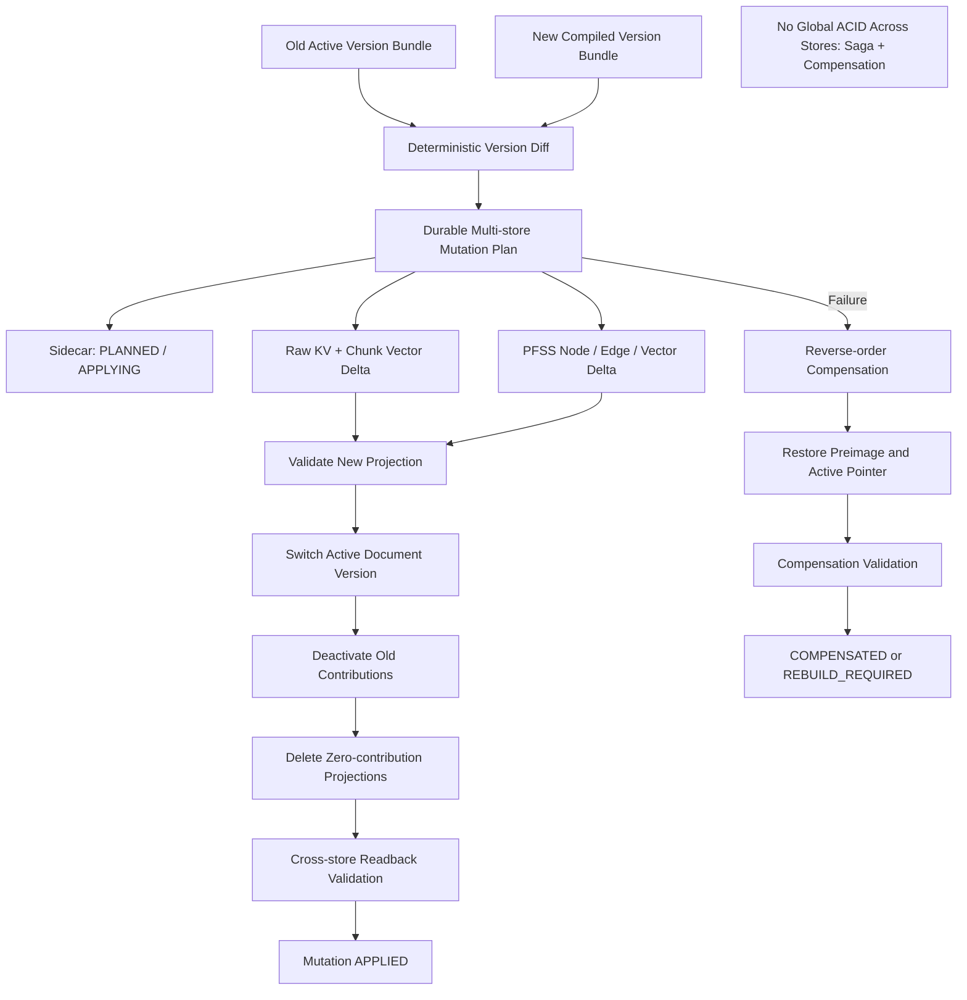

# Block 24C-1：文档版本增量更新、删除与完整重建

你现在继续在本地 LightRAG 代码仓中工作。

本轮任务：**Block 24C-1，Document Version Delta Update, Safe Delete & Rebuild**。

本轮只在隔离本地测试存储中实现和验证文档生命周期变更，不接正式上传入口、不连接生产存储。

---

## 一、前置状态

以下 Block 已通过：

### 24B 系列

- 已实现统一文档 Envelope 和单次解析；
- 已实现 `RawEvidenceChunk`、`SourceTextUnit` 和二者映射；
- `DSL_FULL / DSL_PARTIAL / RAW_ONLY` 都保留原文证据链；
- 已实现 PFSS / Generic / Issue 三空间隔离；
- `DSL_FULL` 可写 PFSS；
- `DSL_PARTIAL` 只写安全对象并写 Issue Index；
- 原始 Chunk 不重复写入；
- Sidecar 对齐、Endpoint Closure、幂等和空间隔离已通过。

### 24C-0

- 已实现 `SidecarRepository` 抽象；
- 已实现本地 SQLite 参考后端；
- 已持久化：
  - Document；
  - Document Version；
  - Ingestion Batch；
  - Raw Chunk；
  - SourceTextUnit；
  - Chunk/TextUnit Link；
  - Semantic Object / Relation；
  - Graph Object Mapping；
  - Evidence Mapping；
  - Term Mapping；
  - Version Group / Member；
  - Issue；
  - Rollback Manifest；
- 已验证事务、外键、幂等、回查和故障回滚；
- 当前尚未实现跨版本差异更新、删除索引和完整重建。

---

## 二、本轮目标

实现以下文档生命周期操作：

```text
UPSERT_NEW_VERSION
DELETE_DOCUMENT_VERSION
DELETE_LOGICAL_DOCUMENT
REBUILD_DOCUMENT_VERSION
```

目标流程：

```text
旧版本注册表 + 新版本编译结果
            ↓
      纯函数差异计算
            ↓
      Multi-store Mutation Plan
            ↓
 Sidecar 持久化计划与补偿信息
            ↓
 隔离本地 KV / Vector / PFSS Graph 更新
            ↓
 引用计数和共享对象保护
            ↓
 Active Version 切换
            ↓
 删除失效投影 / 保留历史证据
            ↓
 Readback Validation
            ↓
 完成或补偿回滚
```

本轮要证明：

1. 相同逻辑文档、内容变化时生成新 `document_version_id`；
2. 只处理新增、变化和移除的知识，不全量重复写入；
3. 未变化 Chunk 不重复 Embedding；
4. 未变化语义对象和关系不重复写图；
5. 旧文档版本保留为历史记录；
6. 新文档版本成为唯一 Active Version；
7. 删除当前版本时不自动把旧版本恢复为 Current；
8. 删除文档时只移除该文档的**活跃索引贡献**；
9. 被多个文档共享的语义对象或关系不能被误删；
10. 文档、图、向量、KV 与 Sidecar 之间不存在分布式事务时，使用可恢复的 Saga / Compensation；
11. Rebuild 能基于已登记版本重新生成活跃投影；
12. 失败后没有半更新、悬空边或错误 Active Version。

---

## 三、必须澄清的版本语义

### 1. 文档版本与业务规则版本不同

本轮处理的是：

```text
Document Version
```

即同一份设计文件的内容版本。

本轮不得自动生成业务语义：

```text
RuleVersion Supersedes
```

原因：

> 新文档版本替换旧文档版本，不等于其中每一条业务规则都自动替代旧规则。

业务规则层的：

```text
RuleVersion
HasVersion
Supersedes
VersionReviewRequired
```

继续由现有版本策略根据明确证据判断。

### 2. 删除当前文档版本不自动恢复旧版本

默认：

```text
restore_previous_version = false
```

删除当前版本后：

```text
document has no active version
```

或者文档状态为：

```text
DELETED / NO_ACTIVE_VERSION
```

不得自动将历史版本重新设为 Current，除非未来显式执行恢复操作。

### 3. 历史证据不物理销毁

默认删除行为：

```text
从活跃 Text / Vector / PFSS 投影中移除
+
在 Sidecar 中保留审计、版本、证据摘要和 Tombstone
```

本轮不做合规意义上的不可恢复物理清除。

---

## 四、本轮严格边界

本轮允许：

- 新增文档版本差异计算；
- 新增 Mutation Plan；
- 新增本地多存储生命周期 Adapter；
- 使用本地 KV / Vector / NetworkX PFSS Graph；
- 使用确定性 Fake Embedding 验证增量调用次数和 ID；
- 执行隔离本地增量更新、删除和重建；
- 扩展 SQLite Sidecar schema；
- 实现 Saga / Compensation；
- 生成报告和测试。

本轮禁止：

1. 不修改 `/documents/upload`；
2. 不接 Live Upload Hook；
3. 不启用正式 Auto Router；
4. 不调用真实 LLM；
5. 不调用原生 `extract_entities`；
6. 不执行原生 Gleaning；
7. 不调用真实外部 Embedding；
8. 不连接生产 PostgreSQL；
9. 不连接 Neo4j；
10. 不连接生产 Vector/KV Storage；
11. 不使用正式 working_dir；
12. 不修改 LightRAG Core/API；
13. 不直接编辑 GraphML、VDB JSON 或 KV JSON 文件；
14. 不通过删除整个 workspace 伪装成“文档级删除”；
15. 不实现生产物理清除；
16. 不实现规则版本自动 Supersedes；
17. 不提前开始 25A。

完成后必须满足：

```text
LIVE_UPLOAD_BEHAVIOR_CHANGED = false
LIVE_UPLOAD_HOOK_CONNECTED = false
AUTO_WRITE_ROUTING_ENABLED = false
REAL_EMBEDDING_CALLS_EXECUTED = false
REAL_LLM_CALLS_EXECUTED = false
ORIGINAL_EXTRACT_ENTITIES_CALLED = false
PRODUCTION_STORAGE_WRITES_EXECUTED = false
PRODUCTION_DATABASE_CONNECTED = false
NEO4J_CONNECTED = false
LIGHTRAG_CORE_MODIFIED = false
```

---

## 五、防止 Codex 原地打圈

必须严格遵守：

1. 只读取一次：
   - `artifacts/block_24c0_persistent_sidecar/sidecar_registry_report.json`
   - `artifacts/block_24c0_persistent_sidecar/sidecar_schema.sql`
   - `artifacts/block_24b2_semantic_branch_isolation/semantic_branch_report.json`
2. 不重新分析 `/documents/upload`；
3. 不重新执行 24A-1 模型 smoke；
4. 不全仓反复 `rg/find`；
5. 每个目标文件最多完整读取一次；
6. 只使用已有依赖和 Python 标准库；
7. 不修改 lockfile 或依赖声明；
8. 先做一次 Storage Capability Probe；
9. Capability Probe 失败时不得反复猜 API；
10. 同一命令只允许：
    - 首次；
    - 一次定向修复；
    - 重跑一次；
11. 第二次仍失败：
    - 记录 unresolved；
    - 停止本轮；
12. 不为支持删除而修改 LightRAG Core；
13. 若无法通过公开 API 或 Storage Abstraction 安全删除：
    - 输出 `BLOCKED_BY_CORE_GAP`；
    - 不进行文件级手工修改；
14. 完成准出项后立即停止。

---

## 六、建议新增文件

建议新增：

```text
lightrag_ext/us_dsl/document_lifecycle_types.py
lightrag_ext/us_dsl/document_version_diff.py
lightrag_ext/us_dsl/lifecycle_storage_capability.py
lightrag_ext/us_dsl/multistore_mutation_plan.py
lightrag_ext/us_dsl/document_contribution_registry.py
lightrag_ext/us_dsl/lifecycle_storage_adapter.py
lightrag_ext/us_dsl/document_lifecycle_service.py
lightrag_ext/us_dsl/lifecycle_compensation.py
lightrag_ext/us_dsl/lifecycle_readback_validator.py
lightrag_ext/us_dsl/scripts/run_document_lifecycle_smoke.py

lightrag_ext/us_dsl/tests/test_document_version_diff.py
lightrag_ext/us_dsl/tests/test_document_contribution_registry.py
lightrag_ext/us_dsl/tests/test_lifecycle_storage_capability.py
lightrag_ext/us_dsl/tests/test_multistore_mutation_plan.py
lightrag_ext/us_dsl/tests/test_document_lifecycle_service.py
lightrag_ext/us_dsl/tests/test_lifecycle_compensation.py
lightrag_ext/us_dsl/tests/test_lifecycle_readback_validator.py
lightrag_ext/us_dsl/tests/test_document_lifecycle_guards.py
```

允许按需小改：

```text
sidecar_registry_types.py
sidecar_repository.py
sqlite_sidecar_repository.py
sidecar_schema.py
sidecar_persistence_service.py
raw_evidence_storage_adapter.py
pfss_graph_writer.py
semantic_branch_types.py
```

只能为生命周期接口、schema migration 和稳定 ID 复用做修改。

禁止修改：

```text
lightrag/lightrag.py
lightrag/operate.py
lightrag/prompt.py
lightrag/api/*
document_routes.py
LightRAG storage implementations
insert / ainsert / ainsert_custom_kg
extract_entities
merge_nodes_and_edges
```

---

## 七、Sidecar Schema Migration

不得破坏 24C-0 的 schema。

新增版本化 migration，例如：

```text
schema_version = 2
migration_id = 002_document_lifecycle
```

必须新增或等价实现以下表。

### 1. document_active_versions

```text
document_id PK FK -> documents
active_document_version_id NULL FK -> document_versions
updated_by_batch_id FK -> ingestion_batches
updated_at
```

要求：

```text
每个逻辑文档最多一个 Active Version
```

### 2. document_version_state_history

```text
state_history_id PK
document_version_id FK
old_status
new_status
batch_id FK
reason_code
changed_at
```

状态至少支持：

```text
STAGED
ACTIVE
SUPERSEDED
DELETED
REBUILD_REQUIRED
REBUILDING
FAILED
```

### 3. raw_chunk_contributions

```text
contribution_id PK
document_version_id FK
chunk_id
active_flag
projection_hash
created_by_batch_id FK
deactivated_by_batch_id NULL FK
created_at
updated_at
```

约束：

```text
UNIQUE(document_version_id, chunk_id)
```

### 4. semantic_object_contributions

```text
contribution_id PK
document_version_id FK
semantic_object_id FK
active_flag
projection_hash
created_by_batch_id FK
deactivated_by_batch_id NULL FK
created_at
updated_at
```

约束：

```text
UNIQUE(document_version_id, semantic_object_id)
```

### 5. semantic_relation_contributions

```text
contribution_id PK
document_version_id FK
semantic_relation_id FK
active_flag
projection_hash
created_by_batch_id FK
deactivated_by_batch_id NULL FK
created_at
updated_at
```

### 6. lifecycle_mutations

```text
mutation_id PK
batch_id FK
document_id FK
old_document_version_id NULL FK
new_document_version_id NULL FK
operation_type
status
plan_hash
started_at
completed_at
error_code
error_summary
```

`operation_type`：

```text
UPSERT_NEW_VERSION
DELETE_DOCUMENT_VERSION
DELETE_LOGICAL_DOCUMENT
REBUILD_DOCUMENT_VERSION
```

`status`：

```text
PLANNED
APPLYING
APPLIED
COMPENSATING
COMPENSATED
FAILED
```

### 7. lifecycle_mutation_steps

```text
mutation_step_id PK
mutation_id FK
step_order
store_kind
operation_kind
target_kind
target_id
preimage_json
postimage_json
status
error_summary
executed_at
compensated_at
```

### 8. document_tombstones

```text
tombstone_id PK
document_id FK
document_version_id NULL FK
delete_scope
reason_code
deleted_by_batch_id FK
deleted_at
```

### 9. rebuild_requests

```text
rebuild_request_id PK
document_version_id FK
reason_code
status
requested_by_batch_id FK
completed_by_batch_id NULL FK
created_at
completed_at
```

---

## 八、Storage Capability Probe

新增 `lifecycle_storage_capability.py`。

本轮只探测一次当前本地测试存储是否支持：

```text
KV upsert
KV delete by ID
Vector upsert
Vector delete by ID
Graph upsert node
Graph upsert edge
Graph delete edge
Graph delete node
Graph get node
Graph get edge
List/count for validation
```

输出：

```text
LifecycleStorageCapabilities
```

字段：

```text
kv_upsert
kv_delete
vector_upsert
vector_delete
graph_node_upsert
graph_edge_upsert
graph_edge_delete
graph_node_delete
graph_readback
supports_safe_document_delete
unsupported_operations
evidence
```

### 安全原则

- 只能通过公开 API 或 Storage Abstraction；
- 不得直接修改底层 GraphML/JSON；
- 删除节点前必须先安全处理边；
- 无 delete 能力时输出：
  ```text
  BLOCKED_BY_CORE_GAP
  ```
- 不得为本轮修改 Core。

---

## 九、Document Version Diff

新增 `document_version_diff.py`。

定义：

```python
build_document_version_diff(
    old_bundle,
    new_bundle,
) -> DocumentVersionDiff
```

必须比较：

### 原文层

```text
added_chunks
unchanged_chunks
updated_chunks
removed_chunks
```

### SourceTextUnit 层

```text
added_text_units
unchanged_text_units
updated_text_units
removed_text_units
```

### 语义对象层

```text
added_semantic_objects
unchanged_semantic_objects
updated_semantic_objects
removed_semantic_objects
```

### 语义关系层

```text
added_semantic_relations
unchanged_semantic_relations
updated_semantic_relations
removed_semantic_relations
```

### Issue 层

```text
opened_issues
unchanged_issues
resolved_issues
```

判断依据：

```text
稳定 ID
content_hash
projection_hash
evidence mapping hash
```

不得只按名称比较。

### Diff 要求

```text
diff 必须确定性
顺序变化但内容相同不得误判 updated
格式空白的非语义变化应可配置忽略
```

---

## 十、贡献注册与共享对象保护

新增 `document_contribution_registry.py`。

### 核心原则

图节点或关系可能被多个文档版本共同贡献。

例如：

```text
Bank Status
```

可能同时被：

```text
US-LCAB-021
US-LCAB-022
US-LCAB-060
```

引用。

删除一个文档版本时：

```text
只停用该版本的 contribution
```

只有当活跃贡献数为 0 时，才允许删除：

```text
PFSS node / edge
entity vector / relationship vector
```

### 必须支持

```text
active_chunk_contribution_count
active_object_contribution_count
active_relation_contribution_count
```

### 删除判定

```text
if active_contribution_count_after_delete == 0:
    physical_projection_delete_allowed = true
else:
    keep_projection = true
```

### 关系先于节点删除

必须：

```text
先删除无贡献关系
再删除无贡献节点
```

不能产生悬空边。

---

## 十一、Multi-store Mutation Plan

新增 `multistore_mutation_plan.py`。

定义：

```text
MutationOperation:
- UPSERT_RAW_CHUNK
- DELETE_RAW_CHUNK
- UPSERT_CHUNK_VECTOR
- DELETE_CHUNK_VECTOR
- UPSERT_PFSS_NODE
- DELETE_PFSS_NODE
- UPSERT_PFSS_EDGE
- DELETE_PFSS_EDGE
- UPSERT_ENTITY_VECTOR
- DELETE_ENTITY_VECTOR
- UPSERT_RELATION_VECTOR
- DELETE_RELATION_VECTOR
- ACTIVATE_DOCUMENT_VERSION
- DEACTIVATE_DOCUMENT_VERSION
- OPEN_ISSUE
- RESOLVE_ISSUE
- CREATE_TOMBSTONE
```

每个操作包含：

```text
operation_id
store_kind
target_kind
target_id
reason
precondition
preimage
postimage
compensation_operation
order
```

### 操作顺序

#### 新版本更新

建议顺序：

```text
1. 写新增/变化 Raw Chunk
2. 写新增/变化 Chunk Vector
3. 写新增/变化 PFSS Node
4. 写新增/变化 Entity Vector
5. 写新增/变化 PFSS Edge
6. 写新增/变化 Relation Vector
7. 验证新版本投影
8. 切换 Active Version
9. 停用旧版本 Contribution
10. 删除零贡献旧 Edge / Relation Vector
11. 删除零贡献旧 Node / Entity Vector
12. 删除旧 Raw Chunk / Chunk Vector
13. 更新 Issue
14. 完成 Mutation
```

### 不允许

```text
先删旧版本全部索引，再尝试写新版本
```

否则失败会导致知识不可用。

---

## 十二、跨存储一致性：必须使用 Saga / Compensation

SQLite Sidecar 可以事务回滚，但 LightRAG KV/Vector/Graph 与 SQLite 之间没有全局 ACID 事务。

不得宣称：

```text
所有存储全局原子提交
```

必须实现：

```text
Durable Mutation Plan
+ Ordered Operations
+ Preimage
+ Compensation
+ Readback Validation
```

### 执行流程

```text
1. Sidecar 记录 mutation = PLANNED
2. Sidecar 记录所有 steps 和 preimage
3. mutation = APPLYING
4. 逐步执行外部存储操作
5. 每步完成后更新 step status
6. 全部外部写入通过
7. 切换 Active Version
8. Readback Validation
9. mutation = APPLIED
```

### 失败流程

```text
1. mutation = COMPENSATING
2. 按相反顺序执行 compensation
3. 恢复 Active Version Pointer
4. 恢复被删除的旧投影
5. 删除已新增的新投影
6. 校验恢复结果
7. mutation = COMPENSATED
```

若补偿也失败：

```text
mutation = FAILED
document_version = REBUILD_REQUIRED
```

必须输出人工/后续重建指引。

---

## 十三、生命周期操作

### A. UPSERT_NEW_VERSION

输入：

```text
old active bundle
new compiled bundle
```

要求：

- 新版本先进入 `STAGED`；
- 生成 Diff；
- 只写 Delta；
- 成功后旧版本 `SUPERSEDED`；
- 新版本 `ACTIVE`；
- 历史 evidence 和 registry 保留；
- 不自动生成业务规则 Supersedes。

### B. DELETE_DOCUMENT_VERSION

默认：

- 停用指定版本 contributions；
- 从活跃索引中移除仅由该版本贡献的 Chunk/Object/Relation；
- 保存 Tombstone；
- 若删除的是 Active Version：
  - `active_document_version_id = null`；
  - 不自动恢复历史版本。

### C. DELETE_LOGICAL_DOCUMENT

要求：

- 停用该文档所有版本 contributions；
- 移除没有其他文档贡献的索引投影；
- 保留审计注册表和 Tombstone；
- 文档状态 `DELETED`；
- 不影响其他文档共享对象。

### D. REBUILD_DOCUMENT_VERSION

要求：

```text
从已登记的文档版本 Bundle / Sidecar 数据
重新生成该版本的 Raw 和 PFSS 活跃投影
```

流程：

- 标记 `REBUILDING`；
- 先构建期望投影；
- 与当前投影比较；
- 补缺失、更新变化、移除多余；
- 验证；
- 标记 `ACTIVE` 或原状态；
- 不调用真实 LLM；
- 使用已编译对象和已保存证据。

---

## 十四、Embedding 增量要求

默认测试使用确定性 Fake Embedding。

必须统计：

```text
embedding_input_count
embedding_reused_count
embedding_recomputed_count
```

### 新版本要求

- Unchanged Chunk：不重新 Embedding；
- Added Chunk：Embedding；
- Updated Chunk：Embedding；
- Removed Chunk：删除向量；
- Unchanged Entity/Relation：不重新 Embedding；
- 描述或 Projection Hash 变化：重新 Embedding。

准出要求：

```text
embedding_recomputed_count
=
新增 + 实际变化的向量对象数量
```

不得全量重算。

---

## 十五、详细设计 Fixture

构造通用产品设计 fixture，不得在逻辑中写死 LC。

### V1

```text
Document: US-SYN-001
Chunks:
- C1: 项目列表支持按项目状态查询
- C2: 项目状态包含 Open 和 Closed

Semantic Objects:
- InquiryProjectList / ReportSpec
- ProjectStatus / FieldSpec
- Open / RuleAtom
- Closed / RuleAtom

Relations:
- InquiryProjectList HasReportFilter ProjectStatus
```

### V2

变更为：

```text
C1 不变
C2 更新：项目状态包含 Open、Suspended、Closed
新增 C3：Suspended 状态禁止提交报价

新增 Object:
- Suspended
- QuoteSubmission

新增 Relation:
- Suspended BlocksAction QuoteSubmission
```

要求：

```text
C1 unchanged
C2 updated
C3 added
原 HasReportFilter unchanged
新增 Objects / Relation 正确
只对 C2、C3 和新/变化语义对象向量化
```

### V3

删除：

```text
Suspended BlocksAction QuoteSubmission
```

用于验证 relation 删除和共享对象保护。

### Shared Document Fixture

第二份文档也引用：

```text
ProjectStatus
```

删除第一份文档后：

```text
ProjectStatus 节点必须保留
```

### Failure Injection

至少在两个位置注入失败：

1. 新 PFSS Edge 写入后失败；
2. Active Version 切换后、旧投影清理前失败。

均必须补偿恢复。

---

## 十六、Readback Validation

新增 `lifecycle_readback_validator.py`。

每次操作后必须验证：

### Registry

```text
active version pointer 正确
version state history 正确
mutation / steps 状态正确
tombstone 正确
```

### Raw Evidence

```text
活跃 Chunk 集合与期望一致
Chunk Vector 集合与期望一致
无重复 Chunk
无孤立 Vector
```

### PFSS

```text
节点集合与期望一致
边集合与期望一致
无悬空边
无重复对象
无 Issue 对象进入 PFSS
```

### Sidecar

```text
Graph Mapping 与实际图对象一致
Evidence Mapping 可回查
Contribution Count 正确
```

### Cross-store

```text
sidecar active projection
=
实际 Raw / Vector / PFSS projection
```

---

## 十七、测试要求

至少覆盖：

### Diff

1. `test_same_bundle_produces_empty_diff`
2. `test_content_change_produces_new_document_version`
3. `test_added_updated_removed_chunks_are_detected`
4. `test_semantic_object_diff_uses_stable_id_and_projection_hash`
5. `test_relation_diff_is_deterministic`
6. `test_order_only_change_is_not_semantic_update`

### Contribution

7. `test_shared_object_has_multiple_active_contributions`
8. `test_delete_one_contribution_keeps_shared_object`
9. `test_zero_contribution_allows_projection_delete`
10. `test_relation_deleted_before_orphan_node`
11. `test_contribution_counts_are_idempotent`

### Capability

12. `test_storage_capability_probe_runs_once`
13. `test_direct_file_edit_is_not_used`
14. `test_missing_safe_delete_capability_blocks_execution`

### Mutation Plan

15. `test_new_version_plan_writes_before_deletes`
16. `test_plan_has_compensation_for_each_external_write`
17. `test_plan_hash_is_deterministic`
18. `test_unchanged_items_generate_no_mutation`
19. `test_active_version_switch_occurs_after_new_projection_validation`

### New Version

20. `test_upsert_new_version_changes_active_pointer`
21. `test_old_version_becomes_superseded`
22. `test_new_version_becomes_active`
23. `test_unchanged_chunks_are_not_reembedded`
24. `test_only_changed_semantic_vectors_are_recomputed`
25. `test_old_historical_registry_is_retained`
26. `test_document_version_update_does_not_create_business_supersedes`

### Delete

27. `test_delete_active_version_does_not_restore_previous_by_default`
28. `test_delete_version_removes_only_zero_contribution_projection`
29. `test_delete_logical_document_keeps_shared_semantic_objects`
30. `test_delete_creates_tombstone`
31. `test_delete_preserves_audit_metadata`
32. `test_delete_produces_no_dangling_edges`

### Rebuild

33. `test_rebuild_restores_missing_raw_projection`
34. `test_rebuild_restores_missing_pfss_projection`
35. `test_rebuild_removes_extra_projection`
36. `test_rebuild_uses_registered_bundle_without_llm`
37. `test_rebuild_is_idempotent`

### Saga / Compensation

38. `test_failure_after_edge_write_compensates_new_projection`
39. `test_failure_after_active_switch_restores_old_active_version`
40. `test_compensation_runs_in_reverse_order`
41. `test_compensation_result_matches_preimage`
42. `test_compensation_failure_marks_rebuild_required`
43. `test_no_half_applied_mutation_remains`

### Readback / Guards

44. `test_cross_store_projection_matches_sidecar`
45. `test_graph_has_no_dangling_edges`
46. `test_no_duplicate_raw_chunks_or_vectors`
47. `test_no_issue_objects_written_to_pfss`
48. `test_no_real_embedding_or_llm_calls`
49. `test_no_production_storage_connection`
50. `test_report_is_serializable`
51. `test_no_lightrag_core_modified`
52. `test_cleanup_removes_all_workspaces`

---

## 十八、输出目录

```text
artifacts/block_24c1_document_lifecycle/
```

必须生成：

```text
document_lifecycle_report.json
document_lifecycle_report.md
schema_migration_002.sql
storage_capability_report.json
version_diff_report.json
mutation_plan.json
mutation_step_log.json
contribution_snapshot.json
active_version_snapshot.json
incremental_embedding_report.json
delete_report.json
rebuild_report.json
compensation_report.json
cross_store_validation.json
idempotency_report.json
safety_check.json
cleanup_report.json
architecture.mmd
command_log.txt
git_status_before.txt
git_status_after.txt
core_diff_check.txt
unresolved_questions.md
workspaces/
```

---

## 十九、架构图

`architecture.mmd`：



---

## 二十、默认测试命令

```bash
mkdir -p artifacts/block_24c1_document_lifecycle

git status --short \
  > artifacts/block_24c1_document_lifecycle/git_status_before.txt
```

```bash
.venv/bin/python - <<'PY'
import subprocess
import sys

tests = [
    "lightrag_ext/us_dsl/tests/test_document_version_diff.py",
    "lightrag_ext/us_dsl/tests/test_document_contribution_registry.py",
    "lightrag_ext/us_dsl/tests/test_lifecycle_storage_capability.py",
    "lightrag_ext/us_dsl/tests/test_multistore_mutation_plan.py",
    "lightrag_ext/us_dsl/tests/test_document_lifecycle_service.py",
    "lightrag_ext/us_dsl/tests/test_lifecycle_compensation.py",
    "lightrag_ext/us_dsl/tests/test_lifecycle_readback_validator.py",
    "lightrag_ext/us_dsl/tests/test_document_lifecycle_guards.py",
]

commands = [
    [".venv/bin/python", "-m", "pytest", test, "-q"]
    for test in tests
] + [
    [".venv/bin/python", "-m", "compileall", "-q", "lightrag_ext"],
    [".venv/bin/python", "-m", "py_compile", "lightrag/prompt.py"],
    [".venv/bin/python", "-m", "ruff", "check",
     "lightrag_ext", "lightrag/prompt.py"],
]

for command in commands:
    print("RUN:", " ".join(command), flush=True)
    try:
        result = subprocess.run(command, timeout=300)
    except subprocess.TimeoutExpired:
        print("TIMEOUT:", " ".join(command))
        sys.exit(124)

    if result.returncode != 0:
        sys.exit(result.returncode)
PY
```

---

## 二十一、隔离生命周期 Smoke

运行：

```bash
.venv/bin/python -m \
  lightrag_ext.us_dsl.scripts.run_document_lifecycle_smoke \
  --output-dir artifacts/block_24c1_document_lifecycle \
  --fixture-suite \
  --fake-deterministic-embedding \
  --failure-injection-suite \
  --cleanup
```

要求依次执行：

```text
V1 initial projection
V1 → V2 incremental update
V2 → V3 relation removal
Shared document contribution test
Delete current version
Delete logical document
Rebuild version
Failure after PFSS edge write
Failure after active version switch
```

不得调用网络或真实模型。

---

## 二十二、安全检查

`safety_check.json` 必须包含：

```json
{
  "live_upload_behavior_changed": false,
  "live_upload_hook_connected": false,
  "auto_write_routing_enabled": false,
  "real_embedding_calls_executed": false,
  "real_llm_calls_executed": false,
  "original_extract_entities_called": false,
  "production_storage_writes_executed": false,
  "production_database_connected": false,
  "neo4j_connected": false,
  "direct_storage_file_edit_used": false,
  "global_acid_claimed": false,
  "saga_compensation_used": true,
  "lightrag_core_modified": false
}
```

Core 检查：

```bash
git diff --name-only -- \
  lightrag/lightrag.py \
  lightrag/operate.py \
  lightrag/prompt.py \
  lightrag/api \
  > artifacts/block_24c1_document_lifecycle/core_diff_check.txt
```

最终状态：

```bash
git status --short \
  > artifacts/block_24c1_document_lifecycle/git_status_after.txt
```

---

## 二十三、准出标准

通过条件：

1. Document Version Diff 已实现；
2. Schema migration v2 已实现且兼容 24C-0；
3. Active Version Pointer 唯一；
4. Contribution Registry 已实现；
5. 共享对象删除保护通过；
6. Storage Capability Probe 通过；
7. 未直接编辑 GraphML/JSON；
8. Delta Plan 确定性；
9. 新版本先写后删；
10. 每个外部写操作有补偿操作；
11. V1 → V2 只处理变化项；
12. 未变化 Chunk 不重新 Embedding；
13. 未变化 Entity/Relation 不重新向量化；
14. 旧版本正确标记 SUPERSEDED；
15. 新版本正确标记 ACTIVE；
16. 文档版本更新不自动生成业务 Supersedes；
17. 删除当前版本不自动恢复旧版本；
18. 删除只移除零活跃贡献投影；
19. 共享语义对象不被误删；
20. Tombstone 生成；
21. 历史审计元数据保留；
22. 无悬空边；
23. Rebuild 可恢复缺失投影；
24. Rebuild 可清除多余投影；
25. Rebuild 不调用 LLM；
26. Saga / Compensation 已实现；
27. 故障后可恢复 preimage 和 Active Pointer；
28. 补偿失败会标记 REBUILD_REQUIRED；
29. Cross-store Readback 与 Sidecar 一致；
30. 无半完成 Mutation；
31. 不调用真实 Embedding / LLM；
32. 不连接生产存储；
33. 不修改 LightRAG Core/API；
34. 测试和静态检查全部通过；
35. artifacts 完整；
36. cleanup 通过。

不通过条件：

1. 更新时全量重写全部 Chunk 和向量；
2. 先删除旧版本再写新版本；
3. 删除一个文档误删其他文档共享对象；
4. 自动恢复历史版本为 Current；
5. 文档更新自动生成业务 Rule Supersedes；
6. 声称多存储全局 ACID；
7. 无补偿记录；
8. 失败后 Active Version 错误；
9. 留下孤立边或孤立向量；
10. 直接编辑 GraphML / JSON；
11. 修改 LightRAG Core；
12. 调用真实模型；
13. 连接生产存储；
14. 为完成删除而删除整个 workspace；
15. 测试失败；
16. cleanup 失败。

---

## 二十四、完成后只输出

```text
Block: 24C-1

Implementation:
- document_version_diff_implemented:
- schema_migration_version:
- active_version_registry_implemented:
- contribution_registry_implemented:
- lifecycle_mutation_plan_implemented:
- saga_compensation_implemented:
- lifecycle_readback_validator_implemented:

Storage capability:
- safe_kv_delete_supported:
- safe_vector_delete_supported:
- safe_graph_edge_delete_supported:
- safe_graph_node_delete_supported:
- direct_storage_file_edit_used:
- blocked_by_core_gap:

Incremental update:
- old_version_id:
- new_version_id:
- unchanged_chunk_count:
- added_chunk_count:
- updated_chunk_count:
- removed_chunk_count:
- embedding_reused_count:
- embedding_recomputed_count:
- unchanged_object_count:
- changed_object_count:
- unchanged_relation_count:
- changed_relation_count:
- old_version_status:
- new_version_status:
- active_version_switch_passed:
- business_rule_supersedes_auto_created:

Delete:
- delete_version_passed:
- delete_document_passed:
- previous_version_auto_restored:
- shared_object_protection_passed:
- tombstone_created:
- dangling_edge_count:

Rebuild:
- rebuild_missing_projection_passed:
- rebuild_extra_projection_cleanup_passed:
- rebuild_idempotency_passed:
- llm_called_during_rebuild:

Compensation:
- failure_after_edge_write_compensated:
- failure_after_active_switch_compensated:
- reverse_order_compensation_passed:
- preimage_restored:
- compensation_failure_marks_rebuild_required:
- half_applied_mutation_count:

Quality:
- cross_store_validation_passed:
- sidecar_projection_match:
- idempotency_passed:
- orphan_vector_count:
- dangling_edge_count:
- duplicate_projection_count:

Safety:
- real_embedding_calls_executed:
- real_llm_calls_executed:
- production_storage_writes_executed:
- production_database_connected:
- neo4j_connected:
- global_acid_claimed:
- saga_compensation_used:
- cleanup_passed:
- core_modified_in_this_round:

Tests:
- collected_count:
- passed_count:
- failed_count:
- compileall:
- py_compile:
- ruff:

Artifacts:
- artifacts/block_24c1_document_lifecycle

Recommended next block:
- Block 25A-0 only if all gates pass.
```

完成后立即停止。

---

## 二十五、特别提醒

本轮真正要解决的是：

> **同一份产品设计文档发生新版本、删除或索引损坏时，如何只更新受影响知识，并安全维护文本、向量、PFSS 图和 Sidecar 的一致性。**

本轮不接正式上传入口，也不做术语归一升级。

下一步才是：

> **Block 25A-0：术语归一 V2 与稳定语义身份。**
