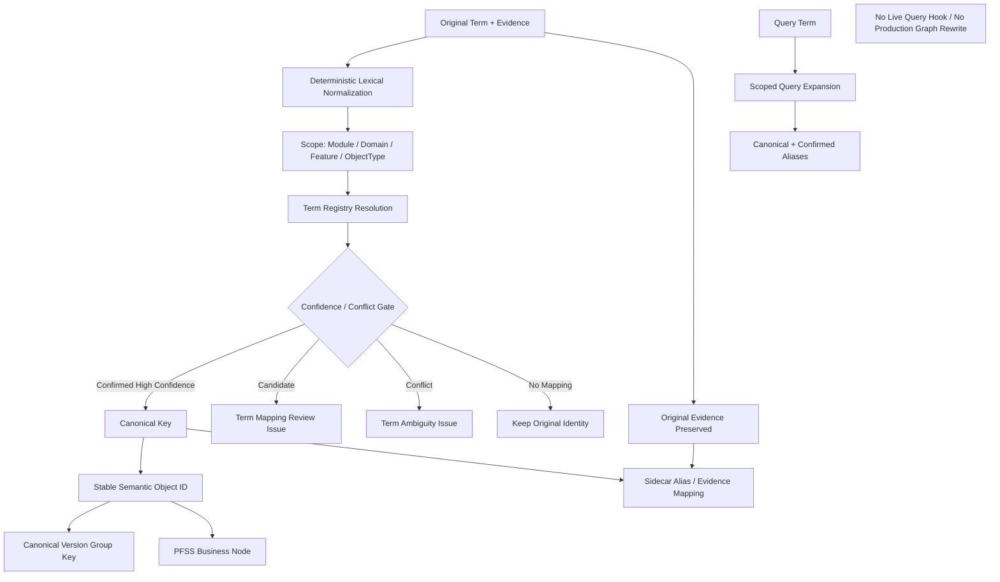

# Block 25A-0：术语归一 V2 与稳定语义身份

你现在继续在本地 LightRAG 代码仓中工作。

本轮任务：**Block 25A-0，Term Normalization V2 & Stable Semantic Identity**。

本轮解决第一轮真实测试中已经暴露的问题：

```text
Search / 查询
Status / 状态
SWIFTCODE / SWIFT CODE / Swift Code
Current Handler / 当前处理人
```

可能被创建为不同节点，导致：

```text
实体重复
关系路径断裂
跨语言召回不完整
版本组被拆散
同一对象跨文档和跨版本身份不稳定
```

本轮只做术语归一、实体消歧和稳定语义身份。  
**不做实体类型纠偏**；“询价项目列表被识别为 Location”将在下一轮 Block 25A-1 处理。

---

## 一、前置状态

以下 Block 已通过：

### 24B 系列

- 已实现统一文档 Envelope、单次解析、原文证据链；
- 已实现 PFSS / Generic / Issue 三空间隔离；
- `DSL_FULL` 和 `DSL_PARTIAL` 可写 PFSS 安全对象；
- Sidecar、Evidence、Endpoint Closure、幂等和 Issue 隔离已通过。

### 24C 系列

- 已实现持久化 Document Registry 和 Metadata Sidecar；
- 已实现 Document Version、Batch、Semantic Object / Relation、Evidence、Term、Version、Issue 和 Rollback 注册；
- 已实现文档新版本增量更新、共享贡献保护、安全删除、Rebuild 和 Saga Compensation；
- 已能够根据稳定 ID 判断对象是否应复用、更新或删除。

---

## 二、本轮核心原则

### 1. 名称不等于身份

```text
名称：对象叫什么
身份：对象究竟是谁
```

以下名称可能指向同一个语义对象：

```text
SWIFTCODE
SWIFT CODE
Swift Code
```

但以下名称即使包含相同词，也不一定是同一对象：

```text
Bank Status
Approval Status
Task Status
Migration Status
```

因此不能只按字符串或翻译关系全局合并。

### 2. 原文永远保留

术语归一不得修改：

```text
RawEvidenceChunk.content
SourceTextUnit.content
evidenceText
sourceSpan
textHash
```

必须同时保留：

```text
original_term
canonical_term
alias / mapping evidence
```

### 3. LLM 不负责最终合并

本轮默认：

```text
不调用真实 LLM
不调用真实 Embedding
```

确定性规则和已确认术语表负责自动归一。  
低置信候选只能进入：

```text
CANDIDATE / TERM_AMBIGUITY / REVIEW_REQUIRED
```

不得直接物理合并节点。

### 4. 术语归一先于稳定 ID 和版本分组

正确顺序：

```text
原始术语
→ 作用域识别
→ 规范化与消歧
→ canonical key
→ stable semantic_object_id
→ version_group_key
→ PFSS payload
```

不得：

```text
先用原始名称生成节点 ID
再事后仅修改显示名称
```

---

## 三、本轮目标

实现：

```text
Term Registry
+ Scope-aware Normalizer
+ Confidence and Conflict Policy
+ Stable Semantic Identity
+ Alias / Canonical Mapping Persistence
+ Query-time Term Expansion Utility
+ Existing Object Migration Plan
+ Isolated PFSS Dedup Smoke
```

本轮要证明：

1. 大小写、空格、连接符、全半角差异可确定性归一；
2. 已确认的中英文同义词可映射到同一稳定语义身份；
3. 泛词不能被全局硬合并；
4. Domain、Feature 和 ObjectType 可参与消歧；
5. 低置信候选不进入正式 PFSS 合并；
6. 原始证据和原始术语保留；
7. 相同概念跨文档、跨版本和跨别名保持稳定 ID；
8. 不同概念即使字符串相似，也保持不同 ID；
9. Version Group 使用 canonical semantic identity，而不是原始显示名；
10. Query Expansion 能在指定作用域内扩展 canonical term 和 aliases；
11. 同义词配置变化能生成影响和 Rebuild Plan；
12. 本轮不修改正式上传入口和在线查询入口。

---

## 四、本轮严格边界

本轮允许：

- 新增术语表 schema 和 importer；
- 新增确定性 lexical normalization；
- 新增作用域匹配和置信度策略；
- 新增 stable semantic ID；
- 扩展 Sidecar `term_mappings`；
- 生成 migration / rebuild plan；
- 在隔离本地 PFSS workspace 中使用 Fake Embedding 验证节点去重；
- 生成查询术语扩展结果；
- 执行本地 SQLite 持久化 smoke。

本轮禁止：

1. 不修改 `/documents/upload`；
2. 不接 Live Upload Hook；
3. 不启用正式 Auto Router；
4. 不调用真实 LLM；
5. 不调用真实外部 Embedding；
6. 不调用原生 `extract_entities`；
7. 不执行原生 Gleaning；
8. 不连接生产数据库；
9. 不连接 Neo4j；
10. 不使用正式 PFSS workspace；
11. 不重写已有生产图；
12. 不自动迁移历史生产数据；
13. 不处理通用 NER 类型纠偏；
14. 不修改 LightRAG Core/API；
15. 不安装新依赖；
16. 不修改 `uv.lock / pyproject.toml / requirements`；
17. 不提前开始 Block 25A-1 或 Block 26。

本轮完成后必须满足：

```text
LIVE_UPLOAD_BEHAVIOR_CHANGED = false
LIVE_QUERY_BEHAVIOR_CHANGED = false
LIVE_UPLOAD_HOOK_CONNECTED = false
AUTO_WRITE_ROUTING_ENABLED = false
REAL_EMBEDDING_CALLS_EXECUTED = false
REAL_LLM_CALLS_EXECUTED = false
ORIGINAL_EXTRACT_ENTITIES_CALLED = false
PRODUCTION_GRAPH_REWRITE_EXECUTED = false
PRODUCTION_DATABASE_CONNECTED = false
NEO4J_CONNECTED = false
LIGHTRAG_CORE_MODIFIED = false
```

---

## 五、防止 Codex 原地打圈

必须严格遵守：

1. 只读取一次：
   - `artifacts/block_24c0_persistent_sidecar/sidecar_schema.sql`
   - `artifacts/block_24c1_document_lifecycle/document_lifecycle_report.json`
   - 当前 `domain_registry.py`
   - 当前 semantic object ID / version group 生成函数
2. 不重新分析 `/documents/upload`；
3. 不重新执行 24A 真实模型 smoke；
4. 不重新执行完整 24C 生命周期 suite；
5. 不全仓反复 `rg/find`；
6. 每个目标文件最多完整读取一次；
7. 只使用已有依赖和 Python 标准库；
8. XLSX importer 仅在当前环境已有安全解析能力时实现；
9. 不为 XLSX 安装新依赖；
10. 同一个失败命令只允许：
    - 首次；
    - 一次定向修复；
    - 重跑一次；
11. 第二次仍失败：
    - 写入 `unresolved_questions.md`；
    - 停止本轮；
12. 不为通过测试放宽冲突规则；
13. 不把低置信候选强制改成 Confirmed；
14. 完成准出项后立即停止。

---

## 六、建议新增文件

建议新增：

```text
lightrag_ext/us_dsl/term_normalization_types.py
lightrag_ext/us_dsl/term_lexical_normalizer.py
lightrag_ext/us_dsl/term_registry.py
lightrag_ext/us_dsl/term_registry_importer.py
lightrag_ext/us_dsl/scoped_term_resolver.py
lightrag_ext/us_dsl/semantic_identity.py
lightrag_ext/us_dsl/term_query_expander.py
lightrag_ext/us_dsl/term_normalization_migration.py
lightrag_ext/us_dsl/scripts/run_term_normalization_smoke.py

lightrag_ext/us_dsl/tests/test_term_lexical_normalizer.py
lightrag_ext/us_dsl/tests/test_term_registry.py
lightrag_ext/us_dsl/tests/test_scoped_term_resolver.py
lightrag_ext/us_dsl/tests/test_semantic_identity.py
lightrag_ext/us_dsl/tests/test_term_query_expander.py
lightrag_ext/us_dsl/tests/test_term_normalization_migration.py
lightrag_ext/us_dsl/tests/test_term_normalization_integration.py
lightrag_ext/us_dsl/tests/test_term_normalization_guards.py
```

允许按需小改：

```text
sidecar_registry_types.py
sidecar_schema.py
sqlite_sidecar_repository.py
semantic_branch_types.py
pfss_graph_writer.py
version_relation_types.py
version_relation_builder.py
document_lifecycle_types.py
```

只能为术语映射、stable ID、version group key 和 migration plan 做修改。

禁止修改：

```text
lightrag/lightrag.py
lightrag/operate.py
lightrag/prompt.py
lightrag/api/*
document_routes.py
LightRAG storage implementations
insert / ainsert / ainsert_custom_kg
extract_entities
merge_nodes_and_edges
```

---

## 七、术语配置模型

新增 `term_normalization_types.py`。

### TermMappingStatus

```text
CONFIRMED
CANDIDATE
REJECTED
DEPRECATED
```

### TermMappingSource

```text
CONFIG
HUMAN_REVIEW
DETERMINISTIC_RULE
HISTORICAL_IMPORT
MODEL_SUGGESTION
```

本轮不得产生 `MODEL_SUGGESTION`，仅保留枚举兼容未来。

### TermScope

字段：

```text
system_name
module_code
domain_code
feature_key
object_type
language_code
```

所有字段允许为空，但解析优先级必须明确。

### TermMappingRecord

字段：

```text
term_mapping_id
source_term
canonical_term
source_language
canonical_language
synonym_type
scope
confidence
status
mapping_source
requires_scope
effective_from
effective_to
owner
comments
registry_version
created_at
updated_at
```

### SynonymType

至少支持：

```text
CASE_VARIANT
WHITESPACE_VARIANT
PUNCTUATION_VARIANT
ABBREVIATION
TRANSLATION
LEGACY_NAME
BUSINESS_ALIAS
TYPO_CORRECTION
```

### TermNormalizationDecision

字段：

```text
original_term
lexically_normalized_term
canonical_term
canonical_key
semantic_scope_key
decision
mapping_status
mapping_source
confidence
matched_mapping_ids
conflict_mapping_ids
requires_review
reason_codes
```

`decision`：

```text
IDENTITY
AUTO_NORMALIZED
REGISTRY_CONFIRMED
CANDIDATE_REVIEW
REJECTED_MAPPING
NO_MAPPING
CONFLICT
```

---

## 八、术语配置文件

必须支持一个规范化 CSV 格式：

```text
module_code
system_name
domain_code
feature_key
object_type
source_term
canonical_term
source_language
canonical_language
synonym_type
confidence
status
requires_scope
effective_from
effective_to
owner
comments
```

生成模板：

```text
artifacts/block_25a0_term_normalization/term_registry_template.csv
```

### XLSX 支持

先检查当前项目环境是否已有：

```text
openpyxl
或项目现有 Excel parser
```

若已有，可实现 XLSX importer。

若没有：

```text
XLSX_IMPORT_STATUS = DEFERRED_NO_EXISTING_DEPENDENCY
```

不得安装新依赖。  
CSV importer 必须完成，不得因 XLSX 延后阻塞核心准出。

---

## 九、确定性词法归一

新增 `term_lexical_normalizer.py`。

必须执行：

```text
Unicode NFKC
trim
连续空白折叠
大小写 casefold
常见连接符和下划线规范化
可配置标点归一
全角/半角归一
```

不得：

```text
翻译文本
删除业务关键词
移除数字、币种、状态值
用词根化改变业务含义
```

示例：

```text
SWIFTCODE
SWIFT CODE
swift-code
swift_code
```

可生成同一 lexical key。

但 lexical key 相同仅说明：

```text
候选相同
```

最终是否同一语义对象仍需作用域和 registry。

---

## 十、作用域优先级

新增 `scoped_term_resolver.py`。

匹配优先级必须为：

```text
1. module + domain + feature + object_type
2. module + domain + object_type
3. module + feature + object_type
4. module + object_type
5. domain + object_type
6. object_type
7. explicit global mapping
```

更具体的 Mapping 优先于更泛的 Mapping。

### 冲突规则

若同一最高优先级作用域内：

```text
同一 source_term
→ 多个不同 canonical_term
→ 状态均为 CONFIRMED
```

必须：

```text
decision = CONFLICT
requires_review = true
```

不得任意选择一条。

### Generic Term 规则

以下类别的词通常需要作用域：

```text
Status / 状态
Search / 查询
Type / 类型
Code / 编码
Amount / 金额
Date / 日期
Handler / 处理人
```

不要在代码里硬编码业务列表。

应通过配置字段：

```text
requires_scope = true
```

控制。

无作用域时：

```text
CANDIDATE_REVIEW 或 NO_MAPPING
```

不得全局自动合并。

---

## 十一、置信度与剪枝

本轮的“剪枝”含义是：

> 低置信、冲突或缺作用域的候选不进入正式 Identity 合并。

不是：

> 删除原始文本、历史术语或证据。

### 建议默认阈值

必须配置化：

```text
auto_confirm_threshold = 0.95
candidate_threshold = 0.70
```

### 确定性评分建议

```text
Confirmed registry exact scope          = 1.00
Lexical identity within same object     = 0.99
Case / whitespace / punctuation variant = 0.98
Confirmed translation mapping           = registry confidence
Candidate mapping                        = capped below auto threshold
Unconfigured cross-language similarity   = 不自动评分为可合并
```

不得仅使用字符串相似度将中英文自动合并。

### 结果分流

```text
score >= auto_confirm_threshold
且无冲突
且 scope 满足
且 status = CONFIRMED / deterministic safe
→ 自动 canonical identity

candidate_threshold <= score < auto_confirm_threshold
→ Candidate Mapping + Review Issue

score < candidate_threshold
→ No Mapping

Conflict
→ TermAmbiguity Issue
```

---

## 十二、稳定语义身份

新增 `semantic_identity.py`。

### SemanticIdentityKey

字段：

```text
system_name
module_code
domain_code
feature_key
object_type
canonical_object_key
rule_dimension
```

其中：

- 普通实体 `rule_dimension` 可为空；
- RuleAtom / RuleVersion 可使用 `rule_dimension`；
- alias、language、source_term 不进入稳定身份；
- document_id、sourceUsId 不进入跨文档稳定身份；
- evidence 单独绑定。

### stable semantic_object_id

必须确定性生成。

建议采用 IRI-compatible 形式：

```text
urn:pfss:{module}:{domain}:{feature}:{object_type}:{canonical_key}
```

或确定性 Hash，但必须可回查 identity components。

要求：

```text
同一 canonical identity 跨文档稳定
同一 canonical identity 跨版本稳定
不同 Domain / Feature / ObjectType 可保持不同身份
```

### semantic_relation_id

应基于：

```text
src_semantic_object_id
relation_type
tgt_semantic_object_id
relation_scope / rule_dimension
```

不得继续主要依赖原始显示名称。

---

## 十三、Version Group 对齐

版本组 key 必须改为或验证为：

```text
moduleCode
+ domainCode
+ featureKey
+ objectType
+ canonical semantic object identity
+ ruleDimension
```

不得使用：

```text
original_term
display_name
source language
```

作为版本组核心身份。

必须验证：

```text
Bank Status
银行状态
```

如果在相同确认作用域内归一为同一对象：

```text
进入同一 version group
```

而：

```text
Bank Status
Approval Status
```

必须保持不同 version group。

---

## 十四、PFSS 图表示策略

### 高置信 / Confirmed Alias

推荐：

```text
仅生成一个 canonical PFSS business node
aliases 保存在 Sidecar term_mappings
可选生成 CanonicalTerm / Alias 元数据
```

不得为每个 confirmed alias 生成一个业务节点。

### 低置信 Candidate Alias

不得物理合并。

可选择：

```text
写入 term_mappings status=CANDIDATE
写入 TERM_AMBIGUITY / TERM_MAPPING_REVIEW Issue
```

不进入正式 PFSS business relation path。

### Original Term

每条 Evidence 必须能回查原始表述：

```text
original_term
sourceUsId
textUnitId
sourceSpan
```

---

## 十五、Sidecar Schema Migration

新增版本化 migration：

```text
schema_version = 3
migration_id = 003_term_normalization_v2
```

允许扩展 `term_mappings`，至少增加：

```text
source_language
canonical_language
synonym_type
system_name
module_code
domain_code
feature_key
object_type
requires_scope
registry_version
effective_from
effective_to
owner
comments
```

新增或等价实现：

### canonical_terms

```text
canonical_term_id PK
canonical_term
canonical_key
language_code
object_type
domain_code
feature_key
created_at
updated_at
```

### semantic_identity_aliases

```text
alias_id PK
semantic_object_id FK
term_mapping_id FK
original_term
lexical_key
active_flag
created_at
```

约束：

```text
同一 scope + source_term 不允许多个 active CONFIRMED canonical target
```

迁移必须兼容 24C-0 / 24C-1 已有数据库。

---

## 十六、Query Expansion Utility

新增 `term_query_expander.py`。

实现：

```python
expand_query_terms(
    query_terms,
    *,
    module_code=None,
    domain_code=None,
    feature_key=None,
    object_type=None,
    registry,
) -> TermExpansionResult
```

输出：

```text
original_terms
canonical_terms
confirmed_aliases
candidate_aliases
rejected_aliases
scope_used
ambiguities
```

### 规则

- 只自动使用 `CONFIRMED` alias；
- Candidate 只能作为低权重提示，不默认加入强查询；
- Rejected 不得加入；
- 作用域越具体，扩展优先级越高；
- 本轮不接 Live Query；
- 只提供纯函数与报告。

---

## 十七、现有对象 Migration Plan

新增 `term_normalization_migration.py`。

本轮不得重写生产图。

必须生成：

```text
TermNormalizationMigrationPlan
```

字段：

```text
affected_semantic_object_ids
alias_groups
merge_candidate_groups
confirmed_merge_groups
conflict_groups
version_group_rekey_count
graph_rebuild_required_count
sidecar_only_update_count
planned_actions
```

### 处理原则

- 已确认同义词导致多个测试节点：
  - 生成 merge/rebuild plan；
  - 本轮只在隔离 fixture 中执行；
  - 不改生产图。
- 低置信候选：
  - 不生成 merge action；
  - 只生成 review issue。
- Mapping 发生变化：
  - 标记受影响对象 `REBUILD_REQUIRED`；
  - 交给 24C-1 生命周期能力未来执行。

---

## 十八、测试 Fixtures

通用逻辑不得写死 LC 或询价系统。

必须包含：

### Fixture A：纯格式变体

```text
SWIFTCODE
SWIFT CODE
swift-code
swift_code
```

相同 scope：

```text
同一 canonical identity
```

### Fixture B：已确认中英文

Registry：

```text
当前处理人 → Current Handler
status = CONFIRMED
scope = Workflow + RolePermission
```

预期：

```text
同一 semantic_object_id
```

### Fixture C：泛词需作用域

```text
Status
状态
```

无 scope：

```text
不得自动全局合并
```

在明确 `Ledger + FieldSpec + BankStatusFeature` scope 且有 confirmed mapping：

```text
可归一到 Bank Status
```

### Fixture D：相似但不同对象

```text
Bank Status
Approval Status
Task Status
```

预期：

```text
三个稳定身份
```

### Fixture E：Search 多义

```text
Search / 查询
```

在 `MonitoringReport + ReportSpec` confirmed mapping：

```text
可归一
```

在不同 object type 或无 scope：

```text
不得强制合并
```

### Fixture F：冲突 Mapping

相同 scope：

```text
Status → Bank Status
Status → Approval Status
均为 CONFIRMED
```

预期：

```text
CONFLICT
TERM_AMBIGUITY Issue
不生成 identity merge
```

### Fixture G：跨文档和跨版本

V1 使用：

```text
Current Handler
```

V2 使用：

```text
当前处理人
```

confirmed mapping 后：

```text
semantic_object_id 不变
version_group_key 不变
```

---

## 十九、隔离 PFSS 去重 Smoke

使用 Fake Deterministic Embedding 和本地隔离 PFSS workspace。

输入两份合成文档：

### 文档 1

```text
Current Handler
SWIFT CODE
Bank Status
```

### 文档 2

```text
当前处理人
SWIFTCODE
银行状态
```

配置确认：

```text
当前处理人 → Current Handler
SWIFTCODE → Swift Code
银行状态 → Bank Status
```

且 scope 完全一致。

验证：

```text
canonical PFSS node count = 3
不是 6
alias record count >= 3
original evidence terms 均可回查
duplicate semantic object count = 0
```

再增加：

```text
Approval Status
```

验证：

```text
不会被合并到 Bank Status
```

Smoke 完成后 cleanup。

---

## 二十、测试要求

至少覆盖：

### Lexical

1. `test_unicode_nfkc_normalization`
2. `test_case_whitespace_punctuation_variants`
3. `test_lexical_normalization_preserves_business_digits`
4. `test_original_term_is_preserved`

### Registry

5. `test_csv_registry_import`
6. `test_registry_rejects_conflicting_confirmed_mapping_in_same_scope`
7. `test_more_specific_scope_wins`
8. `test_candidate_mapping_does_not_auto_confirm`
9. `test_rejected_mapping_is_never_used`
10. `test_registry_version_is_reported`

### Resolver

11. `test_swift_code_variants_normalize_to_one_canonical_term`
12. `test_confirmed_bilingual_alias_normalizes_in_scope`
13. `test_unscoped_generic_status_does_not_auto_merge`
14. `test_scoped_status_mapping_can_resolve`
15. `test_bank_approval_task_status_remain_distinct`
16. `test_search_translation_requires_confirmed_scope`
17. `test_conflicting_mapping_returns_term_ambiguity`
18. `test_low_confidence_result_requires_review`
19. `test_resolution_is_deterministic`

### Identity

20. `test_aliases_share_stable_semantic_object_id`
21. `test_identity_is_stable_across_documents`
22. `test_identity_is_stable_across_document_versions`
23. `test_domain_feature_object_type_affect_identity`
24. `test_original_language_does_not_affect_identity`
25. `test_relation_id_uses_stable_endpoint_ids`
26. `test_version_group_uses_canonical_identity`
27. `test_distinct_status_objects_have_distinct_version_groups`

### Query Expansion

28. `test_query_expansion_returns_confirmed_aliases`
29. `test_query_expansion_excludes_rejected_aliases`
30. `test_query_expansion_keeps_candidate_separate`
31. `test_query_expansion_respects_scope`
32. `test_query_expansion_is_not_connected_to_live_query`

### Migration / Integration

33. `test_confirmed_duplicate_nodes_generate_merge_plan`
34. `test_candidate_alias_generates_no_merge_plan`
35. `test_conflict_generates_review_issue`
36. `test_mapping_change_marks_rebuild_required`
37. `test_isolated_pfss_smoke_creates_one_node_per_canonical_identity`
38. `test_approval_status_is_not_merged_into_bank_status`
39. `test_original_evidence_terms_are_traceable`
40. `test_sidecar_alias_records_are_idempotent`
41. `test_no_real_embedding_or_llm_calls`
42. `test_no_production_graph_rewrite`
43. `test_report_is_serializable`
44. `test_no_lightrag_core_modified`
45. `test_cleanup_removes_all_workspaces`

---

## 二十一、输出目录

```text
artifacts/block_25a0_term_normalization/
```

必须生成：

```text
term_normalization_report.json
term_normalization_report.md
term_registry_template.csv
term_registry_fixture.csv
term_registry_validation.json
normalization_decisions.json
ambiguity_report.json
stable_identity_report.json
version_group_alignment_report.json
query_expansion_report.json
migration_plan.json
pfss_dedup_snapshot.json
sidecar_alias_snapshot.json
idempotency_report.json
safety_check.json
cleanup_report.json
architecture.mmd
command_log.txt
git_status_before.txt
git_status_after.txt
core_diff_check.txt
unresolved_questions.md
workspaces/
```

若实现 XLSX importer，再生成：

```text
term_registry_template.xlsx
xlsx_import_report.json
```

---

## 二十二、架构图

`architecture.mmd`：



---

## 二十三、默认测试命令

```bash
mkdir -p artifacts/block_25a0_term_normalization

git status --short \
  > artifacts/block_25a0_term_normalization/git_status_before.txt
```

```bash
.venv/bin/python - <<'PY'
import subprocess
import sys

tests = [
    "lightrag_ext/us_dsl/tests/test_term_lexical_normalizer.py",
    "lightrag_ext/us_dsl/tests/test_term_registry.py",
    "lightrag_ext/us_dsl/tests/test_scoped_term_resolver.py",
    "lightrag_ext/us_dsl/tests/test_semantic_identity.py",
    "lightrag_ext/us_dsl/tests/test_term_query_expander.py",
    "lightrag_ext/us_dsl/tests/test_term_normalization_migration.py",
    "lightrag_ext/us_dsl/tests/test_term_normalization_integration.py",
    "lightrag_ext/us_dsl/tests/test_term_normalization_guards.py",
]

commands = [
    [".venv/bin/python", "-m", "pytest", test, "-q"]
    for test in tests
] + [
    [".venv/bin/python", "-m", "compileall", "-q", "lightrag_ext"],
    [".venv/bin/python", "-m", "py_compile", "lightrag/prompt.py"],
    [".venv/bin/python", "-m", "ruff", "check",
     "lightrag_ext", "lightrag/prompt.py"],
]

for command in commands:
    print("RUN:", " ".join(command), flush=True)
    try:
        result = subprocess.run(command, timeout=300)
    except subprocess.TimeoutExpired:
        print("TIMEOUT:", " ".join(command))
        sys.exit(124)

    if result.returncode != 0:
        sys.exit(result.returncode)
PY
```

---

## 二十四、隔离 Smoke

运行：

```bash
.venv/bin/python -m \
  lightrag_ext.us_dsl.scripts.run_term_normalization_smoke \
  --output-dir artifacts/block_25a0_term_normalization \
  --fixture-suite \
  --fake-deterministic-embedding \
  --isolated-pfss-dedup-smoke \
  --cleanup
```

不得调用真实模型或生产存储。

---

## 二十五、安全检查

`safety_check.json` 必须包含：

```json
{
  "live_upload_behavior_changed": false,
  "live_query_behavior_changed": false,
  "live_upload_hook_connected": false,
  "auto_write_routing_enabled": false,
  "real_embedding_calls_executed": false,
  "real_llm_calls_executed": false,
  "original_extract_entities_called": false,
  "production_graph_rewrite_executed": false,
  "production_database_connected": false,
  "neo4j_connected": false,
  "entity_type_resolver_changed": false,
  "lightrag_core_modified": false
}
```

Core 检查：

```bash
git diff --name-only -- \
  lightrag/lightrag.py \
  lightrag/operate.py \
  lightrag/prompt.py \
  lightrag/api \
  > artifacts/block_25a0_term_normalization/core_diff_check.txt
```

最终状态：

```bash
git status --short \
  > artifacts/block_25a0_term_normalization/git_status_after.txt
```

---

## 二十六、准出标准

通过条件：

1. Term Registry 已实现；
2. CSV importer 已实现；
3. Lexical Normalizer 已实现；
4. 作用域优先级已实现；
5. 冲突检测已实现；
6. 置信度阈值配置化；
7. 低置信候选不自动合并；
8. Generic Term 无作用域时不自动合并；
9. 已确认中英文 alias 可共享稳定身份；
10. SWIFT Code 格式变体共享稳定身份；
11. Bank Status、Approval Status、Task Status 保持不同身份；
12. stable semantic_object_id 跨文档稳定；
13. stable semantic_object_id 跨版本稳定；
14. relation ID 使用稳定 endpoint ID；
15. version_group_key 使用 canonical identity；
16. Original Term 和 Evidence 完整保留；
17. Query Expansion 只使用 Confirmed alias；
18. Candidate / Rejected 映射不进入强查询扩展；
19. Migration Plan 已实现；
20. Mapping 变化可标记 Rebuild Required；
21. 隔离 PFSS dedup smoke 通过；
22. canonical business node 无重复；
23. Sidecar Alias 持久化幂等；
24. 未修改实体类型 Resolver；
25. 未调用真实 Embedding / LLM；
26. 未重写生产图；
27. 未连接生产数据库或 Neo4j；
28. 未修改 LightRAG Core/API；
29. 测试和静态检查全部通过；
30. artifacts 完整；
31. cleanup 通过。

不通过条件：

1. `Status / 状态` 被全局自动合并；
2. `Bank Status / Approval Status` 被误合并；
3. 只按字符串相似度合并中英文；
4. Candidate Mapping 被当 Confirmed；
5. 冲突 Mapping 任意选择一条；
6. 原文术语被改写或删除；
7. Alias 参与生成不同 semantic IDs；
8. 同一对象跨版本产生新 ID；
9. Version Group 仍按显示名称分组；
10. 为合并 alias 直接修改生产图；
11. 调用真实模型；
12. 修改实体类型逻辑；
13. 修改 LightRAG Core；
14. 安装新依赖；
15. 测试失败；
16. cleanup 失败。

---

## 二十七、完成后只输出

```text
Block: 25A-0

Implementation:
- lexical_normalizer_implemented:
- term_registry_implemented:
- csv_importer_implemented:
- xlsx_import_status:
- scoped_resolver_implemented:
- stable_semantic_identity_implemented:
- query_expander_implemented:
- migration_planner_implemented:

Normalization fixtures:
- swift_code_variants_same_identity:
- current_handler_bilingual_same_identity:
- unscoped_status_auto_merged:
- scoped_bank_status_mapping_passed:
- bank_approval_task_status_distinct:
- search_translation_requires_scope:
- conflict_mapping_detected:
- low_confidence_mapping_auto_merged:

Identity:
- stable_across_documents:
- stable_across_versions:
- relation_id_uses_stable_endpoints:
- version_group_uses_canonical_identity:
- duplicate_semantic_object_count:

PFSS smoke:
- canonical_node_count:
- source_term_count:
- alias_record_count:
- approval_status_kept_separate:
- original_evidence_traceable:
- idempotency_passed:

Migration:
- confirmed_merge_group_count:
- candidate_review_group_count:
- conflict_group_count:
- rebuild_required_count:
- production_graph_rewrite_executed:

Safety:
- live_upload_behavior_changed:
- live_query_behavior_changed:
- real_embedding_calls_executed:
- real_llm_calls_executed:
- entity_type_resolver_changed:
- production_database_connected:
- neo4j_connected:
- cleanup_passed:
- core_modified_in_this_round:

Tests:
- collected_count:
- passed_count:
- failed_count:
- compileall:
- py_compile:
- ruff:

Artifacts:
- artifacts/block_25a0_term_normalization

Recommended next block:
- Block 25A-1 only if all gates pass.
```

完成后立即停止。

---

## 二十八、特别提醒

本轮只解决：

> **同一个产品功能对象因为语言、大小写、空格、缩写或历史名称不同而被拆成多个节点的问题。**

本轮不解决：

> **“询价项目列表被识别为 Location”这类实体类型错误。**

下一步才是：

> **Block 25A-1：实体类型 Resolver 与通用 NER 类型阻断。**
