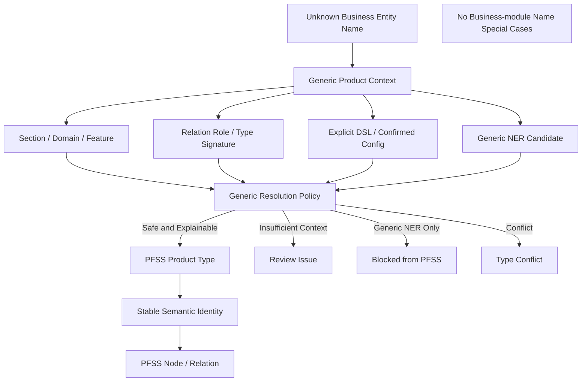

# Block 25A-1.1：实体类型 Resolver 泛化与反硬编码收口

你现在继续在本地 LightRAG 代码仓中工作。

本轮任务：**Block 25A-1.1，Entity Type Resolver Generalization & Anti-Hardcode Closure**。

> 本轮不是新功能开发，也不是进入版本检索。  
> 25A-1 当前仅“局部通过”，说明某些 fixture 可用，但还不能证明 Resolver 对其他资金管理模块和未知业务名词具备泛化能力。  
> 本轮必须先证明：**类型判断来自产品功能本体、文档结构、Domain、Feature、Relation Signature 和配置，而不是针对可接受银行、询价、FX 或任何具体模块名称写死。**

本轮通过后，才允许进入：

```text
Block 25B：版本感知检索与版本问题索引
```

---

## 一、本轮目标

对 25A-1 做严格泛化收口，证明：

1. 产品实体类型解析不依赖具体业务名称；
2. 可接受银行、询价、外汇、资金计划、账户、付款、现金池等词只能出现在 fixture / 测试数据 / 报告示例中；
3. 运行时代码不得通过具体业务词判断实体类型；
4. Resolver 必须依据：
   - 显式 DSL 类型；
   - 产品实体类型 Registry；
   - 文档结构；
   - `sectionType`；
   - Domain / Feature；
   - Relation Signature；
   - 通用、可配置 lexical / structural cues；
   - 置信度与冲突策略；
5. 对未见过的新模块名、新页面名和新字段名仍能正确分类或安全降级；
6. 无法安全判定时进入 Review / Issue，而不是强制归类；
7. 不破坏 25A-0 的术语归一和稳定语义身份；
8. 不修改 LightRAG Core、正式上传、正式查询或生产图。

---

## 二、严格结论边界

本轮完成后只能证明：

```text
实体类型 Resolver 的泛化和反硬编码准出通过
```

不能宣称：

```text
所有真实业务实体都能自动正确分类
生产上传已接入 Resolver
在线查询已接入 Resolver
真实 LLM 类型抽取已完成生产验证
```

---

## 三、防止 Codex 原地打圈

必须严格遵守：

1. 不重新设计 25A-1。
2. 不重写整个 Resolver。
3. 只修：
   - 模块知识硬编码；
   - 不可配置的业务词判断；
   - 测试覆盖不足；
   - 未知模块泛化不足；
   - 报告证据不足。
4. 只允许完整读取一次：
   - `contextual_entity_type_resolver.py`
   - `product_entity_type_registry.py`
   - `generic_ner_type_policy.py`
   - `relation_type_signature_registry.py`
   - `entity_type_resolution_policy.py`
   - `entity_type_migration.py`
   - 25A-1 对应测试文件
5. 禁止全仓反复 `rg/find`。
6. 允许做一次定向静态扫描，检查本轮允许范围内是否存在业务硬编码。
7. 同一失败命令最多：
   - 首次执行；
   - 一次定向修复；
   - 重跑一次。
8. 第二次仍失败：
   - 记录到 `unresolved_questions.md`；
   - 停止本轮。
9. 不安装依赖。
10. 不修改 `uv.lock / pyproject.toml / requirements`。
11. 不调用真实 LLM、真实 Embedding 或生产存储。
12. 不开始 25B。
13. 达到准出标准后立即停止。

---

## 四、允许和禁止的修改范围

### 允许修改

```text
lightrag_ext/us_dsl/contextual_entity_type_resolver.py
lightrag_ext/us_dsl/product_entity_type_registry.py
lightrag_ext/us_dsl/generic_ner_type_policy.py
lightrag_ext/us_dsl/relation_type_signature_registry.py
lightrag_ext/us_dsl/entity_type_resolution_policy.py
lightrag_ext/us_dsl/entity_type_resolution_types.py
lightrag_ext/us_dsl/entity_type_migration.py
lightrag_ext/us_dsl/domain_registry.py
lightrag_ext/us_dsl/tests/test_*entity_type*.py
lightrag_ext/us_dsl/tests/test_*generic_ner*.py
```

允许新增：

```text
lightrag_ext/us_dsl/entity_type_generalization_guard.py
lightrag_ext/us_dsl/scripts/run_entity_type_generalization_closure.py
lightrag_ext/us_dsl/tests/test_entity_type_generalization.py
lightrag_ext/us_dsl/tests/test_entity_type_anti_hardcode.py
lightrag_ext/us_dsl/tests/test_entity_type_unseen_module.py
```

### 禁止修改

```text
lightrag/lightrag.py
lightrag/operate.py
lightrag/prompt.py
lightrag/api/*
document_routes.py
insert / ainsert / ainsert_custom_kg
extract_entities
merge_nodes_and_edges
LightRAG storage implementations
正式上传入口
正式查询入口
.env
```

---

## 五、反硬编码合同

### 1. 运行时代码不得出现业务模块特判

在以下生产代码中，禁止出现基于具体业务词的分支：

```python
if entity_name == "询价项目列表":
    return "ReportSpec"

if "Bank Status" in entity_name:
    return "FieldSpec"

if module_code == "LCAB":
    ...

if "Transfer To" in text:
    ...
```

禁止的业务特例包括但不限于：

```text
LCAB
Acceptable Bank
可接受银行
Bank Status
Swift Code
Current Handler
Transfer To
询价项目
询价项目列表
报价
FX
外汇
现金池
账户
资金计划
付款
```

这些词可以出现于：

```text
tests/
fixtures/
artifacts/
comments explaining examples
```

但不得作为 Resolver 运行时类型判定逻辑。

### 2. 允许的通用结构规则

允许使用通用、可配置结构概念，例如：

```text
query_section
list_definition
result_grid
report_rule
field_table
task_rule
api_desc
migration_rule
access_audit
```

允许使用产品功能本体中的类型：

```text
ReportSpec
FeatureCatalog
FieldSpec
TaskRule
IntegrationEndpoint
RolePermission
DataMigrationSpec
RuleAtom
StateTransition
DomainObject
```

允许使用通用 lexical cue 类别，但必须配置化，例如：

```text
页面类提示
列表类提示
查询类提示
字段类提示
任务类提示
接口类提示
权限类提示
迁移类提示
```

不得把具体业务对象名称当 cue。

### 3. Generic NER 只能作为弱候选

```text
Location
Person
Organization
Event
```

不得直接决定 PFSS 类型。

若无足够产品上下文：

```text
BLOCKED_GENERIC_TYPE
或 CANDIDATE_REVIEW
```

不得猜测。

---

## 六、Resolver 必须使用的通用信号

最终类型决策必须可解释地由以下信号组合产生：

```text
1. explicit DSL type
2. confirmed type configuration
3. document_type
4. section_type
5. primary_domain / related_domains
6. feature role
7. table / heading / field structural context
8. parent object type
9. relation source/target role
10. relation signature
11. generic lexical cue category
12. generic NER candidate
13. evidence completeness
14. confidence / conflict policy
```

每个决策必须输出：

```text
selected_type
confidence
reason_codes
signals_used
signals_rejected
requires_review
blocked_from_pfss
```

若 `signals_used` 只有：

```text
entity_name keyword
generic_ner_type
```

则不得自动进入 PFSS。

---

## 七、配置与逻辑分离

以下内容必须来自 Registry / Policy 配置，而不是散落在 `if/elif` 中：

```text
PFSS allowed entity types
allowed domains
preferred section types
structural cue categories
relation source/target signatures
auto_accept_threshold
review_threshold
generic NER dispositions
```

运行时代码只执行通用评分和约束算法。

若当前 lexical cues 直接写在 Python 字典中，可以保留为默认 Registry 配置，但必须满足：

```text
不包含具体业务对象名称
配置集中
可序列化
可覆盖
可版本化
```

---

## 八、多模块泛化 Fixture 矩阵

本轮必须使用至少 **6 组不同领域、不同名称**的 fixture。

不得只使用可接受银行或询价系统。

### Fixture A：MonitoringReport

文本：

```text
采购申请清单支持按审批阶段和申请日期筛选，并展示申请人、金额和当前节点。
```

结构：

```text
section_type = query_section
primary_domain = MonitoringReport
```

预期：

```text
采购申请清单 → ReportSpec
审批阶段 → FieldSpec
申请日期 → FieldSpec
申请人 → FieldSpec
金额 → FieldSpec
当前节点 → FieldSpec
```

### Fixture B：Workflow

文本：

```text
系统生成待复核任务，并将任务分配给当前处理角色；任务允许转派。
```

预期：

```text
待复核任务 → TaskRule
当前处理角色 → RolePermission
转派 → TaskRule 或 RuleAtom（按既有本体唯一配置）
```

### Fixture C：Integration

文本：

```text
系统调用额度校验服务，并接收额度结果回调。
```

预期：

```text
额度校验服务 → IntegrationEndpoint
额度结果回调 → IntegrationEndpoint
```

### Fixture D：DataMigrationInitialization

文本：

```text
历史合同数据需要执行预检查、字段映射和 dry-run 迁移。
```

预期：

```text
历史合同数据迁移 → DataMigrationSpec
字段映射 → RuleAtom 或 FieldSpec 关系对象
```

### Fixture E：AccessAudit

文本：

```text
只有结算管理员可以修改结算状态，系统记录修改前后值和操作人。
```

预期：

```text
结算管理员 → RolePermission
结算状态 → FieldSpec
审计记录规则 → RuleAtom
```

### Fixture F：MasterData

文本：

```text
客户主数据包含客户编码、客户名称和所属区域。
```

预期：

```text
客户主数据 → DomainObject
客户编码 / 客户名称 / 所属区域 → FieldSpec
```

### Fixture G：未知模块名

使用随机、此前未出现的业务名称，例如：

```text
“Zeta 方案清单支持按阶段标识筛选。”
```

结构明确：

```text
section_type = query_section
primary_domain = MonitoringReport
```

预期：

```text
Zeta 方案清单 → ReportSpec
阶段标识 → FieldSpec
```

必须证明：

> 即使业务名称完全未见过，只要结构和关系上下文明确，Resolver 仍能正确分类。

### Fixture H：无产品上下文的 Generic NER

```text
Berlin
```

原始候选：

```text
Location
```

预期：

```text
不得进入 PFSS
```

### Fixture I：歧义对象

```text
“结果”
```

无 section、domain、parent、relation role。

预期：

```text
NO_SAFE_TYPE / REVIEW_REQUIRED
```

不得强制设为 ReportSpec 或 FieldSpec。

---

## 九、Unseen-Name 泛化测试

必须随机或参数化生成至少 20 个此前未出现的名称，例如：

```text
Alpha 记录清单
Beta 状态列
Gamma 审核任务
Delta 结果接口
Epsilon 历史迁移
```

注意：

- 名称可动态生成；
- 逻辑不得读取名称中的具体业务词决定类型；
- 类型主要由结构上下文和 relation role 决定。

必须输出：

```text
unseen_fixture_count
correct_resolution_count
safe_review_count
unsafe_auto_accept_count
```

准出要求：

```text
unsafe_auto_accept_count = 0
```

对于信息不足的对象，允许安全进入 Review，不要求全部自动分类。

---

## 十、静态反硬编码检查

新增 `entity_type_generalization_guard.py`。

只扫描本轮生产代码文件，不扫描测试和 artifacts。

检查：

1. 禁止业务词列表是否出现在字符串分支；
2. 是否存在：
   ```text
   if entity_name == ...
   if "具体业务词" in ...
   module_code == "具体模块"
   ```
3. 是否存在按 fixture 名称专门返回类型；
4. 是否存在测试名称被运行时代码引用；
5. 是否存在 LC / 询价 / FX 等模块特定策略。

生成：

```text
anti_hardcode_report.json
```

字段：

```text
files_scanned
business_term_hits
conditional_business_term_hits
fixture_reference_hits
runtime_test_coupling_hits
passed
```

注意：

- 注释、docstring 示例可单独报告；
- 只有运行时逻辑命中才阻断；
- 不得简单以“源码出现任何中文”为失败条件。

---

## 十一、Relation Signature 泛化检查

必须验证 Relation Signature Registry：

```text
只按实体类型定义合法组合
不按具体实体名称定义
```

例如：

```text
HasReportFilter:
  source_type ∈ {ReportSpec, FeatureCatalog}
  target_type ∈ {FieldSpec}
```

不得出现：

```text
Bank Status only
Inquiry Project List only
Acceptable Bank Search only
```

生成：

```text
relation_signature_generalization_report.json
```

字段：

```text
signature_count
name_specific_signature_count
module_specific_signature_count
type_based_signature_count
passed
```

通过条件：

```text
name_specific_signature_count = 0
module_specific_signature_count = 0
```

---

## 十二、Issue 与安全降级

若类型无法安全解析，必须进入通用 Issue：

```text
ENTITY_TYPE_REVIEW_REQUIRED
GENERIC_NER_TYPE_BLOCKED
ENTITY_TYPE_CONFLICT
NO_SAFE_PRODUCT_TYPE
INVALID_RELATION_SIGNATURE
```

Issue 中应保存：

```text
original entity name
original entity type
candidate types
score
signals used
source evidence
domain / feature / section
```

不得保存模块专用 Issue 类型。

---

## 十三、迁移与 ID 约束

本轮必须确认 25A-0 / 25A-1 的稳定身份原则不被破坏。

### 类型未变化

```text
semantic_object_id 不变化
version_group_key 不变化
```

### 类型发生安全纠正

```text
生成 rekey / migration plan
不直接重写生产图
Evidence 不丢失
relation endpoints 正确更新
version group 正确 rekey
```

### 不确定类型

```text
不生成正式新 semantic_object_id
或使用 Candidate 隔离 ID
不得污染 PFSS stable identity
```

---

## 十四、测试要求

至少新增或确认以下测试。

### Anti-hardcode

1. `test_runtime_resolver_has_no_acceptable_bank_hardcode`
2. `test_runtime_resolver_has_no_inquiry_hardcode`
3. `test_runtime_resolver_has_no_fx_or_other_module_hardcode`
4. `test_runtime_resolver_does_not_reference_fixture_names`
5. `test_relation_signatures_are_type_based_not_name_based`
6. `test_anti_hardcode_guard_ignores_test_fixtures_but_checks_runtime_logic`

### Cross-domain

7. `test_monitoring_report_fixture_resolves_by_structure`
8. `test_workflow_fixture_resolves_by_structure_and_relation_role`
9. `test_integration_fixture_resolves_without_endpoint_name_hardcode`
10. `test_migration_fixture_resolves_without_business_name_hardcode`
11. `test_access_audit_fixture_resolves_without_role_name_hardcode`
12. `test_master_data_fixture_resolves_without_object_name_hardcode`
13. `test_unknown_module_name_resolves_from_context`
14. `test_generic_location_without_context_is_blocked`
15. `test_ambiguous_short_name_requires_review`

### Unseen names

16. `test_unseen_names_never_use_business_name_special_cases`
17. `test_unseen_structured_list_resolves_to_report_spec`
18. `test_unseen_field_resolves_from_relation_role`
19. `test_unseen_task_resolves_from_section_and_relation_role`
20. `test_unseen_unsafe_auto_accept_count_is_zero`

### Explainability

21. `test_resolution_reports_signals_used`
22. `test_generic_ner_only_signal_cannot_auto_accept`
23. `test_name_keyword_only_signal_cannot_auto_accept`
24. `test_confidence_and_reason_codes_are_deterministic`

### Identity / Migration

25. `test_generalization_does_not_break_term_normalization_identity`
26. `test_same_resolved_type_keeps_stable_identity`
27. `test_type_change_generates_rekey_plan_not_direct_rewrite`
28. `test_uncertain_type_does_not_pollute_pfss_identity`

### Guards

29. `test_no_live_upload_or_query_change`
30. `test_no_real_embedding_or_llm_calls`
31. `test_no_production_graph_or_database_write`
32. `test_report_is_serializable`
33. `test_no_lightrag_core_modified`
34. `test_cleanup_removes_workspaces`

---

## 十五、输出目录

```text
artifacts/block_25a1_1_entity_type_generalization/
```

必须生成：

```text
generalization_closure_report.json
generalization_closure_report.md
anti_hardcode_report.json
cross_domain_fixture_results.json
unseen_name_results.json
relation_signature_generalization_report.json
resolution_explainability_report.json
identity_regression_report.json
migration_regression_report.json
issue_snapshot.json
safety_check.json
cleanup_report.json
architecture.mmd
command_log.txt
git_status_before.txt
git_status_after.txt
core_diff_check.txt
unresolved_questions.md
```

---

## 十六、架构图

`architecture.mmd`：



---

## 十七、运行命令

```bash
mkdir -p artifacts/block_25a1_1_entity_type_generalization

git status --short \
  > artifacts/block_25a1_1_entity_type_generalization/git_status_before.txt
```

```bash
.venv/bin/python - <<'PY'
import subprocess
import sys

tests = [
    "lightrag_ext/us_dsl/tests/test_entity_type_anti_hardcode.py",
    "lightrag_ext/us_dsl/tests/test_entity_type_generalization.py",
    "lightrag_ext/us_dsl/tests/test_entity_type_unseen_module.py",
    "lightrag_ext/us_dsl/tests/test_contextual_entity_type_resolver.py",
    "lightrag_ext/us_dsl/tests/test_relation_type_signature_registry.py",
    "lightrag_ext/us_dsl/tests/test_entity_type_migration.py",
    "lightrag_ext/us_dsl/tests/test_entity_type_resolution_guards.py",
]

commands = [
    [".venv/bin/python", "-m", "pytest", test, "-q"]
    for test in tests
] + [
    [".venv/bin/python", "-m", "compileall", "-q", "lightrag_ext"],
    [".venv/bin/python", "-m", "py_compile", "lightrag/prompt.py"],
    [".venv/bin/python", "-m", "ruff", "check",
     "lightrag_ext", "lightrag/prompt.py"],
]

for command in commands:
    print("RUN:", " ".join(command), flush=True)
    try:
        result = subprocess.run(command, timeout=300)
    except subprocess.TimeoutExpired:
        print("TIMEOUT:", " ".join(command))
        sys.exit(124)

    if result.returncode != 0:
        sys.exit(result.returncode)
PY
```

运行收口报告：

```bash
.venv/bin/python -m \
  lightrag_ext.us_dsl.scripts.run_entity_type_generalization_closure \
  --output-dir artifacts/block_25a1_1_entity_type_generalization \
  --cross-domain-fixtures \
  --unseen-name-suite \
  --anti-hardcode-check \
  --cleanup
```

不得访问网络或生产存储。

---

## 十八、安全检查

`safety_check.json` 必须包含：

```json
{
  "business_module_hardcode_detected": false,
  "fixture_name_used_in_runtime_logic": false,
  "name_specific_relation_signature_detected": false,
  "live_upload_behavior_changed": false,
  "live_query_behavior_changed": false,
  "real_embedding_calls_executed": false,
  "real_llm_calls_executed": false,
  "production_graph_rewrite_executed": false,
  "production_database_connected": false,
  "neo4j_connected": false,
  "term_normalization_v2_bypassed": false,
  "lightrag_core_modified": false
}
```

Core 检查：

```bash
git diff --name-only -- \
  lightrag/lightrag.py \
  lightrag/operate.py \
  lightrag/prompt.py \
  lightrag/api \
  > artifacts/block_25a1_1_entity_type_generalization/core_diff_check.txt
```

最终状态：

```bash
git status --short \
  > artifacts/block_25a1_1_entity_type_generalization/git_status_after.txt
```

---

## 十九、准出标准

通过条件：

1. Resolver 运行时代码无可接受银行硬编码；
2. 无询价系统硬编码；
3. 无 FX 或其他具体模块硬编码；
4. 无 fixture 名称耦合；
5. Relation Signature 只基于类型，不基于实体名称；
6. 至少 6 个跨 Domain fixture 通过；
7. 未知模块名 fixture 可由结构上下文解析；
8. Generic NER 无上下文时被安全阻断；
9. 歧义对象进入 Review；
10. Unseen fixture `unsafe_auto_accept_count = 0`；
11. 类型决策包含可解释信号；
12. 仅名称关键词不能自动准入；
13. 仅 Generic NER 类型不能自动准入；
14. 25A-0 稳定语义身份未被破坏；
15. 类型变化只生成 Migration Plan，不改生产图；
16. Issue 类型保持通用；
17. 未调用真实模型；
18. 未改在线上传或查询；
19. 未写生产图或数据库；
20. 未连接 Neo4j；
21. 未修改 LightRAG Core/API；
22. 测试、compileall、py_compile、ruff 全部通过；
23. artifacts 完整；
24. cleanup 通过。

不通过条件：

1. 为“询价项目列表”单独加判断；
2. 为 Bank Status、Swift Code、Current Handler 等单独加类型逻辑；
3. 通过模块码选择具体实体类型；
4. 只对已知 fixture 正确，未知名称失败或误准入；
5. Relation Signature 包含具体实体名称；
6. 低置信或无上下文对象被强制归类；
7. 修改生产图；
8. 修改 LightRAG Core；
9. 测试失败；
10. cleanup 失败。

---

## 二十、完成后只输出

```text
Block: 25A-1.1

Generalization:
- runtime_business_hardcode_detected:
- fixture_name_runtime_coupling_detected:
- name_specific_relation_signature_count:
- cross_domain_fixture_count:
- cross_domain_pass_count:
- unseen_fixture_count:
- unseen_correct_resolution_count:
- unseen_safe_review_count:
- unseen_unsafe_auto_accept_count:

Anti-hardcode:
- acceptable_bank_hardcode_count:
- inquiry_hardcode_count:
- fx_or_other_module_hardcode_count:
- conditional_business_term_hit_count:
- anti_hardcode_check_passed:

Resolver:
- generic_ner_only_auto_accept_count:
- name_keyword_only_auto_accept_count:
- ambiguous_object_review_count:
- conflict_block_count:
- explainability_passed:
- deterministic_resolution_passed:

Identity:
- term_normalization_identity_regression_passed:
- stable_identity_regression_passed:
- migration_plan_only:
- production_graph_rewrite_executed:

Safety:
- live_upload_behavior_changed:
- live_query_behavior_changed:
- real_embedding_calls_executed:
- real_llm_calls_executed:
- production_database_connected:
- neo4j_connected:
- cleanup_passed:
- core_modified_in_this_round:

Tests:
- collected_count:
- passed_count:
- failed_count:
- compileall:
- py_compile:
- ruff:

Artifacts:
- artifacts/block_25a1_1_entity_type_generalization

Final:
- block_25a1_status:
- recommended_next_block:
```

只有全部准出时：

```text
block_25a1_status = PASS
recommended_next_block = Block 25B
```

完成后立即停止。
