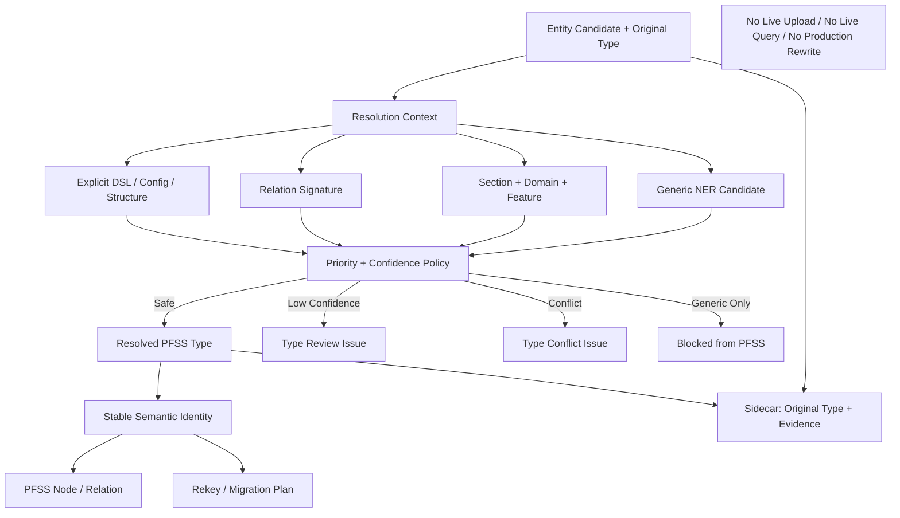

# Block 25A-1：实体类型 Resolver 与通用 NER 类型阻断

你现在继续在本地 LightRAG 代码仓中工作。

本轮任务：**Block 25A-1，Product Entity Type Resolver & Generic NER Type Blocking**。

本轮解决真实模块测试中已经暴露的问题：

```text
“询价项目列表”被识别为 Location
页面、列表、查询、台账等产品功能对象被通用 NER 类型污染
Person / Organization / Location / Event 等泛化类型可能进入 PFSS 图
```

本轮目标不是让模型“重新猜类型”，而是建立一套：

```text
显式类型优先
+ 文档结构和作用域判断
+ 产品功能本体白名单
+ 通用 NER 类型阻断
+ 低置信候选进入 Issue
+ 类型变更生成稳定迁移计划
```

的实体类型解析体系。

---

## 一、前置状态

以下 Block 已通过：

### 24B 系列

- 已实现统一文档 Envelope、单次解析和原文证据链；
- 已实现 PFSS / Generic / Issue 三空间隔离；
- `DSL_FULL`、`DSL_PARTIAL`、`RAW_ONLY` 分支可正确执行；
- Sidecar、Evidence、Endpoint Closure 和对象级阻断已通过。

### 24C 系列

- 已实现 Document Registry、Persistent Sidecar；
- 已实现 Document Version、增量更新、删除、Rebuild；
- 已实现稳定贡献关系和 Saga / Compensation；
- 可以对受影响对象生成重建计划。

### 25A-0

- 已实现术语归一 V2；
- 已实现作用域同义词解析；
- 已实现稳定 semantic identity；
- 已实现 canonical version group key；
- 已实现 alias 持久化、Query Expansion 和 Migration Plan；
- 本轮不得破坏这些能力。

---

## 二、本轮核心原则

### 1. 产品功能本体类型优先于通用 NER 类型

PFSS 产品功能图中的正式实体类型必须来自产品功能本体，例如：

```text
SourceDocument
UserStory
FeatureCatalog
DomainObject
FieldSpec
RuleAtom
TaskRule
StateTransition
MessageAtom
RolePermission
IntegrationEndpoint
ReportSpec
DataMigrationSpec
RuleVersion
CanonicalTerm
EvidenceSpan
```

以下通用 NER 类型不能直接作为 PFSS 正式类型：

```text
Location
Person
Organization
Event
Date
Time
Money
Percent
Product
Misc
GPE
ORG
PER
LOC
```

它们可以作为：

```text
原始模型候选类型
generic_ner_type
候选提示
```

但必须经过 Product Entity Type Resolver 后才能进入 PFSS。

### 2. 类型解析必须基于上下文，而不是只看名称

例如：

```text
“询价项目列表”
```

包含“列表”，且位于页面/查询/报表章节时，更可能是：

```text
ReportSpec
或 FeatureCatalog
```

而不是：

```text
Location
```

但以下对象不能仅凭词尾判断：

```text
项目列表字段
列表导出按钮
列表查询条件
```

必须结合：

```text
sectionType
Domain
Feature
Relation Role
Parent Object
字段表位置
文档结构
已确认类型配置
```

### 3. 低置信不等于强制归类

无法安全解析时：

```text
CandidateEntity
+ ENTITY_TYPE_REVIEW_REQUIRED
```

不得为了提高入图率强行选择类型。

### 4. 类型变化会影响稳定语义身份

25A-0 的 stable semantic identity 包含：

```text
object_type
```

因此：

```text
Location → ReportSpec
```

不是简单修改显示字段，而是可能导致：

```text
semantic_object_id 变化
relation endpoint rekey
version_group_key 变化
graph object rebuild
```

本轮必须生成 Migration / Rebuild Plan，不能直接改生产图。

---

## 三、本轮目标

实现：

```text
Product Entity Type Registry
+ Generic NER Type Blocklist
+ Context-aware Type Resolver
+ Type Confidence / Conflict Policy
+ Relation-role Type Constraints
+ Type Issue Persistence
+ Stable Identity Rekey Plan
+ Isolated PFSS Type-correction Smoke
```

本轮要证明：

1. `Location / Person / Organization / Event` 等通用 NER 类型不能直接进入 PFSS；
2. 明确 DSL 类型、表格结构类型、已确认配置类型优先；
3. 页面、列表、查询、报表类对象可结合上下文解析为 `ReportSpec / FeatureCatalog`；
4. 字段和列解析为 `FieldSpec`；
5. 待办解析为 `TaskRule`；
6. 接口解析为 `IntegrationEndpoint`；
7. 角色、处理人、权限解析为 `RolePermission`；
8. 迁移/初始化规则解析为 `DataMigrationSpec`；
9. 不确定对象进入 Issue，而不是错误入图；
10. Relation 的 subject / object 类型满足本体约束；
11. 类型解析确定性可复现；
12. 类型修正可生成 stable identity rekey 和 graph rebuild plan；
13. 原始候选类型、原始术语和 Evidence 完整保留；
14. 本轮不改在线入库或在线查询。

---

## 四、本轮严格边界

本轮允许：

- 新增产品实体类型 Registry；
- 新增通用 NER 类型阻断配置；
- 新增 Context-aware Resolver；
- 新增类型置信度和冲突策略；
- 新增 relation-role 类型约束；
- 扩展 Sidecar 保存原始类型和最终类型；
- 生成 ID rekey / rebuild plan；
- 使用本地隔离 PFSS、SQLite Sidecar 和 Fake Embedding 做 smoke；
- 执行 PFSS 类型纠偏测试。

本轮禁止：

1. 不修改 `/documents/upload`；
2. 不接 Live Upload Hook；
3. 不启用正式 Auto Router；
4. 不调用真实 LLM；
5. 不调用真实外部 Embedding；
6. 不调用原生 `extract_entities`；
7. 不执行 Gleaning；
8. 不连接生产数据库；
9. 不连接 Neo4j；
10. 不修改正式 PFSS 图；
11. 不自动迁移历史生产数据；
12. 不修改 25A-0 的术语归一规则，除非只是接口适配；
13. 不实现版本感知检索；
14. 不修改 LightRAG Core/API；
15. 不安装新依赖；
16. 不修改 `uv.lock / pyproject.toml / requirements`；
17. 不提前开始 Block 25B。

完成后必须满足：

```text
LIVE_UPLOAD_BEHAVIOR_CHANGED = false
LIVE_QUERY_BEHAVIOR_CHANGED = false
LIVE_UPLOAD_HOOK_CONNECTED = false
AUTO_WRITE_ROUTING_ENABLED = false
REAL_EMBEDDING_CALLS_EXECUTED = false
REAL_LLM_CALLS_EXECUTED = false
ORIGINAL_EXTRACT_ENTITIES_CALLED = false
PRODUCTION_GRAPH_REWRITE_EXECUTED = false
PRODUCTION_DATABASE_CONNECTED = false
NEO4J_CONNECTED = false
LIGHTRAG_CORE_MODIFIED = false
```

---

## 五、防止 Codex 原地打圈

必须严格遵守：

1. 只读取一次：
   - 25A-0 的 term normalization report；
   - 当前 `domain_registry.py`；
   - 当前 entity/relation ontology；
   - 当前 semantic identity 生成函数；
   - 当前 PFSS writer 和 Issue Index 接口。
2. 不重新分析 `/documents/upload`；
3. 不重新执行真实模型 smoke；
4. 不重新跑完整 24C 生命周期 suite；
5. 不全仓反复 `rg/find`；
6. 每个目标文件最多完整读取一次；
7. 不安装依赖；
8. 同一失败命令只允许：
   - 首次；
   - 一次定向修复；
   - 重跑一次；
9. 第二次仍失败：
   - 写入 `unresolved_questions.md`；
   - 停止本轮；
10. 不通过增加硬编码业务词来“修好” fixture；
11. 允许 fixture 使用“询价项目列表”，但 Resolver 逻辑不得写死该名称；
12. 不为提高通过率把所有页面类对象都强制设为 `ReportSpec`；
13. 完成准出项后立即停止。

---

## 六、建议新增文件

建议新增：

```text
lightrag_ext/us_dsl/entity_type_resolution_types.py
lightrag_ext/us_dsl/product_entity_type_registry.py
lightrag_ext/us_dsl/generic_ner_type_policy.py
lightrag_ext/us_dsl/contextual_entity_type_resolver.py
lightrag_ext/us_dsl/relation_type_signature_registry.py
lightrag_ext/us_dsl/entity_type_resolution_policy.py
lightrag_ext/us_dsl/entity_type_migration.py
lightrag_ext/us_dsl/scripts/run_entity_type_resolution_smoke.py

lightrag_ext/us_dsl/tests/test_product_entity_type_registry.py
lightrag_ext/us_dsl/tests/test_generic_ner_type_policy.py
lightrag_ext/us_dsl/tests/test_contextual_entity_type_resolver.py
lightrag_ext/us_dsl/tests/test_relation_type_signature_registry.py
lightrag_ext/us_dsl/tests/test_entity_type_resolution_policy.py
lightrag_ext/us_dsl/tests/test_entity_type_migration.py
lightrag_ext/us_dsl/tests/test_entity_type_resolution_integration.py
lightrag_ext/us_dsl/tests/test_entity_type_resolution_guards.py
```

允许按需小改：

```text
domain_registry.py
kg_schema_policy.py
semantic_identity.py
semantic_branch_types.py
pfss_graph_writer.py
issue_index.py
sidecar_schema.py
sqlite_sidecar_repository.py
term_normalization_types.py
```

只能为 Resolver、类型证据、ID rekey 和 migration plan 做修改。

禁止修改：

```text
lightrag/lightrag.py
lightrag/operate.py
lightrag/prompt.py
lightrag/api/*
document_routes.py
LightRAG storage implementations
insert / ainsert / ainsert_custom_kg
extract_entities
merge_nodes_and_edges
```

---

## 七、产品实体类型 Registry

新增 `product_entity_type_registry.py`。

每个产品实体类型至少定义：

```text
type_code
display_name
allowed_domains
preferred_section_types
lexical_cues
structural_cues
allowed_relation_roles
high_risk
requires_evidence
```

### 必须覆盖的正式 PFSS 类型

```text
SourceDocument
UserStory
FeatureCatalog
DomainObject
FieldSpec
RuleAtom
TaskRule
StateTransition
MessageAtom
RolePermission
IntegrationEndpoint
ReportSpec
DataMigrationSpec
RuleVersion
CanonicalTerm
EvidenceSpan
```

可继续复用已有类型，但本轮必须形成一个统一可查询 Registry。

### 示例语义

#### FeatureCatalog

典型语义：

```text
页面
菜单
功能入口
功能模块
业务能力
```

#### ReportSpec

典型语义：

```text
查询
列表
报表
结果集
导出
查询页面中的整体功能对象
```

#### FieldSpec

典型语义：

```text
字段
列
查询条件
输入项
展示项
接口字段
```

#### TaskRule

典型语义：

```text
待办
任务
处理动作
转审
关闭
```

#### IntegrationEndpoint

典型语义：

```text
API
MQ
接口
服务端点
回调
```

#### RolePermission

典型语义：

```text
角色
权限
处理人
Current Handler
数据范围
```

注意：

> lexical cue 只用于候选评分，不能单独决定最终类型。

---

## 八、通用 NER 类型策略

新增 `generic_ner_type_policy.py`。

### GenericNERTypeDisposition

```text
BLOCK_FROM_PFSS
REQUIRES_RESOLUTION
ALLOW_ONLY_IN_GENERIC_GRAPH
IGNORE_AS_LITERAL
```

### 默认策略

以下类型默认：

```text
Location / LOC / GPE
Person / PER
Organization / ORG
Event
Product
Misc
```

处理为：

```text
REQUIRES_RESOLUTION
```

如果无法解析为 PFSS 类型：

```text
BLOCK_FROM_PFSS
+ ENTITY_TYPE_REVIEW_REQUIRED
```

以下更可能是 Literal，不应自动生成业务实体节点：

```text
Date
Time
Money
Percent
Number
```

处理为：

```text
IGNORE_AS_LITERAL
或映射到 FieldSpec 的属性值
```

不得作为正式 PFSS business entity type。

---

## 九、类型解析上下文

新增 `entity_type_resolution_types.py`。

### EntityTypeResolutionContext

字段：

```text
document_type
module_code
primary_domain
related_domains
feature_key
section_type
parent_object_type
relation_role
relation_type
table_context
field_context
heading_context
neighbor_terms
original_entity_name
original_entity_type
canonical_term
source_us_id
text_unit_id
source_span
evidence_text
```

### EntityTypeCandidate

字段：

```text
candidate_type
score
source
reason_codes
evidence
```

`source`：

```text
EXPLICIT_DSL
CONFIRMED_CONFIG
STRUCTURAL_PARSER
RELATION_SIGNATURE
SECTION_DOMAIN_HEURISTIC
GENERIC_NER
MODEL_CANDIDATE
```

本轮不得创建新的真实 `MODEL_CANDIDATE`，只兼容输入。

### EntityTypeResolutionDecision

字段：

```text
original_entity_type
resolved_entity_type
decision
confidence
candidate_types
conflict_types
requires_review
blocked_from_pfss
reason_codes
identity_rekey_required
old_semantic_object_id
new_semantic_object_id
```

`decision`：

```text
EXPLICIT_ACCEPTED
CONFIG_RESOLVED
STRUCTURE_RESOLVED
RELATION_RESOLVED
HEURISTIC_RESOLVED
CANDIDATE_REVIEW
CONFLICT
BLOCKED_GENERIC_TYPE
NO_SAFE_TYPE
```

---

## 十、解析优先级

新增 `contextual_entity_type_resolver.py`。

必须按以下优先级解析：

```text
1. 明确且合法的 DSL 显式类型
2. 已确认的类型配置映射
3. 文档结构解析结果
4. Relation Signature 约束
5. Section + Domain + Feature 组合
6. Lexical cue 评分
7. Generic NER 原始候选仅作为弱提示
```

不得让：

```text
Generic NER Location
```

覆盖：

```text
结构化章节识别为 ReportSpec
```

### 冲突处理

如果最高可信来源冲突：

```text
CONFLICT
requires_review = true
blocked_from_pfss = true
```

不得任意选择。

---

## 十一、Relation Signature 约束

新增 `relation_type_signature_registry.py`。

为关键关系定义合法的 source / target 类型集合。

示例：

```text
HasReportFilter:
  source ∈ {ReportSpec, FeatureCatalog}
  target ∈ {FieldSpec}

HasReportColumn:
  source ∈ {ReportSpec}
  target ∈ {FieldSpec}

AssignsHandler:
  source ∈ {TaskRule}
  target ∈ {RolePermission}

TransfersTask:
  source ∈ {TaskRule}
  target ∈ {TaskRule, RolePermission}

CallsBackendApi:
  source ∈ {FeatureCatalog, RuleAtom, TaskRule, ReportSpec}
  target ∈ {IntegrationEndpoint}

HasFieldSpec:
  source ∈ {
    FeatureCatalog,
    DomainObject,
    ReportSpec,
    IntegrationEndpoint,
    DataMigrationSpec
  }
  target ∈ {FieldSpec}

HasVersion:
  source ∈ {
    FieldSpec,
    RuleAtom,
    TaskRule,
    StateTransition,
    IntegrationEndpoint,
    ReportSpec,
    RolePermission,
    DataMigrationSpec
  }
  target ∈ {RuleVersion}
```

要求：

1. Resolver 可利用 relation role 辅助消歧；
2. Relation Signature 不得通过修改 endpoint 类型来掩盖错误；
3. 无合法类型组合时：
   ```text
   INVALID_RELATION_SIGNATURE
   ```
   进入 Issue；
4. 不得自动生成新关系。

---

## 十二、类型置信度策略

新增 `entity_type_resolution_policy.py`。

阈值必须配置化：

```text
auto_accept_threshold = 0.90
review_threshold = 0.65
```

建议评分来源：

```text
Explicit valid DSL type                = 1.00
Confirmed config mapping               = 0.98
Strong structural parser result        = 0.95
Relation signature uniquely determines = 0.93
Section + Domain + structural cues      = 0.85~0.92
Lexical cues only                       = 不超过 0.80
Generic NER candidate only              = 不超过 0.40
```

### 自动准入

必须同时满足：

```text
score >= auto_accept_threshold
无同级冲突
类型属于 PFSS Registry
Evidence 完整
Relation Signature 可满足
```

### Review

```text
review_threshold <= score < auto_accept_threshold
```

进入：

```text
ENTITY_TYPE_REVIEW_REQUIRED
```

### 阻断

```text
score < review_threshold
或仅有 Generic NER 类型
或最高候选冲突
```

进入：

```text
INVALID_TYPE / NO_SAFE_TYPE / TYPE_CONFLICT
```

不得进入 PFSS。

---

## 十三、页面/列表/查询类对象规则

不能硬编码具体业务名称，但必须实现可配置的结构语义。

### 优先判断

若对象位于：

```text
report_rule
query_section
list_definition
result_grid
export_section
```

且表示整体查询/列表能力：

```text
ReportSpec
```

若表示菜单、页面入口或业务功能：

```text
FeatureCatalog
```

若表示列表中的一列或查询条件：

```text
FieldSpec
```

### 示例

```text
询价项目列表
```

若上下文是：

```text
页面标题 / 列表功能 / 查询结果整体
```

应解析为：

```text
ReportSpec 或 FeatureCatalog
```

不得解析为：

```text
Location
```

但：

```text
询价项目列表中的项目状态列
```

应将：

```text
项目状态
```

解析为 `FieldSpec`，而不是把整句话解析成 ReportSpec。

---

## 十四、Sidecar Schema Migration

新增：

```text
schema_version = 4
migration_id = 004_entity_type_resolution
```

扩展 `semantic_objects` 或新增等价表，保存：

```text
original_entity_type
resolved_entity_type
type_resolution_decision
type_confidence
type_requires_review
type_resolution_version
```

新增：

### entity_type_resolution_events

```text
resolution_event_id PK
semantic_object_id NULL
document_version_id
text_unit_id
original_entity_name
original_entity_type
resolved_entity_type
decision
confidence
candidate_types_json
reason_codes_json
requires_review
old_semantic_object_id
new_semantic_object_id
created_at
```

新增 Issue 类型：

```text
ENTITY_TYPE_REVIEW_REQUIRED
GENERIC_NER_TYPE_BLOCKED
ENTITY_TYPE_CONFLICT
INVALID_RELATION_SIGNATURE
```

---

## 十五、Stable Identity Rekey / Migration Plan

新增 `entity_type_migration.py`。

当类型从：

```text
Location
```

修正为：

```text
ReportSpec
```

因为 `object_type` 参与 semantic identity，必须生成：

```text
EntityTypeMigrationPlan
```

字段：

```text
old_semantic_object_id
new_semantic_object_id
old_type
new_type
affected_relation_ids
affected_evidence_mapping_ids
affected_version_group_keys
merge_target_id
sidecar_updates
pfss_delete_plan
pfss_upsert_plan
entity_vector_rebuild_required
relation_vector_rebuild_required
document_versions_affected
risk_level
```

### 原则

- 本轮只在隔离 fixture 中执行 Migration；
- 生产图只生成 Plan，不执行；
- 若新 ID 已存在：
  - 执行 alias/merge plan；
  - 不创建重复节点；
- 所有关系 endpoint 必须重键；
- 版本组必须使用新 canonical type identity；
- Evidence 不得丢失；
- 历史 original type 必须保留。

---

## 十六、测试 Fixtures

通用 Resolver 逻辑不得写死任何业务模块。

### Fixture A：明显错误的 Location

文本：

```text
询价项目列表支持按项目状态、询价日期和负责人查询。
```

上下文：

```text
section_type = query_section
primary_domain = MonitoringReport
original_entity_name = 询价项目列表
original_entity_type = Location
```

预期：

```text
resolved_entity_type ∈ {ReportSpec, FeatureCatalog}
resolved_entity_type != Location
blocked_from_pfss = false
```

具体在 fixture 中应通过页面/列表结构配置唯一决定一个类型，避免测试接受两个答案。

### Fixture B：列表字段

```text
项目状态是询价项目列表的查询条件。
```

预期：

```text
项目状态 → FieldSpec
询价项目列表 → ReportSpec
HasReportFilter Signature 合法
```

### Fixture C：待办

```text
系统生成待报价确认待办，并分配给 Current Handler。
```

预期：

```text
待报价确认待办 → TaskRule
Current Handler → RolePermission
AssignsHandler Signature 合法
```

### Fixture D：接口

```text
系统调用供应商报价结果查询 API。
```

预期：

```text
供应商报价结果查询 API → IntegrationEndpoint
```

### Fixture E：迁移

```text
历史询价项目需要执行 dry-run 迁移和字段校验。
```

预期：

```text
迁移规则 → DataMigrationSpec
```

### Fixture F：只有 Generic NER

```text
Paris
```

原始类型：

```text
Location
```

无产品上下文。

预期：

```text
不进入 PFSS
GENERIC_NER_TYPE_BLOCKED
```

### Fixture G：冲突

结构提示 `ReportSpec`，明确配置却为 `FeatureCatalog`，同级证据冲突。

预期：

```text
ENTITY_TYPE_CONFLICT
blocked_from_pfss = true
```

### Fixture H：类型修正迁移

V1：

```text
询价项目列表 / Location
```

V2 Resolver：

```text
询价项目列表 / ReportSpec
```

验证：

```text
旧 ID → 新 ID rekey plan
关系 endpoint 更新
Evidence 保留
无重复节点
```

---

## 十七、隔离 PFSS Smoke

使用：

```text
Fake Deterministic Embedding
本地 PFSS workspace
本地 SQLite Sidecar
```

处理：

1. 错误类型的“询价项目列表”；
2. “项目状态”；
3. “待报价确认待办”；
4. “Current Handler”；
5. 一个纯 Location 泛知识对象。

验证：

```text
询价项目列表进入正确 PFSS 类型
项目状态进入 FieldSpec
待办进入 TaskRule
Current Handler 进入 RolePermission
纯 Location 不进入 PFSS
Generic NER block issue 被持久化
relation signature 全部合法
duplicate semantic object count = 0
```

Smoke 完成后 cleanup。

---

## 十八、测试要求

至少覆盖：

### Registry / Generic Policy

1. `test_registry_contains_all_pfss_entity_types`
2. `test_generic_ner_types_are_not_pfss_types`
3. `test_date_money_percent_are_treated_as_literals_or_attributes`
4. `test_registry_is_domain_aware`
5. `test_registry_has_no_business_module_hardcode`

### Resolver

6. `test_explicit_valid_dsl_type_has_highest_priority`
7. `test_confirmed_config_mapping_precedes_heuristic`
8. `test_structural_context_overrides_generic_location`
9. `test_inquiry_project_list_is_not_location`
10. `test_query_list_object_resolves_to_report_spec`
11. `test_list_column_resolves_to_field_spec`
12. `test_task_resolves_to_task_rule`
13. `test_handler_resolves_to_role_permission`
14. `test_api_resolves_to_integration_endpoint`
15. `test_migration_rule_resolves_to_data_migration_spec`
16. `test_generic_location_without_product_context_is_blocked`
17. `test_low_confidence_type_requires_review`
18. `test_conflicting_high_priority_candidates_are_blocked`
19. `test_resolution_is_deterministic`
20. `test_original_entity_type_is_preserved`

### Relation Signature

21. `test_has_report_filter_requires_field_spec_target`
22. `test_assigns_handler_requires_task_and_role_types`
23. `test_calls_backend_api_requires_integration_endpoint_target`
24. `test_invalid_relation_signature_creates_issue`
25. `test_resolver_does_not_invent_relation_to_fix_signature`

### Policy / PFSS

26. `test_generic_ner_type_cannot_enter_pfss`
27. `test_review_required_type_cannot_enter_pfss`
28. `test_resolved_safe_type_can_enter_pfss`
29. `test_type_resolution_issue_is_persisted`
30. `test_issue_object_is_not_confirmed`
31. `test_endpoint_closure_after_type_resolution`
32. `test_no_forbidden_relation_after_type_resolution`

### Identity / Migration

33. `test_type_change_changes_semantic_identity`
34. `test_type_rekey_plan_updates_relation_endpoints`
35. `test_type_rekey_preserves_evidence`
36. `test_existing_target_identity_generates_merge_plan`
37. `test_version_group_rekeys_with_resolved_type`
38. `test_production_graph_is_not_rewritten`
39. `test_isolated_migration_is_idempotent`

### Guards

40. `test_no_real_embedding_or_llm_calls`
41. `test_no_live_upload_or_query_change`
42. `test_no_production_database_or_neo4j`
43. `test_report_is_serializable`
44. `test_no_lightrag_core_modified`
45. `test_cleanup_removes_all_workspaces`

---

## 十九、输出目录

```text
artifacts/block_25a1_entity_type_resolution/
```

必须生成：

```text
entity_type_resolution_report.json
entity_type_resolution_report.md
product_entity_type_registry.json
generic_ner_type_policy.json
relation_type_signatures.json
resolution_decisions.json
type_conflict_report.json
invalid_relation_signature_report.json
type_migration_plan.json
stable_identity_rekey_report.json
pfss_type_snapshot.json
issue_snapshot.json
sidecar_resolution_snapshot.json
idempotency_report.json
safety_check.json
cleanup_report.json
architecture.mmd
command_log.txt
git_status_before.txt
git_status_after.txt
core_diff_check.txt
unresolved_questions.md
workspaces/
```

---

## 二十、架构图

`architecture.mmd`：



---

## 二十一、默认测试命令

```bash
mkdir -p artifacts/block_25a1_entity_type_resolution

git status --short \
  > artifacts/block_25a1_entity_type_resolution/git_status_before.txt
```

```bash
.venv/bin/python - <<'PY'
import subprocess
import sys

tests = [
    "lightrag_ext/us_dsl/tests/test_product_entity_type_registry.py",
    "lightrag_ext/us_dsl/tests/test_generic_ner_type_policy.py",
    "lightrag_ext/us_dsl/tests/test_contextual_entity_type_resolver.py",
    "lightrag_ext/us_dsl/tests/test_relation_type_signature_registry.py",
    "lightrag_ext/us_dsl/tests/test_entity_type_resolution_policy.py",
    "lightrag_ext/us_dsl/tests/test_entity_type_migration.py",
    "lightrag_ext/us_dsl/tests/test_entity_type_resolution_integration.py",
    "lightrag_ext/us_dsl/tests/test_entity_type_resolution_guards.py",
]

commands = [
    [".venv/bin/python", "-m", "pytest", test, "-q"]
    for test in tests
] + [
    [".venv/bin/python", "-m", "compileall", "-q", "lightrag_ext"],
    [".venv/bin/python", "-m", "py_compile", "lightrag/prompt.py"],
    [".venv/bin/python", "-m", "ruff", "check",
     "lightrag_ext", "lightrag/prompt.py"],
]

for command in commands:
    print("RUN:", " ".join(command), flush=True)
    try:
        result = subprocess.run(command, timeout=300)
    except subprocess.TimeoutExpired:
        print("TIMEOUT:", " ".join(command))
        sys.exit(124)

    if result.returncode != 0:
        sys.exit(result.returncode)
PY
```

---

## 二十二、隔离 Smoke

```bash
.venv/bin/python -m \
  lightrag_ext.us_dsl.scripts.run_entity_type_resolution_smoke \
  --output-dir artifacts/block_25a1_entity_type_resolution \
  --fixture-suite \
  --fake-deterministic-embedding \
  --isolated-pfss-smoke \
  --cleanup
```

不得调用真实模型或生产存储。

---

## 二十三、安全检查

`safety_check.json` 必须包含：

```json
{
  "live_upload_behavior_changed": false,
  "live_query_behavior_changed": false,
  "live_upload_hook_connected": false,
  "auto_write_routing_enabled": false,
  "real_embedding_calls_executed": false,
  "real_llm_calls_executed": false,
  "original_extract_entities_called": false,
  "production_graph_rewrite_executed": false,
  "production_database_connected": false,
  "neo4j_connected": false,
  "term_normalization_v2_bypassed": false,
  "lightrag_core_modified": false
}
```

Core 检查：

```bash
git diff --name-only -- \
  lightrag/lightrag.py \
  lightrag/operate.py \
  lightrag/prompt.py \
  lightrag/api \
  > artifacts/block_25a1_entity_type_resolution/core_diff_check.txt
```

最终状态：

```bash
git status --short \
  > artifacts/block_25a1_entity_type_resolution/git_status_after.txt
```

---

## 二十四、准出标准

通过条件：

1. Product Entity Type Registry 已实现；
2. Generic NER Type Policy 已实现；
3. Context-aware Resolver 已实现；
4. Relation Signature Registry 已实现；
5. 类型优先级和置信度策略配置化；
6. 通用 NER 类型不能直接进入 PFSS；
7. `询价项目列表` 类 fixture 不再解析为 Location；
8. 页面、列表、字段、待办、接口、权限、迁移 fixture 类型正确；
9. Generic Location 无产品上下文时被阻断；
10. 低置信类型进入 Review；
11. 高优先级冲突被阻断；
12. Relation Signature 校验通过；
13. Resolver 不通过发明关系修复类型；
14. 原始 Entity Type 和 Evidence 保留；
15. 类型变化生成 stable identity rekey plan；
16. Relation endpoints 在 rekey 后一致；
17. Version Group 随 resolved type 正确 rekey；
18. 已存在目标身份时生成 merge plan，不重复建点；
19. Issue 持久化成功且不进入 PFSS；
20. 隔离 PFSS smoke 无错误类型节点；
21. 无重复 semantic object；
22. 幂等通过；
23. 未绕过 25A-0 术语归一；
24. 未调用真实 Embedding / LLM；
25. 未改在线上传和在线查询；
26. 未重写生产图；
27. 未连接生产数据库或 Neo4j；
28. 未修改 LightRAG Core/API；
29. 测试和静态检查全部通过；
30. artifacts 完整；
31. cleanup 通过。

不通过条件：

1. 通用 `Location / Person / Organization` 直接进入 PFSS；
2. 仅根据名称词尾强制决定类型；
3. `询价项目列表` 仍为 Location；
4. 所有“列表”均无条件设为 ReportSpec；
5. 低置信候选被自动准入；
6. 类型冲突时任意选一个；
7. Relation Signature 不合法仍入图；
8. 为满足 Relation Signature 发明新关系；
9. 类型变化后 ID 和关系 endpoint 未重键；
10. Evidence 丢失；
11. Issue 对象成为 Confirmed；
12. 直接修改生产图；
13. 调用真实模型；
14. 修改 LightRAG Core；
15. 测试失败；
16. cleanup 失败。

---

## 二十五、完成后只输出

```text
Block: 25A-1

Implementation:
- product_entity_type_registry_implemented:
- generic_ner_type_policy_implemented:
- contextual_resolver_implemented:
- relation_signature_registry_implemented:
- type_resolution_policy_implemented:
- type_migration_planner_implemented:

Resolution fixtures:
- inquiry_project_list_original_type:
- inquiry_project_list_resolved_type:
- inquiry_project_list_blocked_from_pfss:
- project_status_resolved_type:
- task_resolved_type:
- handler_resolved_type:
- api_resolved_type:
- migration_resolved_type:
- generic_location_pfss_written:
- conflict_blocked:
- low_confidence_auto_accepted:

Relation signatures:
- valid_signature_count:
- invalid_signature_count:
- invented_relation_count:
- endpoint_closure_passed:

Identity migration:
- rekey_required_count:
- relation_endpoint_rekey_count:
- version_group_rekey_count:
- merge_plan_count:
- duplicate_semantic_object_count:
- original_evidence_preserved:

PFSS smoke:
- pfss_node_count:
- pfss_edge_count:
- generic_ner_block_issue_count:
- issue_object_written_to_pfss_count:
- idempotency_passed:

Safety:
- live_upload_behavior_changed:
- live_query_behavior_changed:
- real_embedding_calls_executed:
- real_llm_calls_executed:
- production_graph_rewrite_executed:
- production_database_connected:
- neo4j_connected:
- cleanup_passed:
- core_modified_in_this_round:

Tests:
- collected_count:
- passed_count:
- failed_count:
- compileall:
- py_compile:
- ruff:

Artifacts:
- artifacts/block_25a1_entity_type_resolution

Recommended next block:
- Block 25B only if all gates pass.
```

完成后立即停止。

---

## 二十六、特别提醒

本轮只解决：

> **候选实体究竟属于哪一种产品功能类型，以及错误通用 NER 类型如何被阻断。**

本轮不解决：

> **当前规则、历史规则和版本冲突在查询时如何召回和提示。**

下一步才是：

> **Block 25B：版本感知检索与版本问题索引。**
