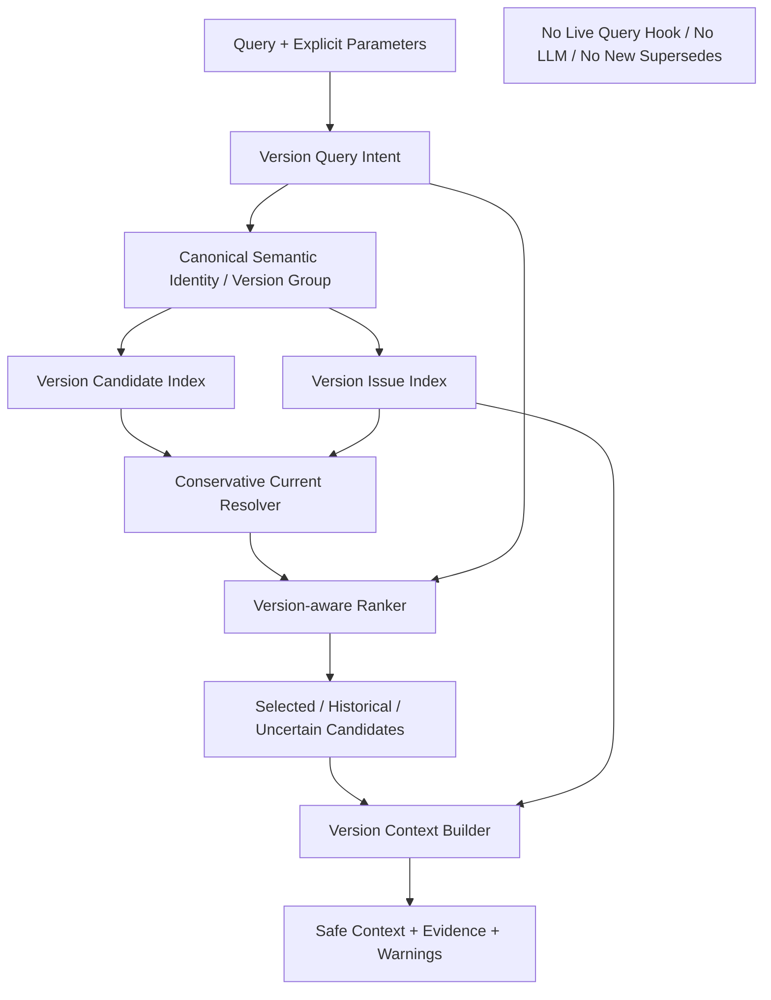

# Block 25B：版本感知检索与版本问题索引

你现在继续在本地 LightRAG 代码仓中工作。

本轮任务：**Block 25B，Version-aware Retrieval & Version Issue Index**。

> 本轮不接正式查询入口，也不生成最终业务答案。  
> 本轮只建立“版本元数据如何被查询、排序、提示和安全使用”的通用能力，为下一步 26A 混合检索融合提供稳定接口。

特别要求：

> **不得根据可接受银行、询价、FX、现金池、账户、付款或任何具体模块知识写死版本规则。**  
> 所有版本判断必须基于通用版本语义、显式证据、稳定语义身份、Sidecar 注册表和配置化策略。

---

## 一、前置状态

以下能力已通过：

### 24B 系列

- 已实现统一原文证据链；
- 已实现 PFSS / Generic / Issue 三空间隔离；
- `DSL_FULL` 和 `DSL_PARTIAL` 可写 PFSS 安全对象；
- 不安全对象进入 Issue Index；
- 原文证据、图对象与 Sidecar 可追溯。

### 24C 系列

- 已实现持久化 Document Registry、Document Version、Batch、Evidence、Semantic Object / Relation、Version Group、Issue 和 Rollback Manifest；
- 已实现文档版本增量更新、删除、重建、贡献保护和 Saga Compensation；
- Document Version 与业务 Rule Version 已明确区分；
- 删除当前文档版本不会自动把历史版本恢复为 Current。

### 25A 系列

- 已实现术语归一 V2；
- 已实现稳定 semantic identity；
- 已实现 canonical version group key；
- 已实现实体类型 Resolver 和通用 NER 类型阻断；
- 已完成泛化与反硬编码收口；
- 版本检索不得退回原始显示名、模块名或业务词硬编码。

---

## 二、本轮要解决的问题

当前已经能：

```text
构造 RuleVersion
构造 HasVersion
识别 VersionReviewRequired
识别 VersionConflictWith
仅在显式证据下生成 Supersedes
```

但还需要解决查询使用层的问题：

```text
用户问“当前规则”时，哪些知识应优先？
用户问“历史规则”时，历史知识是否仍能召回？
用户问“版本差异”时，如何同时返回多版本证据？
用户问“迁移影响”时，如何同时使用新旧规则？
版本不确定时，如何提醒而不是硬判？
多个 latest/current 冲突时，如何阻断确定性结论？
VersionReviewRequired 被阻断入业务图后，查询时如何仍能看到风险？
```

本轮必须实现：

```text
Version Query Intent
+ Version Candidate Index
+ Version Issue Index
+ Conservative Current Resolution
+ Version-aware Ranking
+ Version Context Builder
+ Conflict / Uncertainty Warning
+ Generic, Module-independent Version Policy
```

---

## 三、本轮核心原则

### 1. 版本不确定是对象级风险，不是整份文档失败

```text
一个规则版本不确定
≠ 整个文件不可检索
≠ 整个文件入库失败
```

安全对象照常可用；不确定版本必须：

```text
保留原文证据
进入 Version Issue Index
查询时可见
不得作为已确认当前事实
```

### 2. 版本状态影响排序和措辞，不物理删除历史知识

```text
Current / Explicit Latest
→ 当前问题优先

Historical / Superseded
→ 历史、差异、迁移问题可召回

Unknown / ReviewRequired
→ 可返回候选与风险提示
→ 不得硬判最新

Deleted document projection
→ 不进入普通当前检索
→ 审计/历史模式仍可通过 Sidecar 查证
```

### 3. 只允许显式证据判断替代关系

允许确认 `Supersedes` 的证据：

```text
明确 supersedes / replaces / 替代 / 替换
显式 old_rule_id / new_rule_id
明确版本关系字段
已确认人工配置
```

不得仅凭以下条件判断：

```text
US 编号更大
文档上传时间更晚
文件名版本号更高
内容中出现“新增、优化、调整、完善”
模型认为“应该更新”
```

这些只能形成：

```text
候选版本顺序
或 VersionReviewRequired
```

### 4. 当前规则的选择必须保守

只有满足安全条件时才能输出：

```text
CONFIRMED_CURRENT
```

如果证据不足，应输出：

```text
NO_CONFIRMED_CURRENT
VERSION_REVIEW_REQUIRED
CURRENT_CONFLICT
MULTIPLE_LATEST_CONFLICT
```

不得为了提高召回率任意选一条。

### 5. 版本检索必须基于 canonical semantic identity

Version Group 必须使用：

```text
moduleCode
+ domainCode
+ featureKey
+ objectType
+ canonical semantic identity
+ ruleDimension
```

不得使用：

```text
原始语言
显示名称
sourceUsId 顺序
具体业务模块特例
```

---

## 四、本轮严格边界

本轮允许：

- 新增版本候选索引；
- 新增版本问题索引；
- 新增通用 Query Intent 识别；
- 新增版本状态解析；
- 新增版本安全排序；
- 新增 Version Context Builder；
- 查询本地 SQLite Sidecar；
- 使用合成候选集做离线检索 smoke；
- 生成版本风险提示和证据上下文；
- 生成下一步 26A 可复用的纯函数接口。

本轮禁止：

1. 不修改 `/documents/upload`；
2. 不修改正式查询 API；
3. 不接 Live Query Hook；
4. 不启用正式 Auto Router；
5. 不调用真实 LLM；
6. 不调用真实 Embedding；
7. 不调用原生 `extract_entities`；
8. 不执行 Gleaning；
9. 不写 PFSS Graph；
10. 不写 Generic Graph；
11. 不修改现有业务版本事实；
12. 不自动创建新的 `Supersedes`；
13. 不连接生产数据库；
14. 不连接 Neo4j；
15. 不修改 LightRAG Core/API；
16. 不安装新依赖；
17. 不修改 `uv.lock / pyproject.toml / requirements`；
18. 不提前实现 26A 混合检索。

本轮完成后必须满足：

```text
LIVE_UPLOAD_BEHAVIOR_CHANGED = false
LIVE_QUERY_BEHAVIOR_CHANGED = false
LIVE_QUERY_HOOK_CONNECTED = false
REAL_EMBEDDING_CALLS_EXECUTED = false
REAL_LLM_CALLS_EXECUTED = false
PFSS_GRAPH_WRITES_EXECUTED = false
NEW_SUPERSEDES_AUTO_CREATED = false
PRODUCTION_DATABASE_CONNECTED = false
NEO4J_CONNECTED = false
LIGHTRAG_CORE_MODIFIED = false
```

---

## 五、防止 Codex 原地打圈

必须严格遵守：

1. 只读取一次：
   - 24C Sidecar schema；
   - 24C-1 lifecycle report；
   - 25A-0 stable identity / version group 实现；
   - 当前 version relation builder / policy；
   - 当前 Issue Registry 接口。
2. 不重新分析 `/documents/upload`；
3. 不重新执行 24A 真实模型 smoke；
4. 不重新执行 24C 全量生命周期 suite；
5. 不全仓反复 `rg/find`；
6. 每个目标文件最多完整读取一次；
7. 不安装依赖；
8. 同一失败命令最多：
   - 首次执行；
   - 一次定向修复；
   - 重跑一次；
9. 第二次仍失败：
   - 写入 `unresolved_questions.md`；
   - 停止本轮；
10. 不通过新增具体模块词来修测试；
11. Fixture 可以有业务示例，但运行时代码不得依赖示例名称；
12. 不为“当前规则”强行挑选候选；
13. 完成准出项后立即停止。

---

## 六、建议新增文件

建议新增：

```text
lightrag_ext/us_dsl/version_retrieval_types.py
lightrag_ext/us_dsl/version_query_intent.py
lightrag_ext/us_dsl/version_candidate_index.py
lightrag_ext/us_dsl/version_issue_index.py
lightrag_ext/us_dsl/current_version_resolver.py
lightrag_ext/us_dsl/version_candidate_ranker.py
lightrag_ext/us_dsl/version_context_builder.py
lightrag_ext/us_dsl/version_retrieval_service.py
lightrag_ext/us_dsl/version_retrieval_guard.py
lightrag_ext/us_dsl/scripts/run_version_aware_retrieval_smoke.py

lightrag_ext/us_dsl/tests/test_version_query_intent.py
lightrag_ext/us_dsl/tests/test_version_candidate_index.py
lightrag_ext/us_dsl/tests/test_version_issue_index.py
lightrag_ext/us_dsl/tests/test_current_version_resolver.py
lightrag_ext/us_dsl/tests/test_version_candidate_ranker.py
lightrag_ext/us_dsl/tests/test_version_context_builder.py
lightrag_ext/us_dsl/tests/test_version_retrieval_service.py
lightrag_ext/us_dsl/tests/test_version_retrieval_generalization.py
lightrag_ext/us_dsl/tests/test_version_retrieval_guards.py
```

允许按需小改：

```text
version_relation_types.py
version_relation_policy.py
version_relation_builder.py
version_issue_triage.py
sidecar_repository.py
sqlite_sidecar_repository.py
sidecar_registry_types.py
semantic_identity.py
term_query_expander.py
```

只能为版本检索读取接口和通用数据结构做小改。

禁止修改：

```text
lightrag/lightrag.py
lightrag/operate.py
lightrag/prompt.py
lightrag/api/*
document_routes.py
LightRAG storage implementations
正式 query pipeline
insert / ainsert / ainsert_custom_kg
extract_entities
merge_nodes_and_edges
```

---

## 七、版本查询意图

新增 `version_query_intent.py`。

### VersionQueryIntent

```text
CURRENT
HISTORICAL
COMPARE
MIGRATION
AS_OF_TIME
UNSPECIFIED
```

### VersionQueryRequest

字段：

```text
query_text
explicit_intent
as_of_time
include_historical
include_unknown
require_confirmed_current
module_code
domain_code
feature_key
object_type
semantic_object_id
version_group_key
```

### 识别原则

优先级：

```text
1. 调用方 explicit_intent
2. as_of_time
3. 显式查询参数
4. 通用时间/版本语言提示
5. UNSPECIFIED
```

本轮不得使用 LLM。

可配置的通用提示词包括：

```text
当前 / 现行 / 最新 / current / latest
历史 / 以前 / 旧版 / historical / previous
差异 / 对比 / compare / difference
迁移 / 初始化 / migration / initialization
截至 / as of
```

这些是通用版本意图词，不是业务模块硬编码。

若无法确定：

```text
UNSPECIFIED
```

不得猜成 CURRENT。

---

## 八、版本候选模型

新增 `version_retrieval_types.py`。

### VersionCandidate

字段：

```text
semantic_object_id
semantic_relation_id
version_group_key
version_member_id
rule_version
version_status
latest_flag
valid_from
valid_to
supersedes_member_id
document_id
document_version_id
document_version_status
source_us_id
text_unit_id
source_span
text_hash
evidence_excerpt
knowledge_status
review_decision
issue_types
active_contribution
semantic_relevance_score
evidence_quality_score
stable_identity_key
```

### VersionResolutionStatus

```text
CONFIRMED_CURRENT
CONFIRMED_HISTORICAL
UNKNOWN_CURRENT
NO_CONFIRMED_CURRENT
MULTIPLE_CURRENT_CONFLICT
MULTIPLE_LATEST_CONFLICT
SUPERSEDES_CHAIN_CONFLICT
EVIDENCE_CONFLICT
VERSION_REVIEW_REQUIRED
AS_OF_MATCH
AS_OF_NO_MATCH
```

### VersionAwareRetrievalResult

字段：

```text
request
intent
version_group_key
resolution_status
selected_candidates
supporting_candidates
historical_candidates
uncertain_candidates
excluded_candidates
version_issues
warnings
current_candidate_id
ranking_explanation
evidence_summary
safe_for_deterministic_answer
```

---

## 九、Version Candidate Index

新增 `version_candidate_index.py`。

数据来源：

```text
semantic_objects
semantic_relations
version_groups
version_members
evidence_mappings
ingestion_issues
document_versions
document_active_versions
contribution registry
```

必须支持：

```text
按 semantic_object_id 查询
按 version_group_key 查询
按 canonical identity 查询
按 document_version_id 查询
按 as_of_time 查询
按 version_status 查询
```

### Index 规则

普通当前检索默认只考虑：

```text
active contribution
非 DELETED document version
非无效 projection
```

但历史/审计模式可以读取：

```text
SUPERSEDED / HISTORICAL / DELETED registry evidence
```

不得将已删除投影重新当作当前事实。

---

## 十、Version Issue Index

新增 `version_issue_index.py`。

必须聚合以下问题：

```text
VERSION_REVIEW_REQUIRED
VERSION_CONFLICT
MULTIPLE_CURRENT
MULTIPLE_LATEST
MISSING_VERSION_EVIDENCE
SUPERSEDES_TARGET_MISSING
SUPERSEDES_CYCLE
SUPERSEDES_CHAIN_AMBIGUOUS
DOCUMENT_VERSION_CONFLICT
VALID_TIME_OVERLAP
```

### VersionIssueRecord

字段：

```text
issue_id
version_group_key
semantic_object_id
semantic_relation_id
issue_type
severity
reason_code
member_ids
document_version_ids
source_us_ids
evidence_refs
review_required
issue_status
created_at
```

### 要求

- Issue 可查询；
- Issue 不进入 PFSS 正式事实；
- Issue 可被 Version Context Builder 使用；
- Issue 不导致整份文档不可检索；
- 同一 Issue 幂等；
- 不得创建模块专用 Issue 类型。

---

## 十一、当前版本解析

新增 `current_version_resolver.py`。

### 可确认当前版本的条件

以下任一成立且无冲突：

#### A. 唯一显式 Current

```text
version_status = CURRENT
且 version group 中唯一
且 Evidence 完整
且无 VersionReviewRequired
```

#### B. 唯一显式 latest

```text
latest_flag = true
且 version group 中唯一
且 Evidence 完整
且无冲突
```

#### C. 显式 Supersedes 链终点

```text
Supersedes 全部有显式证据
链无环
终点唯一
终点有有效 Evidence
```

### 不可确认当前版本的情况

```text
多个 CURRENT
多个 latest_flag=true
Supersedes 环
Supersedes 目标缺失
多终点
只有文件时间或 US 编号顺序
只有“优化、调整、完善”等弱描述
Evidence 缺失
VersionReviewRequired
VersionConflictWith
```

### 无确认当前版本时

必须：

```text
resolution_status = NO_CONFIRMED_CURRENT
safe_for_deterministic_answer = false
```

并返回：

```text
候选列表
冲突证据
需要确认的版本字段
```

不得返回空结果，也不得任意选一个。

---

## 十二、AS OF 时间解析

对 `AS_OF_TIME`：

```text
valid_from <= as_of_time
且
(valid_to is null 或 as_of_time < valid_to)
```

若只有一个安全匹配：

```text
AS_OF_MATCH
```

若多个有效期重叠：

```text
VALID_TIME_OVERLAP
safe_for_deterministic_answer = false
```

若没有匹配：

```text
AS_OF_NO_MATCH
```

不得通过文档上传时间替代业务有效时间。

---

## 十三、版本感知排序

新增 `version_candidate_ranker.py`。

输入可以包含上游语义相关分数：

```text
semantic_relevance_score
```

本轮只做 re-rank，不执行向量检索。

建议评分组成，必须配置化：

```text
semantic relevance
evidence quality
active contribution
version intent match
explicit CURRENT
explicit latest
safe Supersedes terminal
valid-time match
document version state
version issue penalty
missing evidence penalty
unknown version penalty
historical penalty or boost
```

### 排序规则

#### CURRENT

```text
CONFIRMED_CURRENT 最高
UNKNOWN / ReviewRequired 可返回但降权并标记
Historical 低权重保留
```

#### HISTORICAL

```text
Historical / Superseded 提升
Current 可作为对照
```

#### COMPARE

```text
至少返回两个不同版本成员
不得只返回 Current
```

#### MIGRATION

```text
Current + Historical + version issue 同时保留
```

#### UNSPECIFIED

```text
Current 优先
Unknown 保留
Historical 降权但不物理删除
```

### 稳定排序

相同分数使用：

```text
stable semantic identity
version member ID
document version ID
```

做确定性 tie-break。

---

## 十四、Version Context Builder

新增 `version_context_builder.py`。

输出必须可供 26A 和后续 LLM 使用，但本轮不调用 LLM。

### VersionContext

字段：

```text
intent
resolution_status
safe_for_deterministic_answer
current_summary
historical_summary
comparison_summary
uncertainty_summary
version_warnings
selected_evidence
candidate_table
recommended_answer_behavior
```

### 推荐答案行为

#### CONFIRMED_CURRENT

```text
可按当前规则回答
必须附 Evidence
```

#### NO_CONFIRMED_CURRENT

```text
不得声明“当前规则就是…”
必须列出候选版本与冲突证据
必须输出待确认项
```

#### COMPARE

```text
按版本分别列规则、Evidence、差异
```

#### MIGRATION

```text
同时说明旧规则、新规则和迁移风险
```

### 禁止内部词泄漏

最终对外上下文可使用：

```text
当前规则已确认
历史规则
版本待确认
存在冲突
```

不得把内部技术字段原样当业务结论，例如：

```text
VERSION_REVIEW_REQUIRED_BLOCKED
policy score 0.72
```

内部诊断可保留在 metadata。

---

## 十五、不可自动创建 Supersedes

本轮必须增加 guard：

```text
Version Retrieval 只读取已有 Supersedes
不得生成新的 Supersedes
```

生成：

```text
new_supersedes_created_count
```

准出要求：

```text
0
```

必须测试：

```text
US-010 比 US-001 编号大
→ 不生成 Supersedes

文档 v2 比 v1 新
→ 不生成业务 Rule Supersedes

“优化某规则”
→ 不生成 Supersedes

明确“本规则替代 Rule-X”
→ 只读取已有已确认 Supersedes
```

---

## 十六、泛化与反硬编码要求

运行时代码不得包含：

```text
可接受银行
询价
FX
现金池
账户
付款
Bank Status
Swift Code
Current Handler
Transfer To
```

等具体业务分支。

Fixture 可以使用多领域示例，但版本逻辑必须只依赖：

```text
Version Group
Version Member
Explicit Evidence
Status
Latest Flag
Valid Time
Supersedes
Issue
Query Intent
```

新增静态 guard，生成：

```text
version_retrieval_anti_hardcode_report.json
```

准出要求：

```text
runtime_business_hardcode_count = 0
module_specific_version_rule_count = 0
source_us_order_rule_count = 0
document_upload_time_rule_count = 0
```

---

## 十七、测试 Fixtures

至少构造以下通用 fixture。

### Fixture A：唯一 Current

```text
V1 Historical
V2 Current
```

预期：

```text
CURRENT 查询选 V2
HISTORICAL 查询包含 V1
```

### Fixture B：唯一 latest

```text
V1 latest=false
V2 latest=true
```

Evidence 完整。

预期：

```text
V2 可确认当前
```

### Fixture C：多个 latest 冲突

```text
V1 latest=true
V2 latest=true
```

预期：

```text
MULTIPLE_LATEST_CONFLICT
不得选任一版本
```

### Fixture D：显式 Supersedes

```text
V2 显式 Supersedes V1
```

链无环且证据完整。

预期：

```text
V2 可确认当前
COMPARE 返回 V1/V2
```

### Fixture E：弱版本词

```text
V2 描述“优化原规则”
```

无显式替代关系。

预期：

```text
不得生成或假设 Supersedes
NO_CONFIRMED_CURRENT 或 VERSION_REVIEW_REQUIRED
```

### Fixture F：US 编号顺序

```text
US-SYN-001
US-SYN-099
```

无版本证据。

预期：

```text
不得仅按 099 选择最新
```

### Fixture G：有效期

```text
V1: 2024-01-01 ~ 2025-01-01
V2: 2025-01-01 ~ null
```

预期：

```text
as_of 2024-06 → V1
as_of 2026-01 → V2
```

### Fixture H：有效期重叠

预期：

```text
VALID_TIME_OVERLAP
不得确定性回答
```

### Fixture I：迁移查询

预期：

```text
Current + Historical + 差异 + Issues
```

### Fixture J：版本 Issue 被业务图阻断

Issue 已存在，但规则原文证据仍可查询。

预期：

```text
Version Context 能返回 Issue 和证据
不把 Issue 当正式事实
```

### Fixture K：删除文档版本

已删除版本：

```text
普通 CURRENT 查询不使用
历史审计查询可回查 Sidecar
```

### Fixture L：跨语言 alias 同一版本组

经 25A-0 归一后的中英文名称：

```text
必须进入同一 version group
```

---

## 十八、离线检索 Smoke

使用本地 SQLite Sidecar fixture，不调用图、向量或模型。

执行至少以下请求：

```text
CURRENT
HISTORICAL
COMPARE
MIGRATION
AS_OF_TIME
UNSPECIFIED
```

验证：

```text
当前规则安全选择
历史规则不丢失
冲突时不硬判
Compare 至少返回两个版本
Migration 同时返回新旧规则
Version Issue 可见
Evidence 可回查
排序确定性
```

---

## 十九、测试要求

至少覆盖：

### Intent

1. `test_explicit_intent_has_highest_priority`
2. `test_as_of_time_creates_as_of_intent`
3. `test_generic_current_terms_detect_current_intent`
4. `test_generic_history_terms_detect_historical_intent`
5. `test_compare_terms_detect_compare_intent`
6. `test_migration_terms_detect_migration_intent`
7. `test_unknown_query_remains_unspecified`
8. `test_intent_logic_has_no_business_module_hardcode`

### Candidate / Issue Index

9. `test_candidate_index_reads_canonical_version_group`
10. `test_active_contribution_used_for_current_search`
11. `test_historical_registry_available_for_history_search`
12. `test_deleted_projection_not_used_as_current`
13. `test_version_issue_index_is_queryable`
14. `test_issue_index_does_not_create_pfss_fact`
15. `test_version_issue_idempotency`

### Current Resolver

16. `test_unique_explicit_current_is_confirmed`
17. `test_unique_explicit_latest_is_confirmed`
18. `test_multiple_current_is_conflict`
19. `test_multiple_latest_is_conflict`
20. `test_safe_supersedes_terminal_is_current`
21. `test_supersedes_cycle_is_conflict`
22. `test_missing_supersedes_target_is_conflict`
23. `test_us_id_order_does_not_select_latest`
24. `test_document_version_order_does_not_select_latest`
25. `test_weak_change_word_does_not_create_supersedes`
26. `test_missing_evidence_prevents_confirmed_current`
27. `test_no_confirmed_current_returns_candidates_and_warning`

### AS OF

28. `test_as_of_time_selects_matching_version`
29. `test_as_of_overlap_is_conflict`
30. `test_as_of_no_match_is_reported`
31. `test_upload_time_is_not_used_as_business_valid_time`

### Ranking

32. `test_current_intent_ranks_confirmed_current_first`
33. `test_historical_intent_boosts_historical`
34. `test_compare_intent_returns_multiple_versions`
35. `test_migration_intent_keeps_current_historical_and_issues`
36. `test_unspecified_intent_does_not_drop_unknown_versions`
37. `test_ranking_is_deterministic`
38. `test_issue_penalty_does_not_hide_version_warning`

### Context

39. `test_confirmed_current_context_is_safe_for_deterministic_answer`
40. `test_unconfirmed_context_requires_warning`
41. `test_compare_context_contains_version_differences`
42. `test_migration_context_contains_old_and_new_rules`
43. `test_context_contains_evidence_references`
44. `test_internal_policy_codes_are_not_exposed_as_business_answer`

### Identity / Generalization

45. `test_aliases_share_same_version_group`
46. `test_distinct_semantic_objects_keep_distinct_version_groups`
47. `test_runtime_has_no_module_specific_version_rules`
48. `test_no_new_supersedes_is_created`
49. `test_term_and_type_generalization_regression_passes`

### Guards

50. `test_no_live_query_change`
51. `test_no_real_embedding_or_llm_calls`
52. `test_no_pfss_or_generic_graph_write`
53. `test_no_production_database_or_neo4j`
54. `test_report_is_serializable`
55. `test_no_lightrag_core_modified`
56. `test_cleanup_removes_workspace`

---

## 二十、输出目录

```text
artifacts/block_25b_version_aware_retrieval/
```

必须生成：

```text
version_retrieval_report.json
version_retrieval_report.md
version_query_intent_results.json
version_candidate_index_snapshot.json
version_issue_index_snapshot.json
current_resolution_results.json
as_of_resolution_results.json
version_ranking_results.json
version_context_results.json
supersedes_guard_report.json
version_retrieval_anti_hardcode_report.json
identity_regression_report.json
issue_visibility_report.json
idempotency_report.json
safety_check.json
cleanup_report.json
architecture.mmd
command_log.txt
git_status_before.txt
git_status_after.txt
core_diff_check.txt
unresolved_questions.md
workspaces/
```

---

## 二十一、架构图

`architecture.mmd`：



---

## 二十二、默认测试命令

```bash
mkdir -p artifacts/block_25b_version_aware_retrieval

git status --short \
  > artifacts/block_25b_version_aware_retrieval/git_status_before.txt
```

```bash
.venv/bin/python - <<'PY'
import subprocess
import sys

tests = [
    "lightrag_ext/us_dsl/tests/test_version_query_intent.py",
    "lightrag_ext/us_dsl/tests/test_version_candidate_index.py",
    "lightrag_ext/us_dsl/tests/test_version_issue_index.py",
    "lightrag_ext/us_dsl/tests/test_current_version_resolver.py",
    "lightrag_ext/us_dsl/tests/test_version_candidate_ranker.py",
    "lightrag_ext/us_dsl/tests/test_version_context_builder.py",
    "lightrag_ext/us_dsl/tests/test_version_retrieval_service.py",
    "lightrag_ext/us_dsl/tests/test_version_retrieval_generalization.py",
    "lightrag_ext/us_dsl/tests/test_version_retrieval_guards.py",
]

commands = [
    [".venv/bin/python", "-m", "pytest", test, "-q"]
    for test in tests
] + [
    [".venv/bin/python", "-m", "compileall", "-q", "lightrag_ext"],
    [".venv/bin/python", "-m", "py_compile", "lightrag/prompt.py"],
    [".venv/bin/python", "-m", "ruff", "check",
     "lightrag_ext", "lightrag/prompt.py"],
]

for command in commands:
    print("RUN:", " ".join(command), flush=True)
    try:
        result = subprocess.run(command, timeout=300)
    except subprocess.TimeoutExpired:
        print("TIMEOUT:", " ".join(command))
        sys.exit(124)

    if result.returncode != 0:
        sys.exit(result.returncode)
PY
```

---

## 二十三、离线 Smoke

运行：

```bash
.venv/bin/python -m \
  lightrag_ext.us_dsl.scripts.run_version_aware_retrieval_smoke \
  --output-dir artifacts/block_25b_version_aware_retrieval \
  --fixture-suite \
  --all-intents \
  --anti-hardcode-check \
  --cleanup
```

不得调用网络、模型或图写入。

---

## 二十四、安全检查

`safety_check.json` 必须包含：

```json
{
  "live_upload_behavior_changed": false,
  "live_query_behavior_changed": false,
  "live_query_hook_connected": false,
  "real_embedding_calls_executed": false,
  "real_llm_calls_executed": false,
  "pfss_graph_writes_executed": false,
  "generic_graph_writes_executed": false,
  "new_supersedes_auto_created": false,
  "production_database_connected": false,
  "neo4j_connected": false,
  "business_module_hardcode_detected": false,
  "source_us_order_used_for_latest": false,
  "document_upload_time_used_for_latest": false,
  "lightrag_core_modified": false
}
```

Core 检查：

```bash
git diff --name-only -- \
  lightrag/lightrag.py \
  lightrag/operate.py \
  lightrag/prompt.py \
  lightrag/api \
  > artifacts/block_25b_version_aware_retrieval/core_diff_check.txt
```

最终状态：

```bash
git status --short \
  > artifacts/block_25b_version_aware_retrieval/git_status_after.txt
```

---

## 二十五、准出标准

通过条件：

1. Version Query Intent 已实现；
2. Candidate Index 已实现；
3. Version Issue Index 已实现；
4. Conservative Current Resolver 已实现；
5. Version-aware Ranker 已实现；
6. Version Context Builder 已实现；
7. 唯一明确 Current 可确认；
8. 唯一明确 latest 可确认；
9. 多 Current / 多 latest 被识别为冲突；
10. 显式、无环、证据完整的 Supersedes 终点可确认；
11. US 编号顺序不参与最新判断；
12. 文档上传时间不参与业务最新判断；
13. 弱版本词不生成 Supersedes；
14. 缺 Evidence 不得确认当前；
15. 无确认当前时返回候选和风险，不硬判；
16. Historical 查询可召回历史规则；
17. Compare 返回多版本；
18. Migration 同时保留新旧规则和风险；
19. AS OF 使用业务有效期；
20. 有效期重叠被识别为冲突；
21. Version Issue 被查询看见但不成为 PFSS 事实；
22. 被阻断的版本风险不导致整份文件不可检索；
23. Canonical alias 进入同一 Version Group；
24. 不同语义对象保持不同 Version Group；
25. 排序确定性；
26. Context 包含 Evidence；
27. Context 不泄漏内部技术码作为业务结论；
28. `new_supersedes_created_count = 0`；
29. 无模块知识硬编码；
30. 未改 Live Query；
31. 未调用真实 Embedding / LLM；
32. 未写 PFSS / Generic Graph；
33. 未连接生产数据库或 Neo4j；
34. 未修改 LightRAG Core/API；
35. 测试和静态检查全部通过；
36. artifacts 完整；
37. cleanup 通过。

不通过条件：

1. 默认把最新上传文档当当前规则；
2. 默认把最大 US 编号当最新；
3. 看到“优化/调整”就生成 Supersedes；
4. 多 current/latest 时任意选择一个；
5. VersionReviewRequired 被隐藏；
6. Historical 被物理过滤，历史查询无法召回；
7. Unknown 被直接当 Current；
8. 删除文档版本重新进入当前候选；
9. 按具体模块名称写版本规则；
10. 修改在线查询；
11. 调用真实模型；
12. 写图；
13. 修改 Core；
14. 测试失败；
15. cleanup 失败。

---

## 二十六、完成后只输出

```text
Block: 25B

Implementation:
- version_query_intent_implemented:
- version_candidate_index_implemented:
- version_issue_index_implemented:
- conservative_current_resolver_implemented:
- version_aware_ranker_implemented:
- version_context_builder_implemented:

Resolution fixtures:
- unique_current_confirmed:
- unique_latest_confirmed:
- multiple_current_conflict:
- multiple_latest_conflict:
- explicit_supersedes_terminal_confirmed:
- weak_change_word_created_supersedes:
- source_us_order_used_for_latest:
- document_upload_time_used_for_latest:
- missing_evidence_confirmed_current:
- no_confirmed_current_returns_warning:

Intent behavior:
- current_intent_passed:
- historical_intent_passed:
- compare_intent_passed:
- migration_intent_passed:
- as_of_intent_passed:
- unspecified_intent_passed:

Version issues:
- issue_record_count:
- issue_visible_in_context:
- issue_written_as_pfss_fact:
- version_review_fails_whole_document:
- valid_time_overlap_detected:

Identity and generalization:
- alias_same_version_group:
- distinct_objects_distinct_version_groups:
- runtime_business_hardcode_count:
- new_supersedes_created_count:

Safety:
- live_query_behavior_changed:
- live_query_hook_connected:
- real_embedding_calls_executed:
- real_llm_calls_executed:
- pfss_graph_writes_executed:
- production_database_connected:
- neo4j_connected:
- cleanup_passed:
- core_modified_in_this_round:

Tests:
- collected_count:
- passed_count:
- failed_count:
- compileall:
- py_compile:
- ruff:

Artifacts:
- artifacts/block_25b_version_aware_retrieval

Recommended next block:
- Block 26A only if all gates pass.
```

完成后立即停止。

---

## 二十七、特别提醒

本轮解决的是：

> **同一产品功能存在多个规则版本时，查询如何安全选择、排序、比较和提示风险。**

本轮不负责：

> **把文本、PFSS、Generic、Issue 和版本候选真正融合到在线检索中。**

下一步才是：

> **Block 26A：四路混合检索与可信融合。**
