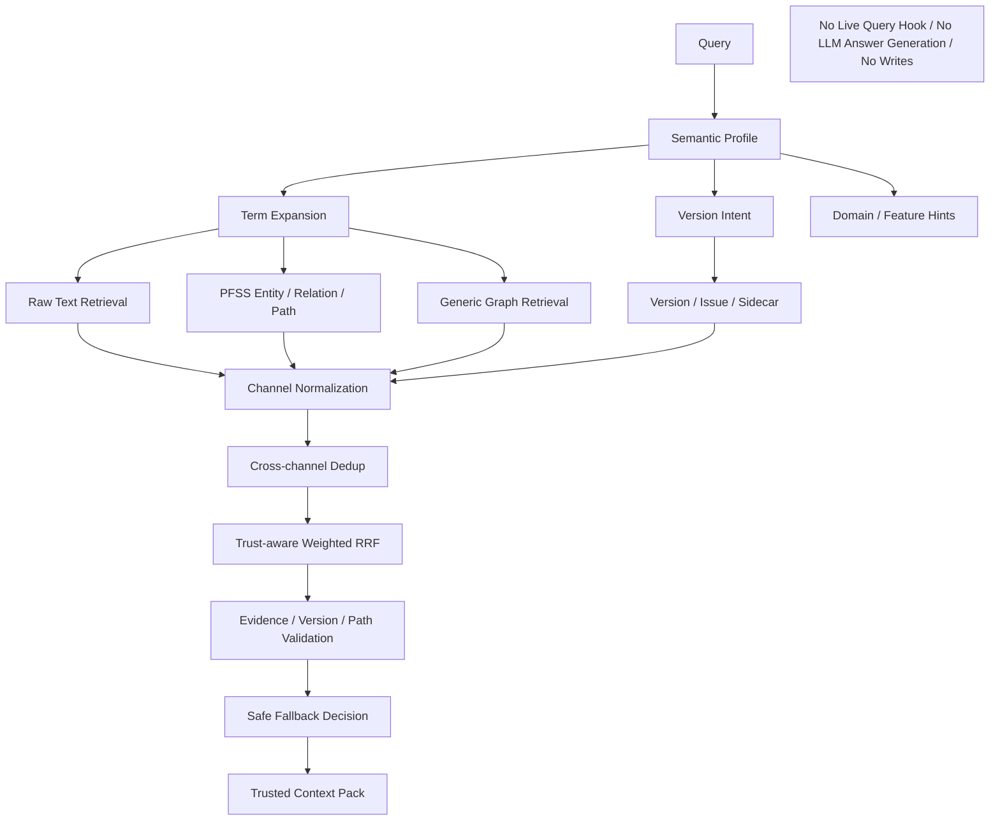

# Block 26A：四路混合检索与可信融合

你现在继续在本地 LightRAG 代码仓中工作。

本轮任务：**Block 26A，Four-channel Hybrid Retrieval & Trust-aware Fusion**。

> 本轮只建设离线、可测试、可解释的统一检索层。  
> 不接正式 Query API，不调用真实 LLM，不生成最终业务答案。  
> 本轮产出的是供后续问答、影响分析、方案设计和 Harness 使用的 **Trusted Context Pack**。

特别要求：

> **不得针对可接受银行、询价、FX、现金池、账户、付款或任何具体模块写检索特例。**  
> 所有召回、加权、降级和风险提示必须基于通用语义身份、Domain / Feature、证据质量、版本状态、图路径质量和配置化策略。

---

## 一、前置状态

以下能力已通过：

### 24B 系列

- 统一原文证据链；
- 单次解析和稳定证据映射；
- PFSS / Generic / Issue 三空间隔离；
- `DSL_FULL / DSL_PARTIAL / RAW_ONLY / PARSE_FAILED` 分支；
- PFSS 安全子集入图；
- 原文 Chunk、实体、关系和 Sidecar 对齐。

### 24C 系列

- 持久化 Document Registry 和 Metadata Sidecar；
- 文档版本、Batch、Evidence、Semantic Object / Relation、Term、Version、Issue 和 Rollback 注册；
- 文档增量更新、删除、Rebuild、共享贡献保护和 Saga Compensation；
- 活跃投影与历史注册表区分。

### 25A 系列

- 术语归一 V2；
- Scoped Alias / CanonicalTerm；
- 稳定 semantic identity；
- 通用实体类型 Resolver；
- Generic NER 类型阻断；
- 泛化与反硬编码收口。

### 25B

- Version Query Intent；
- Version Candidate / Issue Index；
- Conservative Current Resolver；
- Version-aware Ranking；
- Version Context Builder；
- 无证据不硬判最新；
- Historical / Compare / Migration / AS OF 均可安全使用。

---

## 二、本轮要解决的问题

当前各种知识已分别存在于：

```text
1. Raw Text Evidence
   - text_chunks
   - chunks_vdb
   - 原始证据和文档片段

2. PFSS Product Function Graph
   - 受控实体
   - 受控关系
   - 图路径
   - entities_vdb / relationships_vdb

3. Generic Fallback Graph
   - 非产品设计文档的泛知识
   - 可信度低于 PFSS
   - 不能覆盖 PFSS 事实

4. Issue / Version / Sidecar Index
   - 版本冲突
   - MissingEvidence
   - 类型歧义
   - Candidate / ReviewRequired
   - 图对象到 Evidence 的映射
```

本轮必须建立统一检索与可信融合，解决：

```text
同一查询如何同时召回文本、实体、关系、图路径和风险信息？
不同向量库的原始分数不可直接比较，如何稳定融合？
Domain / Feature 应加权还是硬过滤？
Generic Graph 命中能否直接成为业务事实？
图路径没有 Evidence 时能否进入答案上下文？
版本冲突如何影响排序和确定性？
PFSS 与 Raw Text 命中重复时如何去重？
图召回不足时如何安全降级 Text-only？
Issue 应提示风险，还是参与事实回答？
```

---

## 三、目标架构

```text
Query
  ↓
Query Understanding
  ├─ Term Expansion
  ├─ Domain / Feature Hints
  ├─ Retrieval Task Type
  └─ Version Query Intent
  ↓
四路并行召回
  ├─ Raw Text Evidence
  ├─ PFSS Entity / Relation / Path
  ├─ Generic Fallback Graph
  └─ Issue / Version / Sidecar
  ↓
Candidate Normalization
  ↓
Cross-channel Deduplication
  ↓
Trust-aware Rank Fusion
  ↓
Evidence and Version Validation
  ↓
Safe Fallback Decision
  ↓
Trusted Context Pack
```

Trusted Context Pack 将在后续供：

```text
Business QA
关联影响分析
需求分析
高阶方案
详细方案
US / AC 生成
Skills + Harness
```

使用。

---

## 四、本轮核心原则

### 1. Raw Text 不是低级兜底，而是事实证据基础

任何确定性结论都应尽量绑定：

```text
source document
sourceUsId
textUnitId
sourceSpan
textHash
evidence excerpt
```

PFSS 图用于组织关系和路径，Raw Text 用于验证原文依据。

### 2. PFSS 图优先于 Generic Graph

默认信任顺序：

```text
PFSS Explicit Evidence
> Direct Raw Evidence
> PFSS Safe Inference Path
> Generic Graph
> Candidate / Issue
```

Generic Graph：

- 可用于补充背景；
- 不得覆盖 PFSS 事实；
- 不得单独支撑高风险确定性结论；
- 必须标记低可信来源。

### 3. Issue 不是事实候选

Issue / Review / Version Conflict：

- 必须被检索；
- 用于风险提示和答案行为控制；
- 不得作为 Confirmed Fact；
- 不得因召回分数高而进入事实陈述区。

### 4. Domain / Feature 主要用于 Boost

默认：

```text
Domain / Feature match → 加权
Domain / Feature mismatch → 降权
```

不得默认硬过滤。

只有调用方显式指定：

```text
strict_scope = true
```

时才允许严格过滤，并必须报告被过滤候选。

### 5. 不同通道分数不得直接相加

以下分数可能不可比：

```text
chunk vector cosine
entity vector cosine
relationship vector cosine
graph path score
issue relevance
```

必须先进行：

```text
通道内归一
或 Rank-based Fusion
```

推荐使用：

```text
Weighted Reciprocal Rank Fusion
+ 可解释的语义和信任增减项
```

不得直接：

```python
final_score = chunk_cosine + entity_cosine + graph_score
```

### 6. 无 Evidence 的图路径不得进入确定性上下文

若路径中任一关键 Edge：

```text
无 Sidecar Evidence
属于 Candidate / Issue
版本不安全
类型不安全
```

则：

```text
降级为 tentative_path
或从 factual_paths 排除
```

### 7. 图召回失败时必须安全降级

```text
PFSS 无命中
→ Raw Text 仍可用

PFSS 命中但无 Evidence
→ 不作为确定事实

Generic-only
→ 低可信背景，不得形成确定性答案

全部无命中
→ insufficient_evidence
```

---

## 五、本轮严格边界

本轮允许：

- 新增统一检索请求和候选模型；
- 新增四路 Retrieval Adapter；
- 使用本地隔离 Text / Vector / Graph / SQLite Sidecar；
- 使用 Fake Deterministic Embedding 做离线召回；
- 新增 Term Expansion、Version Retrieval 接口调用；
- 新增图路径搜索、证据回查和 Fusion；
- 生成 Trusted Context Pack；
- 执行离线多场景 smoke；
- 可选执行一次显式真实 Embedding 的隔离 smoke，但不作为默认准出必要条件。

本轮禁止：

1. 不修改正式 Query API；
2. 不接 Live Query Hook；
3. 不修改 `/documents/upload`；
4. 不调用真实 LLM；
5. 不生成最终自然语言业务答案；
6. 不调用原生 `extract_entities`；
7. 不执行 Gleaning；
8. 不写生产图、向量或数据库；
9. 不连接 Neo4j；
10. 不连接生产 PostgreSQL / Milvus / Qdrant / Redis / MongoDB / OpenSearch；
11. 不修改 PFSS 事实；
12. 不新建 `Supersedes`；
13. 不处理三类需求 Harness；
14. 不修改 LightRAG Core/API；
15. 不安装新依赖；
16. 不修改 `uv.lock / pyproject.toml / requirements`；
17. 不提前开始 26B。

完成后必须满足：

```text
LIVE_QUERY_BEHAVIOR_CHANGED = false
LIVE_QUERY_HOOK_CONNECTED = false
REAL_LLM_CALLS_EXECUTED = false
FINAL_ANSWER_GENERATED = false
PFSS_GRAPH_WRITES_EXECUTED = false
GENERIC_GRAPH_WRITES_EXECUTED = false
PRODUCTION_STORAGE_CONNECTED = false
NEO4J_CONNECTED = false
NEW_SUPERSEDES_CREATED = false
LIGHTRAG_CORE_MODIFIED = false
```

---

## 六、防止 Codex 原地打圈

必须严格遵守：

1. 只读取一次：
   - 24B 图空间报告；
   - 24C Sidecar schema；
   - 25A Term Query Expander；
   - 25A Entity Type Resolver 输出接口；
   - 25B Version Retrieval Service；
   - 当前 LightRAG Storage 抽象的只读查询接口。
2. 不重新分析上传链；
3. 不重新执行 24A 真实模型 smoke；
4. 不重新运行 24C 生命周期全量测试；
5. 不全仓反复 `rg/find`；
6. 每个目标文件最多完整读取一次；
7. 只允许一次只读 Storage Capability Probe；
8. 不安装依赖；
9. 同一失败命令只允许：
   - 首次；
   - 一次定向修复；
   - 重跑一次；
10. 第二次仍失败：
    - 写入 `unresolved_questions.md`；
    - 停止本轮；
11. 不通过写死 fixture 名称修排序；
12. 不为了指标好看隐藏 Generic 或 Issue 候选；
13. 完成准出项后立即停止。

---

## 七、建议新增文件

建议新增：

```text
lightrag_ext/us_dsl/hybrid_retrieval_types.py
lightrag_ext/us_dsl/query_semantic_profile.py
lightrag_ext/us_dsl/raw_text_retrieval_adapter.py
lightrag_ext/us_dsl/pfss_retrieval_adapter.py
lightrag_ext/us_dsl/generic_graph_retrieval_adapter.py
lightrag_ext/us_dsl/issue_sidecar_retrieval_adapter.py
lightrag_ext/us_dsl/retrieval_candidate_normalizer.py
lightrag_ext/us_dsl/retrieval_candidate_deduplicator.py
lightrag_ext/us_dsl/trust_aware_rank_fusion.py
lightrag_ext/us_dsl/evidence_path_validator.py
lightrag_ext/us_dsl/hybrid_retrieval_fallback.py
lightrag_ext/us_dsl/trusted_context_builder.py
lightrag_ext/us_dsl/hybrid_retrieval_service.py
lightrag_ext/us_dsl/hybrid_retrieval_generalization_guard.py
lightrag_ext/us_dsl/scripts/run_hybrid_retrieval_smoke.py

lightrag_ext/us_dsl/tests/test_query_semantic_profile.py
lightrag_ext/us_dsl/tests/test_raw_text_retrieval_adapter.py
lightrag_ext/us_dsl/tests/test_pfss_retrieval_adapter.py
lightrag_ext/us_dsl/tests/test_generic_graph_retrieval_adapter.py
lightrag_ext/us_dsl/tests/test_issue_sidecar_retrieval_adapter.py
lightrag_ext/us_dsl/tests/test_retrieval_candidate_normalizer.py
lightrag_ext/us_dsl/tests/test_retrieval_candidate_deduplicator.py
lightrag_ext/us_dsl/tests/test_trust_aware_rank_fusion.py
lightrag_ext/us_dsl/tests/test_evidence_path_validator.py
lightrag_ext/us_dsl/tests/test_hybrid_retrieval_fallback.py
lightrag_ext/us_dsl/tests/test_trusted_context_builder.py
lightrag_ext/us_dsl/tests/test_hybrid_retrieval_service.py
lightrag_ext/us_dsl/tests/test_hybrid_retrieval_generalization.py
lightrag_ext/us_dsl/tests/test_hybrid_retrieval_guards.py
```

允许按需小改：

```text
term_query_expander.py
version_retrieval_service.py
version_context_builder.py
sidecar_repository.py
sqlite_sidecar_repository.py
graph_space_policy.py
semantic_identity.py
```

只能为只读检索接口和通用数据结构做小改。

禁止修改：

```text
lightrag/lightrag.py
lightrag/operate.py
lightrag/prompt.py
lightrag/api/*
document_routes.py
正式 query pipeline
LightRAG storage implementations
insert / ainsert / ainsert_custom_kg
extract_entities
merge_nodes_and_edges
```

---

## 八、Retrieval Task Type

新增通用任务类型：

```text
FACT_QA
IMPACT_ANALYSIS
HISTORICAL_COMPARE
MIGRATION_ANALYSIS
DESIGN_CONTEXT
UNSPECIFIED
```

本轮不做三类需求场景 Harness。

任务类型只影响：

```text
通道权重
图路径深度
版本意图
候选数量
Context Pack 结构
```

不得包含模块专用任务类型。

---

## 九、统一查询请求

新增 `HybridRetrievalRequest`。

字段：

```text
query_text
task_type
module_code
domain_hints
feature_hints
object_type_hints
strict_scope
explicit_version_intent
as_of_time
include_historical
include_generic
include_issues
require_evidence
raw_top_k
entity_top_k
relationship_top_k
path_top_k
generic_top_k
issue_top_k
max_graph_hops
max_context_tokens
trace_id
```

默认建议：

```text
strict_scope = false
include_generic = true
include_issues = true
require_evidence = true
max_graph_hops:
  FACT_QA = 1~2
  IMPACT_ANALYSIS = 2~3
  HISTORICAL_COMPARE = 1~2
  MIGRATION_ANALYSIS = 2~3
```

必须配置化。

---

## 十、Query Semantic Profile

新增 `query_semantic_profile.py`。

输出：

```text
normalized_query
expanded_terms
canonical_terms
confirmed_aliases
candidate_aliases
detected_domains
detected_features
detected_object_types
task_type
version_intent
as_of_time
strict_scope
reason_codes
```

必须复用：

```text
25A Term Query Expander
25B Version Query Intent
```

不得重复实现一套新术语或版本判断逻辑。

Candidate Alias：

```text
可用于低权重召回提示
不得成为强制过滤或身份合并依据
```

---

## 十一、统一候选模型

新增 `RetrievalCandidate`。

字段：

```text
candidate_id
channel
object_kind
object_id
semantic_object_id
semantic_relation_id
graph_path_id
document_id
document_version_id
source_us_id
text_unit_id
source_span
text_hash
content
canonical_terms
domain_code
feature_key
object_type
relation_type
version_group_key
version_status
review_decision
issue_types
raw_score
channel_rank
normalized_channel_score
semantic_match_score
term_match_score
domain_match_score
feature_match_score
version_match_score
evidence_quality_score
path_quality_score
uncertainty_penalty
generic_penalty
no_evidence_penalty
trust_tier
final_score
evidence_refs
reason_codes
```

### Channel

```text
RAW_TEXT
PFSS_ENTITY
PFSS_RELATION
PFSS_PATH
GENERIC_ENTITY
GENERIC_RELATION
GENERIC_PATH
VERSION_CONTEXT
ISSUE
```

### TrustTier

```text
T1_EXPLICIT_PFSS_EVIDENCE
T2_DIRECT_RAW_EVIDENCE
T3_SAFE_PFSS_PATH
T4_GENERIC_CONTEXT
T5_CANDIDATE_OR_ISSUE
```

Issue 可以使用 T5，但不得进入 factual candidate 区。

---

## 十二、Raw Text Retrieval Adapter

新增 `raw_text_retrieval_adapter.py`。

必须返回：

```text
chunk content
document / version
source span
text hash
embedding relevance
active contribution state
```

规则：

- 已删除或非活跃投影不进入普通当前检索；
- Historical / Audit 模式可通过 Sidecar 找到历史 Evidence；
- Raw Text 是直接证据候选；
- DSL Context 不得出现在返回正文；
- 同一 chunk 多次命中只保留一个候选。

---

## 十三、PFSS Retrieval Adapter

新增 `pfss_retrieval_adapter.py`。

召回：

```text
Entity Vector
Relationship Vector
Graph Local Neighborhood
Graph Paths
```

必须支持：

```text
semantic object ID
relation ID
type
domain
feature
version group
evidence mapping
review decision
active contribution
```

### 图路径策略

图路径必须满足：

```text
endpoint closure
允许的 relation type
无 Issue 对象充当正式节点
每条关键 Edge 可回查 Evidence
版本状态可解释
```

### PathCandidate

字段：

```text
path_id
node_ids
relation_ids
hop_count
edge_evidence_coverage
node_evidence_coverage
version_safe
type_safe
contains_issue_object
contains_generic_relation
path_quality_score
```

---

## 十四、Generic Graph Adapter

新增 `generic_graph_retrieval_adapter.py`。

规则：

1. 默认允许召回，但权重低；
2. 必须标记：
   ```text
   trust_tier = T4_GENERIC_CONTEXT
   ```
3. 不得覆盖同一 stable semantic identity 的 PFSS 事实；
4. 若与 PFSS 冲突：
   - PFSS 事实保留；
   - Generic 候选进入 conflict note；
5. Generic-only 命中不能单独使：
   ```text
   safe_for_deterministic_answer = true
   ```
6. `include_generic=false` 时完全不召回；
7. 不写或修改 Generic Graph。

---

## 十五、Issue / Sidecar Retrieval Adapter

新增 `issue_sidecar_retrieval_adapter.py`。

召回：

```text
Version Issue
MissingEvidence
Term Ambiguity
Entity Type Review
Invalid Relation
ReviewRequired
InfoOnly
```

规则：

- Issue 单独进入 warning / uncertainty 区；
- 不参与 factual_score；
- 可以降低相关事实候选的确定性；
- 必须带 Evidence 或 Issue reason；
- 不得隐藏高严重度 Issue；
- 同一 Issue 幂等去重。

---

## 十六、候选分数归一

新增 `retrieval_candidate_normalizer.py`。

不得假设不同通道 raw score 同分布。

至少支持：

```text
rank normalization
min-max within channel（仅候选数足够时）
score clipping
missing score handling
```

推荐默认：

```text
以 channel rank 为主
raw score 仅做通道内微调
```

必须输出：

```text
normalization_method
channel_candidate_count
raw_score_range
normalized_score_range
```

---

## 十七、跨通道去重

新增 `retrieval_candidate_deduplicator.py`。

优先使用：

```text
stable semantic_object_id
semantic_relation_id
graph_path signature
document_version_id + text_hash + source_span
```

不得仅按显示名称去重。

### 合并原则

同一事实同时被：

```text
PFSS Entity
PFSS Relation
Raw Text
```

命中时：

- 不简单删除 Raw Evidence；
- 合并为一个 evidence-backed semantic group；
- 保留：
  ```text
  semantic candidate
  direct evidence candidates
  version context
  issue warnings
  ```

Generic 与 PFSS 同 ID：

```text
PFSS 为主
Generic 仅作为低权重补充或冲突说明
```

---

## 十八、可信融合算法

新增 `trust_aware_rank_fusion.py`。

### 推荐基础算法

使用配置化 Weighted Reciprocal Rank Fusion：

```text
base_rrf_score
=
Σ channel_weight[channel] / (rrf_k + rank_in_channel)
```

建议默认值只作为配置，不得散落：

```text
rrf_k = 60

RAW_TEXT        = 1.00
PFSS_ENTITY     = 1.10
PFSS_RELATION   = 1.15
PFSS_PATH       = 1.20
GENERIC_*       = 0.40
VERSION_CONTEXT = 0.80
ISSUE           = 0.00 factual weight
```

Issue 不参与 factual RRF。

### 可解释增减项

```text
term match boost
domain boost
feature boost
version intent boost
direct evidence boost
graph path quality boost
generic penalty
uncertainty penalty
missing evidence penalty
version conflict penalty
type risk penalty
```

最终：

```text
final_score
=
base_rrf_score
+ boosts
- penalties
```

所有项必须有：

```text
配置值
reason code
实际贡献值
```

### 禁止

```text
按业务模块写权重
按实体名称写权重
隐藏负分候选
直接相加不同通道原始 cosine
```

---

## 十九、Evidence Path Validator

新增 `evidence_path_validator.py`。

### factual path 通过条件

```text
所有节点类型安全
所有关系类型安全
所有关键 Edge 有 Evidence
无 ReviewRequired / Issue Edge
无 Version Conflict
路径长度不超过任务上限
```

### 路径分类

```text
FACTUAL_PATH
TENTATIVE_PATH
GENERIC_PATH
REJECTED_PATH
```

#### FACTUAL_PATH

可进入确定性上下文。

#### TENTATIVE_PATH

可进入：

```text
可能影响 / 待确认影响
```

不得进入确定事实区。

#### GENERIC_PATH

只能作为背景。

#### REJECTED_PATH

不进入 Context Pack，只进入诊断。

---

## 二十、安全降级策略

新增 `hybrid_retrieval_fallback.py`。

### 状态

```text
HYBRID_EVIDENCE_READY
TEXT_ONLY_FALLBACK
PFSS_WITH_VERSION_WARNING
GENERIC_ONLY_LOW_TRUST
ISSUE_ONLY
INSUFFICIENT_EVIDENCE
STRICT_SCOPE_EMPTY
```

### 规则

#### PFSS + Raw Evidence

```text
HYBRID_EVIDENCE_READY
```

#### Raw Text 有命中，PFSS 无安全命中

```text
TEXT_ONLY_FALLBACK
```

#### PFSS 有命中但版本冲突

```text
PFSS_WITH_VERSION_WARNING
safe_for_deterministic_answer = false
```

#### 只有 Generic Graph

```text
GENERIC_ONLY_LOW_TRUST
safe_for_deterministic_answer = false
```

#### 只有 Issue

```text
ISSUE_ONLY
```

#### 无有效命中

```text
INSUFFICIENT_EVIDENCE
```

---

## 二十一、Trusted Context Pack

新增 `trusted_context_builder.py`。

### TrustedContextPack

字段：

```text
query_profile
retrieval_status
safe_for_deterministic_answer
factual_semantic_objects
factual_relations
factual_paths
direct_raw_evidence
historical_evidence
tentative_paths
generic_context
version_context
issues_and_warnings
excluded_candidates
score_explanations
source_citations
context_token_estimate
truncation_summary
recommended_answer_behavior
```

### Context 排序

建议：

```text
1. 必要版本警告
2. 最相关直接 Raw Evidence
3. Evidence-backed PFSS relation/path
4. 补充 Raw Evidence
5. Historical / Compare context
6. Tentative paths
7. Generic background
8. Issues / Missing evidence details
```

### Token 预算

必须：

- 不截断版本警告；
- 不截断所有 direct evidence；
- 优先删除重复 Generic；
- 保留每个关键事实至少一个 Evidence；
- 输出 truncation report。

---

## 二十二、泛化与反硬编码

运行时代码不得包含具体模块和实体名特例。

生成：

```text
hybrid_retrieval_anti_hardcode_report.json
```

必须验证：

```text
runtime_business_hardcode_count = 0
entity_name_specific_weight_rule_count = 0
module_specific_channel_weight_count = 0
fixture_name_runtime_coupling_count = 0
```

允许：

```text
Domain type
Task type
Trust tier
Version intent
Relation type
Evidence status
```

等通用规则。

---

## 二十三、测试 Fixtures

至少构造以下通用场景。

### Fixture A：PFSS + Raw 双命中

```text
查询功能 HasReportFilter 状态字段
```

预期：

```text
PFSS Relation + Raw Evidence
HYBRID_EVIDENCE_READY
```

### Fixture B：Raw-only

一般会议纪要，无 PFSS 对象。

预期：

```text
TEXT_ONLY_FALLBACK
```

### Fixture C：PFSS 版本冲突

PFSS 关系存在，但版本组有多个 latest。

预期：

```text
PFSS_WITH_VERSION_WARNING
safe_for_deterministic_answer = false
```

### Fixture D：Generic-only

只有 Generic Graph 命中。

预期：

```text
GENERIC_ONLY_LOW_TRUST
```

### Fixture E：Issue-only

只有 MissingEvidence / TypeReview。

预期：

```text
ISSUE_ONLY
```

### Fixture F：无 Evidence 图路径

预期：

```text
TENTATIVE_PATH 或 REJECTED_PATH
不得进入 factual_paths
```

### Fixture G：跨语言 Alias

查询中文，Raw / PFSS 使用英文 confirmed alias。

预期：

```text
可召回同一 stable identity
```

### Fixture H：Domain 不匹配但语义相关

默认：

```text
降权但不硬过滤
```

`strict_scope=true`：

```text
被过滤并记录
```

### Fixture I：PFSS / Generic 冲突

预期：

```text
PFSS 优先
Generic 标记冲突
```

### Fixture J：Impact Analysis

需要 2~3 hop 路径。

预期：

```text
Evidence 完整路径进入 factual_paths
无 Evidence 分支进入 tentative
```

### Fixture K：Historical Compare

预期：

```text
当前和历史候选均保留
```

### Fixture L：重复命中

同一事实被 Entity / Relation / Raw Text 命中。

预期：

```text
语义去重
Evidence 不丢失
```

---

## 二十四、离线检索 Smoke

使用：

```text
本地 KV / Vector / NetworkX
本地 SQLite Sidecar
Fake Deterministic Embedding
```

执行：

```text
FACT_QA
IMPACT_ANALYSIS
HISTORICAL_COMPARE
MIGRATION_ANALYSIS
DESIGN_CONTEXT
```

必须验证：

```text
四路召回均可工作
可信排序稳定
Raw + PFSS 可融合
Generic 不覆盖 PFSS
Issue 不成为事实
无 Evidence 路径不进入 factual
Text-only 降级可用
版本警告不被截断
跨语言术语可召回
Domain 默认 Boost 非硬过滤
```

---

## 二十五、测试要求

至少覆盖：

### Query Profile

1. `test_query_profile_reuses_term_expander`
2. `test_query_profile_reuses_version_intent`
3. `test_candidate_alias_is_not_strong_identity`
4. `test_domain_feature_hints_are_not_hard_filters_by_default`
5. `test_strict_scope_is_explicit`

### Adapters

6. `test_raw_adapter_returns_direct_evidence`
7. `test_raw_adapter_excludes_deleted_active_projection`
8. `test_pfss_adapter_returns_entity_relation_and_path`
9. `test_pfss_adapter_reads_sidecar_evidence`
10. `test_generic_adapter_marks_low_trust`
11. `test_generic_adapter_can_be_disabled`
12. `test_issue_adapter_returns_warnings_not_facts`
13. `test_version_context_is_attached`

### Normalization / Dedup

14. `test_channel_scores_are_normalized_before_fusion`
15. `test_raw_cosine_is_not_directly_added_to_graph_score`
16. `test_semantic_identity_deduplicates_cross_channel_hits`
17. `test_raw_evidence_is_preserved_after_semantic_dedup`
18. `test_generic_duplicate_does_not_override_pfss`
19. `test_path_signature_dedup_is_deterministic`

### Fusion

20. `test_weighted_rrf_is_deterministic`
21. `test_pfss_and_raw_rank_above_generic`
22. `test_issue_has_zero_factual_weight`
23. `test_domain_match_boosts_without_default_filter`
24. `test_feature_match_boosts_without_default_filter`
25. `test_version_conflict_penalty_is_visible`
26. `test_missing_evidence_penalty_is_visible`
27. `test_no_business_module_specific_weight`

### Path Validation

28. `test_evidence_complete_path_is_factual`
29. `test_missing_evidence_path_is_not_factual`
30. `test_issue_edge_cannot_enter_factual_path`
31. `test_version_conflict_path_is_tentative`
32. `test_generic_path_is_background_only`
33. `test_hop_limit_depends_on_task_type`
34. `test_no_dangling_path`

### Fallback

35. `test_pfss_and_raw_produce_hybrid_ready`
36. `test_raw_only_produces_text_fallback`
37. `test_version_conflict_produces_warning_state`
38. `test_generic_only_is_not_deterministic`
39. `test_issue_only_state`
40. `test_empty_result_is_insufficient_evidence`
41. `test_strict_scope_empty_is_reported`

### Context Pack

42. `test_context_pack_contains_direct_evidence`
43. `test_context_pack_contains_score_explanations`
44. `test_context_pack_keeps_version_warning`
45. `test_context_pack_separates_factual_tentative_generic`
46. `test_context_pack_does_not_promote_issue_to_fact`
47. `test_context_token_budget_keeps_at_least_one_evidence_per_fact`
48. `test_context_pack_is_serializable`

### Generalization / Safety

49. `test_runtime_has_no_module_or_entity_name_hardcode`
50. `test_unseen_module_fixture_uses_same_fusion_policy`
51. `test_no_live_query_change`
52. `test_no_real_llm_calls`
53. `test_no_graph_or_sidecar_write`
54. `test_no_production_storage_or_neo4j`
55. `test_no_new_supersedes_created`
56. `test_no_lightrag_core_modified`
57. `test_cleanup_removes_workspaces`

---

## 二十六、输出目录

```text
artifacts/block_26a_hybrid_retrieval/
```

必须生成：

```text
hybrid_retrieval_report.json
hybrid_retrieval_report.md
query_profile_results.json
raw_retrieval_results.json
pfss_retrieval_results.json
generic_retrieval_results.json
issue_version_results.json
candidate_normalization_report.json
deduplication_report.json
fusion_score_report.json
path_validation_report.json
fallback_results.json
trusted_context_packs.json
token_budget_report.json
hybrid_retrieval_anti_hardcode_report.json
storage_read_capability_report.json
idempotency_report.json
safety_check.json
cleanup_report.json
architecture.mmd
command_log.txt
git_status_before.txt
git_status_after.txt
core_diff_check.txt
unresolved_questions.md
workspaces/
```

---

## 二十七、架构图

`architecture.mmd`：



---

## 二十八、默认测试命令

```bash
mkdir -p artifacts/block_26a_hybrid_retrieval

git status --short \
  > artifacts/block_26a_hybrid_retrieval/git_status_before.txt
```

```bash
.venv/bin/python - <<'PY'
import subprocess
import sys

tests = [
    "lightrag_ext/us_dsl/tests/test_query_semantic_profile.py",
    "lightrag_ext/us_dsl/tests/test_raw_text_retrieval_adapter.py",
    "lightrag_ext/us_dsl/tests/test_pfss_retrieval_adapter.py",
    "lightrag_ext/us_dsl/tests/test_generic_graph_retrieval_adapter.py",
    "lightrag_ext/us_dsl/tests/test_issue_sidecar_retrieval_adapter.py",
    "lightrag_ext/us_dsl/tests/test_retrieval_candidate_normalizer.py",
    "lightrag_ext/us_dsl/tests/test_retrieval_candidate_deduplicator.py",
    "lightrag_ext/us_dsl/tests/test_trust_aware_rank_fusion.py",
    "lightrag_ext/us_dsl/tests/test_evidence_path_validator.py",
    "lightrag_ext/us_dsl/tests/test_hybrid_retrieval_fallback.py",
    "lightrag_ext/us_dsl/tests/test_trusted_context_builder.py",
    "lightrag_ext/us_dsl/tests/test_hybrid_retrieval_service.py",
    "lightrag_ext/us_dsl/tests/test_hybrid_retrieval_generalization.py",
    "lightrag_ext/us_dsl/tests/test_hybrid_retrieval_guards.py",
]

commands = [
    [".venv/bin/python", "-m", "pytest", test, "-q"]
    for test in tests
] + [
    [".venv/bin/python", "-m", "compileall", "-q", "lightrag_ext"],
    [".venv/bin/python", "-m", "py_compile", "lightrag/prompt.py"],
    [".venv/bin/python", "-m", "ruff", "check",
     "lightrag_ext", "lightrag/prompt.py"],
]

for command in commands:
    print("RUN:", " ".join(command), flush=True)
    try:
        result = subprocess.run(command, timeout=300)
    except subprocess.TimeoutExpired:
        print("TIMEOUT:", " ".join(command))
        sys.exit(124)

    if result.returncode != 0:
        sys.exit(result.returncode)
PY
```

---

## 二十九、离线 Smoke

```bash
.venv/bin/python -m \
  lightrag_ext.us_dsl.scripts.run_hybrid_retrieval_smoke \
  --output-dir artifacts/block_26a_hybrid_retrieval \
  --fixture-suite \
  --fake-deterministic-embedding \
  --all-task-types \
  --anti-hardcode-check \
  --cleanup
```

默认不得访问网络。

若实现可选真实 Embedding smoke，必须使用显式环境开关，且不属于本轮核心准出要求。

---

## 三十、安全检查

`safety_check.json` 必须包含：

```json
{
  "live_upload_behavior_changed": false,
  "live_query_behavior_changed": false,
  "live_query_hook_connected": false,
  "real_llm_calls_executed": false,
  "final_answer_generated": false,
  "pfss_graph_writes_executed": false,
  "generic_graph_writes_executed": false,
  "sidecar_writes_executed": false,
  "new_supersedes_created": false,
  "production_storage_connected": false,
  "neo4j_connected": false,
  "business_module_hardcode_detected": false,
  "entity_name_specific_weight_rule_detected": false,
  "lightrag_core_modified": false
}
```

Core 检查：

```bash
git diff --name-only -- \
  lightrag/lightrag.py \
  lightrag/operate.py \
  lightrag/prompt.py \
  lightrag/api \
  > artifacts/block_26a_hybrid_retrieval/core_diff_check.txt
```

最终状态：

```bash
git status --short \
  > artifacts/block_26a_hybrid_retrieval/git_status_after.txt
```

---

## 三十一、准出标准

通过条件：

1. 四路 Retrieval Adapter 已实现；
2. Query Profile 复用 Term / Version 能力；
3. 不同通道分数先归一后融合；
4. Weighted RRF 确定性；
5. PFSS + Raw Evidence 优先于 Generic；
6. Issue factual weight = 0；
7. Domain / Feature 默认 Boost，不硬过滤；
8. strict_scope 行为显式；
9. stable identity 跨通道去重；
10. Raw Evidence 去重后仍保留；
11. Generic 不覆盖 PFSS；
12. Evidence 完整路径进入 factual；
13. 无 Evidence / Issue / 版本冲突路径不进入 factual；
14. PFSS + Raw 产生 Hybrid Ready；
15. Raw-only 可安全降级 Text-only；
16. Generic-only 不允许确定性回答；
17. Issue-only 可返回风险；
18. Version Warning 保留；
19. Trusted Context 区分 factual / tentative / generic / issue；
20. Token 预算不删除所有关键 Evidence；
21. Query 和排序无具体模块硬编码；
22. Unseen 模块使用相同融合策略；
23. 不改 Live Query；
24. 不调用真实 LLM；
25. 不生成最终答案；
26. 不写 Graph、Vector、Sidecar；
27. 不连接生产存储或 Neo4j；
28. 不创建 Supersedes；
29. 不修改 LightRAG Core/API；
30. 测试和静态检查全部通过；
31. artifacts 完整；
32. cleanup 通过。

不通过条件：

1. 直接相加不同通道 raw score；
2. Domain 默认硬过滤；
3. Generic Graph 覆盖 PFSS；
4. Issue 成为事实候选；
5. 无 Evidence 路径进入 factual；
6. 图检索失败时没有 Text-only 降级；
7. 版本冲突仍允许确定性回答；
8. 根据具体业务名称调权；
9. 修改在线 Query；
10. 调用真实 LLM；
11. 写入任何知识存储；
12. 修改 Core；
13. 测试失败；
14. cleanup 失败。

---

## 三十二、完成后只输出

```text
Block: 26A

Implementation:
- raw_text_adapter_implemented:
- pfss_adapter_implemented:
- generic_adapter_implemented:
- issue_sidecar_adapter_implemented:
- candidate_normalizer_implemented:
- candidate_deduplicator_implemented:
- trust_aware_fusion_implemented:
- evidence_path_validator_implemented:
- fallback_policy_implemented:
- trusted_context_builder_implemented:

Retrieval fixtures:
- hybrid_ready_passed:
- text_only_fallback_passed:
- version_warning_passed:
- generic_only_low_trust_passed:
- issue_only_passed:
- insufficient_evidence_passed:
- cross_language_alias_passed:
- domain_boost_not_filter_passed:
- pfss_generic_conflict_passed:
- impact_path_passed:
- historical_compare_passed:
- cross_channel_dedup_passed:

Fusion:
- fusion_method:
- direct_raw_score_addition_used:
- issue_factual_weight:
- generic_overrode_pfss_count:
- missing_evidence_factual_path_count:
- deterministic_ranking_passed:

Context:
- factual_candidate_count:
- direct_evidence_count:
- factual_path_count:
- tentative_path_count:
- generic_context_count:
- issue_warning_count:
- safe_for_deterministic_answer:
- token_budget_preserved_required_evidence:

Generalization:
- runtime_business_hardcode_count:
- entity_name_specific_weight_rule_count:
- unseen_module_policy_passed:

Safety:
- live_query_behavior_changed:
- live_query_hook_connected:
- real_llm_calls_executed:
- final_answer_generated:
- graph_writes_executed:
- sidecar_writes_executed:
- production_storage_connected:
- neo4j_connected:
- cleanup_passed:
- core_modified_in_this_round:

Tests:
- collected_count:
- passed_count:
- failed_count:
- compileall:
- py_compile:
- ruff:

Artifacts:
- artifacts/block_26a_hybrid_retrieval

Recommended next block:
- Block 26B only if all gates pass.
```

完成后立即停止。

---

## 三十三、特别提醒

本轮解决的是：

> **不同知识通道如何被安全、可解释地召回和融合，形成可供后续生成使用的可信上下文。**

本轮不判断真实业务效果是否优于原生 LightRAG。

下一步才是：

> **Block 26B：真实设计文件 A/B 效果与性能准出。**
