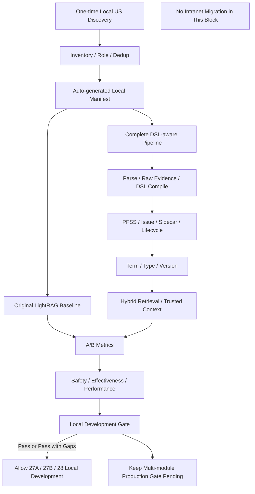

# Block 26B-LOCAL：基于现有全部 US 的本地全流程准出

你现在继续在本地 LightRAG 代码仓中工作。

本轮任务：**Block 26B-LOCAL，Existing-US Local Full-flow Gate**。

当前事实：

```text
正式 Block 26B 多模块 Gate 尚未通过
overall_status = BLOCKED_INPUT_SET
原因：缺少正式 multi-module manifest
```

本轮不得伪造：

```text
BLOCK_26B_MULTI_MODULE = PASS
```

但也不得继续原地等待内网材料。

本轮目标是：

> 自动发现并使用当前本地已经存在的全部 US / 设计材料，跑通从原始文档、DSL 编译、PFSS 入图、Sidecar、版本、术语、类型、混合检索到 A/B 评测的完整本地链路；以此作为继续完成 27A、27B 和 28 开发的本地开发准出，而不是生产准出。

---

## 一、状态必须严格区分

正式多模块 Gate 继续保持：

```text
MULTI_MODULE_26B_STATUS = BLOCKED_INPUT_SET
```

本轮新增本地开发状态：

```text
LOCAL_FULLFLOW_PASS
LOCAL_FULLFLOW_PASS_WITH_GAPS
LOCAL_FULLFLOW_FAIL
BLOCKED_NO_LOCAL_US
BLOCKED_ENV
```

不得将：

```text
LOCAL_FULLFLOW_PASS
```

写成：

```text
26B PASS
生产准出
多模块泛化已完全证明
```

允许的下一步语义：

```text
LOCAL_FULLFLOW_PASS
→ 允许继续开发 27A / 27B / 28 的本地完整流程
→ multi_module_production_gate_pending = true
```

---

## 二、最高优先级原则：运行时代码绝对禁止模块知识写死

本轮可以在**本地测试 Manifest**中引用已有文档名称，但不得在运行时代码中加入任何业务特判。

禁止：

```python
if module_code == "LCAB":
    ...

if "可接受银行" in query:
    ...

if "询价" in text:
    ...

if module_code == "FX":
    ...

if entity_name == "Bank Status":
    ...
```

以下具体业务词只允许存在于：

```text
本地测试 manifest
fixture
case 数据
报告
源文档
```

不得控制：

```text
Router
Term Resolver
Entity Type Resolver
Version Policy
Fusion Weight
Skill Selection
```

新增其他交易模块时只能：

```text
新增文档
新增 manifest
新增 cases / gold
新增外部配置
```

不得修改 Python 运行逻辑。

---

## 三、一次性发现当前本地全部 US

本轮不得等待用户再次手工提供 Manifest。

只进行一次受限发现。

### 发现根目录

按顺序检查：

```text
1. 环境变量 LIGHTRAG_LOCAL_US_ROOT（如已配置）
2. 当前仓库根目录
3. 当前仓库下 data/
4. 当前仓库下 datasets/
5. 当前仓库下 artifacts/
6. 当前仓库下 tests/fixtures/
```

不得扫描：

```text
整个用户目录
整个磁盘
公司网络盘
```

### 文件类型

允许：

```text
.md
.txt
.docx
.xlsx（仅已有解析能力时）
.json
.yaml
.yml
```

### 文件名候选模式

包括但不限于：

```text
*US*
*UserStory*
*用户故事*
*需求*
*设计*
*方案*
*DFX*
```

### 已知本地候选文件名

如本地存在，必须纳入发现报告：

```text
LC_Acceptable_Bank_US_v1.md
LC_Acceptable_Bank_66US_with_synthetic_modification_US_for_LightRAG_DSL_test.md
FX_US_优化后全套US_v9.2.docx
FX_US_优化后全套US_v9.2_dfx.docx
FX_US_质检问题高亮版_v9.2.docx
FX_US_质检问题高亮版_v9.2_dfx.docx
```

注意：

> 这些文件名只允许出现在本地测试数据发现和 Manifest 中，不能进入生产 Router、Resolver 或 Fusion 逻辑。

### 发现结束后的行为

只允许一次发现。

如果一个文件都找不到：

```text
overall_status = BLOCKED_NO_LOCAL_US
```

并停止。

如果只找到部分文件：

```text
继续使用所有找到的有效文件
记录 missing_expected_files
不得反复搜索
不得询问用户后原地等待
```

---

## 四、文档角色自动分类，但不得污染业务逻辑

新增只用于本地评测的：

```text
LocalDocumentRole
```

角色：

```text
CANONICAL_SOURCE
SYNTHETIC_CHANGE_SET
DFX_VARIANT
QUALITY_ANNOTATION
UNKNOWN_SOURCE
```

### 建议角色

#### CANONICAL_SOURCE

正式或优化后的完整 US 文档。

#### SYNTHETIC_CHANGE_SET

人为构造的同功能点变更 US，用于：

```text
版本冲突
Supersedes
1→N 影响
历史规则比较
```

#### DFX_VARIANT

包含 DFX 增补的同模块版本，用于：

```text
详细设计覆盖
DFX 差异
版本和迁移
```

#### QUALITY_ANNOTATION

高亮或标注问题的文档。

用途：

```text
构造负面 Case
质检问题
禁止作为未经确认的 canonical knowledge
```

### 关键限制

角色分类只服务本地测试 Manifest。

不得：

```text
根据角色改 PFSS 本体
根据文件名改实体类型
根据模块名改融合权重
```

---

## 五、去重和版本组织

“使用全部 US”不等于把重复版本无脑同时当 Current。

必须：

1. 计算文件 hash；
2. 计算 US 边界和 `sourceUsId`；
3. 检查完全重复文档；
4. 检查同模块不同版本；
5. 将 DFX、Synthetic Change、Highlighted 文档保留为独立版本或测试角色；
6. 不因文件时间更新自动判业务规则最新；
7. 不因文件名含 `v9.2` 自动生成业务 Supersedes；
8. 只有显式证据允许 Supersedes；
9. 质量高亮文档中的标注不得直接成为业务事实。

输出：

```text
local_document_inventory.json
document_role_report.json
duplicate_document_report.json
local_version_group_report.json
```

---

## 六、自动生成本地 Manifest

生成：

```text
artifacts/block_26b_local_fullflow/local_fullflow_manifest.json
```

结构：

```json
{
  "evaluation_mode": "local_fullflow",
  "suite_id": "existing_us_local_fullflow_v1",
  "documents": [],
  "evaluation_sets": {
    "gold_backed": [],
    "silver_regression": [],
    "negative_quality": [],
    "version_stress": []
  },
  "policy": {
    "minimum_valid_document_count": 1,
    "minimum_valid_case_count": 8,
    "minimum_impact_case_count": 2,
    "max_invalid_citation_count": 0,
    "max_unsupported_factual_path_count": 0,
    "max_version_hard_judgment_error_count": 0,
    "max_generic_ner_fact_hit_count": 0,
    "max_issue_as_fact_count": 0,
    "max_candidate_as_confirmed_count": 0,
    "max_query_p95_latency_ratio": 3.0,
    "max_ingestion_time_ratio": 5.0
  }
}
```

阈值必须集中在 Manifest，不得按模块写死。

---

## 七、Case 来源分层

### 1. GOLD_BACKED

仅使用已有明确问题和可定位 Evidence 的 Case。

例如：

```text
文档中已经包含的测试问题
人工给出的示例问题
有明确 sourceUsId / sourceSpan / Evidence 的问题
```

主要用于严格效果指标。

### 2. SILVER_REGRESSION

允许通过确定性模板从 US 标题、章节和字段表构建。

例如：

```text
“该 US 定义了哪些字段？”
“该规则涉及哪些明确关系？”
“该功能的 Evidence 位于哪里？”
```

Gold 必须来自同一 US 的明确结构，不得由 LLM 生成。

Silver 只用于回归，不得冒充人工 Gold。

### 3. NEGATIVE_QUALITY

从高亮/质检文档或已有问题清单中构建：

```text
错误实体类型
缺 Evidence
模板化 US
不可测试 AC
版本硬判
泛化关系
```

### 4. VERSION_STRESS

从 Synthetic Change、DFX Variant 和文档版本中构建：

```text
CURRENT
HISTORICAL
COMPARE
MIGRATION
AS_OF_TIME
版本冲突
弱版本词不生成 Supersedes
```

---

## 八、不得使用 LLM 自动生成主要 Gold

禁止：

```text
LLM 读取 US
→ 自动生成问题和答案
→ 再用同一系统评测
```

这会形成自我验证。

允许：

- LLM 生成辅助候选问题，但状态必须是：
  ```text
  UNVERIFIED_CASE_PROPOSAL
  ```
- 不计入 Primary Gate；
- 本轮默认不需要调用 LLM 来生成 Case。

---

## 九、完整本地链路必须执行

对所有有效文档执行：

```text
1. 文件解析与质量检查
2. UnifiedDocumentEnvelope
3. 单次解析
4. RawEvidenceChunk / SourceTextUnit
5. DSL Applicability
6. Raw Evidence Chain
7. DSL Semantic Branch
8. PFSS / Issue / Sidecar
9. Document Registry
10. 术语归一 V2
11. Entity Type Resolver
12. Version Group / Issue
13. Version-aware Retrieval
14. Four-channel Hybrid Retrieval
15. Trusted Context Pack
16. 原生 LightRAG Baseline
17. DSL-aware Candidate
18. A/B 效果、安全、性能比较
```

不得跳过中间 Block 逻辑直接调用最终评测函数。

---

## 十、公平 A/B

### Baseline

```text
原始文档
→ 原生 LightRAG
→ 原生 Embedding
→ 原生 LLM 抽实体关系
→ 原生 Retrieval
```

### Candidate

```text
原始文档
→ 当前完整 DSL-aware 流水线
→ PFSS / Issue / Version / Sidecar
→ Hybrid Retrieval
→ Trusted Context Pack
```

必须：

```text
同一源文档
同一 Embedding 模型和维度
同一 Query
等价 Top-K
等价 Token Budget
隔离 Workspace
```

不得让 Candidate 看到 Baseline 的索引，反之亦然。

---

## 十一、全部已有 US 必须被计数

报告必须输出：

```text
discovered_file_count
accepted_file_count
rejected_file_count
total_detected_us_count
unique_source_us_count
duplicate_us_count
canonical_source_us_count
synthetic_change_us_count
dfx_variant_us_count
quality_annotation_us_count
```

每个被拒绝文件必须有原因：

```text
parse_failed
duplicate_exact
unsupported_format
empty_content
quality_annotation_not_canonical
```

“使用全部 US”意味着：

- 所有有效 US 都必须进入 inventory；
- 但不同角色按正确用途使用；
- 不要求所有版本都当 Current；
- 不要求质量标注文档进入 PFSS 事实图。

---

## 十二、必须覆盖的任务

至少评测：

```text
FACT_QA
IMPACT_ANALYSIS
HISTORICAL_COMPARE
MIGRATION_ANALYSIS
DESIGN_CONTEXT
```

若现有 Gold Case 不足：

- 使用 Silver 补齐；
- 必须分开报告；
- 不得将 Silver 指标冒充 Gold 指标。

重点输出：

```text
Gold-backed 结果
Silver regression 结果
Negative quality 结果
Version stress 结果
```

---

## 十三、开发准出 Gate

### LOCAL_FULLFLOW_PASS

必须满足：

```text
1. 至少发现并处理 1 份有效完整 US 文档
2. 至少检测到 8 条有效 Case
3. 全链路无中断
4. invalid_citation_count = 0
5. unsupported_factual_path_count = 0
6. version_hard_judgment_error_count = 0
7. generic_ner_fact_hit_count = 0
8. issue_as_fact_count = 0
9. candidate_as_confirmed_count = 0
10. 文本兜底有效
11. 术语、类型、版本回归通过
12. Candidate Evidence Recall 不发生严重退化
13. 1→N Case 无严重影响维度退化
14. 性能未超过本地开发阈值
15. 无运行时模块硬编码
16. 所有 Storage / Sidecar / Lifecycle 一致性通过
```

### LOCAL_FULLFLOW_PASS_WITH_GAPS

允许在以下情况出现：

```text
Gold Case 不足
只有一个真实模块
没有真正 Holdout
部分文档格式不支持
```

但必须满足全部安全 Gate。

此状态允许继续：

```text
27A / 27B / 28 本地开发
```

同时必须保留：

```text
multi_module_production_gate_pending = true
intranet_real_module_validation_pending = true
```

### LOCAL_FULLFLOW_FAIL

任何安全 Gate 失败，或链路中断。

---

## 十四、继续后续开发的条件

允许进入 27A：

```text
LOCAL_FULLFLOW_PASS
或
LOCAL_FULLFLOW_PASS_WITH_GAPS
```

但 27A/27B/28 报告必须带：

```text
multi_module_production_gate_pending = true
```

在最终生产候选前，仍需内网补：

```text
正式 26B Multi-module Gate
Holdout 模块
真实多模块性能
```

本轮不要求迁移内网，也不生成内网拷贝包。

---

## 十五、反硬编码 Guard

必须扫描 24~26 的运行时代码，输出：

```text
local_fullflow_anti_hardcode_report.json
```

要求：

```text
runtime_module_branch_count = 0
entity_name_specific_rule_count = 0
module_specific_weight_count = 0
fixture_runtime_coupling_count = 0
local_filename_controls_runtime_logic_count = 0
```

允许本地 Manifest Builder 根据文件名分配“测试角色”，但这段逻辑必须：

```text
仅位于 local evaluation package
不被 production runtime import
不影响 Router / Resolver / Fusion
```

---

## 十六、建议新增/修改文件

允许在 26B 评测层新增：

```text
local_fullflow_types.py
local_us_inventory.py
local_document_role_classifier.py
local_case_builder.py
local_fullflow_manifest.py
local_fullflow_gate.py
local_fullflow_generalization_guard.py
scripts/run_existing_us_local_fullflow.py

tests/test_local_us_inventory.py
tests/test_local_document_role_classifier.py
tests/test_local_case_builder.py
tests/test_local_fullflow_manifest.py
tests/test_local_fullflow_gate.py
tests/test_local_fullflow_guards.py
```

允许小改：

```text
multi_module_eval_types.py
retrieval_effectiveness_metrics.py
retrieval_safety_metrics.py
retrieval_performance_metrics.py
ab_result_comparator.py
```

禁止修改：

```text
Router / Resolver / Fusion 的业务逻辑
lightrag/lightrag.py
lightrag/operate.py
lightrag/prompt.py
lightrag/api/*
document_routes.py
正式 upload/query pipeline
```

---

## 十七、防止 Codex 原地打圈

必须严格遵守：

1. 本地文件发现只执行一次；
2. 不反复询问用户提供 Manifest；
3. 找到多少有效 US 就使用多少；
4. 缺失文件只记录，不重复搜索；
5. 不为某个文档现场修改 Ontology、Term、Type 或 Fusion；
6. 不修改 Gold 让结果通过；
7. 每组索引只构建一次；
8. 每个 Query：
   ```text
   1 次 warm-up
   5 次 measured
   ```
9. 不重复跑全套挑最好结果；
10. 同一外部错误最多一次定向诊断；
11. 完成报告后立即停止；
12. 不开始 27A 实现。

---

## 十八、默认测试要求

至少覆盖：

1. `test_local_inventory_discovers_all_supported_us_files_once`
2. `test_inventory_reports_missing_expected_files_without_looping`
3. `test_all_valid_us_are_counted`
4. `test_exact_duplicate_files_are_not_double_ingested`
5. `test_quality_annotation_is_not_canonical_fact_source`
6. `test_synthetic_change_set_is_used_for_version_stress`
7. `test_dfx_variant_is_treated_as_version_or_design_variant`
8. `test_local_manifest_is_generated_without_user_input`
9. `test_gold_and_silver_cases_are_separated`
10. `test_llm_generated_cases_are_not_primary_gold`
11. `test_full_pipeline_invokes_all_required_stages`
12. `test_baseline_and_candidate_workspaces_are_isolated`
13. `test_local_pass_does_not_equal_multi_module_pass`
14. `test_local_pass_with_gaps_keeps_production_gate_pending`
15. `test_runtime_has_no_module_or_entity_hardcode`
16. `test_local_filename_role_logic_is_not_imported_by_runtime`
17. `test_no_live_upload_or_query_change`
18. `test_no_production_storage_connection`
19. `test_report_is_serializable`
20. `test_no_lightrag_core_modified`
21. `test_cleanup_removes_workspaces`

---

## 十九、输出目录

```text
artifacts/block_26b_local_fullflow/
```

必须生成：

```text
local_fullflow_report.json
local_fullflow_report.md
local_document_inventory.json
document_role_report.json
duplicate_document_report.json
local_version_group_report.json
local_fullflow_manifest.json

gold_case_set.json
silver_case_set.json
negative_quality_case_set.json
version_stress_case_set.json
case_source_report.json

baseline_ingestion_metrics.json
candidate_ingestion_metrics.json
baseline_query_results.json
candidate_query_results.json
effectiveness_comparison.json
safety_comparison.json
performance_comparison.json

term_regression_report.json
entity_type_regression_report.json
version_regression_report.json
hybrid_retrieval_report.json
lifecycle_consistency_report.json
sidecar_consistency_report.json

local_fullflow_anti_hardcode_report.json
development_gate_report.json
pending_production_gates.json
safety_check.json
cleanup_report.json
architecture.mmd
command_log.txt
git_status_before.txt
git_status_after.txt
core_diff_check.txt
unresolved_questions.md
workspaces/
```

---

## 二十、架构图

`architecture.mmd`：



---

## 二十一、本地测试命令

```bash
mkdir -p artifacts/block_26b_local_fullflow
```

```bash
.venv/bin/python - <<'PY'
import subprocess
import sys

tests = [
    "lightrag_ext/us_dsl/tests/test_local_us_inventory.py",
    "lightrag_ext/us_dsl/tests/test_local_document_role_classifier.py",
    "lightrag_ext/us_dsl/tests/test_local_case_builder.py",
    "lightrag_ext/us_dsl/tests/test_local_fullflow_manifest.py",
    "lightrag_ext/us_dsl/tests/test_local_fullflow_gate.py",
    "lightrag_ext/us_dsl/tests/test_local_fullflow_guards.py",
]

commands = [
    [".venv/bin/python", "-m", "pytest", test, "-q"]
    for test in tests
] + [
    [".venv/bin/python", "-m", "compileall", "-q", "lightrag_ext"],
    [".venv/bin/python", "-m", "py_compile", "lightrag/prompt.py"],
    [".venv/bin/python", "-m", "ruff", "check",
     "lightrag_ext", "lightrag/prompt.py"],
]

for command in commands:
    print("RUN:", " ".join(command), flush=True)
    result = subprocess.run(command, timeout=300)
    if result.returncode != 0:
        sys.exit(result.returncode)
PY
```

---

## 二十二、真实本地全流程命令

只有显式启用时运行：

```text
LIGHTRAG_ENABLE_EXISTING_US_LOCAL_FULLFLOW=1
```

命令：

```bash
LIGHTRAG_ENABLE_EXISTING_US_LOCAL_FULLFLOW=1 \
.venv/bin/python -m \
  lightrag_ext.us_dsl.scripts.run_existing_us_local_fullflow \
  --output-dir artifacts/block_26b_local_fullflow \
  --discover-existing-us \
  --use-all-valid-us \
  --measured-runs 5 \
  --warmup-runs 1 \
  --cleanup
```

可选：

```bash
export LIGHTRAG_LOCAL_US_ROOT=/absolute/path/to/local/us/files
```

若未设置，则使用受限默认根目录。

---

## 二十三、安全检查

`safety_check.json` 必须包含：

```json
{
  "formal_multi_module_gate_status": "BLOCKED_INPUT_SET",
  "local_fullflow_mode_enabled": true,
  "multi_module_gate_thresholds_changed": false,
  "multi_module_production_gate_pending": true,
  "intranet_real_module_validation_pending": true,
  "runtime_module_branch_count": 0,
  "entity_name_specific_rule_count": 0,
  "module_specific_weight_count": 0,
  "local_filename_controls_runtime_logic_count": 0,
  "live_upload_behavior_changed": false,
  "live_query_behavior_changed": false,
  "production_storage_connected": false,
  "neo4j_connected": false,
  "lightrag_core_modified": false
}
```

Core 检查：

```bash
git diff --name-only -- \
  lightrag/lightrag.py \
  lightrag/operate.py \
  lightrag/prompt.py \
  lightrag/api \
  > artifacts/block_26b_local_fullflow/core_diff_check.txt
```

---

## 二十四、准出标准

通过条件：

1. 一次性发现所有当前有效 US；
2. 所有有效 US 进入 Inventory；
3. 不同文档角色被正确使用；
4. 重复文档不重复入库；
5. 高亮/质检文档不直接成为 canonical 事实；
6. Synthetic Change 用于版本和 1→N 压测；
7. DFX Variant 用于设计差异和版本压测；
8. 自动生成 Local Manifest；
9. Gold / Silver / Negative / Version Cases 分开；
10. 全部核心流水线阶段被实际调用；
11. Baseline / Candidate 隔离；
12. invalid citation = 0；
13. unsupported factual path = 0；
14. version hard judgment error = 0；
15. generic NER fact hit = 0；
16. issue as fact = 0；
17. candidate as confirmed = 0；
18. Text-only fallback 有效；
19. Term / Type / Version 回归通过；
20. Lifecycle / Sidecar 一致性通过；
21. A/B 无严重效果退化；
22. 1→N 无严重影响维度退化；
23. 性能满足本地开发阈值；
24. 无业务模块硬编码；
25. 不修改正式多模块 Gate；
26. 不要求迁移内网；
27. 不修改 Live Upload / Query；
28. 不连接生产存储或 Neo4j；
29. 不修改 LightRAG Core/API；
30. 测试和静态检查全部通过；
31. artifacts 完整；
32. cleanup 通过。

不通过条件：

1. 再次因没有正式 multi-module manifest 而直接停止；
2. 反复询问用户路径而不运行本地发现；
3. 把重复文档都当独立 Current；
4. 把高亮问题标注当业务事实；
5. 使用模块或实体名写死逻辑；
6. 将 Local Pass 冒充 26B 正式 Pass；
7. 修改正式 Gate 门槛；
8. 为某个文档现场调参；
9. 自动修改 Gold；
10. 修改 LightRAG Core；
11. cleanup 失败。

---

## 二十五、完成后只输出

```text
Block: 26B-LOCAL

Discovery:
- discovered_file_count:
- accepted_file_count:
- rejected_file_count:
- missing_expected_file_count:
- total_detected_us_count:
- unique_source_us_count:
- duplicate_us_count:
- canonical_source_us_count:
- synthetic_change_us_count:
- dfx_variant_us_count:
- quality_annotation_us_count:

Cases:
- gold_case_count:
- silver_case_count:
- negative_quality_case_count:
- version_stress_case_count:
- valid_case_count:
- invalid_case_count:

Full flow:
- parse_passed:
- raw_evidence_passed:
- dsl_compile_passed:
- pfss_write_passed:
- sidecar_passed:
- lifecycle_passed:
- term_normalization_passed:
- entity_type_resolution_passed:
- version_retrieval_passed:
- hybrid_retrieval_passed:
- baseline_ab_passed:

Effectiveness:
- baseline_evidence_recall:
- candidate_evidence_recall:
- relation_recall_delta:
- required_dimension_coverage_delta:
- one_to_n_improved_count:
- one_to_n_degraded_count:

Safety:
- invalid_citation_count:
- unsupported_factual_path_count:
- version_hard_judgment_error_count:
- generic_ner_fact_hit_count:
- issue_as_fact_count:
- candidate_as_confirmed_count:
- runtime_module_branch_count:
- entity_name_specific_rule_count:

Performance:
- ingestion_time_ratio:
- query_p95_latency_ratio:
- embedding_call_count:
- llm_call_count:
- storage_size_ratio:

Status:
- formal_multi_module_gate_status:
- local_fullflow_status:
- multi_module_production_gate_pending:
- intranet_real_module_validation_pending:
- allow_continue_27a_27b_28_local_development:
- recommended_next_block:

Artifacts:
- artifacts/block_26b_local_fullflow
```

若本地全流程和安全 Gate 通过：

```text
local_fullflow_status = LOCAL_FULLFLOW_PASS
或 LOCAL_FULLFLOW_PASS_WITH_GAPS

allow_continue_27a_27b_28_local_development = true
recommended_next_block = Block 27A
```

完成后立即停止。

---

## 二十六、特别提醒

本轮不是让用户现在迁移内网。

本轮的目标是：

> **先利用当前本地已有的全部 US，把已经完成的知识编译、治理、检索和 A/B 流程真正串成一条完整可运行链；然后继续在本地完成 27A、27B 和 28。**

等全部流程完成后，再整体迁入公司内网，补正式多模块和 Holdout 生产准出。
