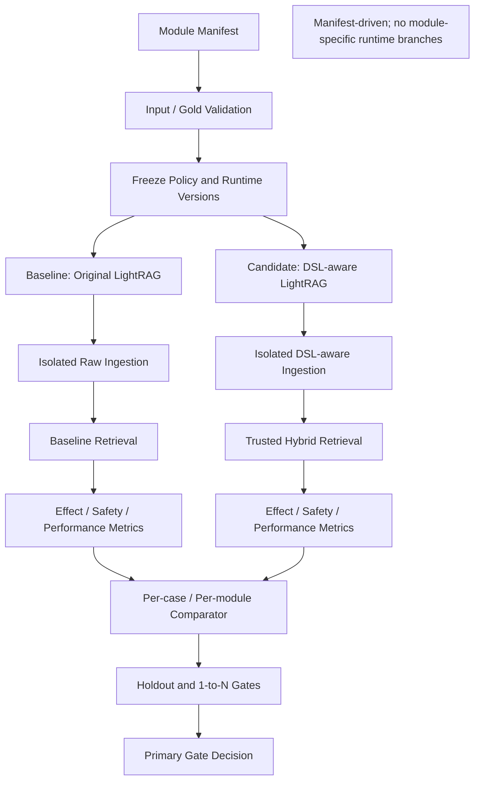

# Block 26B：多交易模块真实 A/B 效果与性能准出

你现在继续在本地 LightRAG 代码仓中工作。

本轮任务：**Block 26B，Real Multi-module A/B Effectiveness & Performance Gate**。

本轮目标是用公司内部真实设计文件和真实问题集，对比：

```text
A. 原生 LightRAG
   Raw Document → 原生 Chunk / Embedding / LLM 抽图 → 原生检索

B. DSL-aware LightRAG
   统一原文证据链 → DSL 编译 → PFSS / Issue / Version
   → 四路混合检索 → Trusted Context Pack
```

严格回答：

> DSL-aware 改造在多个交易类模块中，是否比原生 LightRAG 提供更完整、更准确、更可追溯、更安全的检索上下文；它带来的入库和查询开销是否可接受。

---

## 一、最高优先级原则：绝对禁止模块知识写死

本轮以及后续运行时代码必须支持所有交易类模块。

### 允许

不同模块通过外部数据和配置接入：

```text
module manifest
文档路径
评测问题
Gold Evidence
术语表
Domain / Feature 映射
版本配置
实体类型配置
关系本体配置
性能阈值
```

### 禁止

运行时代码出现任何模块特判：

```python
if module_code == "LCAB":
    ...

if "可接受银行" in query:
    ...

if entity_name == "询价项目列表":
    ...

if module_code in {"FX", "PAYMENT"}:
    channel_weight = ...
```

以下具体词可以出现在：

```text
测试数据
Fixture
Manifest
报告
示例
```

但不得决定运行逻辑：

```text
可接受银行
询价
外汇
信用证
账户
现金池
资金计划
付款
融资
票据
Bank Status
Swift Code
Current Handler
Transfer To
```

### 必须满足的可扩展性合同

新增一个交易模块时，只允许：

```text
新增 manifest / 文档 / Gold Cases / 配置
```

不得要求：

```text
修改 Python Router
修改 Resolver
修改 Fusion 权重代码
增加模块专用 if/else
```

---

## 二、前置状态

以下能力已通过：

- 统一原文证据链；
- PFSS / Generic / Issue 三空间隔离；
- Persistent Sidecar；
- 文档版本增量更新、删除、重建和 Saga Compensation；
- 术语归一 V2 与稳定语义身份；
- 实体类型 Resolver 和通用 NER 类型阻断；
- Resolver 泛化与反硬编码；
- 版本感知检索和版本问题索引；
- 四路混合检索、可信融合、Evidence Path 校验和安全降级。

本轮不再新增新的语义规则。  
若真实 A/B 暴露问题，只记录问题，不在本轮边测边调。

---

## 三、本轮只评测，不调参

本轮必须冻结：

```text
Ontology Version
Term Registry Version
Entity Type Resolver Version
Version Policy Version
Router Policy Version
Fusion Policy Version
Prompt Version
Embedding Model / Dimension
LLM Model
Top-K / Hop / Token Budget
```

开始运行后禁止：

```text
为某个模块改单独权重
为某道题加同义词
为某个实体补特殊类型
为让结果通过修改 Gold
反复重跑并挑最好结果
```

若发现配置缺失：

```text
记录 INPUT_CONFIG_GAP
该 case 标记 INCONCLUSIVE 或 BLOCKED
```

不得现场写死修复。

---

## 四、评测对象和公平性

### A 组：原生 LightRAG

必须使用当前真实原生链：

```text
原始文档
→ 原生解析和切片
→ 真实 Embedding
→ 真实 LLM entity/relation extraction
→ 原生 Graph / Vector / KV
→ 当前可用的 raw/local/global/hybrid/mix 检索
```

### B 组：DSL-aware LightRAG

必须使用当前已完成链路：

```text
统一解析
→ 原文证据链
→ DSL Applicability
→ DSL 编译
→ Term / Type / Version / Evidence / Policy
→ PFSS / Issue / Sidecar
→ 26A 四路混合检索
→ Trusted Context Pack
```

### 公平约束

两组必须：

```text
使用同一份源文档
使用同一 Embedding 模型和维度
使用同一 Query
使用同一硬件和进程环境
使用等价 Top-K 和 Token Budget
使用隔离、全新的 Workspace
不复用对方索引
不连接生产存储
```

原生 A 组可以使用原生 LLM 抽图。  
B 组按当前 DSL 实际实现运行，不得为了公平强行调用原生 `extract_entities` 再抽一次。

---

## 五、多模块评测 Manifest

新增统一 JSON Manifest，不得在代码中写模块列表。

建议路径：

```text
<<MODULE_MANIFEST_PATH>>
```

若用户没有替换，则 runner 必须报错并停止，不得猜路径。

### Manifest 示例结构

```json
{
  "suite_id": "transaction_modules_ab_v1",
  "output_dir": "artifacts/block_26b_multi_module_ab",
  "policy": {
    "minimum_real_module_count": 3,
    "minimum_holdout_module_count": 1,
    "minimum_domain_coverage": 5,
    "minimum_case_count_per_module": 8,
    "max_raw_recall_regression": 0.02,
    "max_per_module_recall_regression": 0.05,
    "max_invalid_citation_count": 0,
    "max_unsupported_factual_path_count": 0,
    "max_version_hard_judgment_error_count": 0,
    "max_generic_ner_fact_hit_count": 0,
    "max_query_p95_latency_ratio": 2.5,
    "max_ingestion_time_ratio": 4.0
  },
  "modules": [
    {
      "module_code": "MODULE_A",
      "module_name": "模块显示名",
      "split": "CALIBRATION",
      "source_files": ["/absolute/path/document.md"],
      "term_registry": "/optional/path/terms.csv",
      "domain_config": "/optional/path/domain.json",
      "version_config": "/optional/path/version.json",
      "cases_file": "/absolute/path/cases.json"
    },
    {
      "module_code": "MODULE_HOLDOUT",
      "module_name": "此前未用于规则调试的模块",
      "split": "HOLDOUT",
      "source_files": ["/absolute/path/document.md"],
      "cases_file": "/absolute/path/cases.json"
    }
  ]
}
```

### 关键要求

- 至少 3 个真实交易模块；
- 至少 1 个 Holdout 模块；
- Holdout 模块在本轮前不得用于代码或策略调试；
- 至少覆盖 10 Domains 中的 5 个；
- 每模块至少 8 个评测问题；
- 若不满足：
  ```text
  BLOCKED_INSUFFICIENT_MODULE_DIVERSITY
  ```
- 不得用大量同一模块文档伪装成多模块。

---

## 六、Case 数据结构

每个 Case 必须有人工确认或可审计的 Gold，不得用系统自身输出当 Gold。

### EvaluationCase

```text
case_id
module_code
task_type
query
strict_scope
version_intent
as_of_time
gold_source_refs
gold_source_us_ids
gold_text_unit_ids
gold_evidence_keywords
gold_semantic_object_ids
gold_relation_types
gold_required_dimensions
gold_forbidden_claims
gold_version_behavior
risk_level
review_status
notes
```

### task_type

至少覆盖：

```text
FACT_QA
IMPACT_ANALYSIS
HISTORICAL_COMPARE
MIGRATION_ANALYSIS
DESIGN_CONTEXT
```

### 1→N 重点 Case

每个真实模块至少包含 2 个 1→N Case，要求 Gold 覆盖多个功能维度，例如：

```text
字段
状态
流程
待办
接口
台账
报表
权限
审计
迁移
DFX
```

具体业务内容由各模块 Case 文件提供，运行代码不得知道。

---

## 七、Gold 质量检查

运行前必须检查：

```text
case_id 唯一
module_code 存在于 manifest
Gold Evidence 文件存在
Gold Source Span 可定位
Forbidden Claims 非空或显式声明无
Version Behavior 明确
```

Gold 不完整时：

```text
CASE_STATUS = INVALID_GOLD
```

不得计入主要 Pass Rate。

不得让 LLM 自动生成 Gold。

---

## 八、本轮主要评测维度

### 1. 原文证据召回

```text
Evidence Recall@K
Evidence Precision@K
Gold Source Document Recall
Gold Source US Recall
Gold TextUnit Recall
Source Span Match Rate
```

### 2. 产品功能语义召回

```text
Entity Recall@K
Relation Recall@K
Required Dimension Coverage
Direct Impact Coverage
Indirect Impact Coverage
Graph Path Coverage
```

### 3. 安全与可信

```text
Invalid Citation Count
No-evidence Factual Path Count
Issue-as-Fact Count
Candidate-as-Confirmed Count
InfoOnly-as-Fact Count
Generic Graph Override Count
Generic NER Fact Hit Count
Version Hard Judgment Error Count
Missing Version Warning Count
```

### 4. 术语和泛化

```text
Cross-language Alias Recall
Stable Identity Match Rate
Unknown Module Safe Resolution Rate
Unsafe Auto-accept Count
Module-specific Hardcode Count
```

### 5. 降级能力

```text
Text-only Fallback Success Rate
Insufficient Evidence Detection Rate
Generic-only Low-trust Detection Rate
Version Conflict Warning Rate
```

### 6. 性能和成本

入库：

```text
Parse Time
Embedding Time
LLM Extraction Time
DSL Compile Time
Graph Write Time
Sidecar Write Time
Total Ingestion Time
Embedding Input Count
Embedding Reuse Count
LLM Call Count
LLM Token Estimate
Storage Size
```

查询：

```text
Query Latency median / p95
Raw Retrieval Time
Graph Retrieval Time
Version / Issue Lookup Time
Fusion Time
Context Build Time
Retrieved Candidate Count
Context Token Estimate
```

---

## 九、Primary Gate 与 Secondary Metrics

### Primary Gate

以下全部满足才可 PASS：

```text
1. Candidate Overall Evidence Recall@K
   >= Baseline Overall Evidence Recall@K - policy tolerance

2. 每个模块 Evidence Recall 回退
   不得超过 max_per_module_recall_regression

3. 1→N Cases：
   Candidate Relation Recall
   和 Required Dimension Coverage
   必须优于 Baseline 或至少无退化且路径证据更完整

4. invalid_citation_count = 0

5. unsupported_factual_path_count = 0

6. version_hard_judgment_error_count = 0

7. generic_ner_fact_hit_count = 0

8. Issue / Candidate / InfoOnly 不得作为事实

9. Holdout 模块不得出现严重退化

10. 运行时代码模块硬编码计数 = 0
```

### Secondary Metrics

用于决策但不单独阻断：

```text
平均分改善
Generic 背景补充率
查询延迟
入库耗时
存储增量
模型调用成本
```

性能阈值来自 Manifest，不得为某模块写死。

---

## 十、禁止用漂亮均值掩盖模块退化

报告必须同时输出：

```text
整体均值
中位数
每模块指标
每任务类型指标
每风险等级指标
Holdout 指标
最差模块指标
最差 10 个 Case
```

不得只输出总体平均分。

若总体提升但某模块严重下降：

```text
overall_status != PASS
```

至少应为：

```text
CONDITIONAL_FAIL_MODULE_REGRESSION
```

---

## 十一、评测不依赖 LLM Judge 作为主要依据

主要指标必须由 Gold 和确定性代码计算。

允许：

- 使用相同 Query LLM 为 A/B 两组生成一个**辅助答案样本**；
- 只作为人工盲评材料；
- 不作为主要准出 Gate；
- 两组必须使用同一模型、Prompt、温度和 Token 限制。

默认建议：

```text
PRIMARY_EVAL_USES_LLM_JUDGE = false
```

不得重复之前“US 样例明显不合格但自动分数很好”的假阳性。

---

## 十二、A/B 隔离和运行顺序

每个模块建立：

```text
baseline_workspace
candidate_workspace
```

必须：

```text
不同 working_dir
不同 namespace
不同 graph files
不同 vector files
相同输入和模型
```

### 推荐顺序

每个模块：

```text
1. Preflight
2. Baseline Raw Ingestion
3. Candidate DSL-aware Ingestion
4. Index Snapshot
5. Warm-up Query（不计分）
6. 正式 Query，每 case 运行 5 次
7. 记录 median / p95
8. 生成结果
9. Cleanup
```

为避免缓存顺序偏差：

- 模块执行顺序可固定种子随机；
- A/B 查询执行顺序交替；
- 报告保存随机种子。

---

## 十三、重复运行和统计

### 效果指标

同一索引下每个 Case 的检索结果应确定性。

若有随机性：

```text
固定 random seed
```

### 性能指标

每个 Query：

```text
1 次 warm-up
5 次正式运行
```

报告：

```text
median
p95
min
max
```

不得只报最好一次。

### 入库

每个模块每组只正式入库一次。  
不得反复入库挑最快结果。

---

## 十四、反硬编码 Guard

新增：

```text
multi_module_ab_generalization_guard.py
```

它必须从 Manifest 动态读取：

```text
module_code
module_name
关键 Gold entity 名称
```

然后扫描本轮和 24~26 相关**运行时代码**的 AST，检查：

```text
与 module_code 的直接比较
具体模块名 membership 判断
具体实体名决定权重
按模块切换 Router / Resolver / Fusion
Fixture 文件名被 runtime import
```

允许这些词出现在：

```text
tests
fixtures
artifacts
reports
manifest parser
日志显示字段
```

不允许作为控制分支。

输出：

```text
multi_module_anti_hardcode_report.json
```

准出：

```text
runtime_module_branch_count = 0
entity_name_weight_rule_count = 0
fixture_runtime_coupling_count = 0
holdout_specific_rule_count = 0
```

---

## 十五、建议新增文件

建议新增：

```text
lightrag_ext/us_dsl/multi_module_eval_types.py
lightrag_ext/us_dsl/multi_module_eval_manifest.py
lightrag_ext/us_dsl/gold_case_validator.py
lightrag_ext/us_dsl/baseline_retrieval_runner.py
lightrag_ext/us_dsl/candidate_retrieval_runner.py
lightrag_ext/us_dsl/retrieval_effectiveness_metrics.py
lightrag_ext/us_dsl/retrieval_safety_metrics.py
lightrag_ext/us_dsl/retrieval_performance_metrics.py
lightrag_ext/us_dsl/ab_result_comparator.py
lightrag_ext/us_dsl/multi_module_ab_generalization_guard.py
lightrag_ext/us_dsl/scripts/run_multi_module_ab_gate.py

lightrag_ext/us_dsl/tests/test_multi_module_eval_manifest.py
lightrag_ext/us_dsl/tests/test_gold_case_validator.py
lightrag_ext/us_dsl/tests/test_retrieval_effectiveness_metrics.py
lightrag_ext/us_dsl/tests/test_retrieval_safety_metrics.py
lightrag_ext/us_dsl/tests/test_retrieval_performance_metrics.py
lightrag_ext/us_dsl/tests/test_ab_result_comparator.py
lightrag_ext/us_dsl/tests/test_multi_module_ab_generalization.py
lightrag_ext/us_dsl/tests/test_multi_module_ab_guards.py
```

允许按需小改：

```text
hybrid_retrieval_service.py
trusted_context_builder.py
query_semantic_profile.py
version_retrieval_service.py
term_query_expander.py
```

只能为稳定评测接口、计时和只读结果导出做修改。

禁止修改：

```text
lightrag/lightrag.py
lightrag/operate.py
lightrag/prompt.py
lightrag/api/*
document_routes.py
正式 query pipeline
LightRAG storage implementations
```

---

## 十六、本轮严格边界

本轮允许：

- 使用真实公司设计文档；
- 使用真实 Embedding；
- 原生 A 组使用真实 LLM 抽图；
- B 组使用当前真实 DSL 链；
- 使用隔离本地测试存储；
- 生成 Context Pack；
- 可选生成 A/B 辅助答案样本。

本轮禁止：

1. 不接正式 Upload API；
2. 不接正式 Query API；
3. 不修改生产数据；
4. 不连接生产 Neo4j；
5. 不连接生产 PostgreSQL / Milvus / Qdrant 等；
6. 不修改模型、Prompt、Ontology、Term Registry 和 Fusion 策略；
7. 不调参；
8. 不按模块写逻辑；
9. 不自动修 Gold；
10. 不将测试输出写入 Git 跟踪目录；
11. 不泄露完整内部文档或密钥；
12. 不修改 LightRAG Core/API；
13. 不开始 27A。

---

## 十七、敏感信息和输出最小化

报告中：

```text
不得复制整份公司文档
不得输出完整 API Key / Token
不得输出完整 Embedding
不得输出超长原文
```

Evidence 只保留：

```text
source file hash
sourceUsId / textUnitId
source span
必要短摘要
```

输出目录必须在 `.gitignore` 覆盖范围内。

---

## 十八、状态枚举

最终状态只能是：

```text
PASS
FAIL_EFFECTIVENESS
FAIL_SAFETY
FAIL_MODULE_REGRESSION
FAIL_HOLDOUT_GENERALIZATION
FAIL_PERFORMANCE
BLOCKED_INPUT_SET
BLOCKED_ENV
INCONCLUSIVE_GOLD
```

不得在 Primary Gate 未满足时输出 PASS。

---

## 十九、测试 Fixture

默认 pytest 使用合成、多模块 fixture，不访问真实文件或网络。

至少构造：

```text
Module A：Workflow + AccessAudit
Module B：MonitoringReport + Ledger
Module C：Integration + RuleManagement
Holdout D：此前未出现的名称和对象
```

运行逻辑不得知道这些模块名称。

Fixture 必须验证：

```text
Manifest 驱动
无模块分支
每模块独立统计
Holdout 单独统计
总体均值不能掩盖模块退化
性能阈值由 Policy 输入
```

---

## 二十、测试要求

至少覆盖：

### Manifest / Gold

1. `test_manifest_requires_minimum_module_diversity`
2. `test_manifest_requires_holdout_module`
3. `test_manifest_requires_domain_coverage`
4. `test_manifest_has_no_duplicate_module_code`
5. `test_case_ids_are_unique`
6. `test_gold_source_refs_are_resolvable`
7. `test_invalid_gold_is_not_counted_as_pass`
8. `test_thresholds_are_policy_driven_not_module_hardcoded`

### Effectiveness

9. `test_evidence_recall_at_k`
10. `test_evidence_precision_at_k`
11. `test_entity_and_relation_recall`
12. `test_required_dimension_coverage`
13. `test_graph_path_coverage`
14. `test_source_span_match`
15. `test_cross_language_alias_recall`
16. `test_text_only_fallback_success`

### Safety

17. `test_invalid_citation_count`
18. `test_no_evidence_factual_path_count`
19. `test_issue_as_fact_count`
20. `test_candidate_as_confirmed_count`
21. `test_info_only_as_fact_count`
22. `test_generic_graph_override_count`
23. `test_generic_ner_fact_hit_count`
24. `test_version_hard_judgment_error_count`
25. `test_missing_version_warning_count`

### Comparator

26. `test_overall_average_cannot_hide_module_regression`
27. `test_holdout_has_separate_gate`
28. `test_1_to_n_cases_have_separate_metrics`
29. `test_candidate_raw_recall_regression_threshold`
30. `test_per_module_regression_threshold`
31. `test_primary_gate_is_deterministic`
32. `test_llm_judge_is_not_primary_gate`

### Performance

33. `test_latency_reports_median_and_p95`
34. `test_warmup_is_excluded`
35. `test_five_measured_runs_are_required`
36. `test_ingestion_and_query_costs_are_separate`
37. `test_embedding_and_llm_call_counts_are_reported`
38. `test_performance_thresholds_come_from_manifest`

### Generalization

39. `test_runtime_has_no_manifest_module_branch`
40. `test_runtime_has_no_entity_name_specific_weight`
41. `test_holdout_specific_rule_count_is_zero`
42. `test_new_module_requires_config_not_code_change`
43. `test_fixture_names_are_not_imported_by_runtime`

### Guards

44. `test_workspaces_are_isolated`
45. `test_no_production_storage_connection`
46. `test_no_live_upload_or_query_hook`
47. `test_reports_redact_secrets`
48. `test_report_is_serializable`
49. `test_no_lightrag_core_modified`
50. `test_cleanup_removes_all_workspaces`

---

## 二十一、输出目录

默认：

```text
artifacts/block_26b_multi_module_ab/
```

必须生成：

```text
multi_module_ab_report.json
multi_module_ab_report.md
manifest_snapshot.json
frozen_policy_snapshot.json
environment_snapshot.json
gold_validation_report.json
module_distribution.json
domain_coverage.json

baseline_ingestion_metrics.json
candidate_ingestion_metrics.json
baseline_query_results.json
candidate_query_results.json

overall_effectiveness_comparison.json
per_module_comparison.json
per_task_type_comparison.json
holdout_comparison.json
one_to_n_comparison.json
worst_cases.json

retrieval_safety_report.json
version_safety_report.json
entity_type_safety_report.json
term_generalization_report.json
fallback_report.json

performance_report.json
latency_distribution.json
model_call_cost_report.json
storage_size_report.json

multi_module_anti_hardcode_report.json
primary_gate_report.json
manual_blind_review_package.json
safety_check.json
cleanup_report.json
architecture.mmd
command_log.txt
git_status_before.txt
git_status_after.txt
core_diff_check.txt
unresolved_questions.md
workspaces/
```

`manual_blind_review_package.json` 可包含匿名化 A/B Context Pack 或辅助答案，不能标出哪一组是 Candidate。

---

## 二十二、架构图

`architecture.mmd`：



---

## 二十三、默认离线测试命令

```bash
mkdir -p artifacts/block_26b_multi_module_ab

git status --short \
  > artifacts/block_26b_multi_module_ab/git_status_before.txt
```

```bash
.venv/bin/python - <<'PY'
import subprocess
import sys

tests = [
    "lightrag_ext/us_dsl/tests/test_multi_module_eval_manifest.py",
    "lightrag_ext/us_dsl/tests/test_gold_case_validator.py",
    "lightrag_ext/us_dsl/tests/test_retrieval_effectiveness_metrics.py",
    "lightrag_ext/us_dsl/tests/test_retrieval_safety_metrics.py",
    "lightrag_ext/us_dsl/tests/test_retrieval_performance_metrics.py",
    "lightrag_ext/us_dsl/tests/test_ab_result_comparator.py",
    "lightrag_ext/us_dsl/tests/test_multi_module_ab_generalization.py",
    "lightrag_ext/us_dsl/tests/test_multi_module_ab_guards.py",
]

commands = [
    [".venv/bin/python", "-m", "pytest", test, "-q"]
    for test in tests
] + [
    [".venv/bin/python", "-m", "compileall", "-q", "lightrag_ext"],
    [".venv/bin/python", "-m", "py_compile", "lightrag/prompt.py"],
    [".venv/bin/python", "-m", "ruff", "check",
     "lightrag_ext", "lightrag/prompt.py"],
]

for command in commands:
    print("RUN:", " ".join(command), flush=True)
    try:
        result = subprocess.run(command, timeout=300)
    except subprocess.TimeoutExpired:
        print("TIMEOUT:", " ".join(command))
        sys.exit(124)

    if result.returncode != 0:
        sys.exit(result.returncode)
PY
```

---

## 二十四、真实多模块 A/B 命令

只有显式启用：

```text
LIGHTRAG_ENABLE_REAL_MULTI_MODULE_AB=1
```

才允许真实模型和真实内部文档运行。

```bash
LIGHTRAG_ENABLE_REAL_MULTI_MODULE_AB=1 \
.venv/bin/python -m \
  lightrag_ext.us_dsl.scripts.run_multi_module_ab_gate \
  --manifest <<MODULE_MANIFEST_PATH>> \
  --output-dir artifacts/block_26b_multi_module_ab \
  --measured-runs 5 \
  --warmup-runs 1 \
  --cleanup
```

要求：

- 总 runner 必须有超时；
- 单模块失败不得无限重试；
- 401 / 403 / 网络问题标记 `BLOCKED_ENV`；
- 输入模块不足标记 `BLOCKED_INPUT_SET`；
- 不得自动换模型、维度或 Prompt。

---

## 二十五、防止原地打圈

必须严格遵守：

1. Manifest 和 Gold 只校验一次；
2. 每个模块 A/B 正式入库各一次；
3. Query 按规定 1 warm-up + 5 measured runs；
4. 不因某个 Case 失败现场修改策略；
5. 同一外部错误最多一次定向诊断，不连续重试；
6. 不自动改 `.env`；
7. 不自动改术语表、版本表或 Domain 配置；
8. 不重新跑完整 suite 挑最好结果；
9. 完成报告后立即停止；
10. 不开始 27A。

---

## 二十六、安全检查

`safety_check.json` 必须包含：

```json
{
  "live_upload_behavior_changed": false,
  "live_query_behavior_changed": false,
  "live_upload_hook_connected": false,
  "live_query_hook_connected": false,
  "production_storage_connected": false,
  "neo4j_connected": false,
  "runtime_module_branch_count": 0,
  "entity_name_specific_weight_rule_count": 0,
  "holdout_specific_rule_count": 0,
  "primary_eval_uses_llm_judge": false,
  "policy_changed_during_run": false,
  "gold_changed_during_run": false,
  "lightrag_core_modified": false
}
```

Core 检查：

```bash
git diff --name-only -- \
  lightrag/lightrag.py \
  lightrag/operate.py \
  lightrag/prompt.py \
  lightrag/api \
  > artifacts/block_26b_multi_module_ab/core_diff_check.txt
```

最终状态：

```bash
git status --short \
  > artifacts/block_26b_multi_module_ab/git_status_after.txt
```

---

## 二十七、准出标准

通过条件：

1. 至少 3 个真实交易模块；
2. 至少 1 个 Holdout 模块；
3. 至少覆盖 5 个通用 Domain；
4. 每模块至少 8 个有效 Gold Cases；
5. 所有输入和 Gold 校验通过；
6. A/B 使用同一源文档、模型和预算；
7. Workspace 严格隔离；
8. Candidate 整体 Evidence Recall 无超阈值回退；
9. 无单模块严重召回退化；
10. 1→N Relation Recall / Dimension Coverage 不低于 Baseline，且至少一项明确改善；
11. invalid citation = 0；
12. no-evidence factual path = 0；
13. Issue / Candidate / InfoOnly as fact = 0；
14. generic graph override = 0；
15. generic NER fact hit = 0；
16. version hard judgment error = 0；
17. Holdout 无严重退化；
18. Text-only 降级有效；
19. 查询和入库性能满足 Manifest 阈值；
20. 每项性能报告 median / p95；
21. 无模块代码硬编码；
22. 新模块只需配置和数据，不改代码；
23. LLM Judge 不是主要准出依据；
24. 不连接生产存储或 Neo4j；
25. 不修改 Live Upload / Query；
26. 不修改 LightRAG Core/API；
27. 测试和静态检查全部通过；
28. artifacts 完整；
29. cleanup 通过。

不通过条件：

1. 只测试一个模块；
2. 没有 Holdout；
3. 通过代码 if/else 适配模块；
4. 按模块改 Fusion 权重；
5. 总体均值掩盖模块严重下降；
6. Gold 来自被评测系统自身输出；
7. 自动修改 Gold 或策略后重跑；
8. 无 Evidence 图路径作为事实；
9. 版本冲突硬判当前；
10. Generic NER 错误类型参与事实；
11. 性能只报最好一次；
12. 用 LLM Judge 漂亮分数替代 Gold 指标；
13. 连接生产存储；
14. 修改 Core；
15. cleanup 失败。

---

## 二十八、完成后只输出

```text
Block: 26B

Input:
- suite_id:
- real_module_count:
- holdout_module_count:
- valid_case_count:
- domain_coverage_count:
- invalid_gold_case_count:

Generalization:
- runtime_module_branch_count:
- entity_name_specific_weight_rule_count:
- holdout_specific_rule_count:
- new_module_requires_code_change:
- anti_hardcode_passed:

Effectiveness:
- baseline_evidence_recall_at_k:
- candidate_evidence_recall_at_k:
- evidence_recall_delta:
- worst_module_recall_delta:
- baseline_relation_recall:
- candidate_relation_recall:
- relation_recall_delta:
- baseline_required_dimension_coverage:
- candidate_required_dimension_coverage:
- one_to_n_improved_count:
- one_to_n_degraded_count:
- holdout_passed:

Safety:
- invalid_citation_count:
- unsupported_factual_path_count:
- issue_as_fact_count:
- candidate_as_confirmed_count:
- info_only_as_fact_count:
- generic_graph_override_count:
- generic_ner_fact_hit_count:
- version_hard_judgment_error_count:
- missing_version_warning_count:

Performance:
- baseline_ingestion_time_ms:
- candidate_ingestion_time_ms:
- ingestion_time_ratio:
- baseline_query_latency_median_ms:
- candidate_query_latency_median_ms:
- baseline_query_latency_p95_ms:
- candidate_query_latency_p95_ms:
- query_p95_latency_ratio:
- baseline_embedding_call_count:
- candidate_embedding_call_count:
- baseline_llm_call_count:
- candidate_llm_call_count:
- storage_size_ratio:

Governance:
- primary_eval_uses_llm_judge:
- policy_changed_during_run:
- gold_changed_during_run:
- production_storage_connected:
- neo4j_connected:
- live_upload_behavior_changed:
- live_query_behavior_changed:
- cleanup_passed:
- core_modified_in_this_round:

Tests:
- collected_count:
- passed_count:
- failed_count:
- compileall:
- py_compile:
- ruff:

Final:
- overall_status:
- failed_primary_gates:
- recommended_fix:
- recommended_next_block:

Artifacts:
- artifacts/block_26b_multi_module_ab
```

只有全部 Primary Gate 通过时：

```text
overall_status = PASS
recommended_next_block = Block 27A
```

完成后立即停止。

---

## 二十九、特别提醒

本轮是第一次真正回答：

> DSL-aware LightRAG 是否在多个交易模块和未见模块上，实质性优于原生 LightRAG。

不能只看平均分，也不能只看可接受银行或询价。

下一步才是：

> **Block 27A：三类需求场景 Router 与 Skills 编排。**
