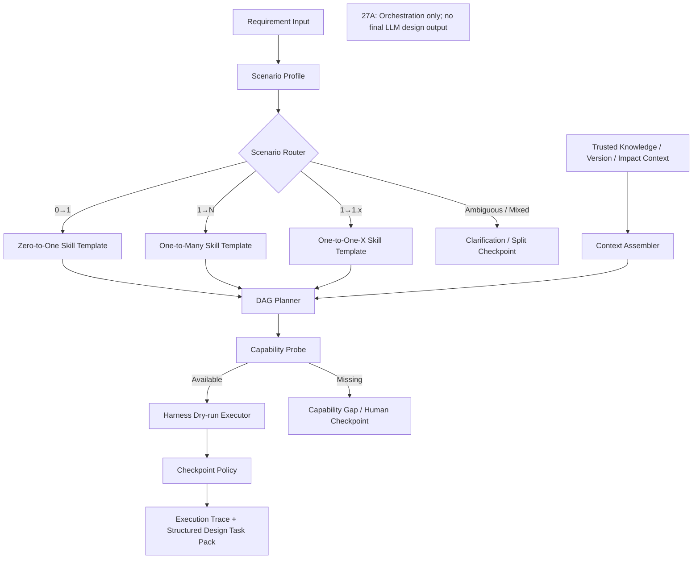

# Block 27A：三类需求场景路由与 Skills 编排

你现在继续在本地 LightRAG 代码仓中工作。

本轮任务：**Block 27A，Three-scenario Requirement Router & Skills Orchestration Harness**。

本轮开始构建叮当猫的产品设计 Harness 编排骨架：

```text
需求输入
→ 三类需求场景识别
→ 知识上下文装配
→ Skills 选择与依赖排序
→ 执行 DAG
→ Checkpoint / Block / Fallback
→ 结构化设计任务包
```

本轮不追求最终 US、方案或影响分析文本质量；  
最终输出质量门禁、正常 BA 风格 US、可测试 AC 和无占位内容校验将在 **Block 27B** 完成。

---

## 一、最高优先级原则：所有交易类模块通用，禁止业务硬编码

本轮及后续 Harness 必须适用于所有财经 IT 交易类模块，例如但不限于：

```text
外汇
信用证
询价
账户
现金池
资金计划
付款
融资
票据
结算
授信
风险
主数据
报表
```

这些模块名称只允许出现在：

```text
测试 fixture
Manifest
报告示例
用户输入
```

不得出现在运行时控制逻辑中。

### 严禁

```python
if module_code == "LCAB":
    route = ONE_TO_MANY

if "可接受银行" in requirement:
    use_bank_status_skill()

if module_code == "FX":
    add_fx_design_skill()

if "询价项目" in text:
    scenario = ONE_TO_MANY
```

### 新模块接入合同

新增一个交易模块时，只允许新增或调整：

```text
module manifest
设计文档
术语配置
Domain / Feature 配置
Gold / Eval Cases
代码上下文 Adapter 配置
```

不得修改：

```text
Scenario Router Python 逻辑
Skill DAG 逻辑
质量门禁代码
模块专用权重
模块专用 if/else
```

---

## 二、前置状态

以下能力已通过：

### 知识编译与入库

- 统一原文证据链；
- DSL 编译；
- PFSS / Generic / Issue 三空间隔离；
- Persistent Metadata Sidecar；
- 文档版本增量更新、删除、重建和 Saga Compensation。

### 语义治理

- 术语归一 V2；
- Stable Semantic Identity；
- Entity Type Resolver；
- Generic NER 阻断；
- 多模块泛化和反硬编码；
- Version-aware Retrieval；
- Version Issue Index。

### 检索与真实验证

- 四路混合检索；
- Trust-aware Fusion；
- Trusted Context Pack；
- 多交易模块真实 A/B；
- Holdout 泛化；
- 性能与安全准出。

本轮必须复用这些既有能力，不得重新实现一套平行的术语、版本或检索逻辑。

---

## 三、Harness 的真实定义

本轮实现的 Harness 不能只是：

```text
一个大 Prompt
一组模板
一个 Skills 列表
```

严格定义为：

```text
Harness
=
Scenario Router
+ Capability / Skill Registry
+ Context Contract
+ Skill Dependency DAG
+ State Machine
+ Checkpoints
+ Failure / Fallback Policy
+ Execution Trace
```

其中：

- **Scenario** 决定执行路径；
- **Skill** 承担单项专业任务；
- **Harness** 负责选择、排序、约束、阻断和记录 Skills；
- **27A** 负责流程和协议；
- **27B** 负责最终输出质量。

---

## 四、本轮要实现什么

实现：

```text
1. 三类需求场景 Profile
2. 通用场景分类与保守路由
3. Skill Capability Registry
4. Skill 输入/输出 Contract
5. 三类场景的通用 Skill Graph 模板
6. 动态 DAG Planner
7. Harness Execution State Machine
8. Context Assembly Contract
9. Checkpoint / Block / Fallback Policy
10. Capability Gap 与人工澄清机制
11. Execution Trace / Audit
12. 反硬编码和 Holdout 泛化验证
```

本轮要证明：

1. `0→1 / 1→N / 1→1.x` 不是按模块名称分类；
2. 场景判断来自需求新颖度、现有知识覆盖、影响广度、跨 Domain 数、Feature 命中、代码/设计资产可用度等通用信号；
3. 低置信或混合需求不会被强制归到某一类；
4. 三类场景能生成不同但可解释的 Skill DAG；
5. Skills 有明确输入、输出、前置条件和完成条件；
6. 未实现的 Skill 不得伪装成已实现；
7. 已有 Retrieval / Version / Impact 能力通过 Adapter 复用；
8. 代码上下文缺失时，1→1.x 不能假装已完成详细实现分析；
9. Harness 可在任一步进入：
   - `WAITING_FOR_CLARIFICATION`
   - `BLOCKED_BY_MISSING_CAPABILITY`
   - `BLOCKED_BY_INSUFFICIENT_EVIDENCE`
10. 所有执行均有可追踪的状态和原因；
11. 本轮不调用真实 LLM，不生成最终业务方案。

---

## 五、三类业务需求场景定义

### 1. ZERO_TO_ONE（0→1）

定义：

> 完全新增或高度新颖的业务能力，与现有 Feature、设计资产和代码实现关联弱，需要从业务目标、对象、流程和规则开始建模。

典型信号：

```text
existing_feature_coverage 低
existing_semantic_object_coverage 低
existing_code_asset_coverage 低
novelty_score 高
new_business_object_ratio 高
impact_path_count 低或不存在
```

注意：

> “图谱没召回到”不等于一定是 0→1。  
> 也可能是文档缺失、术语未配置或检索失败。

### 2. ONE_TO_MANY（1→N）

定义：

> 需求围绕一个或少数主变更点，但影响多个存量 Feature、Domain、规则、接口、台账、报表、权限、迁移或 DFX 维度。

典型信号：

```text
primary_change_target_count 较少
existing_knowledge_coverage 中高
affected_feature_count > 1
affected_domain_count > 1
direct_impact_count + indirect_impact_count 较高
graph_path_coverage 较高
version_issue_count 可大于 0
```

### 3. ONE_TO_ONE_X（1→1.x）

定义：

> 已有单一 Feature 或局部对象的有限优化，影响范围相对明确，代码或接口定位度较高，通常可采用最小变更方案。

典型信号：

```text
existing_feature_coverage 高
primary_change_target_count = 1 或极少
affected_feature_count 低
affected_domain_count 低
code_asset_coverage 高
local_change_score 高
```

### 4. 分类状态不是第四种业务场景

必须另设：

```text
CONFIDENT
AMBIGUOUS
MIXED
INSUFFICIENT_EVIDENCE
MANUAL_OVERRIDE
```

业务场景仍是三类。

若证据不足：

```text
不得强制分类
```

---

## 六、本轮严格边界

本轮允许：

- 使用 26A Trusted Context Pack；
- 使用 25B Version Context；
- 使用 25A Stable Identity 和 Entity Type；
- 定义 Skills 和 Harness DAG；
- 执行离线、无模型的编排 smoke；
- 使用已有确定性 Retrieval / Version / Impact Adapter；
- 对未实现 Skill 生成 Capability Gap；
- 输出结构化 Execution Plan。

本轮禁止：

1. 不修改正式 Upload API；
2. 不修改正式 Query API；
3. 不接 Live Harness Hook；
4. 不调用真实 LLM；
5. 不调用真实 Embedding；
6. 不生成最终 US；
7. 不生成最终高阶方案或详细方案正文；
8. 不执行真实 UX 图生成；
9. 不调用 OpenCode / Code Agent；
10. 不连接生产代码仓；
11. 不写 PFSS / Generic Graph；
12. 不修改 Version / Term / Type 事实；
13. 不连接生产数据库或 Neo4j；
14. 不修改 LightRAG Core/API；
15. 不安装新依赖；
16. 不修改 `uv.lock / pyproject.toml / requirements`；
17. 不提前实现 27B。

完成后必须满足：

```text
LIVE_UPLOAD_BEHAVIOR_CHANGED = false
LIVE_QUERY_BEHAVIOR_CHANGED = false
LIVE_HARNESS_HOOK_CONNECTED = false
REAL_EMBEDDING_CALLS_EXECUTED = false
REAL_LLM_CALLS_EXECUTED = false
FINAL_US_GENERATED = false
FINAL_SOLUTION_DOCUMENT_GENERATED = false
CODE_AGENT_CALLED = false
KNOWLEDGE_STORAGE_WRITES_EXECUTED = false
PRODUCTION_DATABASE_CONNECTED = false
NEO4J_CONNECTED = false
LIGHTRAG_CORE_MODIFIED = false
```

---

## 七、防止 Codex 原地打圈

必须严格遵守：

1. 只读取一次：
   - 26A Trusted Context Pack 接口；
   - 25B Version Context 接口；
   - 当前 Impact Analysis Harness / Eval 接口；
   - 当前 US Generation Harness / Eval 接口；
   - 现有 Domain Registry。
2. 不重新分析上传链；
3. 不重新运行 26B 真实 A/B；
4. 不重新实现 Retrieval；
5. 不全仓反复 `rg/find`；
6. 每个目标文件最多完整读取一次；
7. 不安装依赖；
8. 同一失败命令只允许：
   - 首次；
   - 一次定向修复；
   - 重跑一次；
9. 第二次仍失败：
   - 写入 `unresolved_questions.md`；
   - 停止本轮；
10. 不通过具体业务词调整场景分数；
11. 不用测试 fixture 名称决定 Skill；
12. 不把尚未实现的 Skill 标记为 `AVAILABLE`；
13. 不生成漂亮但虚假的最终方案；
14. 达到准出后立即停止。

---

## 八、建议新增文件

建议新增：

```text
lightrag_ext/us_dsl/harness_types.py
lightrag_ext/us_dsl/requirement_scenario_profile.py
lightrag_ext/us_dsl/requirement_scenario_router.py
lightrag_ext/us_dsl/skill_contracts.py
lightrag_ext/us_dsl/skill_registry.py
lightrag_ext/us_dsl/skill_capability_probe.py
lightrag_ext/us_dsl/scenario_skill_templates.py
lightrag_ext/us_dsl/skill_dag_planner.py
lightrag_ext/us_dsl/harness_context_assembler.py
lightrag_ext/us_dsl/harness_checkpoint_policy.py
lightrag_ext/us_dsl/harness_state_machine.py
lightrag_ext/us_dsl/harness_executor.py
lightrag_ext/us_dsl/harness_generalization_guard.py
lightrag_ext/us_dsl/scripts/run_three_scenario_harness_smoke.py

lightrag_ext/us_dsl/tests/test_requirement_scenario_profile.py
lightrag_ext/us_dsl/tests/test_requirement_scenario_router.py
lightrag_ext/us_dsl/tests/test_skill_contracts.py
lightrag_ext/us_dsl/tests/test_skill_registry.py
lightrag_ext/us_dsl/tests/test_skill_capability_probe.py
lightrag_ext/us_dsl/tests/test_scenario_skill_templates.py
lightrag_ext/us_dsl/tests/test_skill_dag_planner.py
lightrag_ext/us_dsl/tests/test_harness_context_assembler.py
lightrag_ext/us_dsl/tests/test_harness_checkpoint_policy.py
lightrag_ext/us_dsl/tests/test_harness_state_machine.py
lightrag_ext/us_dsl/tests/test_harness_executor.py
lightrag_ext/us_dsl/tests/test_harness_generalization.py
lightrag_ext/us_dsl/tests/test_harness_guards.py
```

允许按需小改：

```text
hybrid_retrieval_service.py
trusted_context_builder.py
version_retrieval_service.py
impact_analysis_types.py
us_generation_types.py
domain_registry.py
```

只能为 typed Adapter 和 capability reporting 做小改。

禁止修改：

```text
lightrag/lightrag.py
lightrag/operate.py
lightrag/prompt.py
lightrag/api/*
document_routes.py
正式 upload/query pipeline
LightRAG storage implementations
```

---

## 九、需求场景 Profile

新增 `requirement_scenario_profile.py`。

### RequirementInput

字段：

```text
requirement_id
requirement_text
module_code
explicit_scenario_override
source_document_refs
requested_outputs
available_code_context
available_design_context
metadata
```

### RequirementScenarioProfile

字段：

```text
requirement_id
primary_change_targets
existing_feature_coverage
existing_semantic_object_coverage
existing_relation_coverage
existing_design_evidence_coverage
existing_code_asset_coverage
novelty_score
new_business_object_ratio
affected_feature_count
affected_domain_count
direct_impact_count
indirect_impact_count
graph_path_count
version_issue_count
term_issue_count
type_issue_count
local_change_score
cross_system_signal_count
evidence_sufficiency_score
profile_confidence
signals
risks
```

所有指标必须是通用指标。

不得出现：

```text
bank_status_changed
quotation_deadline_changed
fx_settlement_changed
```

等模块专用字段。

---

## 十、Scenario Router

新增 `requirement_scenario_router.py`。

### RequirementScenario

```text
ZERO_TO_ONE
ONE_TO_MANY
ONE_TO_ONE_X
```

### ScenarioClassificationStatus

```text
CONFIDENT
AMBIGUOUS
MIXED
INSUFFICIENT_EVIDENCE
MANUAL_OVERRIDE
```

### ScenarioRouteDecision

字段：

```text
requirement_id
selected_scenario
classification_status
confidence
alternative_scenarios
profile
reason_codes
missing_information
clarification_questions
manual_override_used
router_policy_version
```

### 路由原则

#### ZERO_TO_ONE

仅当：

```text
novelty 高
现有 Feature / Object / Code 覆盖低
Evidence 足以确认“确实是新增”，而不是检索失败
```

#### ONE_TO_MANY

仅当：

```text
主变更目标明确
多个 Feature / Domain / 影响路径被识别
```

#### ONE_TO_ONE_X

仅当：

```text
已有 Feature 定位明确
影响范围局部
代码/设计上下文较充分
无明显跨域高风险扩散
```

### 保守行为

若：

```text
0→1 和 1→N 信号同时高
或
1→1.x 但存在跨域风险
```

则：

```text
classification_status = MIXED / AMBIGUOUS
```

不得强制选分数最高的一类后继续。

允许返回：

```text
selected_scenario = null
```

并生成澄清问题。

---

## 十一、Skill Contract

新增 `skill_contracts.py`。

### SkillCapabilityStatus

```text
AVAILABLE
ADAPTER_AVAILABLE
PLANNED_NOT_IMPLEMENTED
BLOCKED_DEPENDENCY
DISABLED
```

### SkillExecutionMode

```text
PLAN_ONLY
DRY_RUN
DETERMINISTIC_EXECUTION
FUTURE_LLM_EXECUTION
FUTURE_EXTERNAL_AGENT
```

本轮不允许执行：

```text
FUTURE_LLM_EXECUTION
FUTURE_EXTERNAL_AGENT
```

### SkillContract

字段：

```text
skill_id
name
description
capability_status
supported_scenarios
required_inputs
optional_inputs
output_schema
preconditions
postconditions
failure_modes
checkpoint_after
side_effect_policy
adapter_target
version
```

### 必须注册的通用 Skills

至少包括：

```text
REQUIREMENT_INTAKE
SCENARIO_CLASSIFICATION
CLARIFICATION_QUESTION_GENERATION
TRUSTED_KNOWLEDGE_RETRIEVAL
VERSION_ANALYSIS
NOVELTY_GAP_ANALYSIS
CURRENT_STATE_ANALYSIS
PRIMARY_CHANGE_TARGET_IDENTIFICATION
FEATURE_DECOMPOSITION
FUNCTION_DECOMPOSITION
IMPACT_ANALYSIS
HIGH_LEVEL_SOLUTION_PLANNING
DETAILED_DESIGN_PLANNING
UX_DESIGN_INPUT_PLANNING
FIELD_SPEC_PLANNING
PROCESS_STATE_DESIGN_PLANNING
INTEGRATION_DESIGN_PLANNING
PERMISSION_AUDIT_DESIGN_PLANNING
MIGRATION_INITIALIZATION_PLANNING
DFX_DESIGN_PLANNING
US_GENERATION
AC_GENERATION
TEST_SCOPE_PLANNING
CODE_CONTEXT_HANDOFF
CROSS_OUTPUT_CONSISTENCY_CHECK
FINAL_QUALITY_GATE
```

注意：

> 注册 Skill 不等于该 Skill 已实现。

例如当前可能：

```text
TRUSTED_KNOWLEDGE_RETRIEVAL = ADAPTER_AVAILABLE
VERSION_ANALYSIS = ADAPTER_AVAILABLE
IMPACT_ANALYSIS = ADAPTER_AVAILABLE
US_GENERATION = ADAPTER_AVAILABLE 或有限实现
UX_DESIGN_INPUT_PLANNING = PLANNED_NOT_IMPLEMENTED
CODE_CONTEXT_HANDOFF = PLANNED_NOT_IMPLEMENTED
```

必须通过 Capability Probe 真实判断，不得全部写 `AVAILABLE`。

---

## 十二、现有能力 Adapter

至少实现 typed Adapter：

### 1. Trusted Retrieval Adapter

复用 26A：

```text
HybridRetrievalRequest
→ TrustedContextPack
```

### 2. Version Analysis Adapter

复用 25B：

```text
Version-aware Retrieval Result
→ Version Context
```

### 3. Impact Analysis Adapter

复用当前已有 Impact Analysis 类型或 Harness。

必须明确：

```text
是 deterministic / rule-based
还是需要未来 LLM
```

### 4. US Generation Adapter

只注册当前真实能力。

不得在 27A 生成最终 US。  
只允许输出：

```text
US generation task specification
required context contract
capability status
```

### 5. Code Context Adapter

若尚未接 OpenCode / Code Wiki：

```text
capability_status = PLANNED_NOT_IMPLEMENTED
```

不得伪造调用结果。

---

## 十三、三类场景 Skill 模板

新增 `scenario_skill_templates.py`。

模板必须可配置、可序列化，不能散落在业务分支里。

### A. ZERO_TO_ONE 模板

建议 DAG：

```text
REQUIREMENT_INTAKE
→ SCENARIO_CLASSIFICATION
→ TRUSTED_KNOWLEDGE_RETRIEVAL
→ NOVELTY_GAP_ANALYSIS
→ CLARIFICATION_QUESTION_GENERATION
→ FEATURE_DECOMPOSITION
→ FUNCTION_DECOMPOSITION
→ HIGH_LEVEL_SOLUTION_PLANNING
→ DETAILED_DESIGN_PLANNING
→ [UX / FIELD / PROCESS / INTEGRATION / PERMISSION / MIGRATION / DFX]
→ US_GENERATION
→ AC_GENERATION
→ TEST_SCOPE_PLANNING
→ CROSS_OUTPUT_CONSISTENCY_CHECK
→ FINAL_QUALITY_GATE
```

特点：

```text
不能伪造“现有系统已有能力”
必须区分业务事实、设计假设、待确认项
```

### B. ONE_TO_MANY 模板

建议 DAG：

```text
REQUIREMENT_INTAKE
→ SCENARIO_CLASSIFICATION
→ TRUSTED_KNOWLEDGE_RETRIEVAL
→ VERSION_ANALYSIS
→ CURRENT_STATE_ANALYSIS
→ PRIMARY_CHANGE_TARGET_IDENTIFICATION
→ IMPACT_ANALYSIS
→ CLARIFICATION_QUESTION_GENERATION
→ FEATURE_DECOMPOSITION
→ FUNCTION_DECOMPOSITION
→ HIGH_LEVEL_SOLUTION_PLANNING
→ DETAILED_DESIGN_PLANNING
→ [FIELD / PROCESS / INTEGRATION / PERMISSION / MIGRATION / DFX / UX]
→ US_GENERATION
→ AC_GENERATION
→ TEST_SCOPE_PLANNING
→ CROSS_OUTPUT_CONSISTENCY_CHECK
→ FINAL_QUALITY_GATE
```

必须优先覆盖：

```text
直接影响
间接影响
版本冲突
跨 Domain 影响
Evidence
```

### C. ONE_TO_ONE_X 模板

建议 DAG：

```text
REQUIREMENT_INTAKE
→ SCENARIO_CLASSIFICATION
→ TRUSTED_KNOWLEDGE_RETRIEVAL
→ VERSION_ANALYSIS
→ CURRENT_STATE_ANALYSIS
→ PRIMARY_CHANGE_TARGET_IDENTIFICATION
→ LOCAL_IMPACT_CHECK
→ CODE_CONTEXT_HANDOFF（若可用）
→ DETAILED_DESIGN_PLANNING
→ 必要的 FIELD / INTEGRATION / PROCESS / DFX
→ US_GENERATION
→ AC_GENERATION
→ TEST_SCOPE_PLANNING
→ CROSS_OUTPUT_CONSISTENCY_CHECK
→ FINAL_QUALITY_GATE
```

若 Code Context 不可用：

```text
不得宣称已完成代码级影响分析
必须输出 capability gap
```

---

## 十四、动态 DAG Planner

新增 `skill_dag_planner.py`。

### SkillPlanNode

字段：

```text
node_id
skill_id
dependencies
required
execution_mode
capability_status
input_bindings
expected_output_schema
checkpoint_after
skip_condition
block_condition
fallback_skill_ids
```

### HarnessExecutionPlan

字段：

```text
plan_id
requirement_id
scenario_route
nodes
edges
topological_order
required_context
capability_gaps
blocking_gaps
optional_gaps
manual_checkpoints
estimated_steps
plan_hash
policy_version
```

### Planner 要求

1. DAG 无环；
2. 所有 required dependency 存在；
3. 不可用的 required Skill 必须阻断或改为人工 checkpoint；
4. 不可用的 optional Skill 可跳过但必须记录；
5. 不得生成未注册 Skill；
6. 同一输入和策略生成相同 plan hash；
7. Skill 模板不含模块名称；
8. 不得根据具体实体名插入专用 Skill。

---

## 十五、Context Contract

新增 `harness_context_assembler.py`。

### HarnessContext

字段：

```text
requirement_input
scenario_profile
scenario_route
trusted_context_pack
version_context
impact_context
term_context
type_context
available_code_context
source_evidence
issues_and_warnings
assumptions
open_questions
context_budget
```

### Skill Context View

每个 Skill 只能读取 Contract 允许的数据。

例如：

```text
VERSION_ANALYSIS
→ version context + stable identity + evidence

IMPACT_ANALYSIS
→ PFSS paths + raw evidence + issues + version context

US_GENERATION
→ 不应直接读取未确认 Candidate 作为事实
```

必须防止：

```text
Issue / Candidate 被无标记地注入事实上下文
```

---

## 十六、Checkpoint Policy

新增 `harness_checkpoint_policy.py`。

### CheckpointType

```text
EVIDENCE_CHECK
VERSION_CHECK
IMPACT_BREADTH_CHECK
CAPABILITY_CHECK
CLARIFICATION_CHECK
HUMAN_DECISION_REQUIRED
FINAL_OUTPUT_CHECK
```

### 强制 Checkpoint

#### ZERO_TO_ONE

```text
Novelty / Existing Capability Check
Assumption / Clarification Check
```

#### ONE_TO_MANY

```text
Version Check
Impact Breadth Check
Evidence Coverage Check
```

#### ONE_TO_ONE_X

```text
Local Scope Check
Hidden Cross-domain Risk Check
Code Context Availability Check
```

Checkpoint 不通过时：

```text
不得继续标记下游 Skill 完成
```

---

## 十七、Harness State Machine

新增 `harness_state_machine.py`。

### 状态

```text
CREATED
PROFILED
ROUTED
WAITING_FOR_CLARIFICATION
CONTEXT_READY
PLAN_READY
EXECUTING
CHECKPOINT_BLOCKED
BLOCKED_BY_MISSING_CAPABILITY
BLOCKED_BY_INSUFFICIENT_EVIDENCE
DRY_RUN_COMPLETED
FAILED
CANCELLED
```

### 状态原则

本轮最终成功状态只能是：

```text
PLAN_READY
或 DRY_RUN_COMPLETED
```

不得是：

```text
FINAL_OUTPUT_APPROVED
```

因为 27B 尚未完成。

所有状态变化必须记录：

```text
from_state
to_state
event
reason
timestamp
actor = SYSTEM / USER / FUTURE_AGENT
```

---

## 十八、Harness Executor

新增 `harness_executor.py`。

本轮支持：

```text
PLAN_ONLY
DRY_RUN
DETERMINISTIC_EXECUTION
```

### 允许实际执行

若 Adapter 已存在且无副作用，可以执行：

```text
Scenario Classification
Trusted Retrieval
Version Analysis
已有 deterministic Impact Analysis
Capability Probe
Context Assembly
Checkpoint Evaluation
```

### 不允许实际执行

```text
真实 LLM 方案生成
真实 US 最终生成
真实 UX 图生成
OpenCode / Code Agent
外部写操作
```

这些 Skill 必须输出：

```text
NOT_EXECUTED
capability_status
required_inputs
future_execution_contract
```

不得输出伪造业务正文。

---

## 十九、Capability Gap

新增统一 `CapabilityGap`：

```text
gap_id
skill_id
gap_type
severity
required_for_completion
missing_dependency
available_fallback
manual_action
blocks_plan
```

例如：

```text
CODE_CONTEXT_HANDOFF 未接入
→ 1→1.x 的代码级影响分析不能完成
→ 可继续输出产品设计级计划
→ 必须在结果中明确边界
```

不得因为缺能力就静默跳过。

---

## 二十、三类场景 Fixtures

必须至少包含以下通用 fixture，不得在运行时代码写死名称。

### Fixture A：0→1

需求：

```text
新增一个此前不存在的智能风险协同能力。
```

上下文：

```text
现有 Feature 覆盖低
代码资产覆盖低
新业务对象比例高
```

预期：

```text
ZERO_TO_ONE
```

并生成：

```text
Novelty Gap
Clarification
Feature / Function Decomposition
Solution Planning
```

不得生成“复用现有功能”的确定结论。

### Fixture B：1→N

需求：

```text
已有交易状态新增一个取值，并影响查询、流程、台账、接口、权限和迁移。
```

预期：

```text
ONE_TO_MANY
```

DAG 必须含：

```text
Version Analysis
Impact Analysis
Cross-domain Design
Test Scope
```

### Fixture C：1→1.x

需求：

```text
已有单一接口的一个字段映射方式调整，业务含义不变。
```

上下文：

```text
单 Feature
局部影响
代码资产覆盖高
```

预期：

```text
ONE_TO_ONE_X
```

若 Code Context Adapter 不可用：

```text
BLOCKED / CAPABILITY GAP
```

不得宣称代码级方案完成。

### Fixture D：混合需求

需求同时包含：

```text
新增能力
+
多个存量功能改造
```

预期：

```text
classification_status = MIXED
需要澄清或拆分
```

### Fixture E：证据不足

预期：

```text
INSUFFICIENT_EVIDENCE
WAITING_FOR_CLARIFICATION
```

### Fixture F：Holdout 未知模块名

使用随机业务名和此前未出现的对象名。

预期：

```text
按通用指标路由
无模块硬编码
```

---

## 二十一、反硬编码 Guard

新增 `harness_generalization_guard.py`。

扫描 27A 运行时代码和 Scenario / Skill 配置。

必须检查：

```text
module_code 直接分支
module_name 直接分支
具体业务实体名决定 scenario
具体业务实体名决定 skill
fixture 名称被 runtime import
模块专用 Skill ID
模块专用阈值
```

输出：

```text
harness_anti_hardcode_report.json
```

准出：

```text
runtime_module_branch_count = 0
entity_name_scenario_rule_count = 0
entity_name_skill_rule_count = 0
fixture_runtime_coupling_count = 0
module_specific_skill_count = 0
module_specific_threshold_count = 0
```

---

## 二十二、测试要求

至少覆盖：

### Scenario Profile / Router

1. `test_zero_to_one_profile_uses_novelty_and_coverage`
2. `test_one_to_many_profile_uses_impact_breadth`
3. `test_one_to_one_x_profile_uses_local_scope_and_asset_coverage`
4. `test_missing_retrieval_is_not_automatically_zero_to_one`
5. `test_cross_domain_risk_prevents_one_to_one_x_overconfidence`
6. `test_mixed_requirement_is_not_forced_to_one_scenario`
7. `test_insufficient_evidence_requires_clarification`
8. `test_manual_override_is_recorded`
9. `test_router_is_deterministic`
10. `test_router_has_no_module_or_entity_name_rules`

### Skill Registry / Capability

11. `test_all_registered_skills_have_contracts`
12. `test_skill_capability_is_probed_not_assumed`
13. `test_unimplemented_skill_is_not_marked_available`
14. `test_existing_retrieval_adapter_is_registered`
15. `test_existing_version_adapter_is_registered`
16. `test_code_context_is_not_faked_when_unavailable`
17. `test_skill_contract_has_preconditions_and_postconditions`
18. `test_skill_registry_has_no_module_specific_skill`

### DAG

19. `test_zero_to_one_plan_contains_novelty_and_decomposition`
20. `test_one_to_many_plan_contains_version_and_impact`
21. `test_one_to_one_x_plan_contains_local_scope_and_code_handoff`
22. `test_dag_is_acyclic`
23. `test_required_dependencies_exist`
24. `test_unavailable_required_skill_blocks_or_creates_checkpoint`
25. `test_optional_skill_can_skip_with_trace`
26. `test_plan_hash_is_deterministic`
27. `test_dag_has_no_module_specific_branch`

### Context / Checkpoints

28. `test_context_assembler_reuses_trusted_context_pack`
29. `test_candidate_and_issue_are_not_unmarked_facts`
30. `test_zero_to_one_requires_assumption_checkpoint`
31. `test_one_to_many_requires_version_impact_evidence_checkpoints`
32. `test_one_to_one_x_requires_code_context_checkpoint`
33. `test_failed_checkpoint_blocks_downstream_completion`
34. `test_clarification_questions_are_structured`

### State Machine / Executor

35. `test_valid_state_transitions`
36. `test_invalid_state_transition_is_rejected`
37. `test_plan_only_ends_at_plan_ready`
38. `test_dry_run_never_marks_final_output_approved`
39. `test_missing_capability_is_visible`
40. `test_insufficient_evidence_is_visible`
41. `test_execution_trace_is_complete`
42. `test_no_fake_output_for_future_llm_skill`

### Generalization / Safety

43. `test_holdout_module_uses_same_router_policy`
44. `test_runtime_module_branch_count_is_zero`
45. `test_entity_name_scenario_rule_count_is_zero`
46. `test_entity_name_skill_rule_count_is_zero`
47. `test_new_module_requires_manifest_not_code_change`
48. `test_no_real_embedding_or_llm_calls`
49. `test_no_code_agent_call`
50. `test_no_knowledge_storage_write`
51. `test_no_live_upload_query_or_harness_hook`
52. `test_report_is_serializable`
53. `test_no_lightrag_core_modified`
54. `test_cleanup_removes_workspaces`

---

## 二十三、输出目录

```text
artifacts/block_27a_three_scenario_harness/
```

必须生成：

```text
three_scenario_harness_report.json
three_scenario_harness_report.md
scenario_policy.json
scenario_profile_results.json
scenario_route_results.json
skill_registry.json
skill_capability_matrix.json
skill_contracts.json
zero_to_one_plan.json
one_to_many_plan.json
one_to_one_x_plan.json
mixed_scenario_result.json
insufficient_evidence_result.json
context_contract_snapshot.json
checkpoint_results.json
state_transition_log.json
execution_trace.json
capability_gap_report.json
harness_anti_hardcode_report.json
holdout_generalization_report.json
safety_check.json
cleanup_report.json
architecture.mmd
command_log.txt
git_status_before.txt
git_status_after.txt
core_diff_check.txt
unresolved_questions.md
workspaces/
```

---

## 二十四、架构图

`architecture.mmd`：



---

## 二十五、默认测试命令

```bash
mkdir -p artifacts/block_27a_three_scenario_harness

git status --short \
  > artifacts/block_27a_three_scenario_harness/git_status_before.txt
```

```bash
.venv/bin/python - <<'PY'
import subprocess
import sys

tests = [
    "lightrag_ext/us_dsl/tests/test_requirement_scenario_profile.py",
    "lightrag_ext/us_dsl/tests/test_requirement_scenario_router.py",
    "lightrag_ext/us_dsl/tests/test_skill_contracts.py",
    "lightrag_ext/us_dsl/tests/test_skill_registry.py",
    "lightrag_ext/us_dsl/tests/test_skill_capability_probe.py",
    "lightrag_ext/us_dsl/tests/test_scenario_skill_templates.py",
    "lightrag_ext/us_dsl/tests/test_skill_dag_planner.py",
    "lightrag_ext/us_dsl/tests/test_harness_context_assembler.py",
    "lightrag_ext/us_dsl/tests/test_harness_checkpoint_policy.py",
    "lightrag_ext/us_dsl/tests/test_harness_state_machine.py",
    "lightrag_ext/us_dsl/tests/test_harness_executor.py",
    "lightrag_ext/us_dsl/tests/test_harness_generalization.py",
    "lightrag_ext/us_dsl/tests/test_harness_guards.py",
]

commands = [
    [".venv/bin/python", "-m", "pytest", test, "-q"]
    for test in tests
] + [
    [".venv/bin/python", "-m", "compileall", "-q", "lightrag_ext"],
    [".venv/bin/python", "-m", "py_compile", "lightrag/prompt.py"],
    [".venv/bin/python", "-m", "ruff", "check",
     "lightrag_ext", "lightrag/prompt.py"],
]

for command in commands:
    print("RUN:", " ".join(command), flush=True)
    try:
        result = subprocess.run(command, timeout=300)
    except subprocess.TimeoutExpired:
        print("TIMEOUT:", " ".join(command))
        sys.exit(124)

    if result.returncode != 0:
        sys.exit(result.returncode)
PY
```

---

## 二十六、离线 Harness Smoke

```bash
.venv/bin/python -m \
  lightrag_ext.us_dsl.scripts.run_three_scenario_harness_smoke \
  --output-dir artifacts/block_27a_three_scenario_harness \
  --fixture-suite \
  --all-scenarios \
  --holdout-fixture \
  --anti-hardcode-check \
  --plan-only \
  --dry-run \
  --cleanup
```

不得调用真实模型、Code Agent 或生产存储。

---

## 二十七、安全检查

`safety_check.json` 必须包含：

```json
{
  "live_upload_behavior_changed": false,
  "live_query_behavior_changed": false,
  "live_harness_hook_connected": false,
  "real_embedding_calls_executed": false,
  "real_llm_calls_executed": false,
  "final_us_generated": false,
  "final_solution_document_generated": false,
  "code_agent_called": false,
  "knowledge_storage_writes_executed": false,
  "production_database_connected": false,
  "neo4j_connected": false,
  "runtime_module_branch_count": 0,
  "entity_name_scenario_rule_count": 0,
  "entity_name_skill_rule_count": 0,
  "module_specific_skill_count": 0,
  "lightrag_core_modified": false
}
```

Core 检查：

```bash
git diff --name-only -- \
  lightrag/lightrag.py \
  lightrag/operate.py \
  lightrag/prompt.py \
  lightrag/api \
  > artifacts/block_27a_three_scenario_harness/core_diff_check.txt
```

最终状态：

```bash
git status --short \
  > artifacts/block_27a_three_scenario_harness/git_status_after.txt
```

---

## 二十八、准出标准

通过条件：

1. 三类需求 Profile 已实现；
2. Scenario Router 已实现；
3. 0→1 不因检索失败被误判；
4. 1→N 使用影响广度和跨 Domain 信号；
5. 1→1.x 需要局部范围和资产覆盖证据；
6. Mixed / Ambiguous 不被强制分类；
7. Skill Registry 和 Contract 完整；
8. Capability Status 来自 Probe，而不是假设；
9. 未实现 Skill 不伪装 Available；
10. 三类场景 DAG 不同且合理；
11. DAG 无环；
12. required dependency 完整；
13. 缺失 required capability 会阻断或生成 checkpoint；
14. Context 复用 Trusted Context Pack 和 Version Context；
15. Candidate / Issue 不被当作无标记事实；
16. Checkpoint Policy 已实现；
17. State Machine 已实现；
18. Plan-only 不生成最终输出；
19. Dry-run 不标记最终质量通过；
20. Capability Gap 可见；
21. Execution Trace 完整；
22. Holdout 模块使用同一 Router 和 Skill Policy；
23. 运行时代码无模块分支；
24. 无实体名决定场景或 Skill；
25. 新模块只需 Manifest / 配置，不改代码；
26. 未调用真实 Embedding / LLM；
27. 未调用 Code Agent；
28. 未写知识存储；
29. 未改 Live Upload / Query / Harness；
30. 未连接生产数据库或 Neo4j；
31. 未修改 LightRAG Core/API；
32. 测试和静态检查全部通过；
33. artifacts 完整；
34. cleanup 通过。

不通过条件：

1. 按模块名或具体业务词选择场景；
2. 按实体名插入 Skill；
3. 把三个场景实现成三个固定 Prompt；
4. 所有 Skill 都谎报为 Available；
5. 缺 Code Context 仍宣称代码级详细方案完成；
6. 证据不足仍强制选场景；
7. Mixed 需求未拆分或未澄清；
8. Candidate / Issue 直接进入事实上下文；
9. 27A 生成最终 US 或方案正文；
10. 调用真实模型或 Code Agent；
11. 修改 Live Pipeline；
12. 修改 Core；
13. 测试失败；
14. cleanup 失败。

---

## 二十九、完成后只输出

```text
Block: 27A

Scenario Router:
- zero_to_one_fixture_passed:
- one_to_many_fixture_passed:
- one_to_one_x_fixture_passed:
- mixed_fixture_forced_classification:
- insufficient_evidence_forced_classification:
- holdout_generalization_passed:
- runtime_module_branch_count:
- entity_name_scenario_rule_count:

Skills:
- registered_skill_count:
- available_skill_count:
- adapter_available_skill_count:
- planned_not_implemented_skill_count:
- blocked_dependency_skill_count:
- module_specific_skill_count:
- unimplemented_skill_falsely_marked_available_count:

Plans:
- zero_to_one_plan_node_count:
- one_to_many_plan_node_count:
- one_to_one_x_plan_node_count:
- dag_cycle_count:
- missing_required_dependency_count:
- deterministic_plan_hash_passed:

Harness:
- context_contract_implemented:
- checkpoint_policy_implemented:
- state_machine_implemented:
- plan_only_status:
- dry_run_status:
- capability_gap_count:
- waiting_for_clarification_count:
- final_us_generated:
- final_solution_document_generated:

Generalization:
- entity_name_skill_rule_count:
- fixture_runtime_coupling_count:
- new_module_requires_code_change:
- anti_hardcode_passed:

Safety:
- live_upload_behavior_changed:
- live_query_behavior_changed:
- live_harness_hook_connected:
- real_embedding_calls_executed:
- real_llm_calls_executed:
- code_agent_called:
- knowledge_storage_writes_executed:
- production_database_connected:
- neo4j_connected:
- cleanup_passed:
- core_modified_in_this_round:

Tests:
- collected_count:
- passed_count:
- failed_count:
- compileall:
- py_compile:
- ruff:

Final:
- overall_status:
- recommended_next_block:

Artifacts:
- artifacts/block_27a_three_scenario_harness
```

只有全部准出时：

```text
overall_status = PASS
recommended_next_block = Block 27B
```

完成后立即停止。

---

## 三十、特别提醒

本轮实现的是：

> **叮当猫如何根据三类需求，选择和组织专业 Skills，并在能力不足、证据不足或场景不明确时安全阻断。**

本轮不负责：

> **让最终 US、影响分析和方案正文达到高级 BA 质量。**

下一步才是：

> **Block 27B：产品设计输出质量门禁与迭代修正。**
