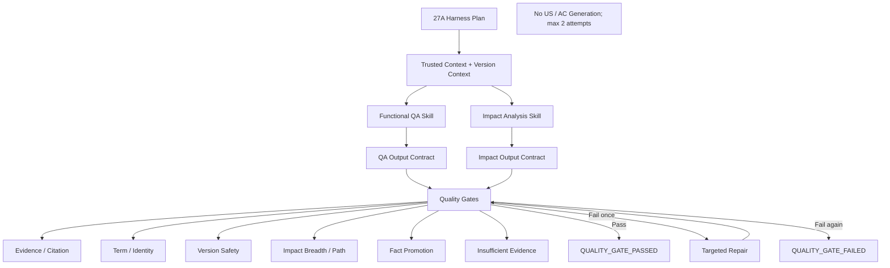

# Block 27B：功能点问答与关联影响分析质量门禁

你现在继续在本地 LightRAG 代码仓中工作。

本轮任务：**Block 27B，Functional QA & Impact Analysis Quality Gate**。

本轮只聚焦两项能力：

```text
1. 功能点问答召回与回答准确性
2. 关联影响分析的完整性、证据性和版本安全性
```

明确排除：

```text
US_GENERATION
AC_GENERATION
完整高阶方案正文生成
完整详细方案正文生成
UX 图生成
Code Agent / OpenCode 调用
```

US / AC 可以继续作为 Skill Registry 中的外部下游能力，但必须保持：

```text
capability_status = EXTERNAL / OUT_OF_SCOPE
executed = false
```

不得生成、不得评测、不得作为本轮准出条件。

---

## 一、前置状态

以下能力已通过：

### 知识编译与治理

- 统一原文证据链；
- DSL 产品功能语义编译；
- PFSS / Generic / Issue 三空间隔离；
- Persistent Metadata Sidecar；
- 文档版本增量更新、删除、重建和 Saga Compensation；
- 术语归一 V2；
- Stable Semantic Identity；
- Entity Type Resolver；
- Generic NER 类型阻断；
- Version-aware Retrieval；
- Version Issue Index。

### 检索与 Harness

- 四路混合检索；
- Trust-aware Rank Fusion；
- Trusted Context Pack；
- 三类需求场景 Router；
- Skill Registry；
- Skill DAG；
- Harness State Machine；
- Capability Gap；
- 27A 已通过。

本轮必须复用已有能力，不得重新实现平行的：

```text
术语归一
类型判断
版本判断
检索融合
场景路由
```

---

## 二、最高优先级原则：所有交易类模块通用，绝对禁止写死

本轮以及后续运行时代码必须适用于所有财经 IT 交易模块。

以下词只允许出现在：

```text
Fixture
Manifest
Gold Case
源文档
报告示例
```

不得出现在运行时逻辑判断中：

```text
可接受银行
询价
外汇
信用证
账户
现金池
资金计划
付款
融资
票据
结算
授信
风险
Bank Status
Swift Code
Current Handler
Transfer To
```

禁止：

```python
if module_code == "LCAB":
    ...

if "询价" in query:
    ...

if entity_name == "Bank Status":
    ...

if module_code in {"FX", "PAYMENT"}:
    required_dimensions = ...
```

新增一个交易模块时，只允许新增：

```text
文档
Manifest
Term Registry
Domain / Feature 配置
Gold / Silver Cases
```

不得修改：

```text
QA Gate
Impact Gate
Harness Loop
Ranking
版本策略
类型策略
```

---

## 三、Harness 在本轮的真实定义

本轮 Harness 不是一个 Prompt。

严格定义：

```text
Harness
=
Trusted Context Contract
+ Skill Execution Contract
+ Output Schema
+ Deterministic Quality Gates
+ Targeted Repair Loop
+ State Transition
+ Evidence / Version / Issue Constraints
+ Audit Trace
```

本轮执行的实际 Skill 仅包括：

```text
FUNCTIONAL_QA
IMPACT_ANALYSIS
TRUSTED_KNOWLEDGE_RETRIEVAL
VERSION_ANALYSIS
EVIDENCE_CHECK
TERM_TYPE_CHECK
FINAL_QUALITY_GATE
```

以下 Skill 必须明确不执行：

```text
US_GENERATION
AC_GENERATION
UX_DESIGN
FULL_SOLUTION_DOCUMENT_GENERATION
CODE_CONTEXT_HANDOFF
```

---

## 四、本轮目标

实现：

```text
1. Functional QA Output Contract
2. Impact Analysis Output Contract
3. Evidence / Citation Gate
4. Term / Identity Consistency Gate
5. Version Safety Gate
6. Impact Breadth / Path Gate
7. Uncertainty / Insufficient Evidence Gate
8. Generic / Issue / Candidate Fact Promotion Gate
9. Targeted Repair Loop
10. QA / Impact Evaluation Harness
11. 多模块泛化与反硬编码 Guard
12. 本地现有 US 回归套件
```

本轮要证明：

1. 功能点问答能够准确命中相关功能对象、关系和原文 Evidence；
2. 已确认中英文 alias 能召回同一语义对象；
3. 版本不确定时不会硬判当前规则；
4. 无 Evidence 的图路径不会成为确定事实；
5. Issue / Candidate / InfoOnly 不会被写成正式结论；
6. 影响分析能区分直接影响、间接影响和待确认影响；
7. 影响分析能覆盖实际相关的 Domain 和功能维度；
8. 不强迫每个需求机械覆盖全部 10 Domain；
9. 1→N 场景能识别多 Feature、多 Domain、多跳路径；
10. 1→1.x 场景不会无意义扩大影响范围，但会检查隐藏跨域风险；
11. 0→1 场景不会伪造存量关联；
12. 质量不通过时最多执行一次定向修正，不允许无限重试；
13. 输出可追溯到 sourceUsId / textUnitId / sourceSpan / textHash；
14. 所有交易模块使用同一套 Gate。

---

## 五、本轮严格边界

本轮允许：

- 使用 27A Harness Plan；
- 使用 26A Trusted Context Pack；
- 使用 25B Version Context；
- 使用当前全部本地 US / Gold / Silver Cases；
- 使用已有 Query LLM 或生成 Adapter 做一次受控回答；
- 使用已有 Impact Analysis Adapter；
- 实现结构化输出和质量门禁；
- 执行一次初始生成和最多一次定向修正；
- 生成评测报告。

本轮禁止：

1. 不修改正式 Upload API；
2. 不修改正式 Query API；
3. 不接 Live Harness Hook；
4. 不调用 Code Agent；
5. 不生成 US；
6. 不生成 AC；
7. 不生成完整方案 PPT；
8. 不生成 UX 图；
9. 不修改 PFSS / Generic Graph；
10. 不创建新的 Supersedes；
11. 不修改术语、类型、版本事实；
12. 不连接生产数据库或 Neo4j；
13. 不修改 LightRAG Core/API；
14. 不安装新依赖；
15. 不修改 `uv.lock / pyproject.toml / requirements`；
16. 不提前开始 Block 28A。

完成后必须满足：

```text
LIVE_UPLOAD_BEHAVIOR_CHANGED = false
LIVE_QUERY_BEHAVIOR_CHANGED = false
LIVE_HARNESS_HOOK_CONNECTED = false
US_GENERATION_EXECUTED = false
AC_GENERATION_EXECUTED = false
CODE_AGENT_CALLED = false
KNOWLEDGE_STORAGE_WRITES_EXECUTED = false
NEW_SUPERSEDES_CREATED = false
PRODUCTION_DATABASE_CONNECTED = false
NEO4J_CONNECTED = false
LIGHTRAG_CORE_MODIFIED = false
```

---

## 六、防止 Codex 原地打圈

必须严格遵守：

1. 只读取一次：
   - 27A Harness Contract；
   - 26A Trusted Context Pack；
   - 25B Version Context；
   - 当前 Business QA / Impact Analysis Adapter；
   - 当前本地 Case Inventory。
2. 不重新分析上传链；
3. 不重新执行 26B 全量 A/B；
4. 不重新实现 Retrieval；
5. 不全仓反复 `rg/find`；
6. 每个目标文件最多完整读取一次；
7. 不安装依赖；
8. 每个 Case 最多：
   - 1 次初始执行；
   - 1 次定向修正；
9. 不允许第三次生成；
10. 不允许通过扩大 Prompt 无限补内容；
11. 不允许修改 Gold 让结果通过；
12. 不允许为某个模块临时加规则；
13. 同一测试命令只允许一次定向修复后重跑；
14. 达到准出后立即停止。

---

## 七、建议新增文件

建议新增：

```text
lightrag_ext/us_dsl/design_quality_types.py
lightrag_ext/us_dsl/functional_qa_contract.py
lightrag_ext/us_dsl/impact_analysis_contract.py
lightrag_ext/us_dsl/functional_qa_executor.py
lightrag_ext/us_dsl/impact_analysis_executor.py
lightrag_ext/us_dsl/evidence_citation_gate.py
lightrag_ext/us_dsl/term_identity_gate.py
lightrag_ext/us_dsl/version_safety_gate.py
lightrag_ext/us_dsl/impact_breadth_gate.py
lightrag_ext/us_dsl/fact_promotion_gate.py
lightrag_ext/us_dsl/insufficient_evidence_gate.py
lightrag_ext/us_dsl/targeted_repair_planner.py
lightrag_ext/us_dsl/design_output_quality_harness.py
lightrag_ext/us_dsl/design_quality_generalization_guard.py
lightrag_ext/us_dsl/scripts/run_qa_impact_quality_gate.py

lightrag_ext/us_dsl/tests/test_functional_qa_contract.py
lightrag_ext/us_dsl/tests/test_impact_analysis_contract.py
lightrag_ext/us_dsl/tests/test_evidence_citation_gate.py
lightrag_ext/us_dsl/tests/test_term_identity_gate.py
lightrag_ext/us_dsl/tests/test_version_safety_gate.py
lightrag_ext/us_dsl/tests/test_impact_breadth_gate.py
lightrag_ext/us_dsl/tests/test_fact_promotion_gate.py
lightrag_ext/us_dsl/tests/test_insufficient_evidence_gate.py
lightrag_ext/us_dsl/tests/test_targeted_repair_planner.py
lightrag_ext/us_dsl/tests/test_design_output_quality_harness.py
lightrag_ext/us_dsl/tests/test_design_quality_generalization.py
lightrag_ext/us_dsl/tests/test_design_quality_guards.py
```

允许按需小改：

```text
harness_types.py
skill_registry.py
harness_executor.py
trusted_context_builder.py
version_context_builder.py
impact_analysis_types.py
graph_retrieval_types.py
```

只能为 typed Adapter、输出 Contract 和 Gate 结果做小改。

禁止修改：

```text
lightrag/lightrag.py
lightrag/operate.py
lightrag/prompt.py
lightrag/api/*
document_routes.py
正式 upload/query pipeline
LightRAG storage implementations
```

---

## 八、功能点问答输出 Contract

新增 `FunctionalQAResult`。

字段：

```text
query
scenario
answer_status
direct_answer
supporting_facts
supporting_relations
supporting_paths
source_citations
version_context
term_identity_context
issues_and_warnings
open_questions
excluded_claims
safe_for_business_use
quality_gate_result
execution_trace
```

### AnswerStatus

```text
ANSWERED_WITH_CONFIRMED_EVIDENCE
ANSWERED_WITH_VERSION_WARNING
TEXT_ONLY_EVIDENCE
INSUFFICIENT_EVIDENCE
CONFLICTING_EVIDENCE
BLOCKED_BY_UNSAFE_CONTEXT
```

### SupportingFact

字段：

```text
fact_id
subject_id
predicate
object_id_or_value
fact_text
trust_tier
version_status
evidence_refs
certainty
```

### Citation

必须至少包含：

```text
document_id
document_version_id
source_us_id
text_unit_id
source_span
text_hash
evidence_excerpt
```

### 问答原则

#### 有确定证据

```text
可直接回答
必须给 Evidence
```

#### 有版本风险

```text
回答历史事实或候选
不得声称当前规则已确认
必须给版本警告
```

#### 仅 Text Evidence

```text
可输出原文支持的答案
不得伪造图关系
```

#### Evidence 不足

```text
明确 insufficient evidence
输出需要补充的文档或澄清问题
```

---

## 九、关联影响分析输出 Contract

新增 `ImpactAnalysisResult`。

字段：

```text
requirement
scenario
primary_change_targets
direct_impacts
indirect_impacts
tentative_impacts
excluded_candidates
domain_coverage
feature_coverage
version_context
source_citations
issues_and_warnings
open_questions
test_scope_hints
safe_for_business_use
quality_gate_result
execution_trace
```

### ImpactItem

字段：

```text
impact_id
affected_object_id
affected_object_name
affected_object_type
domain_code
feature_key
impact_type
impact_level
impact_path
relation_types
evidence_refs
version_status
certainty
risk_level
reason
requires_review
```

### ImpactLevel

```text
DIRECT
INDIRECT
TENTATIVE
```

### Certainty

```text
CONFIRMED
SUPPORTED
POSSIBLE
UNCONFIRMED
```

### 必须区分

```text
确定影响
可能影响
待确认影响
```

不得把所有图邻居都列为影响。

---

## 十、影响维度模型

复用 10 Domains：

```text
MasterData
Workflow
Ledger
RuleManagement
MonitoringReport
Integration
Configuration
AccessAudit
DataMigrationInitialization
Other
```

### 重要原则

不得要求每个需求机械覆盖全部 10 Domain。

必须先识别：

```text
relevant_domains
required_dimensions
optional_dimensions
not_applicable_dimensions
```

### 通用设计维度

可映射到 Domain：

```text
页面 / 菜单 / 查询 / 列表 / 导出
字段 / 枚举 / 状态
业务规则
流程 / 待办 / 审批
接口 / MQ / 回调
台账 / 历史记录
权限 / 数据范围
审计 / 操作日志
迁移 / 初始化
幂等 / 防重 / 超时 / 异常 / 回滚
测试范围
```

这些维度必须配置化，不得按模块决定。

---

## 十一、三类场景下的质量要求

### ZERO_TO_ONE

重点检查：

```text
不得伪造现有 Feature 或历史规则
必须区分已知事实、设计假设、待确认项
Impact Analysis 应以相邻能力、外部约束和潜在集成为主
```

不得因图谱无路径而判失败。

### ONE_TO_MANY

重点检查：

```text
Primary Change Target 明确
至少检查直接和间接路径
跨 Feature / Domain 覆盖
版本冲突
Evidence 完整
Relevant Dimension Coverage
```

这是本轮重点场景。

### ONE_TO_ONE_X

重点检查：

```text
局部影响是否充分
是否存在隐藏跨 Domain 风险
不得无意义扩散到所有领域
代码级影响不可用时必须声明边界
```

---

## 十二、Evidence / Citation Gate

新增 `evidence_citation_gate.py`。

必须验证：

```text
引用对象存在
sourceUsId / textUnitId 可回查
sourceSpan 合法
textHash 匹配
Evidence excerpt 与原文一致
图关系 Evidence 覆盖
版本结论 Evidence 覆盖
```

### 阻断

```text
INVALID_CITATION
MISSING_CITATION
CITATION_HASH_MISMATCH
UNSUPPORTED_FACT
UNSUPPORTED_PATH
```

准出要求：

```text
invalid_citation_count = 0
unsupported_fact_count = 0
unsupported_factual_path_count = 0
```

---

## 十三、Term / Identity Gate

新增 `term_identity_gate.py`。

必须验证：

```text
Confirmed aliases 指向同一 stable identity
Candidate alias 不作为确定身份
Generic Term 无 scope 不被强行合并
回答中的显示名称与 canonical identity 可回查
Impact 去重基于 semantic ID，不基于显示名
```

必须识别：

```text
term_identity_split_count
incorrect_term_merge_count
candidate_alias_as_fact_count
```

准出要求：

```text
incorrect_term_merge_count = 0
candidate_alias_as_fact_count = 0
```

---

## 十四、Version Safety Gate

新增 `version_safety_gate.py`。

验证：

```text
当前规则回答是否真的 CONFIRMED_CURRENT
Historical 是否被错误当 Current
Multiple latest/current 是否被提示
VersionReviewRequired 是否可见
Supersedes 是否有显式 Evidence
```

阻断：

```text
VERSION_HARD_JUDGMENT
HISTORICAL_AS_CURRENT
MISSING_VERSION_WARNING
UNSUPPORTED_SUPERSEDES
```

准出要求：

```text
version_hard_judgment_error_count = 0
historical_as_current_count = 0
unsupported_supersedes_count = 0
```

---

## 十五、Fact Promotion Gate

新增 `fact_promotion_gate.py`。

以下对象不得成为确定事实：

```text
Issue
Candidate
InfoOnly
MissingEvidence
InvalidType
InvalidRelation
Generic-only candidate
VersionReviewRequired
```

统计：

```text
issue_as_fact_count
candidate_as_confirmed_count
info_only_as_fact_count
generic_only_as_confirmed_count
```

准出要求全部为 0。

---

## 十六、Impact Breadth / Path Gate

新增 `impact_breadth_gate.py`。

检查：

```text
Primary Change Target 是否明确
直接影响是否有一跳关系
间接影响是否有多跳路径
每条 factual path 是否 Evidence 完整
重复 Impact 是否去重
Relevant Domain 是否覆盖
必要维度是否遗漏
无关 Domain 是否过度扩展
```

### 1→N Gate

必须输出：

```text
required_dimension_coverage
direct_impact_recall
indirect_impact_recall
evidence_backed_path_ratio
false_positive_impact_count
duplicate_impact_count
```

不得通过“列更多影响”提高表面完整性。

---

## 十七、Insufficient Evidence Gate

新增 `insufficient_evidence_gate.py`。

若：

```text
没有直接 Evidence
只有 Generic Graph
只有 Candidate / Issue
版本无法确认
关键路径缺 Evidence
```

必须选择：

```text
INSUFFICIENT_EVIDENCE
CONFLICTING_EVIDENCE
ANSWERED_WITH_VERSION_WARNING
```

不得强行完整回答。

---

## 十八、定向修正机制

新增 `targeted_repair_planner.py`。

### 最多两次执行

```text
Attempt 1：初始输出
Gate 检查
Attempt 2：只针对失败 Gate 定向修正
结束
```

禁止第三轮。

### RepairAction

```text
RETRIEVE_MISSING_EVIDENCE
REMOVE_UNSUPPORTED_CLAIM
DOWNGRADE_TO_TENTATIVE
ADD_VERSION_WARNING
FIX_CITATION
MERGE_DUPLICATE_IMPACT
REMOVE_IRRELEVANT_IMPACT
ADD_MISSING_RELEVANT_DIMENSION
RETURN_INSUFFICIENT_EVIDENCE
```

### 禁止

```text
重新跑完整链
扩大所有 Top-K
增加模块特例
修改 Ontology / Term / Version 配置
```

若一次修正仍不通过：

```text
final_status = QUALITY_GATE_FAILED
```

不得继续。

---

## 十九、执行状态

扩展 Harness State Machine：

```text
OUTPUT_DRAFTED
QUALITY_CHECKING
REPAIR_PLANNED
REPAIR_EXECUTING
QUALITY_GATE_PASSED
QUALITY_GATE_FAILED
```

本轮允许最终状态：

```text
QUALITY_GATE_PASSED
QUALITY_GATE_FAILED
INSUFFICIENT_EVIDENCE
```

不得使用：

```text
US_APPROVED
SOLUTION_APPROVED
```

---

## 二十、本地现有 US 回归

优先读取：

```text
artifacts/block_26b_local_fullflow/
```

若存在：

```text
gold_case_set.json
silver_case_set.json
negative_quality_case_set.json
version_stress_case_set.json
```

则复用。

若不存在：

- 使用当前已有 QA / Impact fixture；
- 不重新全盘发现文件；
- 不阻塞功能开发；
- 报告：
  ```text
  LOCAL_FULLFLOW_CASES_REUSED = false
  ```

### 必须区分

```text
Gold-backed
Silver Regression
Negative Quality
Version Stress
```

不得把 Silver 当 Gold。

---

## 二十一、评测指标

### Functional QA

```text
Evidence Recall@K
Answer Supporting Fact Precision
Citation Validity
Source Span Accuracy
Term Identity Match
Version Behavior Accuracy
Unsupported Claim Count
Insufficient Evidence Detection
Directness / Relevance
```

### Impact Analysis

```text
Primary Change Target Accuracy
Direct Impact Recall
Indirect Impact Recall
Required Dimension Coverage
Evidence-backed Path Ratio
False-positive Impact Count
Duplicate Impact Count
Version Warning Accuracy
Tentative / Confirmed Classification Accuracy
Cross-domain Coverage
```

### Safety

```text
Invalid Citation
Unsupported Fact
Unsupported Factual Path
Issue as Fact
Candidate as Confirmed
InfoOnly as Fact
Generic-only as Confirmed
Version Hard Judgment
Historical as Current
Generic NER Fact Hit
```

---

## 二十二、准出阈值

阈值集中配置，不得模块化写死。

建议默认：

```text
invalid_citation_count = 0
unsupported_fact_count = 0
unsupported_factual_path_count = 0
issue_as_fact_count = 0
candidate_as_confirmed_count = 0
info_only_as_fact_count = 0
generic_only_as_confirmed_count = 0
version_hard_judgment_error_count = 0
historical_as_current_count = 0
generic_ner_fact_hit_count = 0

gold_qa_evidence_recall >= 0.90
gold_impact_required_dimension_coverage >= 0.85
gold_evidence_backed_path_ratio >= 0.90
one_to_many_degraded_count = 0
```

若 Gold 不足：

```text
LOCAL_QUALITY_PASS_WITH_GAPS
```

但所有 Safety Gate 仍必须通过。

---

## 二十三、多模块和反硬编码 Guard

新增 `design_quality_generalization_guard.py`。

必须扫描运行时代码，输出：

```text
runtime_module_branch_count
entity_name_quality_rule_count
module_specific_dimension_rule_count
fixture_runtime_coupling_count
module_specific_threshold_count
```

准出要求全部为 0。

Holdout / 未知模块 fixture 必须使用同一 Gate。

---

## 二十四、测试 Fixtures

至少包含：

### A. Functional QA：明确证据

预期：

```text
ANSWERED_WITH_CONFIRMED_EVIDENCE
```

### B. Functional QA：版本冲突

预期：

```text
ANSWERED_WITH_VERSION_WARNING
不得硬判当前
```

### C. Functional QA：Text-only

预期：

```text
TEXT_ONLY_EVIDENCE
不得伪造关系
```

### D. Functional QA：证据不足

预期：

```text
INSUFFICIENT_EVIDENCE
```

### E. 1→N Impact

一个主变更点影响多个 Feature / Domain。

预期：

```text
Direct / Indirect / Tentative 分层
```

### F. 1→1.x Impact

局部影响清晰。

预期：

```text
不无意义扩展
隐藏跨域风险可提示
```

### G. 0→1

预期：

```text
不伪造存量关联
```

### H. 术语 alias

中英文 confirmed alias。

预期：

```text
同一 stable identity
```

### I. Generic NER / Issue

预期：

```text
不进入事实
```

### J. 无 Evidence 路径

预期：

```text
TENTATIVE 或排除
```

---

## 二十五、测试要求

至少覆盖：

### Contracts

1. `test_functional_qa_result_contract`
2. `test_impact_analysis_result_contract`
3. `test_qa_and_impact_contracts_require_execution_trace`
4. `test_us_and_ac_generation_are_out_of_scope`

### QA

5. `test_confirmed_evidence_question_is_answerable`
6. `test_version_conflict_question_requires_warning`
7. `test_text_only_question_does_not_invent_graph_relation`
8. `test_insufficient_evidence_question_is_not_forced`
9. `test_answer_contains_valid_source_citations`
10. `test_answer_uses_canonical_identity_with_original_term_trace`

### Impact

11. `test_one_to_many_separates_direct_indirect_tentative`
12. `test_one_to_many_checks_relevant_domains`
13. `test_one_to_one_x_does_not_expand_all_domains`
14. `test_zero_to_one_does_not_invent_existing_impact`
15. `test_impact_paths_have_evidence`
16. `test_duplicate_impacts_are_merged_by_semantic_id`
17. `test_irrelevant_impacts_are_rejected`
18. `test_missing_relevant_dimension_is_detected`

### Gates

19. `test_invalid_citation_is_blocked`
20. `test_unsupported_fact_is_blocked`
21. `test_unsupported_path_is_not_factual`
22. `test_candidate_alias_is_not_confirmed_fact`
23. `test_issue_is_not_fact`
24. `test_info_only_is_not_fact`
25. `test_generic_only_is_not_confirmed_fact`
26. `test_historical_rule_is_not_current`
27. `test_version_hard_judgment_is_blocked`
28. `test_generic_ner_fact_is_blocked`

### Repair

29. `test_repair_planner_targets_failed_gate_only`
30. `test_repair_removes_unsupported_claim`
31. `test_repair_adds_version_warning`
32. `test_repair_downgrades_unsupported_impact`
33. `test_max_attempt_count_is_two`
34. `test_second_failure_stops_without_loop`

### Generalization / Safety

35. `test_runtime_has_no_module_specific_quality_rule`
36. `test_runtime_has_no_entity_name_specific_gate`
37. `test_holdout_module_uses_same_gate`
38. `test_no_us_or_ac_generation`
39. `test_no_code_agent_call`
40. `test_no_knowledge_storage_write`
41. `test_no_live_upload_query_harness_change`
42. `test_report_is_serializable`
43. `test_no_lightrag_core_modified`
44. `test_cleanup_removes_workspaces`

---

## 二十六、输出目录

```text
artifacts/block_27b_qa_impact_quality_gate/
```

必须生成：

```text
qa_impact_quality_report.json
qa_impact_quality_report.md
functional_qa_results.json
impact_analysis_results.json
evidence_citation_gate_report.json
term_identity_gate_report.json
version_safety_gate_report.json
impact_breadth_gate_report.json
fact_promotion_gate_report.json
insufficient_evidence_report.json
repair_plan_report.json
repair_execution_report.json
quality_state_transition_log.json
gold_metrics.json
silver_metrics.json
negative_quality_metrics.json
version_stress_metrics.json
one_to_many_metrics.json
one_to_one_x_metrics.json
zero_to_one_metrics.json
design_quality_anti_hardcode_report.json
capability_scope_report.json
safety_check.json
cleanup_report.json
architecture.mmd
command_log.txt
git_status_before.txt
git_status_after.txt
core_diff_check.txt
unresolved_questions.md
workspaces/
```

`capability_scope_report.json` 必须明确：

```json
{
  "functional_qa_in_scope": true,
  "impact_analysis_in_scope": true,
  "us_generation_in_scope": false,
  "ac_generation_in_scope": false,
  "full_solution_generation_in_scope": false,
  "ux_generation_in_scope": false,
  "code_agent_in_scope": false
}
```

---

## 二十七、架构图

`architecture.mmd`：



---

## 二十八、默认测试命令

```bash
mkdir -p artifacts/block_27b_qa_impact_quality_gate

git status --short \
  > artifacts/block_27b_qa_impact_quality_gate/git_status_before.txt
```

```bash
.venv/bin/python - <<'PY'
import subprocess
import sys

tests = [
    "lightrag_ext/us_dsl/tests/test_functional_qa_contract.py",
    "lightrag_ext/us_dsl/tests/test_impact_analysis_contract.py",
    "lightrag_ext/us_dsl/tests/test_evidence_citation_gate.py",
    "lightrag_ext/us_dsl/tests/test_term_identity_gate.py",
    "lightrag_ext/us_dsl/tests/test_version_safety_gate.py",
    "lightrag_ext/us_dsl/tests/test_impact_breadth_gate.py",
    "lightrag_ext/us_dsl/tests/test_fact_promotion_gate.py",
    "lightrag_ext/us_dsl/tests/test_insufficient_evidence_gate.py",
    "lightrag_ext/us_dsl/tests/test_targeted_repair_planner.py",
    "lightrag_ext/us_dsl/tests/test_design_output_quality_harness.py",
    "lightrag_ext/us_dsl/tests/test_design_quality_generalization.py",
    "lightrag_ext/us_dsl/tests/test_design_quality_guards.py",
]

commands = [
    [".venv/bin/python", "-m", "pytest", test, "-q"]
    for test in tests
] + [
    [".venv/bin/python", "-m", "compileall", "-q", "lightrag_ext"],
    [".venv/bin/python", "-m", "py_compile", "lightrag/prompt.py"],
    [".venv/bin/python", "-m", "ruff", "check",
     "lightrag_ext", "lightrag/prompt.py"],
]

for command in commands:
    print("RUN:", " ".join(command), flush=True)
    try:
        result = subprocess.run(command, timeout=300)
    except subprocess.TimeoutExpired:
        print("TIMEOUT:", " ".join(command))
        sys.exit(124)

    if result.returncode != 0:
        sys.exit(result.returncode)
PY
```

---

## 二十九、本地质量 Gate Smoke

默认使用现有本地 Case：

```bash
.venv/bin/python -m \
  lightrag_ext.us_dsl.scripts.run_qa_impact_quality_gate \
  --output-dir artifacts/block_27b_qa_impact_quality_gate \
  --reuse-local-fullflow-cases \
  --all-scenarios \
  --max-attempts 2 \
  --anti-hardcode-check \
  --cleanup
```

若显式使用真实 Query LLM：

```text
LIGHTRAG_ENABLE_REAL_QA_IMPACT_QUALITY_GATE=1
```

必须使用当前冻结模型和 Prompt，不得现场调参。

---

## 三十、安全检查

`safety_check.json` 必须包含：

```json
{
  "live_upload_behavior_changed": false,
  "live_query_behavior_changed": false,
  "live_harness_hook_connected": false,
  "us_generation_executed": false,
  "ac_generation_executed": false,
  "full_solution_document_generated": false,
  "ux_generated": false,
  "code_agent_called": false,
  "knowledge_storage_writes_executed": false,
  "new_supersedes_created": false,
  "runtime_module_branch_count": 0,
  "entity_name_quality_rule_count": 0,
  "module_specific_dimension_rule_count": 0,
  "production_database_connected": false,
  "neo4j_connected": false,
  "lightrag_core_modified": false
}
```

Core 检查：

```bash
git diff --name-only -- \
  lightrag/lightrag.py \
  lightrag/operate.py \
  lightrag/prompt.py \
  lightrag/api \
  > artifacts/block_27b_qa_impact_quality_gate/core_diff_check.txt
```

---

## 三十一、准出标准

通过条件：

1. Functional QA Contract 已实现；
2. Impact Analysis Contract 已实现；
3. Evidence / Citation Gate 已实现；
4. Term Identity Gate 已实现；
5. Version Safety Gate 已实现；
6. Impact Breadth / Path Gate 已实现；
7. Fact Promotion Gate 已实现；
8. Insufficient Evidence Gate 已实现；
9. Targeted Repair 最多 1 次；
10. 功能问答引用有效；
11. 无 Evidence 结论被阻断；
12. 版本冲突不硬判；
13. Text-only 不伪造图关系；
14. Alias Identity 正确；
15. 1→N Direct / Indirect / Tentative 分层；
16. Relevant Domain 覆盖，无机械全域扩散；
17. 1→1.x 不无意义扩大；
18. 0→1 不伪造历史关联；
19. Issue / Candidate / InfoOnly / Generic-only 不作为事实；
20. invalid citation = 0；
21. unsupported fact = 0；
22. unsupported factual path = 0；
23. version hard judgment error = 0；
24. historical as current = 0；
25. generic NER fact hit = 0；
26. Gold QA Evidence Recall 达阈值，或 Gold 不足时明确 Pass With Gaps；
27. 1→N required dimension coverage 达阈值；
28. 运行时代码无模块硬编码；
29. US / AC 生成未执行；
30. 未调用 Code Agent；
31. 未写知识存储；
32. 未改 Live Pipeline；
33. 未连接生产数据库或 Neo4j；
34. 未修改 LightRAG Core/API；
35. 测试和静态检查全部通过；
36. artifacts 完整；
37. cleanup 通过。

不通过条件：

1. 本轮仍生成或评测 US；
2. 以更长 Prompt 代替 Harness Gate；
3. 无 Evidence 的结论通过；
4. VersionReviewRequired 被隐藏；
5. 影响分析简单罗列所有 Domain；
6. 为某个模块写影响维度特例；
7. 修正超过一次；
8. 第二次失败后继续循环；
9. 修改 Gold；
10. 修改 LightRAG Core；
11. 测试失败；
12. cleanup 失败。

---

## 三十二、完成后只输出

```text
Block: 27B

Scope:
- functional_qa_in_scope:
- impact_analysis_in_scope:
- us_generation_in_scope:
- ac_generation_in_scope:
- code_agent_in_scope:

Functional QA:
- case_count:
- answered_with_confirmed_evidence_count:
- answered_with_version_warning_count:
- text_only_evidence_count:
- insufficient_evidence_count:
- evidence_recall:
- citation_validity_rate:
- source_span_accuracy:
- unsupported_fact_count:
- version_hard_judgment_error_count:
- incorrect_term_merge_count:

Impact Analysis:
- case_count:
- one_to_many_case_count:
- direct_impact_recall:
- indirect_impact_recall:
- required_dimension_coverage:
- evidence_backed_path_ratio:
- tentative_impact_count:
- false_positive_impact_count:
- duplicate_impact_count:
- one_to_many_degraded_count:

Fact safety:
- invalid_citation_count:
- unsupported_factual_path_count:
- issue_as_fact_count:
- candidate_as_confirmed_count:
- info_only_as_fact_count:
- generic_only_as_confirmed_count:
- generic_ner_fact_hit_count:
- historical_as_current_count:

Repair:
- initial_fail_count:
- repair_planned_count:
- repair_success_count:
- second_failure_count:
- max_attempts_observed:

Generalization:
- runtime_module_branch_count:
- entity_name_quality_rule_count:
- module_specific_dimension_rule_count:
- holdout_policy_passed:
- anti_hardcode_passed:

Safety:
- live_upload_behavior_changed:
- live_query_behavior_changed:
- live_harness_hook_connected:
- us_generation_executed:
- ac_generation_executed:
- code_agent_called:
- knowledge_storage_writes_executed:
- production_database_connected:
- neo4j_connected:
- cleanup_passed:
- core_modified_in_this_round:

Tests:
- collected_count:
- passed_count:
- failed_count:
- compileall:
- py_compile:
- ruff:

Final:
- overall_status:
- failed_gates:
- recommended_next_block:

Artifacts:
- artifacts/block_27b_qa_impact_quality_gate
```

只有全部 Safety Gate 通过且核心质量达标时：

```text
overall_status = PASS
或 PASS_WITH_GAPS（仅因 Gold 数量不足）

recommended_next_block = Block 28A
```

完成后立即停止。

---

## 三十三、特别提醒

本轮只验证：

> **功能点问答是否准确、可追溯、版本安全；关联影响分析是否全面、分层、证据充分且不过度扩散。**

本轮不负责：

> **US 生成、AC 生成、UX 图或完整方案文档。**

下一步才是：

> **Block 28A：本地统一完整链路整合与端到端运行。**
