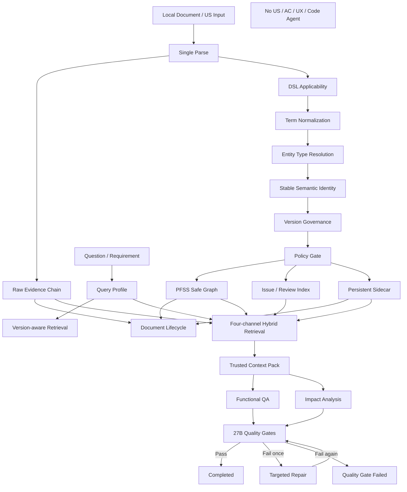

# Block 28A：本地统一完整链路整合与端到端运行

你现在继续在本地 LightRAG 代码仓中工作。

本轮任务：**Block 28A，Local Unified End-to-End Integration & Full-flow Execution**。

本轮目标不是再新增一套算法，而是把此前已经通过的所有模块真正串成一条统一、可运行、可追踪、可回滚的本地完整链路。

本轮完整链路必须覆盖：

```text
统一文档入口
→ 单次解析
→ 原文证据链
→ DSL 适用性判断
→ DSL 语义编译
→ 术语归一
→ 实体类型解析
→ 版本治理
→ Policy Gate
→ PFSS / Issue / Sidecar
→ 文档生命周期与增量治理
→ Query Profile
→ 版本感知检索
→ 四路混合检索
→ Trusted Context Pack
→ 功能点问答
→ 关联影响分析
→ 27B 质量门禁
```

明确排除：

```text
US_GENERATION
AC_GENERATION
完整高阶方案正文生成
完整详细方案正文生成
UX 图生成
Code Agent / OpenCode 调用
生产环境接入
```

---

## 一、前置状态

以下能力已经分别通过：

### Block 24 系列

- 实际入口与运行基线；
- 真实 Embedding / LLM / Storage Smoke；
- Shadow Router；
- 统一原文证据链；
- PFSS / Generic / Issue 三空间隔离；
- Persistent Sidecar；
- 文档版本增量更新、删除、重建；
- Saga / Compensation。

### Block 25 系列

- 术语归一 V2；
- Stable Semantic Identity；
- Entity Type Resolver；
- Generic NER 类型阻断；
- 多模块泛化和反硬编码；
- Version-aware Retrieval；
- Version Issue Index。

### Block 26 系列

- 四路混合检索；
- Trust-aware Fusion；
- Trusted Context Pack；
- 本地全部 US 全流程开发准出；
- 正式多模块生产 Gate 仍可保持：
  ```text
  PENDING / BLOCKED_INPUT_SET
  ```

### Block 27 系列

- 三类需求场景 Router；
- Skills Registry；
- Skill DAG；
- Harness State Machine；
- 功能点问答质量门禁；
- 关联影响分析质量门禁；
- Evidence、术语、类型、版本和 Fact Promotion Gate；
- US / AC 已明确排除。

---

## 二、本轮核心目标

本轮必须证明：

1. 当前各 Block 不是孤立测试模块，而是可以组成一条完整运行链；
2. 同一文档只解析一次；
3. 原文证据链始终执行；
4. DSL_FULL / DSL_PARTIAL / RAW_ONLY / PARSE_FAILED 分支行为正确；
5. PFSS / Generic / Issue / Sidecar 空间不污染；
6. 术语归一和实体类型纠偏发生在稳定语义身份生成之前；
7. 版本治理和版本问题可被查询侧看见；
8. 文档增量更新后 Query 侧能读取新 Active Version；
9. 删除或 Rebuild 后 Query 结果与 Sidecar / PFSS 一致；
10. 功能点问答只使用可信 Context；
11. 关联影响分析区分直接、间接和待确认影响；
12. 27B 质量门禁在端到端链中实际执行；
13. 任一中间步骤失败时，不得继续伪造下游成功；
14. 整条链路有统一 Trace ID、Batch ID、Document ID、Version ID；
15. 整条链路没有任何具体交易模块和实体名称硬编码；
16. 本轮可使用当前本地全部 US，但不能把测试文件名逻辑带入生产运行时；
17. 本轮只在本地隔离环境执行；
18. 本轮完成后，才进入最后一个 Block 28B 工程收口和迁移包。

---

## 三、最高优先级原则：绝对禁止模块知识写死

本轮运行时代码必须支持所有财经 IT 交易类模块。

以下具体词只允许出现在：

```text
源文档
Manifest
Fixture
Gold / Silver Cases
报告示例
```

不得出现在运行时分支、评分、路由、类型、版本或融合逻辑中：

```text
可接受银行
询价
外汇
信用证
账户
现金池
资金计划
付款
融资
票据
结算
授信
风险
Bank Status
Swift Code
Current Handler
Transfer To
```

禁止：

```python
if module_code == "LCAB":
    ...

if "询价" in requirement:
    ...

if entity_name == "Bank Status":
    ...

if module_code in {"FX", "PAYMENT"}:
    ...
```

新增模块只能通过：

```text
文档
Manifest
术语表
Domain / Feature 配置
版本配置
Gold / Silver Cases
```

接入，不得修改 Python 运行逻辑。

---

## 四、本轮不是重新实现算法

本轮禁止重新实现以下能力：

```text
Term Normalization
Entity Type Resolution
Version Resolution
Hybrid Retrieval
Impact Analysis Gate
Functional QA Gate
Document Lifecycle
Sidecar Persistence
```

本轮必须通过 Adapter / Orchestrator 复用已有实现。

若发现接口不一致，只允许：

```text
增加 typed adapter
增加统一 protocol
增加字段转换
增加 execution trace
```

不得复制算法形成第二套实现。

---

## 五、统一 End-to-End Orchestrator

建议新增：

```text
lightrag_ext/us_dsl/unified_e2e_types.py
lightrag_ext/us_dsl/unified_e2e_orchestrator.py
lightrag_ext/us_dsl/unified_e2e_pipeline.py
lightrag_ext/us_dsl/unified_e2e_trace.py
lightrag_ext/us_dsl/unified_e2e_state_machine.py
lightrag_ext/us_dsl/unified_e2e_consistency_validator.py
lightrag_ext/us_dsl/unified_e2e_generalization_guard.py
lightrag_ext/us_dsl/scripts/run_unified_local_e2e.py
```

测试：

```text
lightrag_ext/us_dsl/tests/test_unified_e2e_orchestrator.py
lightrag_ext/us_dsl/tests/test_unified_e2e_ingestion.py
lightrag_ext/us_dsl/tests/test_unified_e2e_query.py
lightrag_ext/us_dsl/tests/test_unified_e2e_lifecycle.py
lightrag_ext/us_dsl/tests/test_unified_e2e_quality_gate.py
lightrag_ext/us_dsl/tests/test_unified_e2e_consistency.py
lightrag_ext/us_dsl/tests/test_unified_e2e_generalization.py
lightrag_ext/us_dsl/tests/test_unified_e2e_guards.py
```

---

## 六、统一输入协议

新增 `UnifiedE2ERequest`：

```text
run_id
trace_id
mode
document_inputs
query_inputs
requirement_inputs
evaluation_case_refs
artifact_root
workspace_root
use_real_embedding
use_real_llm
cleanup_after_run
enable_raw_baseline
enable_dsl_candidate
enable_lifecycle_scenarios
enable_functional_qa
enable_impact_analysis
enable_quality_gate
max_attempts
policy_versions
config_versions
```

### mode

```text
DRY_RUN
LOCAL_ISOLATED
LOCAL_REAL_MODELS
```

本轮不得支持：

```text
PRODUCTION
LIVE_UPLOAD
LIVE_QUERY
```

---

## 七、统一运行状态

新增 `UnifiedE2EState`：

```text
CREATED
PREFLIGHT_VALIDATED
DOCUMENTS_DISCOVERED
PARSING
RAW_EVIDENCE_INDEXED
ROUTED
DSL_COMPILED
SEMANTIC_BRANCH_WRITTEN
SIDECAR_PERSISTED
LIFECYCLE_VALIDATED
QUERY_CONTEXT_READY
FUNCTIONAL_QA_EXECUTED
IMPACT_ANALYSIS_EXECUTED
QUALITY_GATE_CHECKED
COMPLETED
COMPLETED_WITH_GAPS
FAILED
COMPENSATING
COMPENSATED
CLEANED_UP
```

### 状态约束

- 任一步失败不得跳到 `COMPLETED`；
- `DSL_PARTIAL` 可以进入 `COMPLETED_WITH_GAPS`；
- Evidence 不足可以进入：
  ```text
  COMPLETED_WITH_GAPS
  ```
  但问答/影响输出必须标记；
- 质量门禁失败：
  ```text
  FAILED
  或 COMPLETED_WITH_GAPS
  ```
  按策略明确处理；
- cleanup 后最终状态记录：
  ```text
  CLEANED_UP
  ```
  但必须保留前一业务状态。

---

## 八、统一 Trace Contract

整条链必须共享：

```text
trace_id
run_id
batch_id
document_id
document_version_id
source_us_id
text_unit_id
chunk_id
semantic_object_id
semantic_relation_id
version_group_key
graph_object_id
issue_id
query_id
quality_gate_id
```

每个组件不得自己重新生成不兼容 ID。

新增 `ExecutionTraceEvent`：

```text
event_id
trace_id
stage
component
operation
input_ids
output_ids
status
reason_code
started_at
completed_at
elapsed_ms
attempt_no
metadata
```

必须支持：

```text
从最终回答或 Impact Item
反查到 Context Candidate
再反查到 PFSS / Raw Evidence
再反查到 SourceTextUnit 和文档版本
```

---

## 九、统一 Preflight

正式执行前必须检查：

```text
1. 所需 artifacts / configs 存在
2. workspace 全新且隔离
3. Embedding dimension 一致
4. LLM 配置可用（若启用真实 LLM）
5. 不连接生产 storage
6. PFSS / Generic / Issue namespace 隔离
7. Term / Type / Version / Fusion policy version 固定
8. 模块硬编码 Guard 通过
9. US / AC Skills 仍为 OUT_OF_SCOPE
10. max_attempts <= 2
```

若任一关键项失败：

```text
BLOCKED_PREFLIGHT
```

不得进入写入。

---

## 十、统一 Ingestion Flow

每份文档严格按以下顺序：

```text
1. Unified Document Envelope
2. Single Parse
3. RawEvidenceChunk
4. SourceTextUnit
5. Chunk ↔ SourceTextUnit Mapping
6. Raw Evidence Index
7. DSL Applicability
8. Term Normalization
9. Entity Type Resolution
10. Stable Semantic Identity
11. Version Group / Version Issue
12. Policy Gate
13. PFSS Safe Payload
14. Issue Index
15. Sidecar Persistence
16. Lifecycle Registration
17. Readback Validation
```

不得：

```text
先写图再补 Evidence
先生成 ID 再做术语归一
先做版本组再做类型解析
同一文档解析两遍
```

---

## 十一、分支行为

### DSL_FULL

```text
Raw Evidence
+ 完整安全 PFSS
+ Sidecar
+ Version / Issue（非阻断 warning）
```

### DSL_PARTIAL

```text
Raw Evidence
+ 安全 PFSS 子集
+ Issue / Review Index
+ COMPLETED_WITH_GAPS
```

### RAW_ONLY

```text
Raw Evidence
+ Text-only Retrieval
+ 不写 PFSS
```

### PARSE_FAILED

```text
Failed Batch
+ 不写 Chunk / Vector / PFSS
```

---

## 十二、统一 Lifecycle Flow

本轮必须端到端执行以下生命周期场景：

### 1. Initial Ingestion

```text
V1 入库
```

### 2. New Version

```text
V1 → V2
```

验证：

```text
只处理 Delta
Active Version 切换
旧版本保留 Historical
未自动生成业务 Supersedes
```

### 3. Delete Version

验证：

```text
不自动恢复历史版本
共享对象不误删
Tombstone 保留
```

### 4. Rebuild

验证：

```text
恢复缺失 Raw / Vector / PFSS 投影
不调用 LLM 重抽
```

### 5. Failure Compensation

至少注入一次：

```text
PFSS 写入后、Sidecar Commit 前失败
```

验证：

```text
补偿恢复
无半成品
Active Version 不错乱
```

---

## 十三、统一 Query Flow

每个 Query 严格按以下顺序：

```text
1. Query Semantic Profile
2. Term Expansion
3. Domain / Feature Hints
4. Version Intent
5. Raw Text Retrieval
6. PFSS Entity / Relation / Path Retrieval
7. Generic Graph Retrieval（如启用）
8. Issue / Version / Sidecar Retrieval
9. Candidate Normalization
10. Cross-channel Dedup
11. Trust-aware Fusion
12. Evidence Path Validation
13. Fallback Decision
14. Trusted Context Pack
```

不得跳过 Trusted Context Pack 直接调用 LLM。

---

## 十四、功能点问答执行

本轮只允许：

```text
FUNCTIONAL_QA
```

输出必须符合 27B Contract。

必须检查：

```text
Evidence
Citation
Term Identity
Version Safety
Fact Promotion
Insufficient Evidence
```

### 修正轮次

最多：

```text
Attempt 1
Attempt 2（仅定向修正）
```

禁止第三轮。

---

## 十五、关联影响分析执行

本轮只允许：

```text
IMPACT_ANALYSIS
```

输出必须：

```text
Primary Change Target
Direct Impact
Indirect Impact
Tentative Impact
Relevant Domain Coverage
Evidence-backed Path
Version Warning
Open Questions
```

不得：

```text
机械列全部 10 Domain
把所有图邻居都当影响
```

---

## 十六、质量 Gate 必须作为真实链路步骤

不得只在测试结束后离线算分。

必须在运行时调用：

```text
EvidenceCitationGate
TermIdentityGate
VersionSafetyGate
ImpactBreadthGate
FactPromotionGate
InsufficientEvidenceGate
```

若 Gate 失败：

```text
生成 Targeted Repair Plan
最多修正 1 次
再次失败则停止
```

---

## 十七、US / AC / UX / 完整方案必须保持禁用

在 Skill Registry 和执行计划中：

```text
US_GENERATION = OUT_OF_SCOPE
AC_GENERATION = OUT_OF_SCOPE
UX_GENERATION = OUT_OF_SCOPE
FULL_SOLUTION_DOCUMENT = OUT_OF_SCOPE
CODE_AGENT = OUT_OF_SCOPE
```

本轮报告必须验证：

```text
us_generation_executed = false
ac_generation_executed = false
ux_generation_executed = false
code_agent_called = false
```

不得生成任何占位式 US 样例。

---

## 十八、本地全部 US 使用

优先读取：

```text
artifacts/block_26b_local_fullflow/local_document_inventory.json
artifacts/block_26b_local_fullflow/local_fullflow_manifest.json
```

若存在，直接复用，不重复全盘发现。

若不存在：

- 仅执行一次受限本地发现；
- 使用当前找到的全部有效 US；
- 不因缺正式多模块 Manifest 停止；
- 保留：
  ```text
  multi_module_production_gate_pending = true
  ```

---

## 十九、测试场景

至少执行：

### A. DSL_FULL 文档

验证完整 PFSS + QA + Impact。

### B. DSL_PARTIAL 文档

验证安全子集 + Issue + Version Warning。

### C. RAW_ONLY 文档

验证 Text-only QA，不能伪造图关系。

### D. Version Conflict

验证不硬判。

### E. Term Alias

验证中英文 alias 同一身份。

### F. Generic NER 错误类型

验证不入事实。

### G. 1→N 需求

验证直接、间接、待确认影响。

### H. 1→1.x 需求

验证局部范围且不机械扩散。

### I. 0→1 需求

验证不伪造存量关联。

### J. Lifecycle V1→V2→Delete→Rebuild

验证查询结果跟随 Active Version。

### K. Failure Compensation

验证无半完成状态。

---

## 二十、跨层一致性 Validator

新增 `unified_e2e_consistency_validator.py`。

必须检查：

```text
Document Registry Active Version
=
Raw Evidence Active Projection
=
PFSS Active Contribution
=
Sidecar Graph Mapping
=
Version Candidate Index
=
Hybrid Retrieval Candidate
```

还必须检查：

```text
每个 factual answer fact 有 Evidence
每个 factual impact path 有 Evidence
每个 graph relation endpoint 存在
每个 version warning 可回查 Issue
每个 canonical term 可回查 original term
每个 type resolution 可回查 original type
```

统计：

```text
cross_store_mismatch_count
orphan_chunk_count
orphan_vector_count
dangling_edge_count
orphan_sidecar_mapping_count
untraceable_fact_count
untraceable_impact_count
active_version_mismatch_count
```

准出要求全部为 0。

---

## 二十一、反硬编码总检查

新增：

```text
unified_e2e_generalization_guard.py
```

扫描 24~28A 运行时代码。

必须输出：

```text
runtime_module_branch_count
entity_name_specific_rule_count
module_specific_weight_count
module_specific_skill_count
fixture_runtime_coupling_count
file_name_controls_runtime_logic_count
```

准出要求全部为 0。

允许测试文件和报告包含模块示例。

---

## 二十二、防止 Codex 原地打圈

必须严格遵守：

1. 本轮只做集成，不新增业务算法；
2. 不重写已通过组件；
3. 不重新全盘扫描代码；
4. 每个 Adapter 只读取一次；
5. 不因单个 Case 失败现场修改策略；
6. 不修改 Gold；
7. 不修改术语、类型、版本或融合配置；
8. 每个 Case 最多两次执行；
9. 不反复跑全套挑最好结果；
10. 同一失败只允许一次定向修复和一次重跑；
11. 第二次仍失败则停止并报告；
12. 不开始 28B；
13. 达到准出后立即停止。

---

## 二十三、建议新增文件

```text
lightrag_ext/us_dsl/unified_e2e_types.py
lightrag_ext/us_dsl/unified_e2e_trace.py
lightrag_ext/us_dsl/unified_e2e_state_machine.py
lightrag_ext/us_dsl/unified_e2e_orchestrator.py
lightrag_ext/us_dsl/unified_e2e_pipeline.py
lightrag_ext/us_dsl/unified_e2e_consistency_validator.py
lightrag_ext/us_dsl/unified_e2e_generalization_guard.py
lightrag_ext/us_dsl/scripts/run_unified_local_e2e.py
```

测试：

```text
test_unified_e2e_orchestrator.py
test_unified_e2e_ingestion.py
test_unified_e2e_query.py
test_unified_e2e_lifecycle.py
test_unified_e2e_quality_gate.py
test_unified_e2e_consistency.py
test_unified_e2e_generalization.py
test_unified_e2e_guards.py
```

---

## 二十四、输出目录

```text
artifacts/block_28a_unified_local_e2e/
```

必须生成：

```text
unified_e2e_report.json
unified_e2e_report.md
preflight_report.json
document_inventory_snapshot.json
route_execution_report.json
raw_evidence_report.json
dsl_compile_report.json
term_resolution_report.json
entity_type_resolution_report.json
version_governance_report.json
pfss_issue_sidecar_report.json
lifecycle_execution_report.json
query_execution_report.json
trusted_context_report.json
functional_qa_report.json
impact_analysis_report.json
quality_gate_report.json
repair_report.json
cross_layer_consistency_report.json
execution_trace.json
state_transition_log.json
anti_hardcode_report.json
capability_scope_report.json
pending_production_gates.json
performance_report.json
safety_check.json
cleanup_report.json
architecture.mmd
command_log.txt
git_status_before.txt
git_status_after.txt
core_diff_check.txt
unresolved_questions.md
workspaces/
```

---

## 二十五、架构图

`architecture.mmd`：



---

## 二十六、默认测试命令

```bash
mkdir -p artifacts/block_28a_unified_local_e2e

git status --short \
  > artifacts/block_28a_unified_local_e2e/git_status_before.txt
```

```bash
.venv/bin/python - <<'PY'
import subprocess
import sys

tests = [
    "lightrag_ext/us_dsl/tests/test_unified_e2e_orchestrator.py",
    "lightrag_ext/us_dsl/tests/test_unified_e2e_ingestion.py",
    "lightrag_ext/us_dsl/tests/test_unified_e2e_query.py",
    "lightrag_ext/us_dsl/tests/test_unified_e2e_lifecycle.py",
    "lightrag_ext/us_dsl/tests/test_unified_e2e_quality_gate.py",
    "lightrag_ext/us_dsl/tests/test_unified_e2e_consistency.py",
    "lightrag_ext/us_dsl/tests/test_unified_e2e_generalization.py",
    "lightrag_ext/us_dsl/tests/test_unified_e2e_guards.py",
]

commands = [
    [".venv/bin/python", "-m", "pytest", test, "-q"]
    for test in tests
] + [
    [".venv/bin/python", "-m", "compileall", "-q", "lightrag_ext"],
    [".venv/bin/python", "-m", "py_compile", "lightrag/prompt.py"],
    [".venv/bin/python", "-m", "ruff", "check",
     "lightrag_ext", "lightrag/prompt.py"],
]

for command in commands:
    print("RUN:", " ".join(command), flush=True)
    try:
        result = subprocess.run(command, timeout=300)
    except subprocess.TimeoutExpired:
        print("TIMEOUT:", " ".join(command))
        sys.exit(124)

    if result.returncode != 0:
        sys.exit(result.returncode)
PY
```

---

## 二十七、本地完整链路命令

默认可使用 Fake Deterministic Embedding 和 Fake Query LLM 做结构准出：

```bash
.venv/bin/python -m \
  lightrag_ext.us_dsl.scripts.run_unified_local_e2e \
  --output-dir artifacts/block_28a_unified_local_e2e \
  --reuse-local-us-inventory \
  --all-routes \
  --all-scenarios \
  --enable-lifecycle-suite \
  --enable-functional-qa \
  --enable-impact-analysis \
  --enable-quality-gates \
  --max-attempts 2 \
  --anti-hardcode-check \
  --cleanup
```

若需要真实模型，只能显式启用：

```text
LIGHTRAG_ENABLE_REAL_UNIFIED_LOCAL_E2E=1
```

不得自动切换。

---

## 二十八、安全检查

`safety_check.json` 必须包含：

```json
{
  "live_upload_behavior_changed": false,
  "live_query_behavior_changed": false,
  "live_harness_hook_connected": false,
  "production_storage_connected": false,
  "neo4j_connected": false,
  "us_generation_executed": false,
  "ac_generation_executed": false,
  "ux_generation_executed": false,
  "full_solution_document_generated": false,
  "code_agent_called": false,
  "new_supersedes_created": false,
  "runtime_module_branch_count": 0,
  "entity_name_specific_rule_count": 0,
  "module_specific_weight_count": 0,
  "module_specific_skill_count": 0,
  "lightrag_core_modified": false
}
```

Core 检查：

```bash
git diff --name-only -- \
  lightrag/lightrag.py \
  lightrag/operate.py \
  lightrag/prompt.py \
  lightrag/api \
  > artifacts/block_28a_unified_local_e2e/core_diff_check.txt
```

---

## 二十九、准出标准

通过条件：

1. 统一 E2E Orchestrator 已实现；
2. 所有已通过组件通过 Adapter 复用；
3. 同一文档只解析一次；
4. 原文证据链始终执行；
5. 路由分支正确；
6. 术语归一先于 Stable ID；
7. 类型解析先于最终 Identity；
8. Version Group 使用 canonical identity；
9. PFSS / Issue / Sidecar 一致；
10. Lifecycle V1→V2→Delete→Rebuild 通过；
11. Failure Compensation 通过；
12. Query 严格经过 Trusted Context Pack；
13. 功能点问答通过 27B Gate；
14. 关联影响分析通过 27B Gate；
15. 版本不确定不硬判；
16. Issue / Candidate / Generic-only 不作为事实；
17. Direct / Indirect / Tentative Impact 分层；
18. 无机械 10 Domain 全覆盖；
19. 最多一次定向修正；
20. 跨层一致性 mismatch = 0；
21. orphan chunk/vector/sidecar = 0；
22. dangling edge = 0；
23. untraceable fact / impact = 0；
24. Active Version 一致；
25. 无模块、实体、文件名运行时硬编码；
26. US / AC / UX / Code Agent 未执行；
27. 不修改 Live Pipeline；
28. 不连接生产存储或 Neo4j；
29. 不修改 LightRAG Core/API；
30. 测试和静态检查全部通过；
31. artifacts 完整；
32. cleanup 通过。

不通过条件：

1. 只把旧报告拼接成新报告，没有实际调用链；
2. 重新实现已有算法；
3. 同一文档重复解析；
4. 绕过 Trusted Context 直接生成；
5. 质量 Gate 只离线算分、不进入运行流；
6. 失败后继续生成虚假下游成功；
7. US / AC 重新进入范围；
8. 为某模块写特例；
9. 修改 Core；
10. cleanup 失败。

---

## 三十、完成后只输出

```text
Block: 28A

Integration:
- unified_e2e_orchestrator_implemented:
- adapters_reused_existing_components:
- duplicate_algorithm_implementation_count:
- single_parse_passed:
- unified_trace_passed:
- state_machine_passed:

Ingestion:
- document_count:
- dsl_full_count:
- dsl_partial_count:
- raw_only_count:
- parse_failed_count:
- raw_evidence_passed:
- term_normalization_passed:
- entity_type_resolution_passed:
- version_governance_passed:
- pfss_issue_sidecar_passed:

Lifecycle:
- initial_ingestion_passed:
- version_update_passed:
- delete_passed:
- rebuild_passed:
- compensation_passed:
- active_version_consistency_passed:

Query:
- query_count:
- trusted_context_pack_passed:
- functional_qa_passed:
- impact_analysis_passed:
- version_warning_passed:
- text_only_fallback_passed:

Quality:
- invalid_citation_count:
- unsupported_fact_count:
- unsupported_factual_path_count:
- issue_as_fact_count:
- candidate_as_confirmed_count:
- version_hard_judgment_error_count:
- untraceable_fact_count:
- untraceable_impact_count:
- max_attempts_observed:

Consistency:
- cross_store_mismatch_count:
- orphan_chunk_count:
- orphan_vector_count:
- dangling_edge_count:
- orphan_sidecar_mapping_count:
- active_version_mismatch_count:

Scope:
- us_generation_executed:
- ac_generation_executed:
- ux_generation_executed:
- code_agent_called:

Generalization:
- runtime_module_branch_count:
- entity_name_specific_rule_count:
- module_specific_weight_count:
- module_specific_skill_count:
- anti_hardcode_passed:

Safety:
- live_upload_behavior_changed:
- live_query_behavior_changed:
- production_storage_connected:
- neo4j_connected:
- cleanup_passed:
- core_modified_in_this_round:

Tests:
- collected_count:
- passed_count:
- failed_count:
- compileall:
- py_compile:
- ruff:

Final:
- overall_status:
- multi_module_production_gate_pending:
- recommended_next_block:

Artifacts:
- artifacts/block_28a_unified_local_e2e
```

只有全部本地集成 Gate 通过时：

```text
overall_status = PASS
recommended_next_block = Block 28B
```

完成后立即停止。

---

## 三十一、特别提醒

本轮是：

> **将目前所有局部通过能力真正串成一条完整本地技术流程。**

本轮不是：

> **生产接入或内网迁移。**

下一步是最后一个核心 Block：

> **Block 28B：最终工程收口、可观测、配置外置与内网迁移包。**
