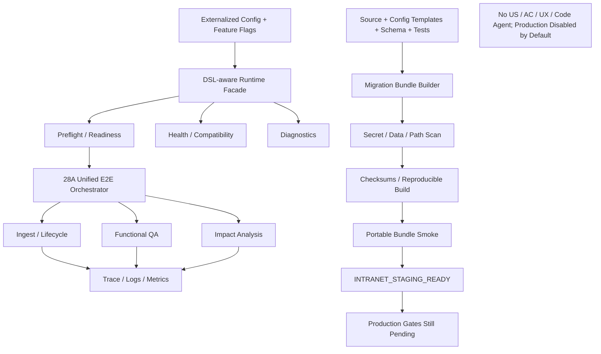

# Block 28B：工程收口、可观测、配置外置与内网迁移包

你现在继续在本地 LightRAG 代码仓中工作。

本轮任务：**Block 28B，Engineering Closure, Observability, Externalized Configuration & Intranet Migration Package**。

这是当前本地改造路线的最后一个核心 Block。

本轮不再新增业务算法，不再调整术语、类型、版本、检索或影响分析策略；目标是将已经通过的完整 DSL-aware LightRAG 流程收敛为一套：

```text
可配置
可启动
可检查
可观测
可回滚
可搬运
不携带业务数据和密钥
```

的内网迁移候选包。

明确排除：

```text
US_GENERATION
AC_GENERATION
UX 图生成
完整高阶/详细方案正文生成
Code Agent / OpenCode 调用
生产环境连接
内网真实多模块准出
```

---

## 一、前置状态

以下本地能力已经通过：

### 知识编译与入库

```text
统一文档入口协议
单次解析
原文证据链
DSL Applicability
DSL 语义编译
PFSS / Generic / Issue 空间隔离
Persistent Metadata Sidecar
```

### 语义治理

```text
术语归一 V2
Stable Semantic Identity
Entity Type Resolver
Generic NER 阻断
Version Governance
Version-aware Retrieval
```

### 生命周期

```text
文档版本增量更新
共享贡献保护
安全删除
Rebuild
Saga / Compensation
```

### 检索与应用

```text
四路混合检索
Trust-aware Fusion
Trusted Context Pack
功能点问答
关联影响分析
27B Quality Gates
```

### 本地完整链路

Block 28A 已通过：

```text
Parse
→ Raw Evidence
→ DSL Compile
→ Term / Type / Version
→ PFSS / Issue / Sidecar
→ Lifecycle
→ Hybrid Retrieval
→ Functional QA / Impact Analysis
→ Quality Gate
```

本轮必须复用这些实现，不得复制或重写。

---

## 二、必须保留的真实边界

当前本地完整流程通过，不代表正式生产准出。

本轮最终状态必须严格区分：

```text
ENGINEERING_CLOSURE_PASS
MIGRATION_PACKAGE_READY
INTRANET_STAGING_READY

MULTI_MODULE_PRODUCTION_GATE_PENDING
INTRANET_REAL_MODEL_VALIDATION_PENDING
INTRANET_REAL_STORAGE_VALIDATION_PENDING
LIVE_UPLOAD_QUERY_INTEGRATION_PENDING
PRODUCTION_APPROVAL_PENDING
```

不得输出：

```text
PRODUCTION_READY = true
FORMAL_MULTI_MODULE_GATE_PASS = true
```

除非已有真实内网多模块、Holdout、正式存储和运行数据证据；本轮不存在这些证据。

---

## 三、最高优先级原则：绝对禁止模块和业务对象写死

本轮打包的运行时代码必须面向所有财经 IT 交易类模块。

以下内容只允许存在于：

```text
Manifest
Fixture
测试数据
文档示例
报告
```

不得存在于运行时控制分支：

```text
可接受银行
询价
外汇
信用证
账户
现金池
资金计划
付款
融资
票据
结算
授信
风险
Bank Status
Swift Code
Current Handler
Transfer To
```

禁止：

```python
if module_code == "LCAB":
    ...

if "询价" in query:
    ...

if entity_name == "Bank Status":
    ...

if module_code in {"FX", "PAYMENT"}:
    ...
```

新模块接入只能通过：

```text
文档
Module Manifest
Term Registry
Domain / Feature 配置
Version 配置
Gold / Eval Cases
模型与存储配置
```

不得修改 Python 运行逻辑。

---

## 四、本轮目标

实现并验证：

```text
1. 稳定的外部 Service Facade
2. 配置全部外置和分层
3. Feature Flags 与安全默认值
4. 本地结构化日志、Trace 和指标
5. Readiness / Health / Compatibility 检查
6. 统一 CLI 与运行入口
7. 数据无关、密钥无关的可移植代码包
8. Schema / Migration / Rollback 脚本
9. 部署、运行、排障和回滚 Runbook
10. 包完整性、Checksum 和可重复构建
11. 临时目录解包后离线 Smoke
12. 反硬编码、密钥、绝对路径和业务数据扫描
13. 内网接入所需的明确未完成 Gate 清单
```

---

## 五、本轮严格边界

本轮允许：

- 新增统一 Service Facade；
- 新增 CLI；
- 新增配置加载器；
- 新增 Feature Flags；
- 新增结构化日志和本地指标；
- 新增 Readiness / Health 检查；
- 新增兼容性矩阵；
- 新增可移植迁移包构建器；
- 新增本地离线 Smoke；
- 新增部署与回滚文档；
- 使用合成、脱敏 fixture 验证包；
- 生成 zip 或 tar.gz 包。

本轮禁止：

1. 不修改正式 `/documents/upload`；
2. 不修改正式 Query API；
3. 不连接 Live Hook；
4. 不连接生产或内网服务；
5. 不调用真实公司 LLM / Embedding；
6. 不连接生产 PostgreSQL / Neo4j / Milvus / Qdrant / Redis 等；
7. 不携带真实业务文档；
8. 不携带本地已有图、向量和 Sidecar 数据；
9. 不携带 `.env`；
10. 不携带 API Key / Token / Secret；
11. 不修改 LightRAG Core/API；
12. 不生成 US / AC / UX；
13. 不调用 Code Agent；
14. 不改 27B 质量门禁；
15. 不改 26A 融合策略；
16. 不改 25A / 25B 术语、类型和版本策略；
17. 不安装新依赖；
18. 不修改 `uv.lock / pyproject.toml / requirements`，除非只是将当前已存在依赖的版本快照写入报告；
19. 不通过复制完整仓库和 `.git` 目录冒充迁移包。

完成后必须满足：

```text
LIVE_UPLOAD_BEHAVIOR_CHANGED = false
LIVE_QUERY_BEHAVIOR_CHANGED = false
LIVE_HARNESS_HOOK_CONNECTED = false
REAL_MODEL_CALLS_EXECUTED = false
PRODUCTION_STORAGE_CONNECTED = false
REAL_BUSINESS_DATA_PACKAGED = false
SECRETS_PACKAGED = false
US_GENERATION_EXECUTED = false
CODE_AGENT_CALLED = false
LIGHTRAG_CORE_MODIFIED = false
```

---

## 六、防止 Codex 原地打圈

必须严格遵守：

1. 只读取一次：
   - 28A 总报告；
   - 当前扩展层入口；
   - 当前配置来源；
   - 当前 Sidecar Schema；
   - 当前 27B Gate 接口。
2. 不重新运行完整 24~28A 开发过程；
3. 不重新设计语义算法；
4. 不重新扫描所有业务文档；
5. 不询问用户提供内网地址、密钥或真实模块；
6. 不尝试连接公司内网；
7. 每个目标文件最多完整读取一次；
8. 同一测试命令最多：
   - 首次执行；
   - 一次定向修复；
   - 重跑一次；
9. 第二次仍失败：
   - 写入 `unresolved_questions.md`；
   - 停止本轮；
10. 不重复构建迁移包挑最好结果；
11. 完成包和准出检查后立即停止。

---

## 七、建议新增文件

建议新增：

```text
lightrag_ext/us_dsl/runtime_facade_types.py
lightrag_ext/us_dsl/dsl_aware_runtime_facade.py
lightrag_ext/us_dsl/runtime_config_types.py
lightrag_ext/us_dsl/runtime_config_loader.py
lightrag_ext/us_dsl/runtime_feature_flags.py
lightrag_ext/us_dsl/runtime_observability.py
lightrag_ext/us_dsl/runtime_metrics.py
lightrag_ext/us_dsl/runtime_health_checks.py
lightrag_ext/us_dsl/runtime_compatibility.py
lightrag_ext/us_dsl/runtime_security_guard.py
lightrag_ext/us_dsl/migration_bundle_builder.py
lightrag_ext/us_dsl/migration_bundle_validator.py

lightrag_ext/us_dsl/scripts/dsl_aware_runtime.py
lightrag_ext/us_dsl/scripts/build_intranet_migration_bundle.py
lightrag_ext/us_dsl/scripts/validate_intranet_migration_bundle.py
lightrag_ext/us_dsl/scripts/run_portable_bundle_smoke.py
```

测试：

```text
test_runtime_facade.py
test_runtime_config_loader.py
test_runtime_feature_flags.py
test_runtime_observability.py
test_runtime_metrics.py
test_runtime_health_checks.py
test_runtime_compatibility.py
test_runtime_security_guard.py
test_migration_bundle_builder.py
test_migration_bundle_validator.py
test_portable_bundle_smoke.py
test_engineering_closure_generalization.py
test_engineering_closure_guards.py
```

允许对现有模块做最小 Adapter 修改。

禁止修改：

```text
lightrag/lightrag.py
lightrag/operate.py
lightrag/prompt.py
lightrag/api/*
document_routes.py
正式 upload/query pipeline
LightRAG storage implementations
```

---

## 八、统一 Runtime Facade

新增 `DslAwareRuntimeFacade`，暴露稳定、与具体存储和模块无关的接口。

至少包括：

```python
class DslAwareRuntimeFacade:
    def preflight(self, request): ...
    def ingest_documents(self, request): ...
    def query_function(self, request): ...
    def analyze_impact(self, request): ...
    def update_document_version(self, request): ...
    def delete_document_version(self, request): ...
    def delete_document(self, request): ...
    def rebuild_document_version(self, request): ...
    def health(self): ...
    def readiness(self): ...
```

### Facade 要求

- 只调用已有 28A Orchestrator 和 Adapter；
- 不复制算法；
- 每次调用生成：
  ```text
  trace_id
  run_id
  batch_id
  ```
- 返回结构化结果；
- 不直接依赖具体业务模块；
- 不在 Facade 中写 Prompt；
- 不在 Facade 中写模块特例；
- 默认不连接外部服务。

### 功能问答接口

只返回：

```text
FunctionalQAResult
```

### 关联影响分析接口

只返回：

```text
ImpactAnalysisResult
```

不得暴露或执行：

```text
generate_us
generate_ac
generate_ux
generate_full_solution
```

---

## 九、配置外置

新增分层配置：

```text
config/
├── runtime.yaml.example
├── models.yaml.example
├── storage.yaml.example
├── routing.yaml.example
├── ontology.yaml.example
├── term_registry.csv.example
├── version_policy.yaml.example
├── retrieval.yaml.example
├── quality_gate.yaml.example
├── observability.yaml.example
└── module_manifest.json.example
```

若项目无 YAML 解析依赖：

- 不安装新依赖；
- 使用 JSON / TOML；
- 或使用已有项目配置解析器。

不得为了形式强行加入 YAML 依赖。

### 配置优先级

必须明确：

```text
CLI 参数
> 环境变量
> 指定配置文件
> 安全默认值
```

### 配置来源报告

每个最终有效配置必须记录：

```text
value source
default / file / env / cli
```

密钥只记录：

```text
configured = true / false
```

不得记录值。

---

## 十、Feature Flags

至少提供：

```text
DSL_AWARE_RUNTIME_ENABLED
DSL_ROUTER_MODE
PFSS_WRITE_ENABLED
GENERIC_GRAPH_ENABLED
ISSUE_INDEX_ENABLED
VERSION_AWARE_RETRIEVAL_ENABLED
TRUSTED_HYBRID_RETRIEVAL_ENABLED
FUNCTIONAL_QA_ENABLED
IMPACT_ANALYSIS_ENABLED
QUALITY_GATE_ENABLED
REAL_MODEL_CALLS_ENABLED
REMOTE_STORAGE_ENABLED
LIVE_UPLOAD_INTEGRATION_ENABLED
LIVE_QUERY_INTEGRATION_ENABLED
```

### 安全默认值

迁移包中必须默认：

```text
DSL_AWARE_RUNTIME_ENABLED = false
PFSS_WRITE_ENABLED = false
GENERIC_GRAPH_ENABLED = false
REAL_MODEL_CALLS_ENABLED = false
REMOTE_STORAGE_ENABLED = false
LIVE_UPLOAD_INTEGRATION_ENABLED = false
LIVE_QUERY_INTEGRATION_ENABLED = false
```

内网部署人员必须显式开启。

### Flag Contract

若依赖 Flag 未开启：

```text
必须快速失败或安全降级
```

例如：

```text
PFSS_WRITE_ENABLED=true
但 REMOTE_STORAGE_ENABLED=false
→ 只允许本地隔离存储
```

不得静默连接远程。

---

## 十一、配置校验

实现：

```text
ConfigValidationResult
```

至少检查：

```text
Embedding Model / Dimension
LLM Binding / Model
Storage Backend
Namespace
Working Directory
Sidecar Schema Version
Ontology Version
Term Registry Version
Version Policy Version
Fusion Policy Version
Quality Gate Version
Feature Flag 依赖
禁止的 Production Namespace
绝对路径可用性
配置占位符是否替换
```

### 配置占位符

包内模板使用：

```text
<<EMBEDDING_MODEL>>
<<EMBEDDING_DIM>>
<<LLM_MODEL>>
<<STORAGE_BACKEND>>
<<MODULE_MANIFEST_PATH>>
```

未替换时：

```text
readiness = false
```

不得进入模型或存储调用。

---

## 十二、可观测能力

新增本地结构化日志，不引入外部观测平台依赖。

### Structured Log

每条日志至少包含：

```text
timestamp
level
trace_id
run_id
batch_id
document_id
document_version_id
query_id
stage
component
event
status
reason_code
elapsed_ms
attempt_no
```

不得包含：

```text
API Key
Token
完整原文
完整 Prompt
完整 Embedding
完整模型响应
```

### 指标

至少支持本地 JSON / text exposition：

#### 入库

```text
documents_total
documents_by_route
parse_failed_total
raw_chunks_total
semantic_objects_total
semantic_relations_total
blocked_objects_total
version_issues_total
term_issues_total
type_issues_total
ingestion_latency_ms
embedding_calls_total
llm_calls_total
compensation_total
rebuild_required_total
```

#### 查询

```text
queries_total
queries_by_task_type
hybrid_ready_total
text_only_fallback_total
version_warning_total
insufficient_evidence_total
quality_gate_failed_total
query_latency_ms
retrieval_candidate_count
factual_path_count
tentative_path_count
```

#### 安全

```text
invalid_citation_total
unsupported_fact_total
unsupported_path_total
issue_as_fact_total
version_hard_judgment_total
generic_ner_fact_hit_total
```

---

## 十三、Health 与 Readiness

### Health

只表示进程和本地组件可运行：

```text
process_alive
config_loaded
artifact_root_writable
local_registry_accessible
```

### Readiness

表示是否允许执行当前模式：

```text
config_valid
required_flags_enabled
embedding_dimension_consistent
model_credentials_configured
storage_capability_validated
namespace_safe
sidecar_schema_compatible
ontology_version_compatible
term_registry_valid
version_policy_valid
quality_gate_loaded
no_placeholder_config
```

### 状态

```text
READY
NOT_READY_CONFIG
NOT_READY_MODEL
NOT_READY_STORAGE
NOT_READY_SCHEMA
NOT_READY_NAMESPACE
NOT_READY_POLICY
```

不得把 Health 通过等同于 Readiness 通过。

---

## 十四、兼容性矩阵

生成：

```text
compatibility_matrix.json
```

至少包括：

```text
Python version
LightRAG commit / version
Extension schema version
Sidecar schema version
Embedding dimension
Supported local storage backends
Future remote storage adapters
Ontology version
Term registry version
Version policy version
Fusion policy version
Quality gate version
```

### 迁移时阻断

若内网版本不兼容：

```text
readiness = false
MIGRATION_BLOCKED_INCOMPATIBLE_RUNTIME
```

不得自动修改 Schema 或模型维度尝试通过。

---

## 十五、迁移包内容

生成：

```text
artifacts/block_28b_engineering_closure/intranet_migration_bundle/
```

必须包含：

```text
README.md
README_内网部署.md
CHANGELOG.md
RELEASE_NOTES.md
LICENSE_NOTICE.md（如适用）

src_manifest.json
package_manifest.json
checksums.sha256
compatibility_matrix.json
requirements_snapshot.txt

config_templates/
schema/
scripts/
runbooks/
tests/
sanitized_fixtures/
```

### config_templates

包含全部外置配置模板。

### schema

包含：

```text
Sidecar schema
Schema migrations
Rollback schema script
```

### scripts

至少：

```text
preflight_check.sh
validate_config.sh
run_local_smoke.sh
run_intranet_staging_smoke.sh
build_module_manifest.sh 或模板
rollback_last_batch.sh（计划模式，不直接生产删除）
collect_diagnostics.sh
```

### runbooks

至少：

```text
01_部署前检查.md
02_配置模型与Embedding.md
03_配置本地或远程存储.md
04_导入术语与Domain配置.md
05_运行Staging入库.md
06_运行功能点问答测试.md
07_运行关联影响分析测试.md
08_查看版本与Issue.md
09_增量更新删除和重建.md
10_故障补偿与回滚.md
11_性能诊断.md
12_生产准出未完成项.md
```

---

## 十六、迁移包不得包含的内容

必须排除：

```text
.git/
.env
*.key
*.pem
真实内部文档
本地全部 US
本地图谱
本地向量库
本地 Sidecar DB
工作目录
模型缓存
API 响应缓存
用户绝对路径
用户主目录名
公司网关 URL
密钥
日志中的原文
```

允许包含：

```text
合成、脱敏 fixture
配置模板
Schema
代码
测试
文档
```

---

## 十七、Secret / Data / Path Guard

新增安全扫描：

```text
runtime_security_guard.py
```

必须检查：

```text
API Key / Token / Bearer
私钥模式
.env 内容
绝对用户路径
/Users/<name>
/home/<name>
公司内部域名
完整业务文档片段
GraphML / VDB / SQLite 数据文件
```

输出：

```text
security_scan_report.json
```

准出：

```text
secret_hit_count = 0
real_business_document_count = 0
local_index_file_count = 0
user_absolute_path_hit_count = 0
internal_endpoint_hit_count = 0
```

内部 endpoint 若存在于用户主动填写的配置模板说明中，必须使用占位符。

---

## 十八、可重复构建

同一 Git commit 和配置模板输入下，构建包必须：

```text
文件清单一致
内容 checksum 一致
package_manifest 一致
```

允许构建时间元数据不同，但不得影响内容 checksum 比较。

生成：

```text
reproducible_build_report.json
```

要求：

```text
two_build_file_set_equal = true
two_build_content_checksum_equal = true
```

---

## 十九、Portable Bundle Smoke

必须将迁移包解压到一个全新临时目录中运行，不能引用仓库路径。

流程：

```text
1. 解包到临时目录
2. 验证 Checksum
3. 加载安全默认配置
4. 运行 Preflight
5. 未替换配置时 Readiness 应 NOT_READY_CONFIG
6. 加载合成隔离配置
7. 执行完整脱敏 Smoke：
   - Ingest
   - PFSS / Sidecar
   - Functional QA
   - Impact Analysis
   - Quality Gate
   - Lifecycle Update / Rebuild
8. Cleanup
```

### 关键要求

- 不依赖源仓库的相对 import；
- 不读取源仓库 artifacts；
- 不读取本地真实 US；
- 不访问网络；
- 不调用真实模型；
- 不连接生产存储。

---

## 二十、Facade 与 CLI 命令

统一 CLI：

```bash
python -m lightrag_ext.us_dsl.scripts.dsl_aware_runtime preflight --config ...
python -m lightrag_ext.us_dsl.scripts.dsl_aware_runtime health --config ...
python -m lightrag_ext.us_dsl.scripts.dsl_aware_runtime readiness --config ...
python -m lightrag_ext.us_dsl.scripts.dsl_aware_runtime ingest --manifest ...
python -m lightrag_ext.us_dsl.scripts.dsl_aware_runtime query --request ...
python -m lightrag_ext.us_dsl.scripts.dsl_aware_runtime impact --request ...
python -m lightrag_ext.us_dsl.scripts.dsl_aware_runtime rebuild --request ...
python -m lightrag_ext.us_dsl.scripts.dsl_aware_runtime diagnostics --trace-id ...
```

不得提供：

```text
generate-us
generate-ac
generate-ux
```

---

## 二十一、部署模式

支持配置枚举：

```text
LOCAL_DRY_RUN
LOCAL_ISOLATED
INTRANET_STAGING
INTRANET_CANDIDATE
PRODUCTION_DISABLED
```

本轮包默认：

```text
PRODUCTION_DISABLED
```

即使用户错误开启部分 Flag，也不得进入生产 namespace。

---

## 二十二、正式 Gate 待办清单

生成：

```text
pending_production_gates.json
```

必须至少包含：

```text
formal_multi_module_ab_gate
holdout_module_validation
intranet_real_embedding_validation
intranet_real_llm_authorization
intranet_storage_adapter_validation
intranet_network_proxy_validation
live_upload_integration
live_query_integration
data_security_review
performance_capacity_test
production_rollback_drill
production_approval
```

每项包含：

```text
status
required_evidence
owner_placeholder
blocking
recommended_command_or_runbook
```

---

## 二十三、反硬编码总回归

扫描 24~28B 运行时代码，输出：

```text
final_anti_hardcode_report.json
```

必须检查：

```text
runtime_module_branch_count
entity_name_specific_rule_count
module_specific_weight_count
module_specific_skill_count
fixture_runtime_coupling_count
local_filename_controls_runtime_logic_count
internal_endpoint_hardcode_count
user_absolute_path_hardcode_count
```

准出要求全部为 0。

---

## 二十四、测试要求

至少覆盖：

### Facade

1. `test_runtime_facade_reuses_existing_orchestrator`
2. `test_runtime_facade_does_not_duplicate_algorithms`
3. `test_runtime_facade_exposes_only_in_scope_capabilities`
4. `test_us_ac_ux_endpoints_do_not_exist`
5. `test_facade_propagates_trace_ids`

### Config / Flags

6. `test_config_precedence_cli_env_file_default`
7. `test_secrets_are_never_returned_by_config_report`
8. `test_unreplaced_placeholders_block_readiness`
9. `test_safe_feature_flag_defaults`
10. `test_live_flags_are_disabled_by_default`
11. `test_invalid_flag_dependency_is_blocked`
12. `test_config_is_module_agnostic`

### Observability

13. `test_structured_log_has_required_trace_fields`
14. `test_structured_log_excludes_secrets_and_full_text`
15. `test_ingestion_metrics_are_emitted`
16. `test_query_metrics_are_emitted`
17. `test_quality_safety_metrics_are_emitted`
18. `test_metrics_are_module_agnostic`

### Health / Compatibility

19. `test_health_and_readiness_are_distinct`
20. `test_embedding_dimension_mismatch_blocks_readiness`
21. `test_namespace_collision_blocks_readiness`
22. `test_sidecar_schema_mismatch_blocks_readiness`
23. `test_policy_version_mismatch_is_reported`
24. `test_compatibility_matrix_is_generated`

### Bundle

25. `test_bundle_contains_required_files`
26. `test_bundle_excludes_git_env_and_real_data`
27. `test_bundle_excludes_local_indexes`
28. `test_bundle_contains_no_secrets`
29. `test_bundle_contains_no_absolute_user_paths`
30. `test_bundle_checksums_validate`
31. `test_two_builds_are_reproducible`
32. `test_bundle_can_run_outside_source_repo`

### Portable Smoke

33. `test_unconfigured_bundle_is_not_ready`
34. `test_sanitized_bundle_smoke_ingestion`
35. `test_sanitized_bundle_smoke_functional_qa`
36. `test_sanitized_bundle_smoke_impact_analysis`
37. `test_sanitized_bundle_smoke_quality_gate`
38. `test_sanitized_bundle_smoke_lifecycle_rebuild`
39. `test_bundle_smoke_uses_no_network_or_real_models`
40. `test_bundle_smoke_cleanup`

### Generalization / Safety

41. `test_final_runtime_has_no_module_hardcode`
42. `test_new_module_requires_only_manifest_and_config`
43. `test_no_live_upload_or_query_change`
44. `test_no_production_storage_connection`
45. `test_no_us_ac_ux_or_code_agent`
46. `test_pending_production_gates_are_explicit`
47. `test_report_is_serializable`
48. `test_no_lightrag_core_modified`

---

## 二十五、输出目录

```text
artifacts/block_28b_engineering_closure/
```

必须生成：

```text
engineering_closure_report.json
engineering_closure_report.md
runtime_facade_report.json
config_externalization_report.json
feature_flag_report.json
observability_report.json
metrics_snapshot.json
health_readiness_report.json
compatibility_matrix.json
security_scan_report.json
final_anti_hardcode_report.json
reproducible_build_report.json
portable_bundle_smoke_report.json
package_inventory.json
checksums_validation.json
pending_production_gates.json
capability_scope_report.json
safety_check.json
cleanup_report.json
architecture.mmd
command_log.txt
git_status_before.txt
git_status_after.txt
core_diff_check.txt
unresolved_questions.md
intranet_migration_bundle/
intranet_migration_bundle.zip 或 .tar.gz
workspaces/
```

---

## 二十六、架构图

`architecture.mmd`：



---

## 二十七、默认测试命令

```bash
mkdir -p artifacts/block_28b_engineering_closure

git status --short \
  > artifacts/block_28b_engineering_closure/git_status_before.txt
```

```bash
.venv/bin/python - <<'PY'
import subprocess
import sys

tests = [
    "lightrag_ext/us_dsl/tests/test_runtime_facade.py",
    "lightrag_ext/us_dsl/tests/test_runtime_config_loader.py",
    "lightrag_ext/us_dsl/tests/test_runtime_feature_flags.py",
    "lightrag_ext/us_dsl/tests/test_runtime_observability.py",
    "lightrag_ext/us_dsl/tests/test_runtime_metrics.py",
    "lightrag_ext/us_dsl/tests/test_runtime_health_checks.py",
    "lightrag_ext/us_dsl/tests/test_runtime_compatibility.py",
    "lightrag_ext/us_dsl/tests/test_runtime_security_guard.py",
    "lightrag_ext/us_dsl/tests/test_migration_bundle_builder.py",
    "lightrag_ext/us_dsl/tests/test_migration_bundle_validator.py",
    "lightrag_ext/us_dsl/tests/test_portable_bundle_smoke.py",
    "lightrag_ext/us_dsl/tests/test_engineering_closure_generalization.py",
    "lightrag_ext/us_dsl/tests/test_engineering_closure_guards.py",
]

commands = [
    [".venv/bin/python", "-m", "pytest", test, "-q"]
    for test in tests
] + [
    [".venv/bin/python", "-m", "compileall", "-q", "lightrag_ext"],
    [".venv/bin/python", "-m", "py_compile", "lightrag/prompt.py"],
    [".venv/bin/python", "-m", "ruff", "check",
     "lightrag_ext", "lightrag/prompt.py"],
]

for command in commands:
    print("RUN:", " ".join(command), flush=True)
    try:
        result = subprocess.run(command, timeout=300)
    except subprocess.TimeoutExpired:
        print("TIMEOUT:", " ".join(command))
        sys.exit(124)

    if result.returncode != 0:
        sys.exit(result.returncode)
PY
```

---

## 二十八、构建迁移包

```bash
.venv/bin/python -m \
  lightrag_ext.us_dsl.scripts.build_intranet_migration_bundle \
  --output-dir artifacts/block_28b_engineering_closure \
  --production-disabled \
  --exclude-real-data \
  --exclude-secrets \
  --include-sanitized-fixtures \
  --include-tests \
  --include-runbooks
```

必须构建两次验证可重复性。

---

## 二十九、验证迁移包

```bash
.venv/bin/python -m \
  lightrag_ext.us_dsl.scripts.validate_intranet_migration_bundle \
  --bundle artifacts/block_28b_engineering_closure/intranet_migration_bundle \
  --verify-checksums \
  --scan-secrets \
  --scan-real-data \
  --scan-absolute-paths \
  --scan-hardcodes
```

---

## 三十、Portable Smoke

```bash
.venv/bin/python -m \
  lightrag_ext.us_dsl.scripts.run_portable_bundle_smoke \
  --bundle artifacts/block_28b_engineering_closure/intranet_migration_bundle \
  --extract-to artifacts/block_28b_engineering_closure/workspaces/portable_smoke \
  --sanitized-config \
  --sanitized-fixtures \
  --offline \
  --fake-deterministic-embedding \
  --fake-query-llm \
  --enable-functional-qa \
  --enable-impact-analysis \
  --enable-lifecycle-rebuild \
  --enable-quality-gates \
  --cleanup
```

不得访问网络。

---

## 三十一、安全检查

`safety_check.json` 必须包含：

```json
{
  "live_upload_behavior_changed": false,
  "live_query_behavior_changed": false,
  "live_harness_hook_connected": false,
  "real_model_calls_executed": false,
  "production_storage_connected": false,
  "real_business_data_packaged": false,
  "secrets_packaged": false,
  "local_indexes_packaged": false,
  "user_absolute_paths_packaged": false,
  "internal_endpoints_packaged": false,
  "us_generation_executed": false,
  "ac_generation_executed": false,
  "ux_generation_executed": false,
  "code_agent_called": false,
  "production_enabled_by_default": false,
  "runtime_module_branch_count": 0,
  "entity_name_specific_rule_count": 0,
  "module_specific_weight_count": 0,
  "module_specific_skill_count": 0,
  "lightrag_core_modified": false
}
```

Core 检查：

```bash
git diff --name-only -- \
  lightrag/lightrag.py \
  lightrag/operate.py \
  lightrag/prompt.py \
  lightrag/api \
  > artifacts/block_28b_engineering_closure/core_diff_check.txt
```

---

## 三十二、准出标准

通过条件：

1. Runtime Facade 已实现并复用 28A；
2. 未复制既有算法；
3. 只暴露当前范围内能力；
4. 配置外置并有明确优先级；
5. 密钥不进入配置报告；
6. Feature Flags 默认安全；
7. Production 默认关闭；
8. Structured Logs 和 Metrics 完整；
9. Logs 不包含密钥和完整原文；
10. Health / Readiness 明确区分；
11. Embedding / Schema / Namespace / Policy 不兼容可阻断；
12. Compatibility Matrix 完整；
13. Migration Bundle 内容完整；
14. Bundle 不含 `.git / .env / 密钥 / 真实业务文档 / 本地索引 / 本地 Sidecar DB`；
15. Bundle 不含用户绝对路径和内部 endpoint；
16. Checksum 校验通过；
17. 两次构建可重复；
18. Bundle 可在仓库外临时目录运行；
19. 未配置 Bundle 正确返回 NOT_READY；
20. Sanitized Portable Smoke 全链路通过；
21. QA / Impact / Quality Gate / Lifecycle Rebuild 通过；
22. Runbooks 完整；
23. Pending Production Gates 明确；
24. 无业务模块或实体名硬编码；
25. 新模块只需 Manifest 和配置；
26. US / AC / UX / Code Agent 未执行；
27. 未改 Live Upload / Query；
28. 未连接生产存储；
29. 未修改 LightRAG Core/API；
30. 测试和静态检查全部通过；
31. artifacts 完整；
32. cleanup 通过。

不通过条件：

1. 打包真实 US 或内部文档；
2. 打包 `.env` 或密钥；
3. 打包本地 Graph / VDB / SQLite 数据；
4. 包依赖源仓库路径才能运行；
5. 生产 Flag 默认开启；
6. 未替换配置仍能连接外部服务；
7. 把 Engineering Closure 宣称为生产准出；
8. 隐藏正式多模块 Gate 待办；
9. 按模块写运行逻辑；
10. 重新加入 US / AC 生成；
11. 修改 LightRAG Core；
12. 测试失败；
13. cleanup 失败。

---

## 三十三、完成后只输出

```text
Block: 28B

Engineering:
- runtime_facade_implemented:
- reused_28a_orchestrator:
- duplicate_algorithm_implementation_count:
- config_externalized:
- feature_flags_implemented:
- structured_logging_implemented:
- metrics_implemented:
- health_readiness_implemented:
- compatibility_matrix_generated:

Bundle:
- bundle_path:
- archive_path:
- package_file_count:
- checksums_valid:
- reproducible_build_passed:
- portable_smoke_passed:
- source_repo_dependency_detected:
- real_business_data_packaged:
- secrets_packaged:
- local_indexes_packaged:
- user_absolute_paths_packaged:
- internal_endpoints_packaged:

Runtime scope:
- functional_qa_available:
- impact_analysis_available:
- us_generation_available:
- ac_generation_available:
- ux_generation_available:
- code_agent_available:

Safety defaults:
- production_enabled_by_default:
- live_upload_enabled_by_default:
- live_query_enabled_by_default:
- real_models_enabled_by_default:
- remote_storage_enabled_by_default:
- generic_graph_enabled_by_default:

Observability:
- required_trace_fields_present:
- ingestion_metrics_present:
- query_metrics_present:
- quality_safety_metrics_present:
- logs_contain_full_document:
- logs_contain_secret:

Generalization:
- runtime_module_branch_count:
- entity_name_specific_rule_count:
- module_specific_weight_count:
- module_specific_skill_count:
- new_module_requires_code_change:
- anti_hardcode_passed:

Pending gates:
- formal_multi_module_ab_gate:
- intranet_real_embedding_validation:
- intranet_real_llm_authorization:
- intranet_storage_validation:
- live_upload_integration:
- live_query_integration:
- production_approval:

Safety:
- live_upload_behavior_changed:
- live_query_behavior_changed:
- production_storage_connected:
- real_model_calls_executed:
- cleanup_passed:
- core_modified_in_this_round:

Tests:
- collected_count:
- passed_count:
- failed_count:
- compileall:
- py_compile:
- ruff:

Final:
- engineering_closure_status:
- migration_package_status:
- intranet_staging_status:
- production_status:
- recommended_next_action:

Artifacts:
- artifacts/block_28b_engineering_closure
```

只有全部本地工程 Gate 通过时：

```text
engineering_closure_status = ENGINEERING_CLOSURE_PASS
migration_package_status = MIGRATION_PACKAGE_READY
intranet_staging_status = INTRANET_STAGING_READY
production_status = PRODUCTION_GATE_PENDING

recommended_next_action =
Move the data-free migration bundle to the intranet,
configure real models/storage/modules,
then run the pending multi-module and production gates.
```

完成后立即停止。

---

## 三十四、特别提醒

本轮是当前本地改造路线的最终工程收口。

它完成后可以说明：

> **代码、配置、治理、检索、问答、影响分析、生命周期、质量门禁和可移植运行包已经完整。**

但仍不能说明：

> **已通过公司内网真实多模块生产准出。**

迁入内网后只需补：

```text
真实模型
真实存储
真实模块 Manifest
真实多模块 / Holdout A/B
Live Upload / Query Adapter
容量、安全和回滚演练
生产审批
```
