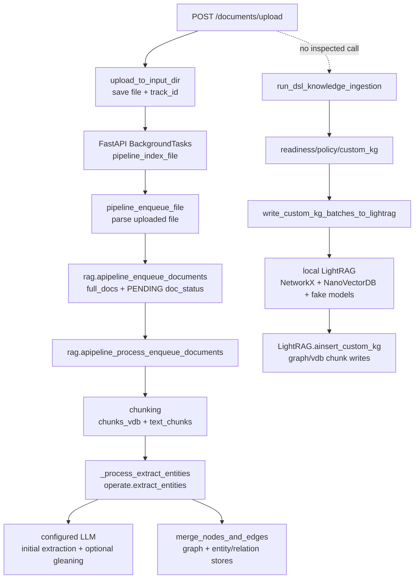

# Block 24A-0 Ingestion Baseline Report

- Repository: `/Users/hufaofao/Projects/LightRAG`
- Branch: `main`
- Commit: `91bf57c90c8321fddc3b2e04d4f456c19d693012`
- Generated at: `2026-06-20T08:14:05.535857+00:00`

## Scope and Safety Boundary

- This closure validates the Block 24A-0 baseline only.
- No upload endpoint was called.
- No model provider was called.
- No graph, vector, KV, or document-status mutation was executed.
- No LightRAG Core/API file was modified.

## Confirmed Facts

- /documents/upload is implemented by upload_to_input_dir in lightrag/api/routers/document_routes.py.
- The upload route saves the file, generates an upload track_id, and schedules pipeline_index_file with FastAPI BackgroundTasks.
- pipeline_index_file calls pipeline_enqueue_file and then rag.apipeline_process_enqueue_documents after successful enqueue.
- pipeline_enqueue_file parses the uploaded file and calls rag.apipeline_enqueue_documents(content, file_paths=file_path.name, track_id=track_id).
- Native apipeline_enqueue_documents writes full_docs and PENDING doc_status before queue processing.
- Native apipeline_process_enqueue_documents writes chunks_vdb/text_chunks, calls _process_extract_entities, merges graph data, and updates doc_status to PROCESSED or FAILED.
- Native extract_entities uses the configured LLM function for initial extraction and has one optional gleaning request gate.
- DSL run_dsl_knowledge_ingestion is an explicit function entry, not an inspected API upload route.
- DSL canary/module modes call write_custom_kg_batches_to_lightrag, which builds local NetworkX/NanoVectorDB/Json storage with fake embedding and fake LLM defaults.
- DSL writer calls LightRAG.ainsert_custom_kg; the inspected DSL chain does not call native extract_entities.
- LightRAG.ainsert_custom_kg writes chunks, graph nodes/edges, entities_vdb, and relationships_vdb but does not write full_docs or doc_status.
- Static router scan: upload_calls_dsl=False, auto_router_exists=False.
- DSL static scan: calls_ainsert_custom_kg=True, calls_extract_entities=False.
- Current raw working_dir baseline: /Users/hufaofao/Projects/LightRAG/rag_storage.
- Current DSL canary/module working_dir baseline: tempfile.mkdtemp(prefix='lightrag_dsl_ingestion_dsl_test_').
- Original chain flags: embedding=True, llm=True, graph=True.
- DSL chain flags: embedding=True, llm=False, graph=True.

## Original Upload Call Chain

| Step | File | Line | Function | Async | Callee | Side effects |
| --- | --- | ---: | --- | --- | --- | --- |
| raw-01-upload-route | `lightrag/api/routers/document_routes.py` | 2127 | `upload_to_input_dir` | `True` | background_tasks.add_task(pipeline_index_file, rag, file_path, track_id) | Streams upload bytes to input_dir before returning HTTP 200.; Checks filename duplicate through rag.doc_status.get_doc_by_file_path.; Schedules background processing through FastAPI BackgroundTasks. |
| raw-02-background-index-file | `lightrag/api/routers/document_routes.py` | 1691 | `pipeline_index_file` | `True` | pipeline_enqueue_file(...); rag.apipeline_process_enqueue_documents() | Runs after upload response in background task.; Processes queue only if pipeline_enqueue_file succeeds. |
| raw-03-parser-enqueue-file | `lightrag/api/routers/document_routes.py` | 1233 | `pipeline_enqueue_file` | `True` | rag.apipeline_enqueue_documents(content, file_paths=file_path.name, track_id=track_id) | Reads file bytes and extracts text.; Writes file extraction failures through rag.apipeline_enqueue_error_documents.; Moves successfully enqueued file to __enqueued__. |
| raw-04-full-docs-and-pending-status | `lightrag/lightrag.py` | 1344 | `apipeline_enqueue_documents` | `True` | self.full_docs.upsert(...); self.doc_status.upsert(...) | Computes doc_id from content hash when ids are absent.; Writes original text to full_docs.; Writes doc_status=PENDING with file_path and track_id.; Writes duplicate attempts as doc_status=FAILED. |
| raw-05-process-pending-queue | `lightrag/lightrag.py` | 1740 | `apipeline_process_enqueue_documents` | `True` | chunking_func; chunks_vdb.upsert; text_chunks.upsert; _process_extract_entities; merge_nodes_and_edges | Uses pipeline_status busy/request_pending as queue gate.; Reads original content from full_docs.; Writes doc_status=PROCESSING before extraction.; Writes chunks_vdb and text_chunks before entity extraction.; Writes doc_status=PROCESSED after graph merge, FAILED on exception. |
| raw-06-entity-extraction | `lightrag/lightrag.py` | 2318 | `_process_extract_entities` | `True` | operate.extract_entities(..., llm_response_cache=self.llm_response_cache, text_chunks_storage=self.text_chunks) | Calls raw native LLM extraction path.; May update chunk llm_cache_list through text_chunks storage. |
| raw-07-llm-extract-and-gleaning | `lightrag/operate.py` | 2883 | `extract_entities` | `True` | use_llm_func_with_cache for initial extraction and one optional gleaning request | Calls LLM for initial extraction unless cache hits.; If entity_extract_max_gleaning > 0, performs at most one additional gleaning request.; Caches extract responses when enabled. |
| raw-08-merge-graph-and-vdb | `lightrag/operate.py` | 2501 | `merge_nodes_and_edges` | `True` | _merge_nodes_then_upsert; _merge_edges_then_upsert; full_entities_storage.upsert; full_relations_storage.upsert | Upserts graph nodes and edges.; Upserts entities_vdb and relationships_vdb.; Writes full_entities and full_relations per doc.; May call LLM summarization during merge when description merge threshold is exceeded. |

## DSL Ingestion Call Chain

| Step | File | Line | Function | Async | Callee | Side effects |
| --- | --- | ---: | --- | --- | --- | --- |
| dsl-01-entry | `lightrag_ext/us_dsl/dsl_knowledge_ingestion.py` | 22 | `run_dsl_knowledge_ingestion` | `False` | run_ingestion_readiness_gate / run_canary_dsl_knowledge_ingestion / run_module_level_dsl_knowledge_ingestion | No write in readiness mode.; Canary/module may call writer if gates pass. |
| dsl-02-readiness | `lightrag_ext/us_dsl/dsl_knowledge_ingestion_readiness.py` | 20 | `run_ingestion_readiness_gate` | `False` | build_module_ingestion_payload; prepare_policy_approved_ingestion_payload | Builds and validates custom_kg artifacts in memory. |
| dsl-03-sidecar-and-custom-kg | `lightrag_ext/us_dsl/dsl_knowledge_ingestion_policy.py` | 67 | `prepare_policy_approved_ingestion_payload` | `False` | build_metadata_sidecar_records; to_lightrag_custom_kg_input; build_graph_insert_sidecar_records | Builds full sidecar records and graph-insert sidecar records in memory.; Does not persist sidecar records in dsl_knowledge_ingestion_writer. |
| dsl-04-batching | `lightrag_ext/us_dsl/dsl_knowledge_ingestion.py` | 175 | `split_custom_kg_batches` | `False` | write_custom_kg_batches_to_lightrag |  |
| dsl-05-writer | `lightrag_ext/us_dsl/dsl_knowledge_ingestion_writer.py` | 64 | `write_custom_kg_batches_to_lightrag` | `False` | without_graph_remote_env; asyncio.run(_write_batches_async(...)) | Blocks production namespace/Neo4j/non-fake-model use through guard issues.; Optionally isolates remote graph env before local write. |
| dsl-06-local-lightrag-construction | `lightrag_ext/us_dsl/dsl_knowledge_ingestion_writer.py` | 224 | `_write_batches_in_working_dir` | `True` | LightRAG(... local stores, fake embedding, fake LLM); rag.ainsert_custom_kg | Creates/uses a test-scoped local working_dir.; Initializes local LightRAG storages.; Calls ainsert_custom_kg for each batch. |
| dsl-07-custom-kg-core-write | `lightrag/lightrag.py` | 2376 | `ainsert_custom_kg` | `True` | chunks_vdb.upsert; text_chunks.upsert; graph upsert_nodes_batch/upsert_edges_batch; entities_vdb.upsert; relationships_vdb.upsert | Writes chunks_vdb and text_chunks.; Writes graph nodes and relationships.; Writes entities_vdb and relationships_vdb.; Does not call extract_entities.; Does not write full_docs or doc_status. |

## Current Runtime Configuration

### Embedding

- binding/model: `openai` / `text-embedding-3-large`
- endpoint host: `api.openai.com`
- configured dimension/source: `3072` / `environment`
- sends dimension parameter: `False`
- context limit/batch/concurrency: `8192` / `10` / `8`
- config sources: `{'EMBEDDING_BINDING': 'environment', 'EMBEDDING_MODEL': 'environment', 'EMBEDDING_BINDING_HOST': 'environment', 'EMBEDDING_DIM': 'environment', 'EMBEDDING_SEND_DIM': 'default', 'embedding_context_limit': 'environment', 'EMBEDDING_BATCH_NUM': 'default', 'EMBEDDING_FUNC_MAX_ASYNC': 'default', 'EMBEDDING_TIMEOUT': 'default'}`
- proxy detected / NO_PROXY covers host: `False` / `False`
- credential configured/fingerprint/source: `True` / `sha256:5948d8c736ea` / `environment:embedding_binding_credential`
- fake model detected: `False`

### LLM

- binding/model: `openai` / `gpt-5.4-mini`
- endpoint host: `api.openai.com`
- cache enabled: `True`
- max async/timeout: `4` / `180`
- summary context/source: `1200` / `default`
- config sources: `{'LLM_BINDING': 'environment', 'LLM_MODEL': 'environment', 'LLM_BINDING_HOST': 'environment', 'MAX_ASYNC': 'environment', 'LLM_TIMEOUT': 'default', 'ENABLE_LLM_CACHE': 'default', 'ENABLE_LLM_CACHE_FOR_EXTRACT': 'environment', 'summary_context_limit': 'default'}`
- credential configured/fingerprint/source: `True` / `sha256:5948d8c736ea` / `environment:llm_binding_credential`
- extract model same as query model: `True`

### Storage

- KV/vector/graph/doc_status: `JsonKVStorage` / `NanoVectorDBStorage` / `NetworkXStorage` / `JsonDocStatusStorage`
- workspace: ``
- working_dir: `/Users/hufaofao/Projects/LightRAG/rag_storage`
- NetworkX/Neo4j/PostgreSQL/NanoVectorDB: `True` / `False` / `False` / `True`
- Redis/Mongo/OpenSearch: `False` / `False` / `False`
- storage files found: `0`
- embedding metadata found: `None`

## Current State vs Configuration Capability

```text
CURRENT_RAW_AND_DSL_SHARE_WORKING_DIR = false
CURRENT_RAW_AND_DSL_SHARE_GRAPH_NAMESPACE = false
CAPABILITY_RAW_AND_DSL_CAN_TARGET_SAME_GRAPH = true
CURRENT_UPLOAD_ROUTE_CALLS_DSL = false
CURRENT_AUTO_INGESTION_ROUTER_EXISTS = false
CURRENT_DSL_PATH_CALLS_AINSERT_CUSTOM_KG = true
CURRENT_DSL_PATH_CALLS_ORIGINAL_EXTRACT_ENTITIES = false
CURRENT_RAW_PATH_CALLS_LLM_EXTRACTION = true
CURRENT_FAKE_AND_REAL_EMBEDDING_MIX_DETECTED = false
FAKE_AND_REAL_EMBEDDING_MIX_RISK = MEDIUM
CORE_MODIFIED_IN_THIS_ROUND = false
NETWORK_CALLS_EXECUTED = false
STORAGE_WRITES_EXECUTED = false
```

| Field | Conclusion | Evidence File | Line | Function | Explanation |
| --- | --- | --- | ---: | --- | --- |
| CURRENT_RAW_AND_DSL_SHARE_WORKING_DIR | `false` | `lightrag_ext/us_dsl/runtime_baseline_probe.py` | 278 | `_working_dir_baseline` | Current parsed raw working_dir and DSL ingestion working_dir are compared directly. This is current-state evidence, not routing capability. |
| CURRENT_RAW_AND_DSL_SHARE_GRAPH_NAMESPACE | `false` | `lightrag_ext/us_dsl/runtime_baseline_probe.py` | 278 | `_working_dir_baseline` | Current parsed raw workspace and DSL namespace are compared directly. Empty raw workspace and default DSL test namespace do not match. |
| CAPABILITY_RAW_AND_DSL_CAN_TARGET_SAME_GRAPH | `true` | `lightrag_ext/us_dsl/dsl_knowledge_ingestion_writer.py` | 224 | `_write_batches_in_working_dir` | Code capability: DSL writer accepts config.working_dir/config.namespace and native LightRAG accepts working_dir/workspace, so configuration can target the same local graph namespace. This is not a current-state fact. |
| CURRENT_UPLOAD_ROUTE_CALLS_DSL | `false` | `lightrag/api/routers/document_routes.py` | 2127 | `upload_to_input_dir` | The current upload route schedules pipeline_index_file and the scoped route source contains no DSL entry call. |
| CURRENT_AUTO_INGESTION_ROUTER_EXISTS | `false` | `lightrag/api/routers/document_routes.py` | 2127 | `upload_to_input_dir` | Scoped code evidence in the upload route and native core does not contain auto/dsl/raw/shadow ingestion router markers. |
| CURRENT_DSL_PATH_CALLS_AINSERT_CUSTOM_KG | `true` | `lightrag/lightrag.py` | 2376 | `ainsert_custom_kg` | The DSL writer path reaches LightRAG.ainsert_custom_kg. |
| CURRENT_DSL_PATH_CALLS_ORIGINAL_EXTRACT_ENTITIES | `false` | `lightrag_ext/us_dsl/dsl_knowledge_ingestion.py` | 22 | `run_dsl_knowledge_ingestion` | The scoped DSL ingestion/readiness/policy/writer source does not call native extract_entities. |
| CURRENT_RAW_PATH_CALLS_LLM_EXTRACTION | `true` | `lightrag/operate.py` | 2883 | `extract_entities` | Native upload processing calls operate.extract_entities, which uses the configured LLM function unless cache satisfies the request. |
| CURRENT_FAKE_AND_REAL_EMBEDDING_MIX_DETECTED | `false` | `lightrag_ext/us_dsl/runtime_baseline_probe.py` | 278 | `_working_dir_baseline` | No runtime storage evidence of mixed fake and real vectors was observed by this no-write probe. |
| FAKE_AND_REAL_EMBEDDING_MIX_RISK | `MEDIUM` | `lightrag_ext/us_dsl/runtime_baseline_probe.py` | 278 | `_working_dir_baseline` | Risk is configuration-level: fake DSL embeddings remain separate by default, but deliberate working_dir/workspace convergence would create a mix hazard. |
| CORE_MODIFIED_IN_THIS_ROUND | `false` | `lightrag/api/routers/document_routes.py` | 2127 | `upload_to_input_dir` | core_diff_check.txt is generated from git diff over forbidden core/API paths and reports no diff. |
| NETWORK_CALLS_EXECUTED | `false` | `lightrag_ext/us_dsl/runtime_baseline_probe.py` | 278 | `_working_dir_baseline` | The runtime probe only parses files and environment/default values; it does not instantiate model clients. |
| STORAGE_WRITES_EXECUTED | `false` | `lightrag_ext/us_dsl/runtime_baseline_probe.py` | 278 | `_working_dir_baseline` | The runtime probe does not call insert, ainsert, ainsert_custom_kg, or storage mutation APIs. |

## Working Directory and Embedding Mix Risk

- Raw upload working_dir: `/Users/hufaofao/Projects/LightRAG/rag_storage`
- Raw workspace: ``
- DSL readiness working_dir: `None`
- DSL canary/module working_dir: `tempfile.mkdtemp(prefix='lightrag_dsl_ingestion_dsl_test_')`
- DSL namespace: `dsl_test_knowledge_ingestion`
- E2E/test working_dir baseline: `/Users/hufaofao/Projects/LightRAG/artifacts`
- Current raw and DSL share working_dir: `False`
- Current raw and DSL share graph namespace: `False`
- Fake and real embedding mix detected: `False`
- Runtime confirmation required: `True`

## Unresolved Questions

- RUNTIME_CONFIRMATION_REQUIRED: the live server process may pass CLI arguments or environment variables not visible to this static/dry-run probe.
- RUNTIME_CONFIRMATION_REQUIRED: model access cannot be confirmed without a network call, which was intentionally not executed.
- RUNTIME_CONFIRMATION_REQUIRED: production storage contents and historical vector dimensions cannot be confirmed unless the configured working_dir or remote storage is inspected in the target runtime.
- RUNTIME_CONFIRMATION_REQUIRED: no deployed process table was inspected, so effective runtime workspace may differ from .env/default parsing.
- DSL working_dir is unset in the parsed config, so canary/module mode creates a temp directory at runtime.

## Recommended Next Block

Block 24A-1 should add an explicit routing design only after runtime working_dir, embedding dimension, and model access checks are verified outside production writes.

## Architecture Diagram


