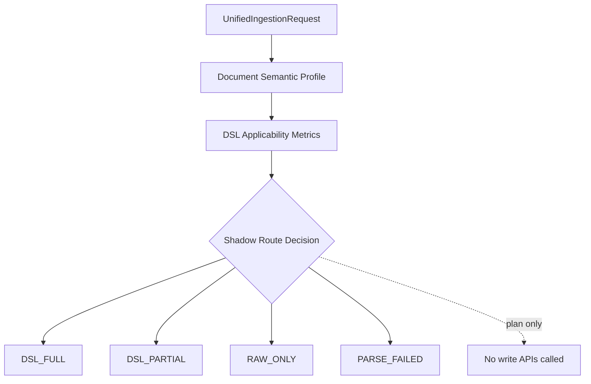

# Block 24B-0 Unified Ingestion Protocol Report

## Safety Invariants

```text
LIVE_UPLOAD_BEHAVIOR_CHANGED = false
LIVE_SHADOW_HOOK_CONNECTED = false
AUTO_WRITE_ROUTING_ENABLED = false
RAW_WRITE_EXECUTED = false
DSL_WRITE_EXECUTED = false
NETWORK_CALLS_EXECUTED = false
MODEL_CALLS_EXECUTED = false
STORAGE_WRITES_EXECUTED = false
LIGHTRAG_CORE_MODIFIED = false
```

## Protocol Summary

- Protocol version: `24B-0`
- Plan count: `5`
- Route distribution: `{'DSL_FULL': 1, 'RAW_ONLY': 2, 'DSL_PARTIAL': 1, 'PARSE_FAILED': 1}`
- Live upload behavior changed: `false`
- Live shadow hook connected: `false`
- Auto write routing enabled: `false`

## Decision Model



## Plans

| Document | Mode | Live Route | Shadow Candidate | Selected Plan | Score | Risks | Notes |
| --- | --- | --- | --- | --- | ---: | ---: | --- |
| 24b0-dsl-full | `shadow` | `RAW_ONLY` | `DSL_FULL` | `DSL_FULL` | 0.775 | 0 | 24B-0 produces a plan only; no LightRAG write APIs are invoked.; Original text evidence chain is always retained in the plan.; Domain hit alone is insufficient; structure, evidence, object signals, and risk counts affect DSL applicability.; mode=shadow live_route=RAW_ONLY selected_plan_route=DSL_FULL; shadow_candidate_route=DSL_FULL; live upload behavior remains raw-only/not connected. |
| 24b0-domain-only | `auto` | `RAW_ONLY` | `None` | `RAW_ONLY` | 0.0867 | 2 | 24B-0 produces a plan only; no LightRAG write APIs are invoked.; Original text evidence chain is always retained in the plan.; Domain hit alone is insufficient; structure, evidence, object signals, and risk counts affect DSL applicability.; mode=auto live_route=RAW_ONLY selected_plan_route=RAW_ONLY |
| 24b0-version-risk | `dsl` | `DSL_PARTIAL` | `None` | `DSL_PARTIAL` | 0.765 | 2 | 24B-0 produces a plan only; no LightRAG write APIs are invoked.; Original text evidence chain is always retained in the plan.; Domain hit alone is insufficient; structure, evidence, object signals, and risk counts affect DSL applicability.; mode=dsl live_route=DSL_PARTIAL selected_plan_route=DSL_PARTIAL; DSL_PARTIAL requires review before write routing is enabled in a later block. |
| 24b0-raw-only | `raw` | `RAW_ONLY` | `None` | `RAW_ONLY` | 0.0 | 2 | 24B-0 produces a plan only; no LightRAG write APIs are invoked.; Original text evidence chain is always retained in the plan.; Domain hit alone is insufficient; structure, evidence, object signals, and risk counts affect DSL applicability.; mode=raw live_route=RAW_ONLY selected_plan_route=RAW_ONLY |
| 24b0-parse-failed | `shadow` | `PARSE_FAILED` | `PARSE_FAILED` | `PARSE_FAILED` | 0.0 | 0 | 24B-0 produces a plan only; no LightRAG write APIs are invoked.; Original text evidence chain is always retained in the plan.; Domain hit alone is insufficient; structure, evidence, object signals, and risk counts affect DSL applicability.; mode=shadow live_route=PARSE_FAILED selected_plan_route=PARSE_FAILED; shadow_candidate_route=PARSE_FAILED; live upload behavior remains raw-only/not connected. |

## Current Boundary

- `/documents/upload` is not modified or connected in 24B-0.
- `insert`, `ainsert`, and `ainsert_custom_kg` are not called by this planner.
- Domain hit alone is insufficient for DSL_FULL; structure, evidence, object signals, and risk counts are required.
- Generic Graph fallback is only represented as a disabled/enabled plan field; no native graph extraction runs.
