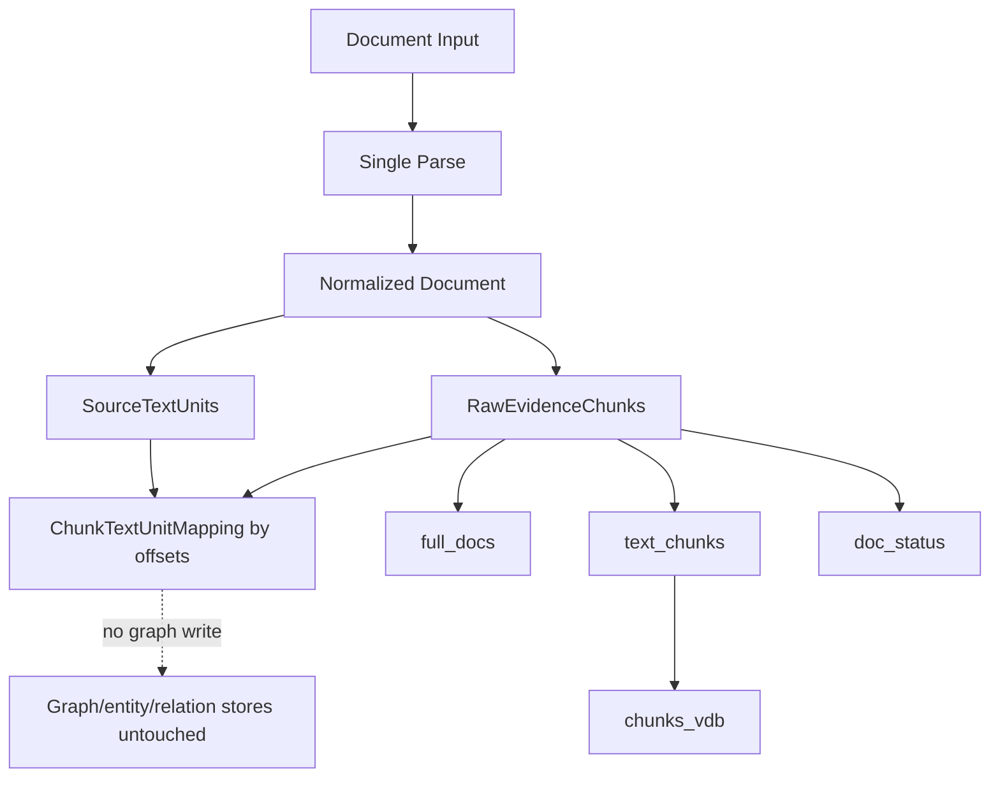

# Block 24B-1 Raw Evidence Chain Report

## Scope and Safety Boundary
- This report validates single-parse raw evidence indexing in an isolated local workspace.
- `/documents/upload`, live router hooks, LLM extraction, graph writes, entities_vdb, and relationships_vdb are not used.

## Confirmed Results
- input_document_count: 4
- successful_document_count: 3
- parse_failed_count: 1
- raw_chunk_total: 3
- source_text_unit_total: 4
- mapping_link_total: 3
- average_raw_chunk_mapping_coverage: 1.0
- average_text_unit_mapping_coverage: 1.0

## Route Coverage
- DSL_FULL: 1
- DSL_PARTIAL: 1
- RAW_ONLY: 1
- PARSE_FAILED: 1

## Storage Snapshot
```json
{
  "chunks_vdb_count": 3,
  "doc_status_count": 4,
  "entities_vdb_count": 0,
  "full_docs_count": 3,
  "graph_edge_count": 0,
  "graph_node_count": 0,
  "relationships_vdb_count": 0,
  "text_chunks_count": 3
}
```

## Safety Check
```json
{
  "auto_write_routing_enabled": false,
  "dsl_write_executed": false,
  "entity_vector_writes_executed": false,
  "extract_entities_called": false,
  "graph_writes_executed": false,
  "lightrag_core_modified": false,
  "live_upload_behavior_changed": false,
  "live_upload_hook_connected": false,
  "llm_calls_executed": false,
  "model_calls_executed": false,
  "network_calls_executed": false,
  "production_storage_writes_executed": false,
  "raw_write_executed": false,
  "relation_vector_writes_executed": false
}
```

## Idempotency
```json
{
  "after_first_snapshot": {
    "chunks_vdb_count": 3,
    "doc_status_count": 4,
    "entities_vdb_count": 0,
    "full_docs_count": 3,
    "graph_edge_count": 0,
    "graph_node_count": 0,
    "relationships_vdb_count": 0,
    "text_chunks_count": 3
  },
  "after_second_snapshot": {
    "chunks_vdb_count": 3,
    "doc_status_count": 4,
    "entities_vdb_count": 0,
    "full_docs_count": 3,
    "graph_edge_count": 0,
    "graph_node_count": 0,
    "relationships_vdb_count": 0,
    "text_chunks_count": 3
  },
  "before_snapshot": {
    "chunks_vdb_count": 3,
    "doc_status_count": 4,
    "entities_vdb_count": 0,
    "full_docs_count": 3,
    "graph_edge_count": 0,
    "graph_node_count": 0,
    "relationships_vdb_count": 0,
    "text_chunks_count": 3
  },
  "document_id": "block24b1-fixture-dsl-full",
  "document_version_id": "docver-94bf4f5256b84b9d5f23fdea095a6a9f",
  "first_chunk_ids": [
    "chunk-d85499495371c2daef4c6d984be4eb40"
  ],
  "issues": [],
  "passed": true,
  "second_chunk_ids": [
    "chunk-d85499495371c2daef4c6d984be4eb40"
  ]
}
```

## Architecture Diagram


## Unresolved Questions
- None for this isolated smoke scope.

## Recommended Next Block
- Block 24B-2: connect the planned router only after raw evidence contract review

## Fixed Safety Conclusions
```text
LIVE_UPLOAD_BEHAVIOR_CHANGED = false
LIVE_SHADOW_HOOK_CONNECTED = false
AUTO_WRITE_ROUTING_ENABLED = false
RAW_WRITE_EXECUTED = false
DSL_WRITE_EXECUTED = false
NETWORK_CALLS_EXECUTED = false
MODEL_CALLS_EXECUTED = false
STORAGE_WRITES_EXECUTED = isolated local raw evidence only
LLM_CALLS_EXECUTED = false
EXTRACT_ENTITIES_CALLED = false
GRAPH_WRITES_EXECUTED = false
ENTITY_VECTOR_WRITES_EXECUTED = false
RELATION_VECTOR_WRITES_EXECUTED = false
PRODUCTION_STORAGE_WRITES_EXECUTED = false
LIGHTRAG_CORE_MODIFIED = false
```
