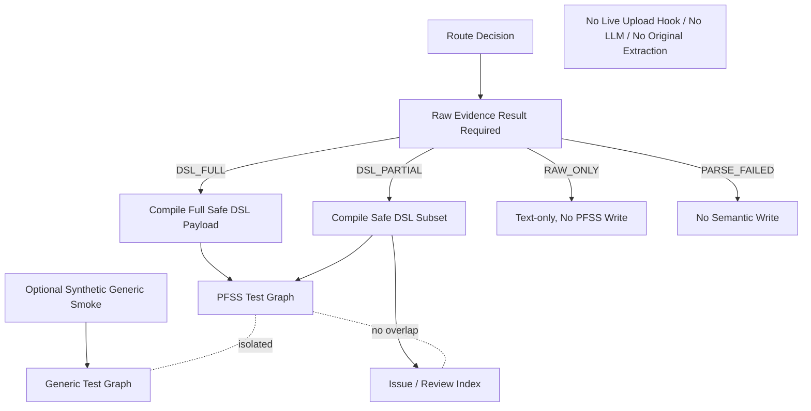

# Block 24B-2 Semantic Branch Isolation Report

## Scope
- Isolated semantic branch execution only; no live upload hook, no auto write routing, no real LLM, no original extraction.
- PFSS and Generic graphs are local JSON test graphs; Issue is a local JSON review index.

## Route Execution
- dsl_full_pfss_write: True
- dsl_partial_pfss_write: True
- dsl_partial_issue_write: True
- raw_only_pfss_write: False
- parse_failed_semantic_write: False

## Isolation
```json
{
  "generic_edge_ids": [],
  "generic_node_ids": [
    "generic:Synthetic Generic Topic"
  ],
  "issue_object_ids": [
    "issue:missing_evidence",
    "issue:version_review_required"
  ],
  "namespace_collision_count": 0,
  "pfss_edge_ids": [
    "pfss:bank_status:has_field:query_condition",
    "pfss:rule_version:has_field:approval_status"
  ],
  "pfss_generic_edge_overlap_count": 0,
  "pfss_generic_node_overlap_count": 0,
  "pfss_issue_overlap_count": 0,
  "pfss_node_ids": [
    "pfss:approval_status",
    "pfss:bank_status",
    "pfss:query_condition",
    "pfss:rule_version"
  ]
}
```

## Source Reference
```json
{
  "PFSS_SOURCE_REFERENCE_STRATEGY": "EXTERNAL_SIDECAR_REFERENCE",
  "duplicate_raw_chunk_count": 0,
  "raw_chunk_count_after": 3,
  "raw_chunk_count_before": 3,
  "raw_chunk_vector_count_after": 3,
  "raw_chunk_vector_count_before": 3
}
```

## Safety
```json
{
  "auto_write_routing_enabled": false,
  "lightrag_core_modified": false,
  "live_generic_fallback_extraction_implemented": false,
  "live_upload_behavior_changed": false,
  "live_upload_hook_connected": false,
  "neo4j_connected": false,
  "original_extract_entities_called": false,
  "original_gleaning_executed": false,
  "production_storage_writes_executed": false,
  "real_llm_calls_executed": false
}
```

## Architecture


## Recommended Next Block
- Block 24C-0 only if all gates pass.

## Exit Gate
- sidecar_alignment_passed: True
- endpoint_closure_passed: True
- forbidden_relation_count: 0
- duplicate_semantic_object_count: 0
- idempotency_passed: True
- issue_object_written_to_pfss_count: 0
- artifacts_complete: True
- real_embedding_smoke_status: NOT_RUN

Final status:
- PASS
