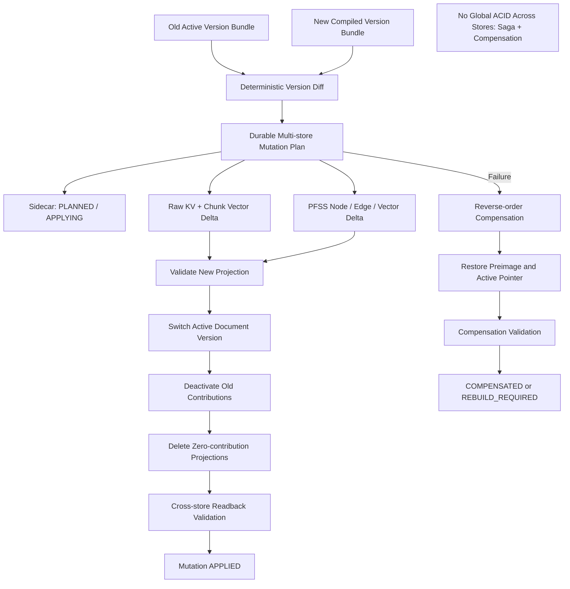

# Block 24C-1 Document Lifecycle Report

## Architecture

## Summary
- document_version_diff_implemented: True
- schema_migration_version: 2
- active_version_registry_implemented: True
- contribution_registry_implemented: True
- lifecycle_mutation_plan_implemented: True
- saga_compensation_implemented: True
- lifecycle_readback_validator_implemented: True

## Incremental Update
{
  "active_version_switch_passed": true,
  "added_chunk_count": 1,
  "business_rule_supersedes_auto_created": false,
  "changed_object_count": 3,
  "changed_relation_count": 1,
  "embedding_recomputed_count": 6,
  "embedding_reused_count": 5,
  "new_version_status": "ACTIVE",
  "old_version_status": "SUPERSEDED",
  "removed_chunk_count": 0,
  "unchanged_chunk_count": 1,
  "unchanged_object_count": 3,
  "unchanged_relation_count": 1,
  "updated_chunk_count": 1
}

## Delete
{
  "dangling_edge_count": 0,
  "delete_document_passed": true,
  "delete_version_passed": true,
  "previous_version_auto_restored": false,
  "shared_object_protection_passed": true,
  "tombstone_created": true
}

## Rebuild
{
  "llm_called_during_rebuild": false,
  "rebuild_extra_projection_cleanup_passed": true,
  "rebuild_idempotency_passed": true,
  "rebuild_missing_projection_passed": true,
  "validation": {
    "active_version_pointer_correct": true,
    "dangling_edge_count": 0,
    "details": {
      "active_version_id": "docver:US-SYN-001:v3",
      "expected_active_version_id": "docver:US-SYN-001:v3",
      "object_actual": [
        "obj:Closed",
        "obj:InquiryProjectList",
        "obj:Open",
        "obj:ProjectStatus",
        "obj:QuoteSubmission",
        "obj:SharedProjectReport",
        "obj:Suspended"
      ],
      "object_expected": [
        "obj:Closed",
        "obj:InquiryProjectList",
        "obj:Open",
        "obj:ProjectStatus",
        "obj:QuoteSubmission",
        "obj:SharedProjectReport",
        "obj:Suspended"
      ],
      "raw_actual": [
        "chunk:US-SYN-001:C1",
        "chunk:US-SYN-001:C2",
        "chunk:US-SYN-001:C3",
        "chunk:US-SYN-002:C1"
      ],
      "raw_expected": [
        "chunk:US-SYN-001:C1",
        "chunk:US-SYN-001:C2",
        "chunk:US-SYN-001:C3",
        "chunk:US-SYN-002:C1"
      ],
      "relation_actual": [
        "rel:InquiryProjectList:HasReportFilter:ProjectStatus",
        "rel:SharedProjectReport:HasReportFilter:ProjectStatus"
      ],
      "relation_expected": [
        "rel:InquiryProjectList:HasReportFilter:ProjectStatus",
        "rel:SharedProjectReport:HasReportFilter:ProjectStatus"
      ]
    },
    "duplicate_projection_count": 0,
    "issue_object_written_to_pfss_count": 0,
    "orphan_vector_count": 0,
    "passed": true,
    "pfss_projection_matches_sidecar": true,
    "raw_projection_matches_sidecar": true,
    "vector_projection_matches_sidecar": true
  }
}

## Compensation
{
  "compensation_failure_marks_rebuild_required": true,
  "failure_after_active_switch_compensated": true,
  "failure_after_edge_write_compensated": true,
  "half_applied_mutation_count": 0,
  "preimage_restored": true,
  "reverse_order_compensation_passed": true
}

## Safety
{
  "auto_write_routing_enabled": false,
  "direct_storage_file_edit_used": false,
  "global_acid_claimed": false,
  "lightrag_core_modified": false,
  "live_upload_behavior_changed": false,
  "live_upload_hook_connected": false,
  "neo4j_connected": false,
  "original_extract_entities_called": false,
  "production_database_connected": false,
  "production_storage_writes_executed": false,
  "real_embedding_calls_executed": false,
  "real_llm_calls_executed": false,
  "saga_compensation_used": true
}
