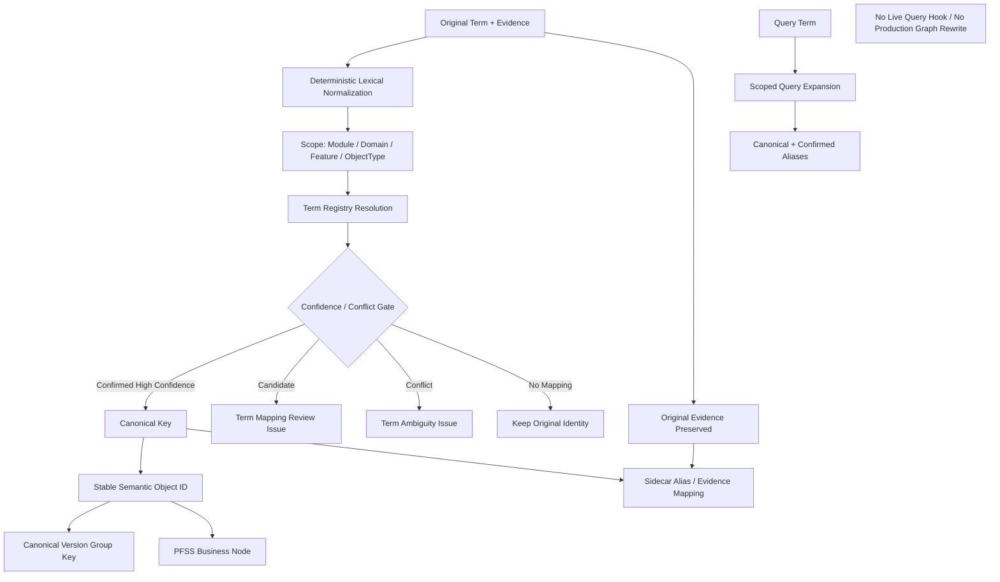

# Block 25A-0 Term Normalization Report

## Architecture

## Implementation
{
  "csv_importer_implemented": true,
  "lexical_normalizer_implemented": true,
  "migration_planner_implemented": true,
  "query_expander_implemented": true,
  "scoped_resolver_implemented": true,
  "stable_semantic_identity_implemented": true,
  "term_registry_implemented": true,
  "xlsx_import_status": "DEFERRED_NO_EXISTING_DEPENDENCY"
}

## Normalization Fixtures
{
  "bank_approval_task_status_distinct": true,
  "conflict_mapping_detected": true,
  "current_handler_bilingual_same_identity": true,
  "low_confidence_mapping_auto_merged": false,
  "scoped_bank_status_mapping_passed": true,
  "search_translation_requires_scope": true,
  "swift_code_variants_same_identity": true,
  "unscoped_status_auto_merged": false
}

## PFSS Smoke
{
  "alias_record_count": 5,
  "approval_status_kept_separate": true,
  "canonical_node_count": 3,
  "dedup_duplicate_alias_count": 3,
  "duplicate_semantic_object_count": 0,
  "evidence": [
    {
      "original_term": "Current Handler",
      "semantic_object_id": "urn:pfss:mod-product:workflow:handlerfeature:rolepermission:currenthandler:default",
      "source_span": "synthetic",
      "text_unit_id": "doc1-tu1"
    },
    {
      "original_term": "SWIFT CODE",
      "semantic_object_id": "urn:pfss:mod-product:integration:paymentfeature:fieldspec:swiftcode:default",
      "source_span": "synthetic",
      "text_unit_id": "doc1-tu2"
    },
    {
      "original_term": "Bank Status",
      "semantic_object_id": "urn:pfss:mod-product:ledger:bankstatusfeature:fieldspec:bankstatus:default",
      "source_span": "synthetic",
      "text_unit_id": "doc1-tu3"
    },
    {
      "original_term": "当前处理人",
      "semantic_object_id": "urn:pfss:mod-product:workflow:handlerfeature:rolepermission:currenthandler:default",
      "source_span": "synthetic",
      "text_unit_id": "doc2-tu1"
    },
    {
      "original_term": "SWIFTCODE",
      "semantic_object_id": "urn:pfss:mod-product:integration:paymentfeature:fieldspec:swiftcode:default",
      "source_span": "synthetic",
      "text_unit_id": "doc2-tu2"
    },
    {
      "original_term": "银行状态",
      "semantic_object_id": "urn:pfss:mod-product:ledger:bankstatusfeature:fieldspec:bankstatus:default",
      "source_span": "synthetic",
      "text_unit_id": "doc2-tu3"
    }
  ],
  "idempotency_passed": true,
  "nodes": {
    "urn:pfss:mod-product:integration:paymentfeature:fieldspec:swiftcode:default": {
      "aliases": [
        "SWIFT CODE",
        "SWIFTCODE"
      ],
      "canonical_term": "Swift Code",
      "semantic_object_id": "urn:pfss:mod-product:integration:paymentfeature:fieldspec:swiftcode:default"
    },
    "urn:pfss:mod-product:ledger:bankstatusfeature:fieldspec:bankstatus:default": {
      "aliases": [
        "Bank Status",
        "银行状态"
      ],
      "canonical_term": "Bank Status",
      "semantic_object_id": "urn:pfss:mod-product:ledger:bankstatusfeature:fieldspec:bankstatus:default"
    },
    "urn:pfss:mod-product:workflow:handlerfeature:rolepermission:currenthandler:default": {
      "aliases": [
        "Current Handler",
        "当前处理人"
      ],
      "canonical_term": "Current Handler",
      "semantic_object_id": "urn:pfss:mod-product:workflow:handlerfeature:rolepermission:currenthandler:default"
    }
  },
  "original_evidence_traceable": true,
  "source_term_count": 6,
  "total_node_count_after_approval_status": 4
}

## Safety
{
  "auto_write_routing_enabled": false,
  "entity_type_resolver_changed": false,
  "lightrag_core_modified": false,
  "live_query_behavior_changed": false,
  "live_upload_behavior_changed": false,
  "live_upload_hook_connected": false,
  "neo4j_connected": false,
  "original_extract_entities_called": false,
  "production_database_connected": false,
  "production_graph_rewrite_executed": false,
  "real_embedding_calls_executed": false,
  "real_llm_calls_executed": false
}
