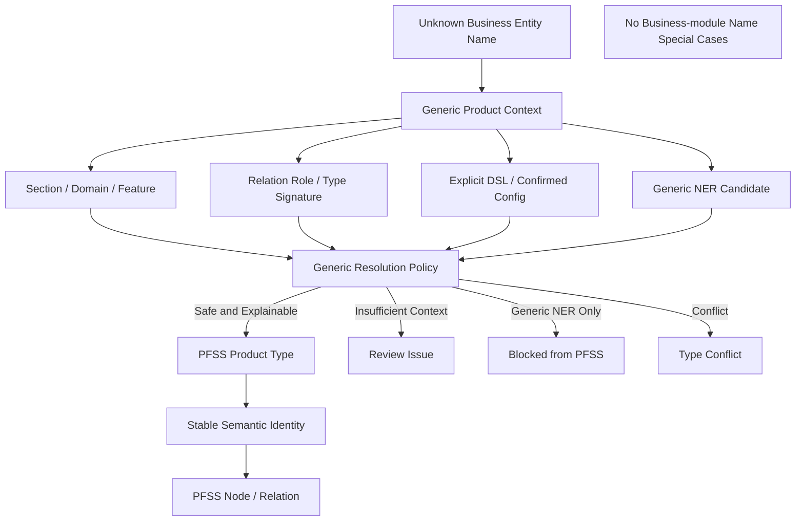

# Block 25A-1.1 Entity Type Generalization Closure

## Architecture

## Generalization
{
  "cross_domain_fixture_count": 16,
  "cross_domain_pass_count": 16,
  "fixture_name_runtime_coupling_detected": false,
  "name_specific_relation_signature_count": 0,
  "runtime_business_hardcode_detected": false,
  "unseen_correct_resolution_count": 25,
  "unseen_fixture_count": 30,
  "unseen_safe_review_count": 5,
  "unseen_unsafe_auto_accept_count": 0
}

## Anti-hardcode
{
  "acceptable_bank_hardcode_count": 0,
  "anti_hardcode_check_passed": true,
  "conditional_business_term_hit_count": 0,
  "fx_or_other_module_hardcode_count": 0,
  "inquiry_hardcode_count": 0
}

## Safety
{
  "business_module_hardcode_detected": false,
  "fixture_name_used_in_runtime_logic": false,
  "lightrag_core_modified": false,
  "live_query_behavior_changed": false,
  "live_upload_behavior_changed": false,
  "name_specific_relation_signature_detected": false,
  "neo4j_connected": false,
  "production_database_connected": false,
  "production_graph_rewrite_executed": false,
  "real_embedding_calls_executed": false,
  "real_llm_calls_executed": false,
  "term_normalization_v2_bypassed": false
}
