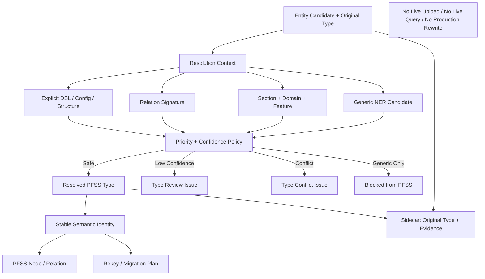

# Block 25A-1 Entity Type Resolution Report

## Architecture

## Resolution Fixtures
{
  "api_resolved_type": "IntegrationEndpoint",
  "conflict_blocked": true,
  "generic_location_pfss_written": false,
  "handler_resolved_type": "RolePermission",
  "inquiry_project_list_blocked_from_pfss": false,
  "inquiry_project_list_original_type": "Location",
  "inquiry_project_list_resolved_type": "ReportSpec",
  "low_confidence_auto_accepted": false,
  "migration_resolved_type": "DataMigrationSpec",
  "project_status_resolved_type": "FieldSpec",
  "task_resolved_type": "TaskRule"
}

## Relation Signatures
{
  "endpoint_closure_passed": true,
  "invalid_signature_count": 1,
  "invented_relation_count": 0,
  "valid_signature_count": 3,
  "validations": [
    {
      "issue_code": null,
      "relation_type": "HasReportFilter",
      "source_type": "ReportSpec",
      "target_type": "FieldSpec",
      "valid": true
    },
    {
      "issue_code": null,
      "relation_type": "AssignsHandler",
      "source_type": "TaskRule",
      "target_type": "RolePermission",
      "valid": true
    },
    {
      "issue_code": null,
      "relation_type": "CallsBackendApi",
      "source_type": "ReportSpec",
      "target_type": "IntegrationEndpoint",
      "valid": true
    },
    {
      "issue_code": "INVALID_RELATION_SIGNATURE",
      "relation_type": "HasReportFilter",
      "source_type": "ReportSpec",
      "target_type": "Location",
      "valid": false
    }
  ]
}

## Safety
{
  "auto_write_routing_enabled": false,
  "lightrag_core_modified": false,
  "live_query_behavior_changed": false,
  "live_upload_behavior_changed": false,
  "live_upload_hook_connected": false,
  "neo4j_connected": false,
  "original_extract_entities_called": false,
  "production_database_connected": false,
  "production_graph_rewrite_executed": false,
  "real_embedding_calls_executed": false,
  "real_llm_calls_executed": false,
  "term_normalization_v2_bypassed": false
}
