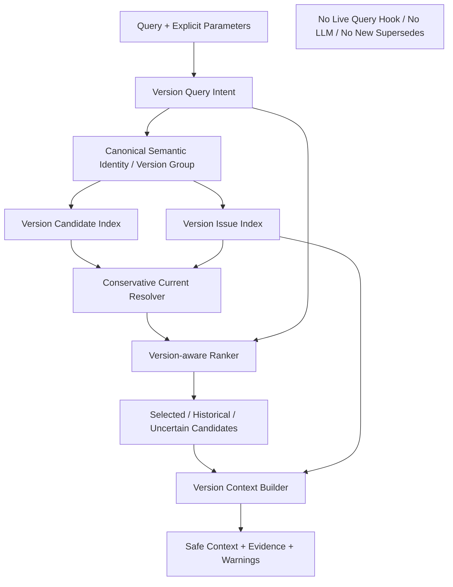

# Block 25B Version-aware Retrieval Report

## Architecture

## Implementation
{
  "conservative_current_resolver_implemented": true,
  "version_aware_ranker_implemented": true,
  "version_candidate_index_implemented": true,
  "version_context_builder_implemented": true,
  "version_issue_index_implemented": true,
  "version_query_intent_implemented": true
}

## Resolution Fixtures
{
  "document_upload_time_used_for_latest": false,
  "explicit_supersedes_terminal_confirmed": true,
  "missing_evidence_confirmed_current": false,
  "multiple_current_conflict": true,
  "multiple_latest_conflict": true,
  "no_confirmed_current_returns_warning": true,
  "source_us_order_used_for_latest": false,
  "unique_current_confirmed": true,
  "unique_latest_confirmed": true,
  "weak_change_word_created_supersedes": false
}

## Safety
{
  "business_module_hardcode_detected": false,
  "document_upload_time_used_for_latest": false,
  "generic_graph_writes_executed": false,
  "lightrag_core_modified": false,
  "live_query_behavior_changed": false,
  "live_query_hook_connected": false,
  "live_upload_behavior_changed": false,
  "neo4j_connected": false,
  "new_supersedes_auto_created": false,
  "pfss_graph_writes_executed": false,
  "production_database_connected": false,
  "real_embedding_calls_executed": false,
  "real_llm_calls_executed": false,
  "source_us_order_used_for_latest": false
}
