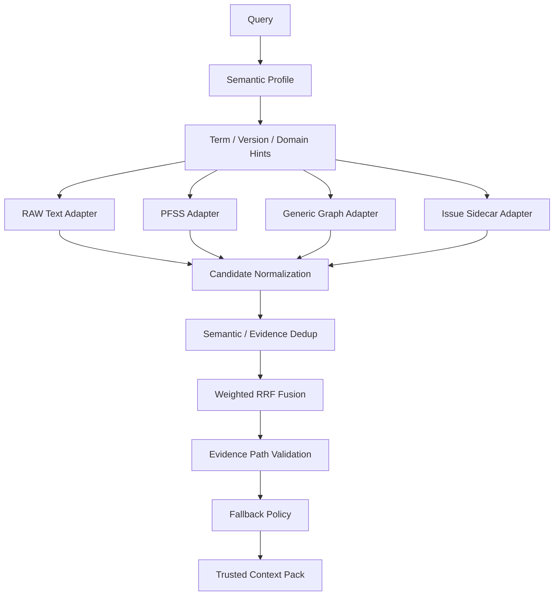

# Block 26A Hybrid Retrieval Smoke

## Scope
Offline four-way retrieval and trusted context pack construction only. No live query hook, model call, graph write, sidecar write, or production storage connection was executed.

## Architecture


## Fixture Results
```json
{
  "hybrid_ready_passed": true,
  "text_only_fallback_passed": true,
  "version_warning_passed": true,
  "generic_only_low_trust_passed": true,
  "issue_only_passed": true,
  "insufficient_evidence_passed": true,
  "cross_language_alias_passed": true,
  "domain_boost_not_filter_passed": true,
  "pfss_generic_conflict_passed": true,
  "impact_path_passed": true,
  "historical_compare_passed": true,
  "cross_channel_dedup_passed": true
}
```

## Fallback States
```json
{
  "hybrid_ready": "HYBRID_EVIDENCE_READY",
  "text_only_fallback": "TEXT_ONLY_FALLBACK",
  "version_warning": "PFSS_WITH_VERSION_WARNING",
  "generic_only_low_trust": "GENERIC_ONLY_LOW_TRUST",
  "issue_only": "ISSUE_ONLY",
  "insufficient_evidence": "INSUFFICIENT_EVIDENCE",
  "strict_scope_empty": "STRICT_SCOPE_EMPTY",
  "impact_path": "HYBRID_EVIDENCE_READY",
  "historical_compare": "HYBRID_EVIDENCE_READY"
}
```

## Fusion
```json
{
  "fusion_method": "WEIGHTED_RRF",
  "direct_raw_score_addition_used": false,
  "issue_factual_weight": 0.0,
  "generic_overrode_pfss_count": 0,
  "missing_evidence_factual_path_count": 0,
  "deterministic_ranking_passed": true
}
```

## Context
```json
{
  "factual_candidate_count": 13,
  "direct_evidence_count": 16,
  "factual_path_count": 3,
  "tentative_path_count": 1,
  "generic_context_count": 5,
  "issue_warning_count": 4,
  "safe_for_deterministic_answer": true,
  "token_budget_preserved_required_evidence": true
}
```

## Safety
```json
{
  "LIVE_QUERY_BEHAVIOR_CHANGED": false,
  "LIVE_QUERY_HOOK_CONNECTED": false,
  "REAL_LLM_CALLS_EXECUTED": false,
  "FINAL_ANSWER_GENERATED": false,
  "PFSS_GRAPH_WRITES_EXECUTED": false,
  "GENERIC_GRAPH_WRITES_EXECUTED": false,
  "PRODUCTION_STORAGE_CONNECTED": false,
  "NEO4J_CONNECTED": false,
  "NEW_SUPERSEDES_CREATED": false,
  "LIGHTRAG_CORE_MODIFIED": false,
  "graph_writes_executed": false,
  "sidecar_writes_executed": false
}
```

## Recommended Next Block
Block 26B only if all gates pass.

## Implementation
```json
{
  "raw_text_adapter_implemented": true,
  "pfss_adapter_implemented": true,
  "generic_adapter_implemented": true,
  "issue_sidecar_adapter_implemented": true,
  "candidate_normalizer_implemented": true,
  "candidate_deduplicator_implemented": true,
  "trust_aware_fusion_implemented": true,
  "evidence_path_validator_implemented": true,
  "fallback_policy_implemented": true,
  "trusted_context_builder_implemented": true
}
```

## Validation
```json
{
  "collected_count": 59,
  "passed_count": 59,
  "failed_count": 0,
  "compileall": "passed",
  "py_compile": "passed",
  "ruff": "passed"
}
```

## Safety Summary
```json
{
  "live_query_behavior_changed": false,
  "live_query_hook_connected": false,
  "real_llm_calls_executed": false,
  "final_answer_generated": false,
  "graph_writes_executed": false,
  "sidecar_writes_executed": false,
  "production_storage_connected": false,
  "neo4j_connected": false,
  "cleanup_passed": true,
  "core_modified_in_this_round": false
}
```
