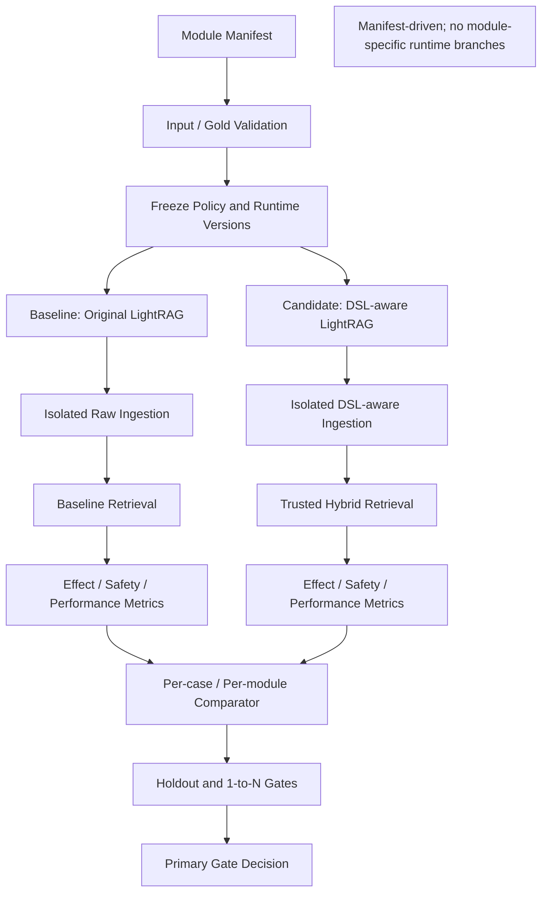

# Block 26B Multi-module A/B Gate

## Status
`BLOCKED_INPUT_SET`

## Blocker
BLOCKED_INPUT_SET: real multi-module manifest path is required

## Architecture


## Primary Gate
```json
{
  "overall_status": "BLOCKED_INPUT_SET",
  "failed_primary_gates": [
    "BLOCKED_INPUT_SET: real multi-module manifest path is required"
  ],
  "recommended_fix": "Provide a real multi-module manifest with audited Gold cases.",
  "recommended_next_block": "Stay in Block 26B"
}
```

## Safety
```json
{
  "live_upload_behavior_changed": false,
  "live_query_behavior_changed": false,
  "live_upload_hook_connected": false,
  "live_query_hook_connected": false,
  "production_storage_connected": false,
  "neo4j_connected": false,
  "runtime_module_branch_count": 0,
  "entity_name_specific_weight_rule_count": 0,
  "holdout_specific_rule_count": 0,
  "primary_eval_uses_llm_judge": false,
  "policy_changed_during_run": false,
  "gold_changed_during_run": false,
  "lightrag_core_modified": false,
  "overall_status": "BLOCKED_INPUT_SET"
}
```

## Validation
```json
{
  "collected_count": 50,
  "passed_count": 50,
  "failed_count": 0,
  "compileall": "passed",
  "py_compile": "passed",
  "ruff": "passed"
}
```
