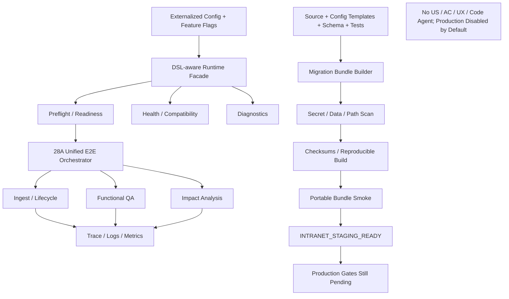

# Block 28B Engineering Closure

## Status
- engineering_closure_status: ENGINEERING_CLOSURE_PASS
- migration_package_status: MIGRATION_PACKAGE_READY
- intranet_staging_status: INTRANET_STAGING_READY
- production_status: PRODUCTION_GATE_PENDING

## Runtime
- Runtime facade implemented and delegates to 28A orchestrator.
- US/AC/UX/code-agent generation capabilities are unavailable.
- Production, live upload/query, real model calls, remote storage, and generic graph are disabled by default.

## Bundle
- bundle_path: `artifacts/block_28b_engineering_closure/intranet_migration_bundle`
- archive_path: `artifacts/block_28b_engineering_closure/intranet_migration_bundle.tar.gz`
- package_file_count: 79
- checksums_valid: True
- reproducible_build_passed: True
- portable_smoke_passed: True

## Safety
- real_business_data_packaged: False
- secrets_packaged: False
- local_indexes_packaged: False
- user_absolute_paths_packaged: False
- internal_endpoints_packaged: False
- lightrag_core_modified: False

## Architecture

## Pending Gates
Production gates remain pending: real models, real storage, live adapters, capacity, security review, rollback drill, approval.
